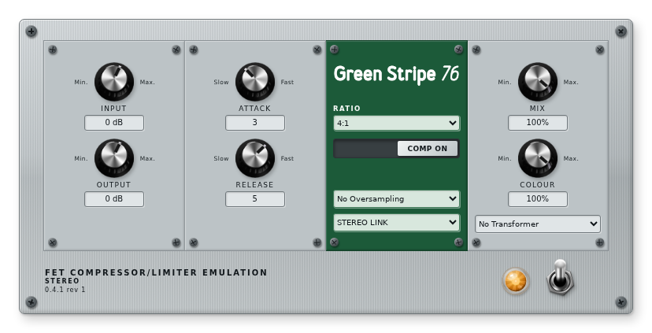
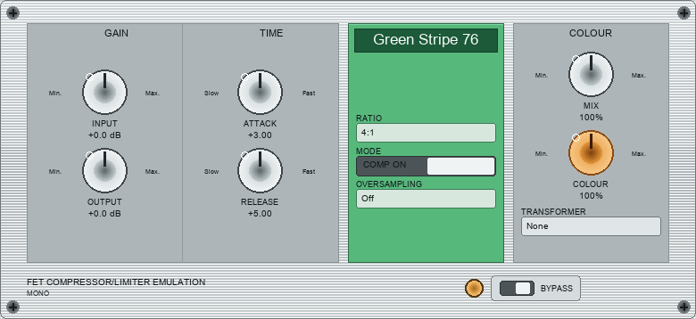

# Green Stripe 76

**FET-Compressor-/Limiter-Adaption für MOD Dwarf und REAPER — LV2 und JSFX aus einem DSP.**

Green Stripe 76 ist eine eigenständige, 1176-inspirierte Adaption mit hörbaren
Eingangstransformatoren und bewusst eigener Gestaltung; der DSP-Kern läuft
doppelpfadig als frameworkfreies C++11 (LV2) und als EEL2 (JSFX) mit belegter
Bit-Parität. Die Modellbank ist am MOD Dwarf gegen digitale Referenzen
validiert — Transformator-Matrix, Colour-Serie und CPU-Matrix mit
Referenzdeckung bis in die 4. Dezimale — und mit 38 geprüften
Instrument-Presets versehen. Das Projekt bildet Funktionsprinzipien der
1176-Familie ab, erhebt aber ausdrücklich keine Hardwaregleichheit mit einem
bestimmten Originalgerät; alle Messwerte und Grenzen sind dokumentiert.

## Funktionsumfang

**Regler (LV2-Paneel und JSFX, gemeinsame Semantic):**

| Bereich | Regler | Bereich |
|---|---|---|
| GAIN | Input −36…+24 dB · Output −36…+24 dB | drei Potireihen, spaltfreies Paneel |
| TIME | Attack 1–7 · Release 1–7 | Feedback Gain Law, Abgriff vor dem Output |
| ENGINE | Ratio 2:1/4:1/8:1/12:1/20:1/All Buttons · Compression On/Off · Oversampling Off/2x/4x (Latenz 0/3/4 Frames) | Off = CPU-günstiger Referenzpfad |
| COLOUR | Colour 0–100 % · Transformer None/60s/80s/00s/Symmetric | Transformer = hörbare Eingangsstufe |

Dazu: **Mix** 0–100 %, **Stereo Link** On/Off (Off = zwei unabhängige
Regelkreise), **Bypass** als Schalter, **Instrument preset** mit 38 Einträgen
(01–36 instrumentweise gruppiert, 37/38 als 2:1-Varianten angehängt).
Das **VU-Meter** im grünen ENGINE-Feld zeigt die laufende Gain-Reduction
  mit einer Nadel und etwa 300 ms VU-Ballistik (0 dB Ruhe links, bis 30 dB am Skalenende; rote Zone ab
  20 dB) und dient zugleich als Statuslicht: beleuchtet bei COMP ON,
gedimmt bei COMP OFF. Es liest einen reinen Output-Port (`gr_db`) — der
Feed-Regelkreis greift weiterhin vor dem Output ab, die Anzeige kann den
GR-Verlauf nicht ändern. `None` ist exakt
transparent, `Symmetric` ist die lineare Prüfreferenz. Oversampling und
Stereo Link sind bewusst kein Paneel-Regler, sondern in den
Plugin-Einstellungen (MOD-Parameterliste bzw. Host) einstellbar.





## Lieferumfang

- LV2-Bundle **Mono** und **Stereo** mit MOD-GUI (Screenshots oben), Factory-
  Presets und angehängten Transformer-/Oversampling-Ports.
- JSFX **Mono** und **Stereo** für REAPER 7 mit GR-, Peak-/RMS- und
  Host-GR-Anzeigen sowie eingebautem Preset-Selektor.
- 38 Instrument-Presets als JSFX-Bank, `.rpl`-Import und LV2-Factory-Presets
  (geprüft gegen Parameterdaten und Laufzeit).
- Frameworkfreier C++11-DSP und gleichwertiger EEL2-Kern; generierte
  Ports/Presets/GUI aus `data/*.json` (`tools/generate.py`).
- Build-, Paketierungs-, Test-, Benchmark- und Messwerkzeuge
  (Dwarf-Lasttest, CPU-Matrix, Transformator-Bench, Scarlett-Messreihe).
- Deutsche Dokumentation: Betrieb, DSP-Architektur, Messtechnik,
  Messergebnisse, Performance, Quellen und Übergabe.

## Schnellstart

**REAPER 7 (JSFX):**

1. `jsfx/` vollständig nach `REAPER-Ressourcenordner/Effects/GreenStripe76/`
   kopieren (REAPER: **Options → Show REAPER resource path**).
2. FX-Liste aktualisieren, **Green Stripe 76 Mono** oder **Stereo** einfügen.
3. **Instrument preset** wählen; **Input** auf die gewünschte GR stellen,
   **Output** pegelgleich zum trockenen Signal ziehen.
4. Stereo: `Stereo Link=On` für zusammenhängendes Stereosignal, `Off` für
   zwei unabhängige Regelkreise. Die Mono-Fassung verarbeitet Input L und
   gibt denselben Ausgang auf L/R aus (dokumentiert).

**LV2 nativ (Buildrechner):**

```bash
make
make test
make install PREFIX="$HOME/.local"
```

**MOD Dwarf:** Build und Installation laufen über den offiziellen
[MOD Plugin Builder](https://github.com/moddevices/mod-plugin-builder); Rezept
und Ablauf: [BETRIEB — Build/Installation](docs/BETRIEB.md). Zielgerät:
MOD Dwarf OS 1.13.x, aarch64, 48 kHz. Nach jedem Binary-Austausch den
Audio-Stack neu starten und die installierte SHA256 protokollieren
(BETRIEB, Verfahrensregel).

## Weiterführende Dokumentation

| Dokument | Inhalt |
|---|---|
| [PROJEKT](docs/PROJEKT.md) | Verbindlicher Umfang, aktueller Stand, Prüfstand, Übergabeauftrag, Historie |
| [DSP](docs/DSP.md) | Signalfluss, Numerik, Färbung, Parameter/Ports, Transformator-Laufzeit |
| [MESSERGEBNISSE](docs/MESSERGEBNISSE.md) | Vollständige Gerätemesswerte (Transformator, Colour, CPU) mit Plots — generiert |
| [MESSTECHNIK](docs/MESSTECHNIK.md) | Prüfverfahren, Dwarf-Lastmessung, Scarlett-Workflow, Protokolle |
| [PERFORMANCE](docs/PERFORMANCE.md) | CPU-Analyse, Serie B (A35-Bench), Reduktionshebel |
| [EXTERN](docs/EXTERN.md) | PluginDoctor-/ReaJS-Auswertungen, Ankerinterpretation, Presetbewertung |
| [BETRIEB](docs/BETRIEB.md) | Bedienung, Gain-Staging, Build, Paketierung, Installation |
| [QUELLEN](docs/QUELLEN.md) | Quellenkatalog, Lizenzen, NAM-Profile, Literatur |
| [PRESETS](docs/PRESETS.md) | Generierte Presetwerte und GR-Richtwerte |
| [TODO](docs/TODO.md) | Offene Punkte und nächste Arbeit |

## Lizenzhinweise

- Der Projektcode steht unter der **MIT-Lizenz** (`LICENSE`,
  Copyright © 2026 Green Stripe 76 contributors).
- Genutzte Fremdbibliotheken und ihre Lizenzen (ysfx-Fork, WDL, HIIR) sind
  in [QUELLEN](docs/QUELLEN.md) und `docs/THIRD_PARTY.md` mit gepinnten
  Ständen dokumentiert; die Testumgebung nutzt den gepinnten
  [ysfx-Fork](https://github.com/JoepVanlier/ysfx).
- Die vier lokalen NAM-Profile liegen **außerhalb** dieses Repositories;
  ihre Lizenz ist nicht Teil dieses Projekts und sie werden nicht in
  Distributionspakete kopiert.
- Keine zertifizierte Hardwaregleichheit: Der Name und die Gestaltung sind
  eigenständig; „1176" bezeichnet Funktionsprinzipien, keine
  Produktrevision. Messwerte und Grenzen sind in der Dokumentation
  offen ausgewiesen.
