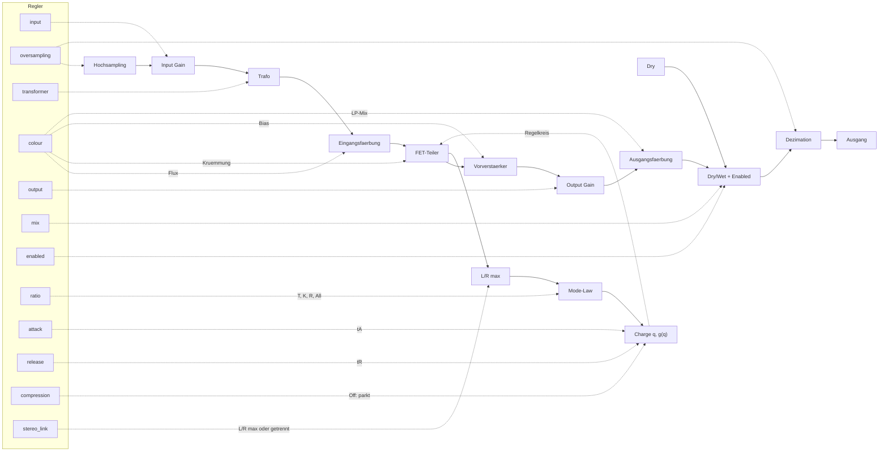

# Green Stripe 76 — DSP-Architektur und Modell

Signalfluss, Numerik, Parameter-/Portverträge, Transformator-Laufzeit und LUT-Grenzen.

**Konsolidiert am 2026-10-06** aus den bisherigen Einzeldokumenten; Inhalt inhaltlich unverändert, Pfadangaben auf die neue Struktur angepasst.

## Inhalt

1. DSP_ARCHITECTURE.md — *(Quelle: DSP_ARCHITECTURE.md)*
2. PARAMETERS.md — *(Quelle: PARAMETERS.md)*
3. TRANSFORMER_RUNTIME.md — *(Quelle: TRANSFORMER_RUNTIME.md)*
4. LUT_REFERENCE.md — *(Quelle: LUT_REFERENCE.md)*


---

<!-- ===== Teil 1: Quelle docs/DSP_ARCHITECTURE.md ===== -->

# DSP-Architektur — Green Stripe 76, 0.4.1

## 1. Status und normative Dateien

Dies ist ein eigenständiges **reduziertes Gray-Box-Modell**. Die Funktionsstruktur
ist durch 1176-Unterlagen motiviert, die konkrete parametrische Gain Law und
Färbung sind eigene Näherungen. Es existiert kein verifizierter transistorweiser
Original-Netlist-/SPICE-Fit und keine automatisch aus NAM gewonnene Kalibrierung.

- `data/model.json`: gemeinsam generierte Konstanten.
- `data/transformers.json`: validierte Transformatorbank; `src/dsp/TransformerModels.hpp`
  und `GreenStripe76-Transformers.jsfx-inc` werden gemeinsam daraus erzeugt.
- `src/dsp/GreenStripe.hpp`: C++11-Implementierung, double-Zustände.
- `jsfx/GreenStripe76-Core.jsfx-inc`: gleichwertige EEL2-Implementierung.
- `tools/generate.py`: generierte Model-Includes, Ports, Presets und Oberflächen.
- `tests/jsfx_parity.cpp`: tatsächliches Rendern beider Kerne, nicht Textvergleich.

### Messvalidierung (Stand 2026-10-07)

Sowohl der **C++- als auch der EEL2-Pfad sind geräteverifiziert**: Die
Dwarf-Serien (Transformator-Matrix `matrix-dwarf-20261007-b2`, Colour-Serie
`colour-dwarf-20261007`) decken sich mit den digitalen Referenzrendern bis in
die 4. Dezimale — Bank-only (Colour 0 × 60s/80s/00s/Sym) und Colour-Stufen
(None × 5–100 %) einzeln exakt. Die **JSFX-Render aller 34 Betriebszustände**
(einschließlich der 24 Bank×Colour-Interaktionszustände) sind bitgleich gegen
den C++-Pfad verifiziert (max 0,5 LSB bei 24 bit, PDC-Offset −3). Die
Interaktionsmatrix ist damit modellseitig vollständig belegt und geräteseitig
über Zerlegung + Parität abgedeckt (nicht direkt am Gerät gemessen; Begründung
und Kennwerte: `MESSERGEBNISSE.md`, Abschnitt 2.5). Die 20-Hz-Klirrreihung der
aktuellen Bank am Gerät: 60s 12,42 % / 80s 12,28 % / 00s 1,00 % / Sym 0,00 %.

### Modus-Tabellen: EEL2-Lookup statt indizierter Globals

Die Halfband-Koeffizienten bleiben in EEL2 indizierte Globals. Die drei
Modus-Tabellen (`ratios`, `thresholds_dbfs`, `knees_db`) werden dagegen als
generierte Lookup-Funktionen `gs_ratio_of`, `gs_threshold_of` und
`gs_knee_of` ausgegeben.

Grund ist ein messbarer Fehler in nseel: Globale in einem `@init`-Funktionsrumpf
teilen sich einen Speicherpool, und ein indizierter Schreibvorgang über die
deklarierte Arraygröße hinaus vergrößert das Array **nicht**, sondern
überschreibt die folgende Variable. Mit sechs Modi las `gs_ratios[5]` dadurch
`gs_thresholds[0]` und `gs_thresholds[5]` `gs_knees[0]`. Der Effekt war
unabhängig von der deklarierten Größe und nicht monoton: 7, 8, 10, 24, 32 und 48
lieferten plausible Werte, 12, 16 und 18 nicht, und eine Vergrößerung aller drei
Tabellen verschob zusätzlich die Basiszeiger (`gs_ratios[0]` las dann `6`). Ein
sentinelbasierter Test bestätigte: Schreibt man `gs_ratios[9]=64`, ist
`gs_ratios[9]` hinterher nicht `64`, sondern der Wert des Nachbarn. Die
Modus-Zuordnung war damit zur Laufzeit kaputt, ohne jeden Compilerfehler.

Die Lookup-Funktionen umgehen das vollständig und sind zur Laufzeit billiger.
Sie verwenden `local(v)` und Zuweisungsanweisungen statt einer
Ternär-Kette, weil EEL2 weder ein negatives Literal noch eine Klammer direkt
nach `?` parst. Die C++-Seite behält ihre Arrays aus `src/dsp/ModelConstants.hpp`; die
Parität zwischen beiden Kernen ist über `tests/jsfx_parity.cpp` belegt.

## 2. Signalfluss

Zwei Diagramme: zuerst der **reine Signalpfad** inklusive Feedback-Regelkreis,
danach eine **kompakte Übersicht** mit den Reglerzuordnungen. Gerenderte
Fassungen (192 DPI, `tools/md_to_png.py`):
[`dsp-signalfluss.png`](plots/dsp-signalfluss.png) und
[`dsp-regler-uebersicht.png`](plots/dsp-regler-uebersicht.png).

### Reiner Signalfluss (ohne Regler)

```mermaid
flowchart LR
    subgraph AUDIO["Audiopfad - je Kanal, interne Rate fs·Faktor"]
        direction TB
        IN["Host-Audio L/R<br>float, NaN/Inf zu 0, Begrenzung ±256"] --> UP["Hochsampling<br>Off / 2x / 4x"]
        UP --> GIN["Input Gain"]
        GIN --> TRA["Eingangstransformator<br>60s / 80s / 00s / Sym"]
        TRA --> INCOL["Eingangsfaerbung<br>8 Hz DC + 35 Hz Tiefpass"]
        INCOL --> FET["FET-Spannungsteiler<br>regularisierte Knotenform"]
        FET --> PRE["Vorverstaerkerfaerbung<br>asym. Kennlinie + 45 kHz"]
        PRE --> GOUT["Output Gain"]
        GOUT --> OUTCOL["Ausgangsfaerbung<br>35 Hz + asym. Amp + 5 Hz DC"]
        OUTCOL --> MIX["Dry/Wet-Mischung<br>und Enabled"]
        MIX --> DOWN["Dezimation<br>auf Host-Rate"]
        DOWN --> AOUT["Float-Ausgang<br>Latenz 0/3/4 Frames"]
        DRY["Dry-Abgriff<br>vor Input Gain"] --> MIX
    end

    subgraph CTRL["Regelseite - Abgriff VOR Output Gain"]
        direction TB
        TAP["Tap: zustandslose Auswertung<br>von FET- und Preamp-Stufe"] --> MAG["Betragspegel L/R<br>max ABS - Stereo Link"]
        MAG --> LAW["Mode-Law:<br>Schwelle T, Knie K, Ratio R"]
        LAW --> KNEE["d = L - T<br>weiches Knie knee(d)"]
        KNEE --> QT["q_target<br>Charge-Zielwert"]
        QT --> CHG["Aufladung q<br>implizit, Newton/Bisektion"]
        CHG --> GQ["Charge q zu Gain g(q)<br>GR-Computer max 60 dB"]
        GQ --> DIS["Entladung<br>plus Historie m"]
        DIS -->|"m (GR-Historie)"| CHG
        GQ -.->|"g(q) in den Regelkreis"| FET
    end

    FET -.->|"zustandsloser Tap"| TAP
```



### Kompakte Übersicht mit Reglern



Output und der gesamte Ausgangsblock sind **nicht Teil des Detektorabgriffs**.
Die Audiostufen werden pro Sample nur mit definitiven Zuständen fortgeschrieben;
die iterativen Detektorberechnungen benutzen zustandslose `tap()`-Auswertungen.
So wird derselbe Filterzustand nicht mehrfach in einem Solver-Schritt verändert.

## 3. Zeit- und Parametermodell

Abtastrate ist die von Host/REAPER gelieferte Rate, intern
`fs_internal=factor·fs`, `factor=1/2/4` für Off/2x/4x.
Attack und Release werden geometrisch von den Skalen 1–7 abgebildet:

$$
t_A = 0.0008 \cdot \left(\frac{0.00002}{0.0008}\right)^{(A-1)/6},
\qquad
t_R = 1.1 \cdot \left(\frac{0.05}{1.1}\right)^{(R-1)/6}.
$$

Dies sind nominelle Modellzeiten. Die geschlossene Feedback-Antwort, steigende
Flanken, durch Sinuszyklen wieder aufgeladene Zustände und All Buttons können
effektive GR-Zeiten verändern. Eine direkte Gleichsetzung mit 63-%-/10–90-%-
Hardwaremessungen wäre falsch.

Regler-Zielwerte werden mit
`c=1-exp(-1/(0.002 fs_internal))` geglättet. Erster Parametersatz nach Reset wird
direkt übernommen, damit Preset-Start/Referenzmessung keine Input-Anfahrrampe
enthält. Keine pro Block erneut zurückgesetzten Zeitglieder.
Ab 0.1.1 rasten die Zielwerte bei 10⁻¹² absolut/relativ ein; dann wird die
Sample-Glättung übersprungen. Das ermöglicht exakte 0/1-Fastpaths.

## 4. FET-Spannungsteiler

Der physikalische Bezug ist ein Serienwiderstand plus FET als Shunt. Im
ohmischen Modell erzeugt derselbe Abschwächer Gain und pegelabhängige Verzerrung.
Green Stripe verwendet eine **regularisierte** dimensionslose Knotenform:

$$
u = 0.08\,x, \qquad C = B - 1 + q, \qquad B = 10^{1/20},
\qquad F(v) = v - k\,\frac{v^2}{1+|v|}.
$$

$$
v + C\,F(v) - u = 0, \qquad k = \mathrm{Colour} \cdot (0.24 + 0.08 \cdot \mathrm{All}).
$$

Die 0.08-Volt-/Skalierungswahl ist eine eigene Normalisierung, keine ermittelte
FET-Drainspannung eines Capture-Geräts. Die kleine Ruheabschwächung von nominell
1 dB ist über `B` kalibriert und am Ausgang wieder normalisiert. Bei Colour=0:

$$
y = x \cdot \frac{B}{B+q}, \qquad g(q) = \frac{B}{B+q}.
$$

Nach Multiplikation mit `1+|v|` ist die Knotenform auf jeder Polarität ein
Quadratpolynom. Mit `U=|u|`, `s=sign(u)` lautet die stabile positive Wurzel:

$$
a = 1 + C\,(1 - s\,k), \qquad b = 1 + C - U, \qquad
v = \frac{2u}{b + \sqrt{b^2 + 4aU}}.
$$

Die rationalisierte Lösung vermeidet Wurzelsubtraktions-Auslöschung und ersetzt
drei frühere per-Tap-Newton-Schritte. Steigung bleibt für die Krümmung positiv;
beliebig große Extrapolation des reinen JFET-Quadratgesetzes wird vermieden.
Der Funktionszweig modelliert weder
Gate-Leckstrom noch ein vollständiges Shichman–Hodges-/Halbleiterkennfeld.

`fetcomp-dsp` zeigt alternativ eine geschlossene quadratische Divider-Lösung
inklusive LN-Gatefeedback. Das ist eine wertvolle Vergleichsquelle, aber deren
JUCE-Struktur, Potentiometertabellen, Plugin-Fit und Transformerzustände sind
hier **nicht übernommen**. Green Stripe ist kein Port dieser Bibliothek.

## 5. Feedback Gain Law

Für das zustandslose FET-/Preamp-Tap-Signal wird

$$
L = 20\,\log_{10}\!\left(\max\left(\left|tap_{\mathrm{L}}(q)\right|,
\left|tap_{\mathrm{R}}(q)\right|\right)\right), \qquad d = L - T
$$

berechnet. Das weiche Knie nutzt die übliche stetige quadratische Überleitung:

$$
\mathrm{knee}(d) =
\begin{cases}
0 & d < -K/2 \\
d & d > K/2 \\
\dfrac{(d + K/2)^2}{2K} & \text{sonst}
\end{cases}
$$

Die gewünschte Abschwächung gegen den **Feedback-Pegel** ist `(R-1)·knee(d)`.
`R−1` ist wesentlich: der Feed-forward-Koeffizient `1−1/R` würde in derselben
Feedback-Struktur nicht die gewünschte statische Ratio ergeben. Überleitung in
den positiv begrenzten Charge-/Conductance-Zustand:

$$
q_{\text{target}} = B \cdot \left(10^{\min\left(60,\ (R-1)\,\mathrm{knee}(d)\right)/20} - 1\right).
$$

Das ist eine bewusst gewählte **Verhaltenskennlinie**, kein rekonstruierter
AC-/DC-Widerstands-/Diodenblock. Ratio-abhängige T/K-Werte:

| Modus | nominale Ratio | Threshold dBFS am Tap | Knie dB |
|---|---:|---:|---:|
| 2 | 2 | −25 | 7,5 |
| 4 | 4 | −24 | 6 |
| 8 | 8 | −21 | 4 |
| 12 | 12 | −19,5 | 3 |
| 20 | 20 | −18 | 2 |
| All | 12…20 | −22 | 1,5 |

Diese Tabellen sind **provisorische Green-Stripe-Abstimmung**, nicht aus der
Dissertationsgrafik digitalisierte oder vom NAM abgeleitete Messdaten.

## 6. Regelkreis: Aufladung und Entladung

Aufladung benutzt einen impliziten Backward-Euler-Schritt:

$$
(1+\alpha)\,q_{n+1} - q_n - \alpha\,q_{\text{target}}(x_{n+1},\,q_{n+1}) = 0,
\qquad
\alpha = \frac{1}{fs_{\text{internal}} \cdot t_A \cdot R \cdot (1 + 0.3\,\mathrm{All})}.
$$

Die zusätzliche Ratio-Skalierung hält die nominale geschlossene Zeit näher am
Reglerbereich. Sie ist eine Modellentscheidung, keine RC-Bauteilidentifikation.
Kein explizites Base-rate-`z^-1` im Detektorpfad.

- Startintervall aus statischer Feed-forward-Näherung.
- Maximal vier Intervallerweiterungen.
- Maximal acht safeguarded Newton-Schritte; andernfalls Bisektion des Intervalls.
- Charge begrenzt auf 0…1000, GR-Computer auf 60 dB.
- Ableitung des sauberen Divider-Gains dient als monotone Näherung bei Colour.

Presetprüfung 0.4.0: Der Newton-Nenner wird in beiden Engines ausdrücklich
als `denominator=1+alpha; denominator-=alpha*derivative` ausgewertet.
Der vorherige EEL2-Gesamtausdruck konnte die Rundung verändern und bei
Preset 29 Mono eine andere Newton-/Bisektionsentscheidung auslösen.
~~Keine neue Iterationszahl oder Toleranz; Signalbeleg in `EXTERN.md`.~~
*(Überholt 2026-10-07: Startwert-Prädikator und Toleranz 1e-6 relativ sind
umgesetzt — siehe „Numerisches Modell".)*

Bei geschlossenem Gleichrichter entlädt sich der Zustand exponentiell:

$$
q_{n+1} = q_n \cdot e^{-1/\left(fs_{\text{internal}} \cdot t_R \cdot (1 + 0.75\,m + 0.2\,\mathrm{All})\right)}.
$$

Ab 0.1.1 wird exp(−s) im kleinen zulässigen Schrittbereich kubisch ausgewertet:
`1−s+s²/2−s³/6`, Koeffizientenfehler <7×10⁻¹⁵ im schlechtesten unterstützten
Fall (8k/4×/50 ms). Der GR-Logarithmus wird beim Entladen über ein kubisches
`log(1−z)`-Inkrement fortgeführt und beim Aufladen exakt neu verankert.
Damit entfallen zwei häufige Transzendentalaufrufe; Fehlergrenzen und 80
Vorher/Nachher-Fälle sind in `PERFORMANCE.md` dokumentiert.

`m∈[0,1]` verfolgt die GR-Historie mit etwa 80 ms Lade-/400 ms Erholungszeit.
Durch die nichtlineare Zuordnung `q→g` ist die GR-Erholung schon vor dieser
Historie nicht identisch mit einer einfachen exponentiellen dB-GR-Hüllkurve.
Die Zusatzhistorie ist eine **programabhängige Näherung**, kein belegter optischer
oder thermischer Speicher eines 1176. Eichas' Mehrzustands-Fitting motiviert
den Nutzen längerer Dynamik, nicht diese konkreten Zahlen.

## 7. All Buttons

- Getrennte Threshold-/Knie-/Färbungswerte.
- Ratio folgt `12+8m`.
- Unkomprimierter Betragspegel lädt ein etwa 60-µs-Lagglied.
- Detektor mischt im All-Zustand den normalen Feedback-Tap mit
  `lagged * g(q)`; das erzeugt eine anfängliche besondere Transientenantwort.
- Attack-/Release-Skalierungen ändern sich.

AXT zeigt, dass die echte Taste sowohl Bias/Pegel **als auch Thevenin-Impedanzen**
ändert. Green Stripe bildet diese Gesamtwirkung parametrisch ab, nicht als
exaktes Schalter-Netzwerk. Im Status als Näherung beibehalten.

Die Taste ist der letzte Modus, Index 5. Vor der 2:1-Erweiterung im
0.3.0-Entwicklungsstand stand sie auf Index 4. Mit `2:1` an erster Stelle
verschoben sich die Ratio-Werte, nicht die Instrument-Presetnummern.
Die aktuelle Factory-Bank enthält 2:1/4:1/8:1/All bzw. Compression Off;
2:1-Erweiterungen und Signalprüfung in `EXTERN.md`. 0.4.1 ändert
Presetwerte, nicht das DSP-Modell oder die Transformatorbank.

## 8. Verstärker- und tieffrequente Färbung

Eingang: 8-Hz-DC-Zustand, 35-Hz-Lowpass-Zustand und konservative niederfrequente
Amplitudenkrümmung. Vorverstärker: asymmetrische Kennlinie, 45-kHz-Bandbegrenzung.
Ausgang: Output Gain, eigener 35-Hz-Zustand, asymmetrische Verstärkerkennlinie,
5-Hz-DC-Korrektur. Input-/Output-States sind kanalgetrennt.

Diese Zustände **sind kein Jiles–Atherton-Hysteresemodell**. Sie stellen eine
geringe, pegel-/frequenzabhängige Klangfärbung dar. Behauptungen über einen
bestimmten 5002-/Lundahl-Core, Wicklung oder B-H-Kurve wären nicht gerechtfertigt.

### Was `Colour` tatsächlich imitiert

Der Regler `colour` (0…100, intern `0…1`) ist **kein** Transformator- und auch
kein Röhrenmodell. Er ist ein generischer Regler für **Nichtlinearitäts- und
Bandbegrenzungs-Textur** und wirkt an genau vier Stellen der Kette. Das ist
absichtlich so: er soll den Charakter einer analogen Übertragungsstufe
veränderbar machen, ohne ein einzelnes Gerät zu imitieren.

| Ort | Wirkung | Quelle |
|---|---|---|
| FET-Kennlinie | `curvature = colour · (0.24 + 0.08·all)` im Divider; asymmetrische Kompression der positiven Halbwelle | `src/dsp/GreenStripe.hpp`, `fet()` |
| Tap-Sättigung | `softClip` um einen kleinen, über `clipSlope` normierten Bias; Kleinsignal-Gain bleibt ≈ 1 | `tap()` |
| Eingang | `flux`-Lowpass, dessen Differenz `softClip`-begrenzt wird: leichte HF-Dichte/-Kompression | `Channel::input()` |
| Ausgang | Lowpass-Mix, zweiter `flux`-`softClip`, asymmetrisch nachgeführte `softClip`-Stufe um +0,04, plus mit `colour` verschobene DC-Eckfrequenz | `Channel::output()` |

Der wichtigste Punkt ist der erste: Bei `Colour = 0` ist der Divider
**symmetrisch**. Mit steigendem `Colour` wird die positive Halbwelle stärker
komprimiert als die negative. Das erzeugt die charakteristische asymmetrische
Kompression und damit **geradzahlige Verzerrungsanteile**. Die beiden
`softClip`-Stufen liefern zusätzlich die klassische „driven"-Kompression, und die
`flux`-Glieder verdichten das obere Ende.

**Was `Colour` ausdrücklich nicht ist:**

- kein Transformator (keine Magnetisierungsinduktivität, keine Hysterese, keine
  Wicklungserscheinungen, keine Kopplungs-Bassabsenkung, kein Brummen)
- kein Röhrenmodell (die Trioden-Kennlinie aus `docs/sauce/tube.lib` ist nicht
  Teil des DSP)
- kein Jiles–Atherton-Kern und kein Core-/Wicklungsbehauptungsmodell

`MIX` ist bewusst **nicht** Teil dieses Reglers, sondern ein separater
Dry/Wet-Anteil. Im Panel sitzt der `MIX`-Knopf deshalb silbern und nicht im
grünen ENGINE-Bay: er ist ein Utilities-Regler, kein Färbungsregler.

### Gemeinsame `tanh`-Näherung

Audio und Bias-Korrektur benutzen exakt dieselbe [7/6]-Padé-Formel:

$$
S(x) = \frac{x\,\left(135135 + x^2\left(17325 + x^2\left(378 + x^2\right)\right)\right)}
{135135 + x^2\left(62370 + x^2\left(3150 + 28\,x^2\right)\right)}.
$$

Für `|x|≥5` wird auf ±1 begrenzt. Die kleine Restdiskontinuität am Rand ist
numerisch gering, aber das Antialiasing bleibt erforderlich. Analytische
Ableitung derselben Funktion normiert die Kleinsignalverstärkung bei Bias:

$$
A(x) = H \cdot \frac{S(x/H + b) - S(b)}{S'(b)}.
$$

Keine Vermischung von std::tanh und Approximation; das vermeidet DC-Fehler durch
unterschiedliche Bias-Referenzen. Keine Float-Bit-Hacks, damit double-EEL2 und
C++ dieselben Operationen nutzen können. Approximationseffizienz ist nicht
gleich Hardwaretreue; diese Abgrenzung aus den neuen Quellen bleibt wichtig.

## 9. Oversampling, Dry/Wet und Bypass

Zwei kaskadierte 2×-Halfband-Polyphasen-IIR-Stufen, skalare Allpass-Rekursion:

`y=(x-y_previous)*a+x_previous`.

Koeffizientenprovenienz: HIIR-Designer-Prinzip, Übergangsargumente 0.04 und 0.27,
acht beziehungsweise vier Koeffizienten (fest in Model-JSON). Interpolation
erhält DC-Gain ohne zusätzliche ×4-Multiplikation. Decimation tauscht die
chronologischen Paarhälften gemäß dem Polyphasenschema und mittelt mit 0.5.

Je Kanal eigene Up/Down-States. Die ausgewählte Rate umfasst Sättigung,
Transformator und Regler. Seit 0.2.0 Off/2x/4x mit Default Off; Umschaltung
blendet samplegezählt über je 2 ms aus/ein und setzt die Rate-Historien zurück.

Dry-Abgriff vor Input; Mischung und Enabled erfolgen vor derselben Decimation.
So entsteht bei internem Bypass keine abrupte Phase-/Latenzumschaltung. Externes
Host-Bypass kann sich anders verhalten. 0/3/4 Frames gemeldete Nominal-PDC,
nicht frequenzunabhängige Filterverzögerung. External parallel routing prüfen.

## 10. Stereo und RT

Zwei unabhängige Controller plus ein gemeinsamer Link-Controller sind vorhanden.
Ab 0.1.1 rechnen bei stabilem Link nur die benötigten Zustände: Link On einer,
Off zwei. Bei Umschaltung werden Zustände übernommen; während der kurzen
Glättung laufen alle drei. Link-Umschaltung mischt dynamische **Gains**, dann
wird in Charge zurückgerechnet. Vollständig abgeschaltete Compression/Enabled
parkt Controller; Bypass überspringt auch den Audiopfad. Die Resamplinghistorie
läuft für identische Phase weiter. Kein Audiosummen-Sidechain/Kanalfaltung.

Core-Allokationen nur bei Host-Instanziierung. Speichergröße unabhängig vom
Block; kein Worker/Thread nötig. Ausnahmebehandlung/RTTI im LV2-Binary aus.
Inputs NaN/Inf → 0; endliche Inputs auf ±256 begrenzt. Die Begrenzung ist
Robustheit für fehlerhafte Hosts, kein musikalischer Limiter. Extrem kleine
rekursive Zustände werden auf null gesetzt; keine künstliche Rauschquelle.

## 11. Transformator — Laufzeitmodell ab 0.4.0

**Aktueller Vertrag:** [`DSP.md`](DSP.md).
Die gefitteten 60s/80s/00s-Profile sind in C++ und EEL2 integriert, nach Input
Gain und vor der bisherigen Eingangsfärbung. `None` ist exakt transparent;
`Symmetric` ist eine lineare lastgekoppelte Referenz ohne Stop-Gedächtnis.
Modellwechsel blenden über den Eingang, Stereo-Historien bleiben unabhängig.
Die normative Bank lässt sich mit `tools/transformer_model.py` neu importieren.

**Die folgenden Abschnitte dokumentieren die frühere 0.3.0-Planung und deren
Widerlegung.** Aussagen „noch nicht eingebaut“ beziehen sich auf diesen
historischen Arbeitsstand. Die alten xformer.lib-Zuordnungen/Knieformeln
werden in 0.4.0 nicht verwendet. Laufzeitkoeffizienten, neue Symmetric-Semantik,
HF-Diskretisierung und gemessene Grenzen stehen im aktuellen Vertrag oben;
die Offlineberichte behalten ihre ursprünglichen Messbedingungen.

**SPICE-Befund 2026-10-05:** Die unten dokumentierte frühere GC-/Knie-Planung
ist durch die inzwischen ausgeführte Simulation **nicht bestätigt**. Die vier
Netzmodelle besitzen einen instabilen Nullzustand und keine Rückwirkung der
Sekundärlast. Die Formel für `φ_k` setzt zudem eine Spannung der `Bc`-Quelle
mit einem Strom gleich. Sie ist damit keine belastbare Schwellenkalibrierung.
Maßgeblicher neuer Befund und nächster Schritt:
[SPICE-Bericht](QUELLEN.md) und der Abschluss dieses Abschnitts.

Seit 0.3.0 gibt es einen Control-Port `transformer` und ein Dropdown im Panel.
~~**Die Auswahl hat derzeit keine Klangwirkung.**~~ *(Überholt ab 0.4.0: die
Stufen sind hörbar, geräteverifiziert und bitparitisch — siehe den
aktuellen Vertrag am Anfang dieses Abschnitts.)* ~~Der Wert wird im
Parameterpfad geführt, von Presets adressiert und im `mod-active`-Zustand
gespeichert, ist aber noch nicht mit dem Audiopfad verbunden.~~ *(Seit
0.4.0 wandert die Stufe mit dem Preset und ist mit dem Audiopfad
verbunden.)*

### Auswahl

| Wert | Bezeichnung | Herkunft `docs/sauce/xformer.lib` | Topologie |
|---:|---|---|---|
| 0 | `None` | kein Transformator | — |
| 1 | `60s` | `GCOT-SE-01`, 5 W, 70 Hz–15 kHz | single-ended |
| 2 | `80s` | `GCOT-PP-03` | push-pull |
| 3 | `00s` | `GCOT-PP-04` | push-pull |
| 4 | `Symmetric` | `GCSYMETRICAL`, **nur für Testzwecke** | push-pull |

Die Bezeichnungen sind bewusst **neutral** und nennen kein Produkt. Die
Herkunft, die Gerätebezeichnungen des Originals und die Parameter stehen in
`docs/QUELLEN.md`. Ein Produktname in unserer Oberfläche wäre eine
Hardwarebehauptung, die `AGENTS.md` ausschließt. `Symmetric` ist in der Quelle
ausdrücklich als Testschaltung markiert und gehört so gekennzeichnet in die
Liste.

### Was ein Echtzeit-Port des Modells braucht

Das SPICE-Modell arbeitet mit `DDT`, also einer **Ableitung**:

```
Bp  P1 C1 V = {Np} * DDT(I(Vp))
Cc  N1 N2   {C}                       // magnetische Kapazität = Permeanz
Bc  N2 N3 V = {a} * (ABS(V(N1,N2)))**{n} * SGN(V(N1,N2))   // Sättigung
Br  N3 N4 I = {b} * (ABS(V(N3,N4)))**{m} * SGN(V(N3,N4))   // Hysterese
```

Ein direkter diskreter Differentiator verstärkt hohe Frequenzen
(Betrag ∝ f, nicht 1/f). Für einen physikalisch konsistenten Echtzeit-Port ist
eine integrierte Zustandsform zu prüfen. Die folgenden Überlegungen stammen
aus der Planung **vor** dem SPICE-Befund und identifizieren noch kein gültiges
Flux-Modell der vorhandenen Netlist:

- magnetischer Zustand `φ` mit `v = N·dφ/dt`, integriert mit Trapez- oder
  Bilinearregel (nicht explizit, sonst instabil bei steiler Sättigung)
- `i(φ)` mit Sättigung `|φ|^n·sgn(φ)` und Hysterese über einen geschlossenen
  Schleifenpfad, nicht über die ungedämpfte `Br`-Quelle
- Kopplung: das Übersetzungsverhältnis `Ns/Np` wirkt auf die Wicklungsspannung,
  die Kopplung selbst verursacht die Bassabsenkung — **das ist genau der
  Klangeffekt, der interessiert**, und er entsteht nur, wenn beide Wicklungen
  über denselben Kern geführt werden
- Kanaltrennung: Flux-Zustand je Kanal/Richtung, analog zu den Resamplerhistorien

Das Modell hat außerdem zwei Eigenschaften, die Prüfung brauchen: Es ist
**nichtlinear und damit nicht LTI**, und `ABS(V)^n` mit `n` bis 13 verlangt eine
`pow`-Funktion pro Sample je Wicklung. Beides trifft direkt die Paritäts- und
CPU-Zusagen dieses Projekts.

### Latenzentscheidung

**Getroffene Festlegung:** Der Latenz-Port meldet **unverändert** 0/3/4 Frames,
abhängig von Oversampling. Eine GC-Kern-Stufe wird bewusst **nicht** als
zusätzliche Latenz deklariert.

Begründung: Der Kern verursacht vor allem **Phasendrehung im Tieffrequenzbereich**,
keine echte Laufzeitverzögerung. Eine deklarierte zusätzliche Latenz würde im Host
eine Sample-genaue Phasenkompensation auslösen, die genau den Charakter zerstört,
den man mit einem Transformator wählt. Für Gütekommunikation gilt: das Signal
ist minimalphasig; ein Phasenverzerrungsfilter wäre die Alternative, nicht mehr
Latenz.

Ab jetzt nicht mehr offen sind:

- Der Einbauort ist die **Eingangsseite**, vor der Kompressorstufe, mit einem
  **kanalgetrennten** Flux-Zustand pro Kanal nach dem Vorbild von `CORE_GC`.
- Die Kopplungs-Bassabsenkung entsteht **aus dem gemeinsamen Kern** und wird
  **nicht** als eigener Regler exponiert. Sie ist Nebeneffekt, nicht Bedienziel.
- Die `flux`-/Lowpass-Färbung in `Colour` bleibt **unverändert**. Der Kern soll den
  Kopplungs- und Sättigungseffekt liefern, nicht eine zweite, parallele
  Bassabsenkung modellieren.

### Frühere Festlegung: Sättigungsschwelle — durch SPICE nicht bestätigt

Die frühere Planung setzte einen nichtlinearen Magnetisierungsstrom mit einem
linearen Anteil gleich. Diese Zuordnung ist durch die tatsächlichen Elemente
von `CORE_GC` **nicht gedeckt**: `Bc` erzeugt eine Spannung. Die damalige,
hier nur zur Nachvollziehbarkeit erhaltene Rechnung lautete:

```
i_lin   = C · ω · φ              // linearer Anteil bei Frequenz ω
i_sat   = a · |φ|^n · sgn(φ)     // Sättigungsanteil
Kniefall:  a · φ_k^n = C · ω · φ_k   →   φ_k = (C · ω / a)^(1/(n-1))
```

Arithmetisch ausgewertet für die vier Parametersätze aus `xformer.lib`, beim
geometrischen Mittel des damals angenommenen Übertragungsbands (nur das
SE-Band steht im Originalkommentar):

| Typ | Subckt | Band | `f_mitte` | `n` | `Np` | `φ_k` |
|---|---|---|---|---|---|---|
| `60s` | `GCOT-SE-01` | 70 Hz–15 kHz | 1025 Hz | 13 | 2012 | **0,532** |
| `80s` | `GCOT-PP-03` | 20 Hz–20 kHz | 633 Hz | 6 | 668 | **0,337** |
| `00s` | `GCOT-PP-04` | 20 Hz–20 kHz | 633 Hz | 8 | 1996 | **0,368** |
| `Symmetric` | `GCSYMETRICAL` | — | 633 Hz | 25 | 200 | **1,761** |

Die drei Zahlen liegen zwischen **0,337** und **0,532**, Faktor **1,58**.
Daraus folgt nach dem SPICE-Befund keine verifizierte Sättigungshärte der
Bauarten und kein physikalischer Flux-Schwellwert.

**Frühere, ausgesetzte Festlegung:** Schwellwert als **normierter Flux**
`u = φ / φ_k`, Schwelle bei **`u = 1,0`**, mit dem vorgesehenen Ausdruck:

```
i_mag(u) = C · ω · φ_k · u  +  a · φ_k^n · |u|^n · sgn(u)
```

Vorgesehen waren ein gemeinsamer Normierungsparameter, unveränderte
`n`/`Np`/`Ns` und kein zusätzlicher Clamp. Die frühere Annahme, eine steile
Kennlinie verhindere weiteres Flux-Wachstum automatisch, ist durch die
unstabilen Originalzustände widerlegt. Vor einer solchen Umsetzung müssen
zuerst die Netzgleichungen und die Bedeutung des Zustands geklärt werden;
numerische Integrationsstabilität allein repariert das Modell nicht.

### Einordnung des vierten Modells

`GCSYMETRICAL` ist in `xformer.lib` ausdrücklich mit
`* IMPORTANT: Only for testing purposes` überschrieben. Die GUI-Bezeichnung
`Symmetric` ist deshalb **kein** Vintage-Transformator, sondern eine Referenz mit
hoher Sättigungsschwelle und steiler Nichtlinearität (`n = 25`). Das ist in der
Dokumentation so zu führen und darf nicht als klangliches Ziel verkauft werden.

### Mögliche Alternativen zum GC-Kern

Falls sich der GC-Kern als zu teuer, zu schwer paritätisch zu halten oder klanglich
zu ähnlich zu `Colour` erweist, sind diese Wege geprüft worden:

| Alternative | Vorteil | Nachteil |
|---|---|---|
| **Nur Kopplungstiefpass** (LC-Tiefpass je Wicklung, ohne Sättigung) | sehr billig, linear, exakt paritätisch, kein `pow` | keine Sättigung, kein Hysteresepfad; wird ein reiner Bassfilter |
| **Statische Sättigung ohne Zustand** (`softClip` im Transformatorpfad) | billig, bereits im Kern vorhanden | keine Hysterese, kein Pegel-/Zeitverlauf; ähnelt `Colour` und würde mit ihm kollidieren |
| **Gedämpfter Oszillator-Nachlauf** als Resonanzmodell | billig, gibt das „Nachsummen" großer Wandler | modeliert Resonanz, nicht Sättigung |
| **Trapezintegrierter GC-Kern** (geplanter Weg) | echte Sättigung + Hysterese + Kopplung | höchster Aufwand: `pow`, Zustand, Parität, CPU neu messen |

### Vorgesehene Einbauposition

Die Eingangsseite, **vor** der Eingangsstufe. Begründung: Der Eingangstransformator
prägt den Kompressions-Charakter über die gesamte Kette — der Kompressor „sieht"
das bereits gesättigte/kopplungsgedämpfte Signal. Eine Ausgangsstufe würde nur
das fertige Signal färben. Für die Versuche mit Transformatoren am Ausgang wäre
eine zweite, getrennte Option nötig; das ist bewusst nicht Teil des ersten Schritts.

### Nächster Schritt nach der SPICE-Simulation

Die eigene Offline-Rechnung in `docs/spice_sim/` umfasst 260 Hauptarbeitspunkte,
76 Diagnoseläufe und vier dokumentierte Abbrüche mit direktem Original-Include.
Alle Eingangswerte `C`, `a`, `n`, `R`, `b`, `m`, `Np`, `Ns` sind erhalten.
ngspice 45.2 löst die KCL-äquivalente Zustandsform; eine unabhängige
DDT-/Hilfsinduktorrealisierung bestätigt sie.

**Die Simulation liefert keine neuen Klang-Kniekoeffizienten.** Sie liefert
gemessene instabile Wachstumsraten von **0,836965 / 0,483798 / 0,619532 /
2,235942 s⁻¹** für 60s/80s/00s/Symmetric. Der zugehörige positive Pol folgt
aus `C·du/dt=j+w`, `N_h·dw/dt=u`, mit `N_h=Np` bzw. `Np/2`.
Die Hauptfenster zeigen überwiegend Expansion; spätere Fenster sind
weiterhin zeitabhängig. `φ_k`, Kniebreite, gefittetes `n` und stationärer
DC-Offset bleiben in `spice_sim/coefficients.json` deshalb `null` mit Begründung.

Vor einem DSP-Umbau müssen eine konsistente Netzform, magnetische Einheiten,
Vorzeichen, gemeinsamer Kern und Last-Rückwirkung sowie Quellen-/Last-/Biaswerte
geklärt werden. In der gelieferten Netlist ist `m` ein Exponent, `Rr` liegt
parallel zu `Br`, und `Bc` liefert eine Spannung statt eines Stroms; die
bisherige Schwellenformel ist daher keine aus diesem Netz abgeleitete
physikalische Gleichung. Eine reparierte Netzform wäre ein neues Modell und
müsste erneut vermessen werden. Erst dessen stabile Daten könnten die
Eingangsstufe kalibrieren; anschließend C++/EEL2 gemeinsam und Parität prüfen.

**Neue Literaturgrundlage:** de Paiva et al. (2011), *Real-Time Audio
Transformer Emulation for Virtual Tube Amplifiers*, liefert eine
bidirektionale GC-/WDF-Struktur, elektrischen Parameterfit und einen
Referenzparametersatz. Die lokale Netlist ist kein korrekter Port dieser
Struktur. Als nächster Offline-Kandidat ist Abb. 6(b) mit Tabelle 1 zu
untersuchen; insbesondere Verlustzweig-Normierung, Sekanten-/
Differentialpermeanz und verzögerte WDF-Nichtlinearitäten sind vor einer
Echtzeitentscheidung zu klären. Details und Seitenbelege in
[`QUELLEN.md`](QUELLEN.md).

**Reale 1:1-Zielkurven:** Die später gelesenen Hammond-Datenblätter
140TEX/560Q in `docs/transformer/` liefern einen passenderen Line-
Anwendungsbezug als der Paper-Ausgangsübertrager. Besonders der 560Q zeigt
Amplitude, Phase und THD+N bei mehreren Pegeln und zwei Verschaltungen.
Auswertung und Ablesebereiche: [`QUELLEN.md`](QUELLEN.md).
Die Kurven ersetzen keine H-Φ-Identifikation; Quellen-/Lastbedingungen,
dBm-Bezug und tabellierte L-/Impedanzwerte müssen gemeinsam interpretiert
werden. Der ebenfalls abgelegte LL1930 ist regulär 5,8:1/11,6:1 und keine
direkt 1:1 qualifizierte Referenz.

**Eingegrenzter Fit mit Schätzungen:** Whitlocks zusätzlich untersuchtes
Kapitel enthält eine besser bezeichnete 1:1-Line-Eingangsreferenz
(Jensen JT-11P-1, Quelle 600 Ω, Last 10 kΩ, THD über Pegel/Frequenz).
`QUELLEN.md` empfiehlt diese als ersten
Fitdatensatz, mit effektiver Flussverkettung statt unidentifizierter
Kerngeometrie. `transformer/FIT_STARTWERTE.json` enthält veröffentlichte Werte und
ausdrücklich **nicht gefittete** Suchwerte; keine neue normative Modellbank.
Hysterese, komplexe Magnetisierung und Transienten bleiben ohne neue
Messungen mehrdeutig. Ein erster Offline-Fit ist mit diesen offengelegten
Annahmen möglich; die bisherigen GC-Koeffizienten werden daraus nicht
automatisch übernommen.

**Ergänzende Modellauswahl:** `05_e.pdf` (Macak/Schimmel, DAFx-11)
motiviert eine einfache dynamische Sättigungsbaseline (Fröhlich oder
glattes Potenzgesetz) neben einem gedächtnisbehafteten Kandidaten.
„Ohne Hysterese“ bedeutet dabei weiterhin einen integrierten
Flussverkettungszustand im lastgekoppelten Netz, nicht statisches
Audio-Waveshaping. Verlustanteile des gemessenen Erregerstroms dürfen
bei einem bereits dissipativen Hysteresemodell nicht doppelt gezählt
werden. Messmethodik und Quellenkritik:
[`QUELLEN.md`](QUELLEN.md).

### Erster ausgeführter Offlinefit — noch kein Produktport

Am 2026-10-05 wurde die Jensen-JT-11P-1-Referenz tatsächlich gegen
53 Datenblatt-/Ablesebedingungen gefittet. Der ausgewählte partielle
Gray-Box-Kandidat erreicht 18/20 zurückgehaltene Intervalle; Restfehler
und 24/33 Trainingstreffer in `QUELLEN.md`.
Die mitgelieferte Offline-C++-Datei gehört **nicht** zu `src/dsp/` und
ist nicht Teil des gebauten Plugins.

Die reduzierte Zustandsform arbeitet mit Flussverkettung `lambda`,
monotoner Fröhlich-/Potenzkennlinie, positiv gewichteten Stop-Zweigen
und einer linearen RL-Relaxation. Quelle/Last werden gemeinsam gelöst;
ein effektiver HF-Zweipol ist nachgeschaltet und nicht als vollständig
identifiziertes Wicklungsnetz ausgegeben. Gedächtnis-/Materialparameter
bleiben ohne Strom-/Transientenreferenzen mehrdeutig.

**Benutzerwahl umgesetzt:** `60s` warm, früh/weich (p=3), `80s`
ausgewogen (p=5), `00s` clean/Jensen-artig. `transformer/offline_fit/profiles.json` enthält
die eigenständige Offline-Abstimmung mit 20-Hz-1-%-THD-Ankern bei
−14/−8/−2 dBFS Peak und HF-`f0` 26/48/108,257 kHz. Diese Werte
ersetzen erst bei einem gesonderten Produktport die früheren
unbestätigten Gitarrentrafo-Koeffizienten; Port/UI-Zuordnung allein
macht sie noch nicht hörbar.

Für die WAV-Proben existiert eine ausdrücklich feste Mittelband-
normalisierung. Ein späterer Produktport muss Gainpolitik,
gemeinsame Kanalregler und getrennte Zustände, Bypass/Mix/Recall,
Hochfeldfortsetzung des 00s-Kerns und ein geeigneteres Rate-/HF-
Antialiasverfahren festlegen. Die jetzige Tustin-Offlinenäherung
bei 48 kHz ist nicht als fertiger OS-Off-Produktpfad qualifiziert.
Erst danach C++/EEL2 gemeinsam, Parität, Übergänge und Geräte-CPU testen.

---

## 12. Grenzen und Ausbau

- Native und JSFX-Parität ist belegt, Hardwaregleichheit nicht.
- Controller-Attack/Knie/Release abhängig von Betriebszustand; vollständige
  quantitative Probe-Matrix bleibt zur musikalischen Abstimmung sinnvoll.
- Hohe nominelle Ratios können auf schnelleren Sinuszyklen schwächer erscheinen.
- Aktive Controller plus Solver: tatsächliche Dwarf-CPU messen; der lokale
  JSFX-Vergleich ist kein Gerätelastnachweis.
- Modelldaten und mathematische Struktur bei Änderung versionieren; beide
  Implementierungen und Tests gemeinsam nachziehen.
- NAM-Färbungsfit erst nach verifizierter Core-Auswertung und Peak/RMS-
  Kalibrierung; nicht direkt in die Laufzeit kaskadieren.


---

<!-- ===== Teil 2: Quelle docs/PARAMETERS.md ===== -->

# Parameter, Ports und Persistenz

Normative Quelle: `data/parameters.json`. TTL und JSFX-Wrappers werden mit
`python3 tools/generate.py` erzeugt. Diese Tabelle beschreibt Version 0.5.0.
Gegenüber 0.1.1 kamen `oversampling`, `transformer` und (0.5.0) der
GR-Output-Port hinzu; die Indizes der bestehenden Ports und die Plugin-URIs
sind unverändert.

| Symbol | JSFX-Slider | Bereich | Default | Bedeutung |
|---|---:|---|---:|---|
| input | 1 | −36…+24 dB | 0 | Staging vor dem Feedback-Modell |
| output | 2 | −36…+24 dB | 0 | Gain vor Ausgangsfärbung, hinter Detektor |
| attack | 3 | 1…7 | 3 | 1 langsam, 7 schnell |
| release | 4 | 1…7 | 5 | 1 langsam, 7 schnell |
| ratio | 5 | 0…5, Enum | 1 | 2:1 / 4:1 / 8:1 / 12:1 / 20:1 / All |
| mix | 6 | 0…100 % | 100 | lineare, interne Dry/Wet-Mischung |
| colour | 7 | 0…100 % | 100 | eigene Audiopfad-Färbungsdosierung |
| compression | 8 | 0/1, Enum | 1 | dynamische Abschwächung aktiv (`COMP ON`/`COMP OFF`) |
| enabled | 9 | 0/1 | 1 | interner Bypass; LV2 designation enabled |
| stereo_link | 10 | 0/1 | 1 | Stereo: gemeinsamer Gain / Dual Mono |
| Instrument preset | 11 | 0…38 | 0 | JSFX-only: Custom oder Instrumentstartwert |
| oversampling | 12 | 0…2, Enum | 0 | Off / 2x / 4x; Qualitäts-/CPU-Wahl, **nicht** im Preset |
| transformer | 13 | 0…4, Enum | 0 | None / 60s / 80s / 00s / Symmetric; hörbare Eingangsmodelle, Symmetric linear |
| gr_db | — (LV2-Output) | −60…0 dB | 0 | gemessene Gain-Reduction am Ende jedes Blocks, Maximum der Kanäle, nur lesend (0.5.0, treibt die GUI-Nadel); kein JSFX-Slider |

Alle Klangparameter außer Mode-Auswahl werden in abgeleiteter Form geglättet:
Gains linear, Zeiten in Sekunden, Threshold/Knie/Ratio linear. Die Mode-Auswahl
wird in Ratio/Threshold/Knie/All-Zielwerte übersetzt und diese geglättet.
Transformatorwechsel blenden den Modellanteil über den ungefärbten Eingang
aus/ein (je 2 ms), statt elektrische Modellparameter zu interpolieren.
Modellbank, feste Pegelnormierung und Refit-Kompatibilität: `DSP.md`.

### Ratio-Modi

Der aktuelle Stand enthält sechs Ratio-Stufen; `2:1` wurde bereits im
0.3.0-Entwicklungsstand (Commit `3512096`) ergänzt. `2:1` steht vorn,
`All Buttons` hinten. Damals verschoben sich die gespeicherten **Ratio-Werte**
um eins, nicht die Nummern der Instrumentpresets. Ältere eigene Hostzustände
mit der früheren Fünferliste brauchen eine Kontrolle der Ratio-Auswahl.

| Index | Beschriftung | Verhältnis | Schwelle | Knie |
|---:|---|---:|---:|---:|
| 0 | 2:1 | 2,0 | −25 dBFS | 7,5 dB |
| 1 | 4:1 | 4,0 | −24 dBFS | 6 dB |
| 2 | 8:1 | 8,0 | −21 dBFS | 4 dB |
| 3 | 12:1 | 12,0 | −19,5 dBFS | 3 dB |
| 4 | 20:1 | 20,0 | −18 dBFS | 2 dB |
| 5 | All Buttons | 16,0 | −22 dBFS | 1,5 dB |

`2:1` ist eine bewusste Erweiterung dieses gray-box-Modells, keine
Hardwareeigenschaft; die Vorlage kennt keinen 2:1-Schalter. ~~Schwelle und
Knie sind bewusst mit `4:1` identisch, damit der Vergleich nicht durch zwei
veränderte Größen erschwert wird.~~ *(Seit 0.4.2 hat 2:1 auf
ausdrücklichen Benutzerauftrag (2026-10-07) eine eigene Kennlinie:
Schwelle −25 dBFS (früherer Einsatz) und Knie 7,5 dB (breiteres, weicheres
Knie). Signalbeleg: bei −18 dBFS/1 kHz liegt die mittlere Wet-GR jetzt bei
2,06 statt bisher 1,56 dB — näher an 4:1 (2,62 dB); bei −12 dBFS Spitzen-GR
3,45 statt 4,11 dB (31/35-Vergleich, `PRESET_AUDIT.json`).)*
~~Bei festem **Feedback-Tap-Pegel** ist die angeforderte dB-GR proportional
zu `R−1`, daher 1/3 für 2:1 gegenüber 4:1.~~ *(Diese 1/3-Relation galt bei
identischer T/K-Geometrie; seit 0.4.2 nutzt 2:1 eigene Schwelle/Knie, die
Relation ist daher nur noch näherungsweise.)*
Das ist **kein** Vergleich bei gleichem Eingang: Der Tap-Pegel ändert sich
durch die Rückkopplung. Im idealisierten sauberen stationären Bereich oberhalb
des Knies gilt `GR=(1−1/R)·(L_in−T)`, also dort **2/3** statt 1/3.
Realer Regelverlauf, Knie, Colour und Zeiten ändern diese Relation.
Gemessene Sekantenratios sind
1,99974 und 3,99948. Der Default ist `4:1` (Index 1); `All Buttons` verhält sich
unverändert und ist nur von Index 4 auf Index 5 gewandert.

Factory-Presets **37 Piano Gentle 2:1** und **38 Stereo Bus Subtle 2:1** nutzen
Index 0. 31/35 behalten 4:1. In 0.4.1 wechseln 21/22 auf Attack 2/3 statt 5;
Nummern 01–36 und bestehende URIs bleiben erhalten, Recall lädt neue Werte.
Begründung und Vergleich: `EXTERN.md`.

### Unterschiedliche Preset-Semantik der angehängten Ports

`oversampling` und `transformer` sind beide `lv2_append` und beide
`connectionOptional`, ihre Preset-Semantik ist aber **absichtlich verschieden**:

| Port | Verhalten beim Recall | Begründung |
|---|---|---|
| `oversampling` | startet immer auf **Off** | Qualitäts-/CPU-Wahl, nicht Teil des Klangs; ein Recall darf nicht ungefragt 4x-Rechenzeit aktivieren |
| `transformer` | übernimmt den **Wert des Presets**, sonst `None` | Klangwahl; 6 von 38 Presets tragen eine Stufe |

Beide Pfade laufen in `tools/generate.py` durch `appended_value()`, deshalb
können LV2-TTL, JSFX-Selektor und RPL-Bänke nicht auseinanderlaufen.

## LV2-Portlayout

### Mono — 14 Ports

0 Audio In, 1 Audio Out; 2–10 die ersten neun Parameter in obiger Reihenfolge;
11 Nominal Latency (Output ControlPort, `notOnGUI`), 12 Oversampling,
13 Transformer. Kein Stereo-Link-Port.

### Stereo — 17 Ports

0 In L, 1 In R, 2 Out L, 3 Out R; 4–13 die zehn Parameter;
14 Nominal Latency (Output ControlPort, `notOnGUI`), 15 Oversampling,
16 Transformer.

| Variante | URI |
|---|---|
| Mono | `https://github.com/j4yj03/mod-1175-lv2#green-stripe-76-mono` |
| Stereo | `https://github.com/j4yj03/mod-1175-lv2#green-stripe-76-stereo` |

Der Host setzt normale ControlPorts, alle Presetwerte sind normale Ports.
Kein Atom-/Worker-/State-Extension-Sonderzustand ist erforderlich. Aktivierung
setzt DSP-Historien zurück, nicht die verbundenen Portadressen.

Die MOD-GUI-`lv2:index`-Werte beziehen sich auf **GUI-Reihenfolge**, nicht auf
DSP-Portnummern. `:bypass` ist ein Hostsymbol und kein LV2-Audio-/Control-Port.

## JSFX-Verhalten

Das vollständige Paket enthält zwei `.jsfx`, sieben Includes (Core, Model,
Numeric, TransformerCore, Transformers, Presets, UI) und
zwei `.rpl`-Bänke. Reglerwerte speichert REAPER normal im Projekt. Es wird kein
laufender GR-/Resamplerzustand serialisiert; reguläres `@init` setzt die Historie
zurück. Bei Abtastratenwechsel werden Rate und Koeffizienten aktualisiert.

Der eingebettete Selektor setzt bei Laden auch Enabled und Link. Danach führt
manuelles Verändern zu Custom. RPL-Bankwerte speichern Custom=0 und die
eigentlichen Klangeinstellungen, damit Projekt-Recall keine unerwartete
Preset-Neuanwendung auslöst.

Änderungen werden bei `@slider` und `@block` übernommen, intern geglättet.
**Keine samplegenaue `slider_next_chg`-Interpolation in 0.1.1**: die verfügbaren
Testhosts implementieren diese REAPER-Funktion nicht vollständig. Das darf in
der nächsten Session als ausdrückliche Erweiterung hinzugefügt werden.

## Latenz

Die Latenz folgt dem Oversampling: **0 / 3 / 4** Frames nominal für Off / 2x / 4x
(LV2 `lv2:latency`, JSFX `pdc_delay`, `pdc_bot_ch=0`, `pdc_top_ch=2`).
Off ist der CPU-günstige Referenzpfad mit 0 Frames. Die tatsächliche IIR-Gruppenlaufzeit ist
frequenzabhängig. Kein Anspruch auf sampleexaktes Nulling einer externen Spur.


---

<!-- ===== Teil 3: Quelle docs/TRANSFORMER_RUNTIME.md ===== -->

# Transformatorstufe und spätere Refits — seit 0.4.0, Produkt 0.4.1

## Produktstatus

`transformer` wirkt ab **0.4.0** in LV2 und JSFX. Die drei eigenen Profile
stammen aus dem partiellen Jensen-JT-11P-1-Datenblattfit in
[`transformer/offline_fit/`](QUELLEN.md). Die instabile
`xformer.lib` und deren frühere Knieformeln sind keine Laufzeitgrundlage.

| Portwert | Profil | Bedeutung |
|---:|---|---|
| 0 | None | exakter Durchgang ohne Transformatorrechnung |
| 1 | 60s | warm, frühe/weiche Tiefbasssättigung, Potenzgesetz p=3 |
| 2 | 80s | ausgewogen, mittlerer Headroom, Potenzgesetz p=5 |
| 3 | 00s | clean, größter Headroom, regularisierter Fröhlich-Kern |
| 4 | Symmetric | lineare lastgekoppelte Referenz, ohne nichtlinearen Strom oder Stop-Gedächtnis |

Alle Profile sind polaritätssymmetrisch. `Symmetric` ist eine technische
Vergleichsstufe, kein viertes historisches Modell und kein Port des alten
`GCSYMETRICAL`. Namen bezeichnen eigene Klangabstimmung, keine Revisionstreue.
Der Referenzfit trifft 18/20 zurückgehaltene Intervalle und 24/33 Trainingsintervalle.
Diese Restfehler werden durch den Runtime-Port nicht zu Hardwarekalibrierung.

Presetprüfung: 11/12 wählen 60s, 13/19/24 wählen 80s, 20 wählt 00s;
alle anderen None. Die gespeicherten Input-Gains treiben den Kern zusätzlich:
„00s clean“ bedeutet größeren Headroom, nicht garantiert geringe Sättigung.
Die 20-Hz-Anker gelten am Transformator-Eingang nach Input-Gain.
`08 Vocal Transformer` ist ein Quellen-Trickname und bleibt bewusst None.
Vollständige Einordnung: `EXTERN.md`.

## Signalweg und Zustand

```text
Host → Off/2x/4x-Interpolation → Input Gain → Transformator
     → bisherige Colour-Eingangsstufe → FET/Feedback → Output/Färbung
     → Mix/Enabled → Decimation
```

- `Input` steuert auch die Transformatoraussteuerung. `Output` liegt hinter
  dem Feedback-Abgriff und verändert weder Transformator noch GR-Verlauf.
- Eigene Flussverkettung, RL-Relaxation, 14 Stop-Zweige und HF-Historien je Kanal.
  Stereo Link verbindet ausschließlich die Kompressorregelung.
- Compression Off lässt die Transformatorstufe aktiv. Colour 0 schaltet sie
  ebenfalls nicht ab. Für den vollständig sauberen Pfad `None` wählen.
- Mix 0 und Enabled Off liefern den bisherigen resamplingangepassten Drypfad.
  Im eingerasteten Bypass werden Audio-/Transformatorzustände zurückgesetzt.
- Modellwechsel: bisherigen Transformatoranteil über 2 ms auf den Eingang
  zurückblenden, Modellzustand bei Blend=0 zurücksetzen, neues Modell über
  2 ms einblenden. Schnelle weitere Auswahländerungen verfolgen das neueste
  Ziel ohne zusätzliche Pfade oder Allokationen. Änderungen sind blockinvariant.
- OS-Wechsel nutzt die vorhandene 2-ms-Aus-/Einblendung des Gesamtausgangs und
  setzt die Transformatorhistorien am stummen Umschaltpunkt zurück.
- Nominale Hostlatenz weiterhin **0/3/4 Frames**. Transformatorfilter besitzen
  frequenzabhängige Phase, keine zusätzliche reine Sampleverzögerung.

## Numerisches Modell

`src/dsp/Transformer.hpp` und `jsfx/GreenStripe76-TransformerCore.jsfx-inc`
implementieren dieselbe implizite Trapez-Zustandsform wie der unabhängige
Offlinekern. Quelle, Primär-/Sekundärwiderstände und Last sind gekoppelt.
Der skalare monotone Solver hat maximal **40 Newton-/Bisektionsschritte**,
Startwert `flux + 2h·voltage + (flux − px2)` (Prädikator, `px2` = Lösung von
vor zwei Samples) und Konvergenztoleranz **1e-6 relativ** — gelöst wird
dieselbe Gleichung, nur Iterationsstart/-abbruch haben sich geändert.
~~Toleranz 1e-14 relativ ohne Prädikator~~ *(überholt 2026-10-07; Rückpfad in
PERFORMANCE „Toleranz 1e-6")*. Iterationen je Probe gemessen: 1,5–2,0
(00s/Sym ~1,5, 60s/80s ~2,0; vorher 2,0–2,55). Zustände werden erst nach der
Lösung fortgeschrieben. Keine Audioallokationen,
Dateizugriffe oder offenen Konvergenzschleifen; Koeffizienten für alle vier
Profile und drei OS-Stufen werden bei Initialisierung vorbereitet.

Die 00s-Kennlinie wird oberhalb `0.98·flux_scale_vs` C1-stetig auf eine endliche
positive Hochfeldsteigung fortgesetzt. `high_field_l_ratio=0.0001` ist eine
offengelegte Modellannahme, kein identifizierter Materialwert. Der Stop-Clamp
ist Teil des Gedächtnismodells, kein Audio-Limiter.

Die festen `source_volts_per_fs` und `fixed_output_normalization` werden aus
dem Profilimport übernommen: nominell −18 dBFS Peak → +4 dBu Primärpegel bei
1 kHz in der Referenzbeschaltung. Die Normalisierung ist **fest**, keine
signalabhängige Auto-Makeup-Regelung und keine Kalibrierung des Dwarf-Interfaces.

### HF-Diskretisierung und Grenzen

Der analoge effektive Zweipol wird mit angepassten Polstellen diskretisiert.
Ein reeller minimalphasiger Zähler wird auf DC und `min(20 kHz, 0.4·fs_internal)`
abgeglichen. Die frühere rohe Tustin-Abbildung würde bei OS Off trotz oberhalb
Nyquist liegender Eckfrequenz eine Nullstelle bei Nyquist erzwingen.

Im tatsächlich gerenderten Vergleich bei 44,1/48/96/192 kHz und
1/5/10/15/20 kHz beträgt der größte Amplitudenfehler **0,3081 dB**.
Die größte Phasendifferenz zum analogen HF-Surrogat beträgt **67,91°**:
Amplitudenanpassung ist keine analoge Phasengleichheit, besonders nahe Nyquist.
Für strengere Phasenziele sind höhere interne Rate oder eine erneute gemeinsame
Amplituden-/Phasenanpassung nötig. OS Off ist kein aliasfreier Betrieb; der
Transformator folgt der gewählten OS-Stufe, keine versteckte feste Hochrate.

## Refit-Vertrag

`data/model.json` verweist über `transformer_bank` auf **`data/transformers.json`**.
Diese Datei ist die normative, versionierte Bank. `schema_version=1`, eigene
`revision`, SHA256 des importierten `transformer/offline_fit/profiles.json` und des zugrunde liegenden
Fits halten die Herkunft fest. `tools/generate.py` erzeugt daraus:

- `src/dsp/TransformerModels.hpp`
- `jsfx/GreenStripe76-Transformers.jsfx-inc`

Keine JSON-Datei wird vom Audiothread geladen. Ein Refit ist ein neuer Build
bzw. ein neuer JSFX-Include-Stand. Bestehende Projekte speichern weiterhin die
Profilnummer: Austausch der Bank ändert deshalb den Klang bestehender Projekte.
Für reproduzierbare Projekte alten Build/JSFX-Ordner und Bankrevision aufheben.

### Ablauf

1. Ziele, Quelle/Last, Pegelbezug und zurückgehaltene Bedingungen im Offlinefit
   dokumentieren; Werkzeuge in `QUELLEN.md` verwenden.
2. `transformer/offline_fit/fit.py`, `transformer/offline_fit/create_profiles.py` und Offlinevalidierung ausführen. Ein neuer
   `transformer/offline_fit/profiles.json` muss dieselben physikalischen Parameternamen enthalten.
3. Bank importieren, beispielsweise:

   ```bash
   python3 tools/transformer_model.py \
     --import-profiles docs/transformer/offline_fit/profiles.json \
     --revision gs76-input-2026-10-05-v1
   python3 tools/generate.py
   make test
   make check-generated
   ```

   Mit `--output /pfad/kandidat.json` zuerst einen Kandidaten schreiben.
   Validierung erfolgt vor dem Schreiben: endliche Werte, positive elektrische
   Größen, sichere Bereiche und unterstützte Modellfamilien. Unbekannte Felder,
   generalisierte rationale Exponenten, zusätzliche nichtlineare Serienzweige
   oder geänderte Stop-Schwellen werden ausdrücklich abgelehnt.
4. C++/EEL2-Parität und unabhängigen Referenzvergleich gemäß `MESSTECHNIK.md`
   ausführen. Die 1-%-Abnahmeanker bei −14/−8/−2 dBFS sind aktuelle Klangziele;
   deren Änderung muss bewusst dokumentiert werden, nicht bloß Testgrenzen lockern.
5. Bankrevision/Produktversion und Testergebnisse aktualisieren; Geräte-CPU,
   Automation, Recall und pegelgleiches Hören auf dem Testrechner prüfen.

Es braucht keinen DSP-Umbau für neue Koeffizienten innerhalb dieses Vertrags.
Eine neue Topologie erfordert dagegen eine Schema-/Implementierungsänderung
in beiden Engines und eigene Signalprüfungen.

## Lokal tatsächlich geprüft

- Native Signal-/Stress-/Übergangsprüfung: 8…384 kHz, alle Profile/OS-Modi,
  Kanaltrennung, Gegenphase, Output/GR, Dry/Bypass und schwere Übersteuerung.
- 20-Hz-THD an den drei Ankern: **1,00009 / 1,00271 / 1,00001 %** bei 48 kHz;
  96/192 kHz ebenfalls innerhalb der definierten 0,85…1,15-%-Abnahmegrenze.
- Unabhängiger Offlinekern, Bass/DC-/Burstverläufe: maximale rohe
  Ausgangsabweichung **5,42×10⁻¹⁵ FS**, 44,1/48/96/192 kHz.
- **430** allgemeine C++/EEL2-Fälle plus aktuell **76 Preset-Signalvergleiche**,
  maximale Float-Port-Abweichung **0 FS**; **76** RPL-/Selector-Presetzustände.
- `None` gegen den unabhängig aus Commit `77a25fd` exportierten Kern:
  **144 Fälle bitgleich**, einschließlich Audio/GR/Latenz und Umschaltungen.
- Tatsächlich geladene LV2-Binary: optionale Portverbindung, hörwirksame
  Modellauswahl, In-place, nichtendliche Eingaben und blockinvariante Wechsel.
- **Am Gerät (2026-10-07, Dwarf-Quelle, OS 2x, gültige Serie b2):** alle
  vier Profile plus Symmetric gegen Bypass gemessen — 20-Hz-Klirr 60s
  **12,42 %** / 80s 12,28 % / 00s **1,00 %** / Sym 0,00 %, Referenzdeckung
  bis in die 4. Dezimale; JSFX-Render 34 Zustände bitgleich; CPU-Matrix
  36 Zustände (0 xruns). Der 1-%-Anker von 00s (−2 dBFS) ist am Gerät exakt
  getroffen, 60s/80s haben ihre Anker by design bei −14/−8 dBFS. Details:
  `MESSERGEBNISSE.md`, `EXTERN.md`, `MESSTECHNIK.md` 1b–1f.

Aktuelle Dwarf-/REAPER-Geräteprüfung und Hörabnahme bleiben auf dem anderen
Rechner auszuführen. Frühere Geräte-CPU-Werte gelten nicht für die neue Stufe.


---

<!-- ===== Teil 4: Quelle docs/LUT_REFERENCE.md ===== -->

# LUT-Referenz für die statische Kennlinie

Wegweiser, wie dieses Projekt an eine Lookup-Table (LUT) der statischen
1176-Kennlinie kommt. Grundlage: `sauce/PhD_Thesis_Felix_Eichas.pdf`
(Felix Eichas, PhD-Thesis; liegt unter `docs/sauce/`, Originalmaterial, nicht
im Versionsverzeichnis — `.gitignore` schließt `docs/sauce/*` aus).
Stand: 0.2.0. Keine dieser Routen ist bisher umgesetzt.

## Was die Thesis selbst dokumentiert

- **Messprotokoll (S. 79):** statische Kennlinie pro Ratio-Stellung des
  Referenzgeräts gemessen. Eingangspegel **−80 bis 0 dB, logarithmisch
  verteilte Amplituden** (gute Auflösung im unteren Bereich). Die Kurve
  ist das Verhältnis **Ausgangsspannung / Eingangsspannung** je Pegel.
- **Verwendung (S. 79):** die Kurve wird als Lookup-Table mit **linearer
  Interpolation** im Digitalmodell genutzt; Pre-Gain vor und Post-Gain
  nach der Abbildung skalieren die Kurve.
- **Abbildung:** **Fig. 6.13 (S. 77)** zeigt die gemessenen statischen
  Kennlinien aller Ratio-Tasten des UREI 1176LN inkl. „ABI" (All Buttons
  In); Fig. 6.8 (S. 72) zeigt das berechnete/gemessene Gegenstück des
  Flatline-Compressors. Die **numerischen Tabellenwerte sind nicht
  abgedruckt** — sie liegen in der Implementierung des Autors, die nicht
  Teil der Thesis ist.

## Route 1 — Fig. 6.13 digitalisieren

1. PDF-Seite 77 in hoher Auflösung rendern (z. B. `pypdf`/`pdftoppm`).
2. Achsenkalibrierung und Kurvenzug pro Ratio in **WebPlotDigitizer**
   (oder vergleichbar) nachziehen; pro Kurve 60–120 Punkte sichern.
3. Punkte glätten, in dB→dB-Paare überführen, als CSV/JSON ablegen und
   monotone Lücken füllen.

Grenzen: Ablesungen sind auf die Strichstärke der Publikationsgrafik
begrenzt (typischer Fehler einige 0,1 dB); Rechte beachten — die
Abbildung ist Originalmaterial. Abgeleitete Zahlen **nicht** in
Distributionspakete legen; Herkunft in `docs/QUELLEN.md` eintragen
(Autor, Seite, Figur, Digitalisierdatum). Nicht als „verifizierte
Hardwarekalibrierung" ausgeben.

## Route 2 — Eigenmessung nach Thesis-Protokoll

Der gray-box-konforme Weg, wenn ein physisches 1176 (oder eine seriöse
Referenz) verfügbar ist:

1. Sinusbursts auf logarithmisch gestuften Pegeln von −80 bis 0 dBFS
   erzeugen (Stimulus-Material kann mit `tools/make_probes.py` bzw.
   dem Measurement-Probe erweitert werden).
2. Je Ratio-Stellung (2:1, 4:1, 8:1, 12:1, 20:1, All Buttons) und Pegel den
   stationären Ausgangspegel messen; LUT-Paar = 20·log10(out/in). Die
   2:1-Stellung hat keine Hardware Entsprechung; für sie liefert Route 3
   eine Modelltabelle, eine echte Messung ist dort nicht möglich.
3. Pegelstufung und Interpolation wie in der Thesis (log-Stufung,
   lineare Interpolation), Pre-/Post-Gain-Taps vorsehen.

Ergebnis ist eine **eigene** Kalibrierreferenz mit dokumentierter
Herkunft (Gerät, Seriennummer, Interface, Datum, Temperatur); gemäß
AGENTS.md bleibt Hardwarekalibrierung eigenständige Arbeit.

## Route 3 — LUT aus dem eigenen Modell (CPU-Hebel)

Die analytische Kennlinie des eigenen Kerns (FET-Teiler `fet()`/`gs_fet`,
zusammen mit dem Feedback-Regler) offline tabellieren:

1. Tabellenerzeugung im **Generierungsschritt** (`tools/generate.py`
   aus `data/model.json`): identische Tabellen in
   `src/dsp/ModelConstants.hpp` **und** `jsfx/GreenStripe76-Model.jsfx-inc`
   ausgeben — eine Quelle, zwei Konsumenten, bitgleiche Werte.
2. Im Sample-Pfad Tabellenzugriff mit linearer Interpolation statt
   Wurzel/Polynomen; Speicherung mit logarithmischer Achse, wie in der
   Thesis. Stufe `data/model.json` hochzählen.
3. **Paritätsdisziplin:** beide Engines müssen dieselben Werte und
   dieselbe Interpolations-Operationsreihenfolge nutzen
   (siehe bindende Regel in `docs/MESSTECHNIK.md`); vollständigen
   Paritätssatz (232 Fälle, max=0 FS), Vorher/Nachher
   (`cpu_regression`) und Übergangstests laufen lassen.

Motiv: der Colour-Pfad ist der CPU-dominante Anteil (gemessen 2,1×
gegenüber Colour 0, siehe `docs/PROJEKT.md`); eine Kennlinien-LUT ist der
wirksamste strukturierende Eingriff, ohne das Modell zu ändern. Vor der
Tabellierung Genauigkeit gegen die analytische Form quantifizieren
(Ziel ≤ 10⁻⁴ relative Abweichung der Gainkurve; Hörtest im Befund).

## Vorstudie Route 3 (2026-10-04, ohne DSP-Änderung)

Der in Schritt 1 geforderte Genauigkeitsvergleich wurde **vor** jedem Eingriff
in den DSP durchgeführt, als offline Python-Analyse über den analytischen
Formeln aus `src/dsp/GreenStripe.hpp`. Ergebnis: **Route 3 in der
geschriebenen Form ist nicht umsetzbar.** `softClip()` ist ein tragfähiger
Kandidat, `fet()` nicht — es erreicht das Genauigkeitsziel erst bei einem
Tabellenvolumen, das für das Zielgerät absurd ist.

### `fet()` / `gs_fet()` als LUT — verworfen

**Messgrundlage.** Die Offline-Analyse bildet `fet()` in Python ab und wurde
gegen den echten C++-Originalkern (`src/dsp/GreenStripe.hpp`) abgeglichen:
4 000 zufällige Punkte über input ∈ [±10⁻⁴, ±10⁻⁰·⁵], charge ∈ [10⁻³, 10],
curvature ∈ [0, 0.32], **maximale relative Abweichung 0.0** (bit-exakt).
Fehler werden auf der **realen Trajektorie** des laufenden Processors
gemessen: 352 602 `fet()`-Aufrufe einer Testabtastung, input −6.0722…+7.3028,
charge 0…68.752, curvature 0.000579…0.319226.

#### Warum das Volumen kippt

`fet(input, charge, colour, all)` hängt von **drei kontinuierlichen Größen** ab,
denn alle vier Parameter werden pro Sample ausgewertet:

- **`charge`** ist eine Zustandsvariable des Ladungsregelkreises, keine
  Einstellung. Bei festem input überspannt sie den Ausgang um **99,89 %**
  (input = 1: fet(charge=0) = +1.001161 → fet(charge=1000) = +0.001121).
  Eigene Achse zwingend; logarithmisch über den Modellbereich
  1 + charge ∈ [1.0001, 1001] (Klemme in `src/dsp/GreenStripe.hpp`).
- **`curvature = colour · (0.24 + 0.08 · all)`** ist *eine* Achse, nicht zwei —
  `colour` und `all` werden intern zu einem einzigen Skalar kombiniert. Der
  Einfluss ist klein, aber größer als das Ziel: bei input = 5.0, charge = 0
  bewirkt `curvature` 0 → 0.32 eine relative Änderung von **0,929 %**, also
  rund 93-mal das 10⁻⁴-Ziel. Eigene Achse ebenfalls zwingend.
- **Vorzeichen**: `a = 1 + g·(1 ∓ polarity · curvature)` hängt vom
  Vorzeichen des Eingangs ab. `fet` ist deshalb **nicht ungerade**:
  |fet(−x) − (−fet(x))| erreicht bei x = 3.0 relative **0,342 %** — das
  34-fache des Ziels. Eine einzige per Vorzeichen gespiegelte Tabelle
  scheidet aus, es braucht zwei Polaritätstabellen (Faktor 2 im Speicher).

Eine Steigungs-Polstelle ist dabei **nicht** die Ursache: mit
`a ≥ 1 + 0.68·g > 0` und `b² ≥ 0` ist `b² + 4·a·|u|` im gesamten
Betriebsbereich positiv, `fet` ist dort glatt. Für `input → 0` geht `fet`
analytisch in `input · qBase/(1+g)` über, eine exakt lineare Nullregion.

#### Gemessene Konvergenz

Trilineare Interpolation, |input| logarithmisch [10⁻⁴, 8], 1+charge
logarithmisch [1.0001, 1001], curvature linear [0, 0.32], zwei
Polaritätstabellen:

| Gitter (nx × ng × nk) | Zellen | Speicher | max. rel. Abweichung |
|---|---:|---:|---:|
| 257 × 129 × 33 | 2 188 098 | 16,7 MiB | 6,06·10⁻⁴ |
| 513 × 257 × 33 | 8 701 506 | 66,4 MiB | 1,52·10⁻⁴ |
| **1025 × 513 × 33** | 34 704 450 | **264,8 MiB** | **3,79·10⁻⁵** |
| 1025 × 513 × 65 | 68 357 250 | 521,5 MiB | 3,79·10⁻⁵ |

Die Konvergenz ist sauber und reproduzierbar: Verdopplung der Auflösung
senkt den Fehler exakt um Faktor 4.00 (O(h²), wie lineare Interpolation
erwarten lässt) — 3,94·10⁻² → 9,77·10⁻³ → 2,43·10⁻³ → 6,06·10⁻⁴ →
1,52·10⁻⁴ → 3,79·10⁻⁵. Zwei unabhängige Implementierungen (reines Python
unter WSL, vektorisiert mit numpy) reproduzieren dieselben Werte.

Daraus folgt das eigentliche Problem: **das Genauigkeitsziel 10⁻⁴ ist erst
bei 264,8 MiB erreichbar**, und das allein für den positiven Eingangszweig —
zwei Tabellen zusammen. Eine praxistaugliche Größe von 16,7 MiB verfehlt das
Ziel um Faktor 6. Der Cortex-A35 des MOD Dwarf hat keinen Cache in dieser
Größenordnung; 264,8 MiB wären pro Sample reines Cache-Miss-Streaming und
würden den Zweck (CPU-Ersparnis) weit verfehlen.

Die curvature-Achse ist der einzige günstige Teil: 33 → 65 Knoten ändert den
Fehler **überhaupt nicht** (3,79·10⁻⁵ in beiden Fällen), weil die Wirkung
nahezu linear in `curvature` ist. Sie verdoppelt das Volumen also ohne
Genauigkeitsgewinn — die zweite Achse für `all` ist damit endgültig
ausgeschlossen.

Eine Verengung der Ladungsachse auf den beobachteten Bereich (0…68.75, 61 %
der Modellachse) würde `ng` von 513 auf rund 315 senken, ändert die Größenordnung
aber nicht — und wäre zudem eine **Modelländerung**: Bei anderer Stellkonfiguration
oder Material würde die Achse clipped. Nicht zulässig.

**Fazit:** `fet()` ist nicht mathematisch untabellierbar — eine 264,8-MiB-
Tabelle erfüllt das Ziel. Sie ist aber innerhalb des für das Zielgerät
sinnvollen Speicherbudgets **nicht darstellbar**. Eine Wiederaufnahme würde eine
neu begründete Achsenwahl *und* ein revidiertes Genauigkeitsziel erfordern.

### `softClip()` / `gs_soft()` als LUT — technisch tragfähig

Die gemeinsame Padé-[7/6]-Sättigung ist dagegen ein 1-D-Kandidat auf
logarithmischer Achse |x| ∈ [10⁻⁶, 5], weil sie die am häufigsten aufgerufene
Nichtlinearität im Sample-Pfad ist (≈ 5–6 Aufrufe je hochratigem Sample) und
somit zugleich den teuersten Anteil trägt.

| N | max. rel. Abweichung | Speicher |
|---:|---:|---:|
| 129 | 1,82·10⁻³ | 2 KiB |
| 257 | 4,54·10⁻⁴ | 4 KiB |
| 513 | 1,14·10⁻⁴ | 8 KiB |
| **1025** | **2,84·10⁻⁵** | 16 KiB |
| 2049 | 9,65·10⁻⁶ | 32 KiB |

Auch diese Abbildung ist gegen den C++-Originalkern abgeglichen (5 000
Punkte, max. relative Abweichung 0.0). N = 1025 erfüllt das Ziel 10⁻⁴ mit
rund 3,5× Reserve **bei 16 KiB** — drei Größenordnungen weniger Speicher als
die `fet()`-Variante, die dasselbe Ziel erreicht. Exakte Odd-Symmetry und
die exakte Sättigung ±1 für |arg| ≥ 5 bleiben erhalten; unterhalb der
kleinsten Stützstelle gilt analytisch `softClip(x) = x·R(x²)` mit `R(0) = 1`,
sodass der Nullpunkt exakt bleibt.

### Entscheidung

Die Umsetzung ist **zurückgestellt — und als CPU-Maßnahme abgelehnt.**

Die ursprüngliche Bedingung aus `docs/PROJEKT.md` D12 (zuerst Zeitdaten) ist
inzwischen auf dem Zielgerät erfüllt: MOD Dwarf, OS 1.13.5.3315, aarch64
Cortex-A35, 48 kHz, Block 128/256. Ergebnis: **rund 13 % eines Kerns je
Stereo-Instanz**, linear skalierend (13,75 / 13,37 / 13,2 % für 1 / 2 / 4
Instanzen), auf den vier Kernen rund 3,4 % der Gesamtleistung pro Instanz.
Vollständige Methodik, Rohdaten und Vorbehalte: `docs/PERFORMANCE.md`
Abschnitt 5b.

Damit fehlt der vorausgesetzte Engpass. Zusätzlich spricht der x86-Mikro-
benchmark gegen den beabsichtigten Gewinn: eine Log-LUT für `softClip()` ist
**langsamer** als die analytische Form (9,70 ns gegen 1,87 ns), und eine
Linear-LUT erreicht die Genauigkeitsgrenze erst bei N = 2049 — ohne
Geschwindigkeitsvorteil bei doppelter Tabellenspeichergröße.

Eine LUT ist damit allenfalls noch eine **Modell- und Färbungsfrage**, keine
Rechenwegoptimierung. Sie sollte nur wieder aufgegriffen werden, wenn die
Feedback- oder die Färbungsgenauigkeit ausdrücklich Priorität bekommt.
**Kein DSP wurde geändert.**

**Weiterhin nicht geliefert:** Hörtest, `cpu_regression` mit Vorher/Nachher am
geänderten Pfad, REAPER-Gesamt-CPU, xruns auf dem Dwarf und eine Messung mit
Eingangssignal. Das Fehlen belegt keine Brauchbarkeit einer LUT, es verhindert
nur ihre Begründung als CPU-Gewinn.

## Empfohlene Reihenfolge

1. **Vor jeder LUT-Arbeit** die Zeitdaten aus `docs/PERFORMANCE.md`
   Abschnitt 6/7 erheben (REAPER und Dwarf, 128/256er Blöcke). Ohne diesen
   Nachweis ist der beabsichtigte CPU-Gewinn eine Annahme.
2. Nur bei bestätigtem Engpass `softClip()`/`gs_soft()` nach der Vorstudie
   tabellieren — N = 1025, 1-D logarithmisch, beide Engines aus
   `tools/generate.py`, mit Genauigkeits- und Paritätsprüfung.
3. Route 1 als Referenzplot neben die eigene Kurve legen (Abweichung
   dokumentieren, nicht als Zielwert missbrauchen).
4. Route 2, sobald Gerätzugang besteht — ersetzt Route 1 als Referenz.
5. Ein `fet()`-LUT gilt nach der Vorstudie als **verworfen**; eine Wiederaufnahme
   bräuchte eine neu begründete Achsenwahl und ein revidiertes Ziel.

Alle Varianten: Quellen- und Herkunftsangaben pflegen, keine
Thesis-/Messdaten in Pakete, keine Hardwaregleichheits-Behauptungen.

---

# Klangmodell-Verfeinerung und Kennlinien-LUT — Plan (2026-10-07)

**Status: Plan, nicht umgesetzt.** Es wurden keine `src/`-/`jsfx/`-Dateien
geändert; die Version bleibt **0.4.1**. Klangziel (Benutzerentscheidung
2026-10-07): **stärkerer, eigenständiger Green-Stripe-Charakter** — Jensen/
Hammond/de-Paiva und alle Messreihen sind Leitplanken und Validierungswerkzeuge,
kein Hardwareidentitätsziel. Arbeitsliste: `TODO.md` (Abschnitt
„Eigenständiger Green-Stripe-Charakter"); Optionenliste und Hörbefund:
`EXTERN.md`. Vor jeder Laufzeitänderung läuft ein Offline-Kandidatenvergleich.

## Teil A — Klangmodell verfeinern

### Phase 1: Ziel und Referenz festlegen

Der **eigenständige Green-Stripe-Charakter** hat Priorität; Hardwaredaten
dienen als Orientierung, nicht als Identitätsversprechen. Drei Ziele werden
**getrennt** behandelt:

1. **Kompressionskennlinie:** Input → stationärer Output/GR je Ratio.
2. **Zeitverhalten:** Attack, Release, Vorbelastung, programabhängige
   Erholung.
3. **Färbung:** Transformer und Colour getrennt von der Regelung.

Die Trennung verhindert, dass beispielsweise Transformator-Klirr
versehentlich über Threshold oder Release kompensiert wird.

### Phase 2: Mess- und Fitdatensatz erweitern

**Kompressor — pro Ratio inklusive All Buttons:**

- Input-Sweep mit Compression-Off-Referenz.
- Mindestens 80 Hz, 1 kHz und 10 kHz; ausreichend eingeschwungen.
- GR, Grundton, H2/H3/H5 separat ausweisen.
- Attack-Bursts bei mehreren GR-Tiefen.
- Release nach kurzer und langer Vorbelastung; leiser Carrier während
  der Erholung.
- Training und zurückgehaltene Validierungspunkte trennen.

Wichtigster offener Punkt ist die dokumentierte Schwäche beziehungsweise
ungewöhnliche Reihung ab 8:1 (PluginDoctor-Daten, `EXTERN.md`).

**Transformator — zuerst die fehlende direkte Geräteprüfung:**

- 20-Hz-Pegelreihe um die eigenen Anker −14/−8/−2 dBFS.
- Zusätzlich 30/50/80/100 Hz; H2/H3/H5, Gain und Phase.
- Kurze/lange Bassbursts und Wiederanlauf nach Vorbelastung.
- Colour 0, Compression Off.
- Zweite Quellen-/Lastbedingung, sobald reale Hardwaremessung möglich ist.

Die 14 Stop-Zweige werden **ohne Minor-Loop-/Transientendaten nicht weiter
frei gefittet** — ihre fast gleichen Gewichte sind derzeit schwach
identifiziert (`QUELLEN.md`, Jensen-Fit).

### Phase 3: Kompressionskern verbessern

**Statische Kennlinie:** die festen Threshold-/Knie-/Ratio-Formeln werden
durch eine kleine, gemessene **Gain-Law-LUT pro Modus** ersetzt; der
Feedback-Aufbau bleibt erhalten. Die LUT kopiert **nicht** einfach die
gemessene Input→Output-Kurve: ihre Werte werden offline so optimiert, dass
der **vollständige geschlossene Feedback-Regelkreis** die gemessene Kurve
reproduziert.

**Dynamik, danach:**

- Release als zwei gekoppelte Zeitanteile statt nur Einpol + einfachem
  Memory.
- Gewichtung abhängig von GR-Tiefe und Vorbelastungsdauer.
- Attack erst erweitern, wenn Burst-Daten einen systematischen Fehler zeigen.
- All Buttons mit eigener Kennlinie und eigenen Zeitparametern, nicht nur
  `12 + 8·memory`.

Die Anzahl zusätzlicher Zustände bleibt auf **zwei** beschränkt, solange
kein Messdatensatz mehr Freiheitsgrade identifiziert.

### Phase 4: Transformatorwirkung verstärken

Bevorzugter Weg: die bestehende Bank zunächst **unverändert** lassen und
einen expliziten Parameter **Transformer Drive** anhängen:

$$y = \frac{T(g\,x)}{g}$$

- `g` beispielsweise 0…+12 dB; **Default 0 dB** — bestehende Projekte
  bleiben klanglich identisch.
- Die **inverse Kleinsignalkompensation** (`/g`) hält den Pegel in Richtung
  Kompressor weitgehend stabil.
- Mehr Sättigung, ohne gleichzeitig über den allgemeinen Input-Regler mehr
  GR zu erzeugen.
- `None` bleibt exakt transparent; `Symmetric` bleibt analytische lineare
  Prüfreferenz.
- Neuer Port bedeutet Produktversion **0.5.0**.

Damit wird der Charakter dosierbar, ohne die bereits bestätigten Profile
still umzudefinieren.

**Erst danach** einen neuen Bank-Refit prüfen:

- stärkere Variante durch **negativere** THD-Anker (frühere Sättigung;
  eine Verschiebung Richtung +dBFS würde schwächen).
- LF-Kopplung und HF-Verlauf bewusst getrennt fitten.
- H2/Asymmetrie nur bei Messbeleg.
- HF-Surrogat langfristig durch ein lastabhängiges Ersatznetz ersetzen.
- **Keine** Colour×Transformer-Kopplung; beide Pfade bleiben unabhängig
  prüfbar.

## Teil B — Kennlinien-LUT anlegen

### 1. Empfohlen: kleine Gain-Law-LUT

Eine Tabelle je diskretem Ratio-Modus:

```text
Achse:   over_db = detector_db - threshold_db
Bereich: etwa -12 … +48 dB
Schritt: 0,25 dB
Tabellen: 2:1, 4:1, 8:1, 12:1, 20:1, All
Wert:    gewünschte Feedback-Abschwächung in dB
```

Das ergibt etwa 241 × 6 double-Werte, rund **12 KiB**.

Laufzeit:

```text
index     = floor((over_db - min_db) * inv_step)
fraction  = (over_db - min_db) * inv_step - index
desired_db = y[index] + fraction * (y[index+1] - y[index])
slope      = (y[index+1] - y[index]) * inv_step
```

Die Intervallsteigung ersetzt im impliziten Solver den heutigen Ausdruck
aus Ratio und `kneeSlope()` — Newton-Schritt und LUT bleiben so
mathematisch konsistent.

**Eigenschaften:**

- unter dem unteren Tabellenende exakt 0 dB GR;
- oberhalb linear fortsetzen und bei 60 dB begrenzen;
- keine Interpolation zwischen Ratio-Tasten;
- All Buttons erhält eine eigene Tabelle;
- 2:1 bleibt eigene Green-Stripe-Erweiterung;
- monotone lineare Interpolation, keine kubischen Überschwinger;
- Werte aus einer normativen JSON-Datei generieren (`tools/generate.py`);
- C++ als konstante Arrays;
- EEL2 über reservierten `gs_alloc`-Speicher, nicht über riskante globale
  Arrays;
- dieselbe Index- und Interpolationsreihenfolge in beiden Engines.

### 2. Optional: LUT für `TransformerCore::law()`

Nur sinnvoll, wenn eine gemessene oder neu gefittete Magnetisierungskurve
die heutigen Potenz-/Fröhlich-Familien ersetzen soll. Tabelliert wird

$$f(u), \qquad u=\frac{|\lambda|}{\lambda_\text{scale}},$$

mit

$$i(\lambda)=\operatorname{sgn}(\lambda)\,
\frac{\lambda_\text{scale}}{L_m}f(u),
\qquad
\frac{di}{d\lambda}=\frac{f'(u)}{L_m}.$$

**Wichtig:**

- nur drei nichtlineare Profile; `Symmetric` analytisch direkt lösen;
- Odd-Symmetrie exakt per Betrag/Vorzeichen;
- Werte **und konsistente Steigung** bereitstellen;
- monotone Hermite-Interpolation oder lineare Interpolation mit exakt
  daraus abgeleiteter Steigung;
- dichter Bereich um das Knie;
- Tabellenbereich erst aus realen Trajektorien und Extremtests bestimmen;
- außerhalb **niemals klemmen**: analytischer Fallback oder C¹-passende
  Hochfeldfortsetzung;
- Stop-/Hysteresezustände bleiben separat — sie sind nicht statisch
  tabellierbar;
- Startgröße etwa 257 Punkte × 3 Profile × Wert+Steigung ≈ **12 KiB**;
- vor Übernahme ein **A35-Microbenchmark**, denn p=3/p=5 sind derzeit sehr
  billig und ein Cachezugriff kann langsamer sein.

### 3. Nicht erneut verfolgen

**Vollständige `fet()`-LUT — weiterhin verworfen:**

- drei kontinuierliche Achsen (input, charge, curvature) plus zwei
  Polaritätstabellen;
- 16,7 MiB verfehlen das Fehlerziel 10⁻⁴;
- rund 264,8 MiB nötig für <10⁻⁴;
- für A35-Cache und EEL2 ungeeignet.

Die bessere Lösung ist die kleine Gain-Law-LUT; der vorhandene FET-Divider
bleibt analytisch.

**`softClip()`-LUT — technisch möglich, aber nicht sinnvoll:**

- 1025 log-Stützpunkte: 16 KiB, Fehler 2,84×10⁻⁵;
- auf x86 bereits langsamer als die analytische Padé-Funktion;
- kein Klanggewinn, solange nur dieselbe Kurve approximiert wird.
