# Messergebnisse — Transformator-Matrix, Colour-Serie und CPU am Gerät

Generiert von `tools/render_results_doc.py` aus den Analyse-JSONs unter
`test-results/`; Zahlen werden nicht von Hand gepflegt. Messdatum:
**2026-10-07**; Gerät: MOD Dwarf OS 1.13.5.3315, 48 kHz, Bundle `48ab885`
(HEAD, MPB `moddwarf-new`, `-O3 -ffp-contract=off -fno-fast-math`).

Alle Digitalmessungen sind Dwarf-Recorder-Captures (Kabel GS76 → Record,
keine Wandler, Kanal 1; Stimulus L=R). Referenzen sind Offline-Render des
C++-Pfads mit identischer Parametrisation; die JSFX-Render des Benutzers
sind bitnah dagegen verifiziert (Abschnitt 3). Stimulus: 19 Segmente
(1-kHz-Tone, Sweep 20 Hz…20 kHz je −2 dBFS, Pegelreihe 1 kHz −26…−2 dBFS),
Dauer 64,47 s.

## 1. Transformator-Matrix (Bank-only: Colour 0, COMP OFF, OS 2x)

Bedingungen: Input/Output 0 dB, Mix 100 %, Ratio 4:1 (geparkt), Preset
Custom; Baseline = Bypass. Digital-Capture `matrix-dwarf-20261007-b2`.

### 1.1 Kennwerte

| Typ | 20-Hz-Klirr % | 80-Hz-Klirr % | 1-kHz-Klirr % | rel. Gain 20 Hz dB | rel. Gain 1 kHz dB |
|---|---:|---:|---:|---:|---:|
| 60s | 12.4242 | 0.2508 | 0.0008 | -0.8174 | -0.0001 |
| 80s | 12.2758 | 0.0218 | 0.0005 | -0.4412 | -0.0001 |
| 00s | 0.9995 | 0.0088 | 0.0004 | -0.0156 | -0.0000 |
| Sym | 0.0000 | 0.0000 | 0.0000 | -0.0018 | +0.0001 |
| Baseline (Bypass) | 0.0000 | 0.0000 | 0.0000 | 0.0000 | 0.0000 |

Die Sättigungshärte-Reihung der aktuellen Bank am 20-Hz-Klirr ist
**60s ≈ 80s (12,42/12,28 %) ≫ 00s (1,00 %) ≫ Sym (0 %)**. Gegenüber der
alten Installationsbank (5,53/2,15/0,11 %) haben sich 60s und 80s
zusammengerückt; die Typen unterscheiden sich jetzt stärker über die
Koppelungsverluste (rel. Gain 20 Hz −0,82/−0,44/−0,02 dB) und das
80-Hz-Klirrverhalten (0,25/0,02/0,01 %). Interpretation gegen die
Modellanker: `EXTERN.md` (offen).

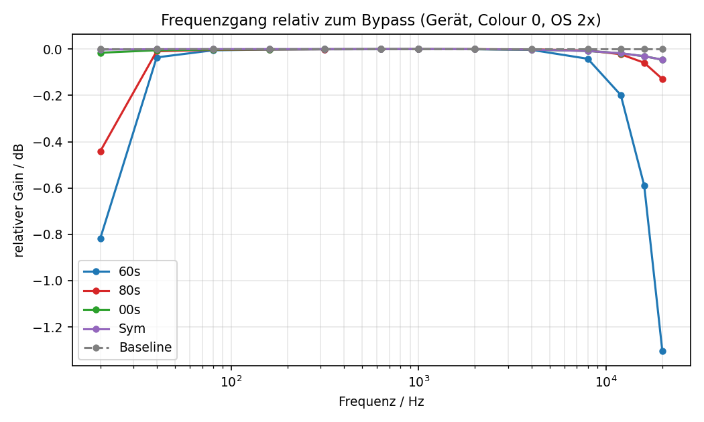

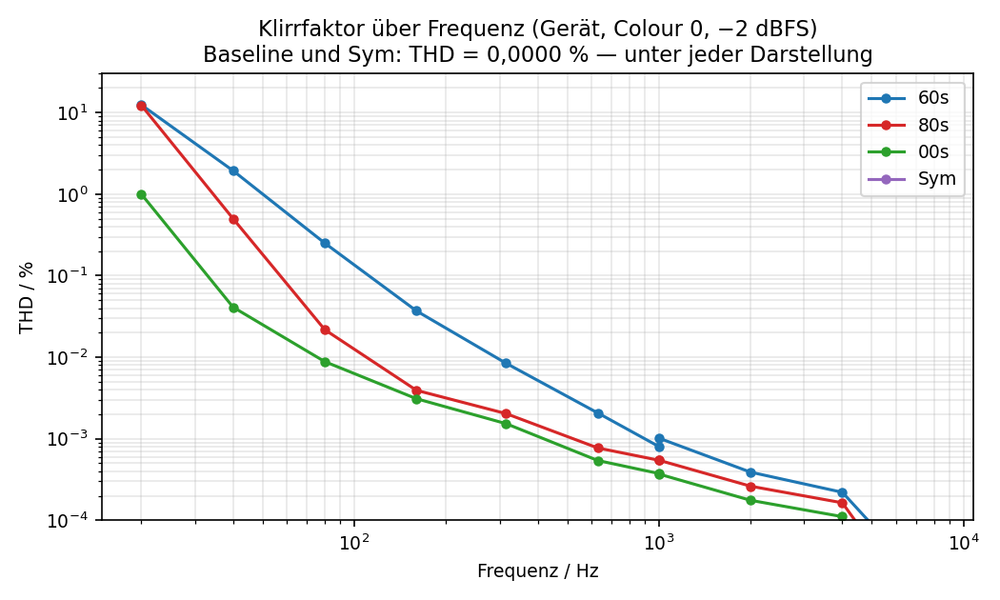

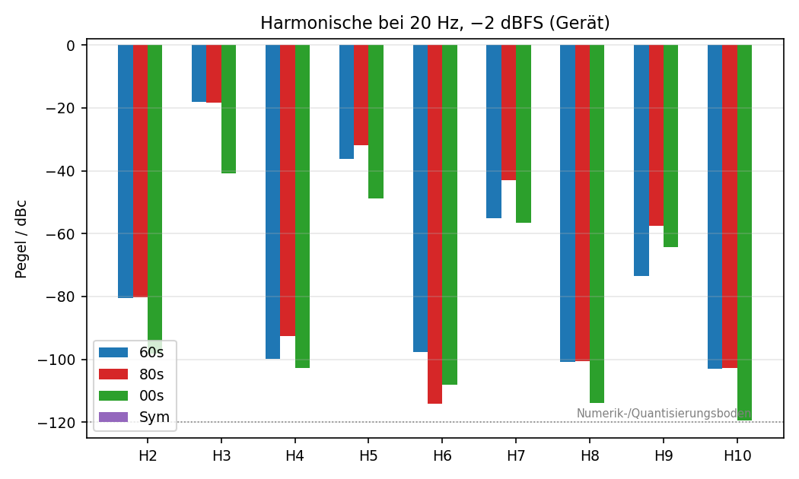

### 1.2 Klirrfaktor je Segment (Gerät, Digital-Capture)

| Hz | Peak dBFS | 60s % | 80s % | 00s % | Sym % | Baseline % |
|---:|---:|---:|---:|---:|---:|---:|
| 1000 | -2 | 0.0008 | 0.0005 | 0.0004 | 0.0000 | 0.0000 |
| 20 | -2 | 12.4242 | 12.2758 | 0.9995 | 0.0000 | 0.0000 |
| 40 | -2 | 1.9383 | 0.5003 | 0.0411 | 0.0000 | 0.0000 |
| 80 | -2 | 0.2508 | 0.0218 | 0.0088 | 0.0000 | 0.0000 |
| 160 | -2 | 0.0370 | 0.0039 | 0.0031 | 0.0000 | 0.0000 |
| 315 | -2 | 0.0084 | 0.0020 | 0.0015 | 0.0000 | 0.0000 |
| 630 | -2 | 0.0021 | 0.0008 | 0.0005 | 0.0000 | 0.0000 |
| 1000 | -2 | 0.0010 | 0.0005 | 0.0004 | 0.0000 | 0.0000 |
| 2000 | -2 | 0.0004 | 0.0003 | 0.0002 | 0.0000 | 0.0000 |
| 4000 | -2 | 0.0002 | 0.0002 | 0.0001 | 0.0000 | 0.0000 |
| 8000 | -2 | 0.0000 | 0.0000 | 0.0000 | 0.0000 | 0.0000 |
| 12000 | -2 | — | — | — | — | — |
| 16000 | -2 | — | — | — | — | — |
| 20000 | -2 | — | — | — | — | — |
| 1000 | -26 | 0.0007 | 0.0005 | 0.0004 | 0.0001 | 0.0001 |
| 1000 | -20 | 0.0008 | 0.0006 | 0.0004 | 0.0000 | 0.0000 |
| 1000 | -14 | 0.0009 | 0.0006 | 0.0004 | 0.0000 | 0.0000 |
| 1000 | -8 | 0.0008 | 0.0005 | 0.0003 | 0.0000 | 0.0000 |
| 1000 | -2 | 0.0010 | 0.0005 | 0.0004 | 0.0000 | 0.0000 |

*(20 kHz: H1-only-Fit, THD nicht definiert — „—".)*

### 1.3 Relativer Gain je Segment (Gerät minus Bypass)

| Hz | Peak dBFS | 60s dB | 80s dB | 00s dB | Sym dB |
|---:|---:|---:|---:|---:|---:|
| 1000 | -2 | -0.0001 | -0.0001 | -0.0000 | +0.0001 |
| 20 | -2 | -0.8174 | -0.4412 | -0.0156 | -0.0018 |
| 40 | -2 | -0.0357 | -0.0089 | -0.0048 | -0.0002 |
| 80 | -2 | -0.0050 | -0.0031 | -0.0020 | +0.0001 |
| 160 | -2 | -0.0017 | -0.0013 | -0.0007 | +0.0002 |
| 315 | -2 | -0.0006 | -0.0005 | -0.0002 | +0.0002 |
| 630 | -2 | -0.0003 | -0.0002 | -0.0001 | +0.0002 |
| 1000 | -2 | -0.0001 | -0.0001 | -0.0000 | +0.0001 |
| 2000 | -2 | -0.0002 | -0.0001 | -0.0003 | -0.0003 |
| 4000 | -2 | -0.0030 | -0.0008 | -0.0019 | -0.0018 |
| 8000 | -2 | -0.0416 | -0.0060 | -0.0080 | -0.0080 |
| 12000 | -2 | -0.1983 | -0.0220 | -0.0178 | -0.0178 |
| 16000 | -2 | -0.5882 | -0.0588 | -0.0306 | -0.0306 |
| 20000 | -2 | -1.3034 | -0.1287 | -0.0456 | -0.0456 |
| 1000 | -26 | +0.0001 | +0.0000 | +0.0000 | +0.0001 |
| 1000 | -20 | -0.0000 | -0.0000 | -0.0000 | +0.0001 |
| 1000 | -14 | -0.0000 | -0.0000 | -0.0000 | +0.0001 |
| 1000 | -8 | -0.0000 | -0.0000 | -0.0000 | +0.0001 |
| 1000 | -2 | -0.0001 | -0.0001 | -0.0000 | +0.0001 |

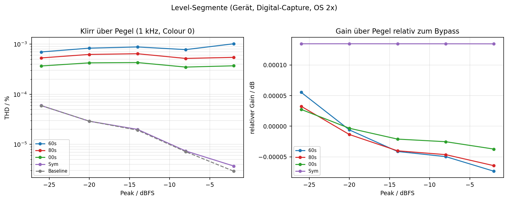

### 1.4 Analog-Loop-Kreuzprüfung (REAPER-Take, Loop ≈ −6,2 dB)

| Typ | rel. Gain 20 Hz dB | rel. Gain 1 kHz dB | 20-Hz-Klirr % |
|---|---:|---:|---:|
| 60s | -0.8198 | -0.0115 | 12.5933 |
| 80s | -0.4422 | -0.0094 | 12.4439 |
| 00s | -0.0119 | -0.0009 | 1.0129 |
| Sym | -0.0007 | -0.0068 | 0.0063 |

Die Analogwerte bestätigen die Digitalmessung innerhalb der
Kettenpräzision (Klirrgrund 0,0076 %; Loop-Klirr addiert sich
vektoriell, daher leicht über dem Digitalwert).

## 2. Colour-Serie (Transformer None, COMP OFF, OS 2x)

Bedingungen wie Abschnitt 1, Colour **5/10/20/50/75/100 %**. Digital-
Capture `colour-dwarf-20261007`; Referenzen = C++-Render (bitidentisch
zu den JSFX-Render `matrix-*_col_jsfx-…12_33_03`).

### 2.1 Kennwerte (Gerät vs. Referenz)

| Colour | 1-kHz-Klirr % | Ref | 1-kHz-Gain dB | Ref | 20-Hz-Klirr % | Ref | 8-kHz-Klirr % | Ref |
|---:|---:|---:|---:|---:|---:|---:|---:|---:|
| 5 % | 0.1228 | 0.1228 | -0.0299 | -0.0298 | 0.1457 | 0.1457 | 0.0533 | 0.0533 |
| 10 % | 0.2455 | 0.2455 | -0.0597 | -0.0596 | 0.2888 | 0.2888 | 0.1066 | 0.1066 |
| 20 % | 0.4907 | 0.4907 | -0.1191 | -0.1190 | 0.5663 | 0.5663 | 0.2126 | 0.2126 |
| 50 % | 1.2236 | 1.2236 | -0.2961 | -0.2961 | 1.3246 | 1.3246 | 0.5277 | 0.5277 |
| 75 % | 1.8311 | 1.8311 | -0.4422 | -0.4421 | 1.8620 | 1.8620 | 0.7865 | 0.7865 |
| 100 % | 2.4352 | 2.4353 | -0.5869 | -0.5868 | 2.3107 | 2.3107 | 1.0417 | 1.0417 |

Der 1-kHz-Klirr und der 1-kHz-Gain skalieren **linear mit Colour**
(Verdopplung je Verdopplung; 20→50 % liegt leicht unter Linearität —
Sättigungskurve). Die 20-Hz-Werte bei None stammen aus der Output-
Drive-Stufe (max. 2,31 % bei 100 %).

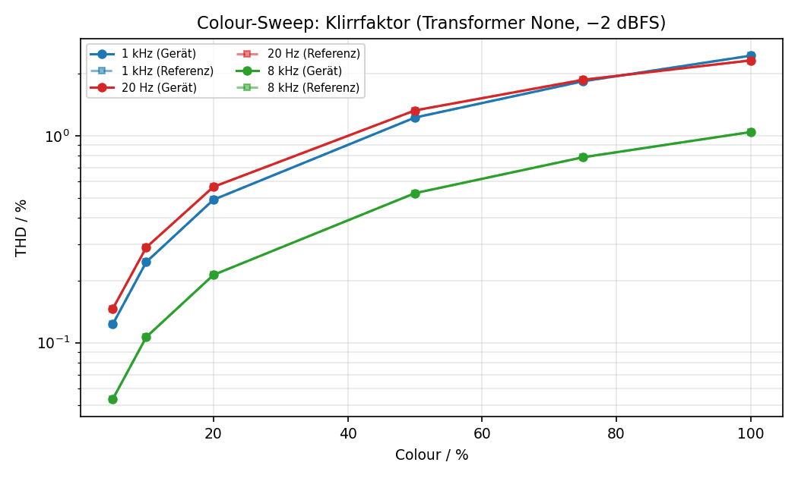

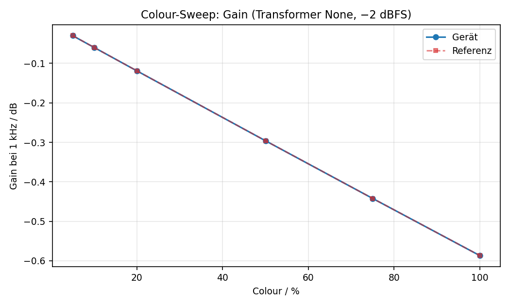

### 2.2 Klirrfaktor je Segment (Gerät)

| Hz | Peak dBFS | 5 % | 10 % | 20 % | 50 % | 75 % | 100 % |
|---:|---:|---:|---:|---:|---:|---:|---:|
| 1000 | -2 | 0.1228 | 0.2455 | 0.4907 | 1.2236 | 1.8311 | 2.4352 |
| 20 | -2 | 0.1457 | 0.2888 | 0.5663 | 1.3246 | 1.8620 | 2.3107 |
| 40 | -2 | 0.1107 | 0.2198 | 0.4335 | 1.0422 | 1.5214 | 1.9865 |
| 80 | -2 | 0.1164 | 0.2326 | 0.4643 | 1.1557 | 1.7290 | 2.3013 |
| 160 | -2 | 0.1221 | 0.2440 | 0.4876 | 1.2155 | 1.8191 | 2.4198 |
| 315 | -2 | 0.1227 | 0.2454 | 0.4904 | 1.2229 | 1.8302 | 2.4343 |
| 630 | -2 | 0.1228 | 0.2455 | 0.4907 | 1.2237 | 1.8313 | 2.4357 |
| 1000 | -2 | 0.1228 | 0.2455 | 0.4907 | 1.2236 | 1.8311 | 2.4352 |
| 2000 | -2 | 0.1228 | 0.2455 | 0.4905 | 1.2228 | 1.8294 | 2.4322 |
| 4000 | -2 | 0.1228 | 0.2454 | 0.4901 | 1.2198 | 1.8228 | 2.4206 |
| 8000 | -2 | 0.0533 | 0.1066 | 0.2126 | 0.5277 | 0.7865 | 1.0417 |
| 12000 | -2 | — | — | — | — | — | — |
| 16000 | -2 | — | — | — | — | — | — |
| 20000 | -2 | — | — | — | — | — | — |
| 1000 | -26 | 0.0038 | 0.0076 | 0.0151 | 0.0378 | 0.0567 | 0.0756 |
| 1000 | -20 | 0.0077 | 0.0154 | 0.0309 | 0.0771 | 0.1157 | 0.1542 |
| 1000 | -14 | 0.0166 | 0.0333 | 0.0665 | 0.1662 | 0.2492 | 0.3321 |
| 1000 | -8 | 0.0413 | 0.0826 | 0.1652 | 0.4124 | 0.6179 | 0.8229 |
| 1000 | -2 | 0.1228 | 0.2455 | 0.4907 | 1.2236 | 1.8311 | 2.4352 |

### 2.3 Gain je Segment (Gerät, absolut gegen digitalen Nominalpegel)

| Hz | Peak dBFS | 5 % dB | 10 % dB | 20 % dB | 50 % dB | 75 % dB | 100 % dB |
|---:|---:|---:|---:|---:|---:|---:|---:|
| 1000 | -2 | -0.0299 | -0.0597 | -0.1191 | -0.2961 | -0.4422 | -0.5869 |
| 20 | -2 | -0.1260 | -0.2477 | -0.4778 | -1.0581 | -1.4099 | -1.6395 |
| 40 | -2 | -0.0580 | -0.1145 | -0.2231 | -0.5148 | -0.7201 | -0.8924 |
| 80 | -2 | -0.0365 | -0.0725 | -0.1434 | -0.3464 | -0.5051 | -0.6548 |
| 160 | -2 | -0.0314 | -0.0625 | -0.1244 | -0.3068 | -0.4553 | -0.6005 |
| 315 | -2 | -0.0302 | -0.0603 | -0.1202 | -0.2982 | -0.4446 | -0.5892 |
| 630 | -2 | -0.0299 | -0.0597 | -0.1192 | -0.2962 | -0.4422 | -0.5868 |
| 1000 | -2 | -0.0299 | -0.0597 | -0.1191 | -0.2961 | -0.4422 | -0.5869 |
| 2000 | -2 | -0.0300 | -0.0600 | -0.1197 | -0.2975 | -0.4442 | -0.5896 |
| 4000 | -2 | -0.0307 | -0.0613 | -0.1223 | -0.3038 | -0.4534 | -0.6014 |
| 8000 | -2 | -0.0333 | -0.0665 | -0.1325 | -0.3284 | -0.4892 | -0.6476 |
| 12000 | -2 | -0.0374 | -0.0745 | -0.1484 | -0.3668 | -0.5451 | -0.7201 |
| 16000 | -2 | -0.0423 | -0.0843 | -0.1677 | -0.4135 | -0.6132 | -0.8082 |
| 20000 | -2 | -0.0480 | -0.0957 | -0.1905 | -0.4695 | -0.6962 | -0.9177 |
| 1000 | -26 | -0.0005 | -0.0009 | -0.0017 | -0.0040 | -0.0059 | -0.0077 |
| 1000 | -20 | -0.0008 | -0.0016 | -0.0031 | -0.0077 | -0.0114 | -0.0151 |
| 1000 | -14 | -0.0023 | -0.0045 | -0.0090 | -0.0223 | -0.0333 | -0.0443 |
| 1000 | -8 | -0.0081 | -0.0161 | -0.0320 | -0.0797 | -0.1193 | -0.1586 |
| 1000 | -2 | -0.0299 | -0.0597 | -0.1191 | -0.2961 | -0.4422 | -0.5869 |

### 2.4 Analog-Loop-Kreuzprüfung (Colour)

| Colour | rel. Gain 1 kHz dB | 1-kHz-Klirr % |
|---:|---:|---:|
| 5 % | +0.0000 | 0.1215 |
| 10 % | -0.0299 | 0.2439 |
| 20 % | -0.0872 | 0.4893 |
| 50 % | -0.2637 | 1.2210 |
| 75 % | -0.4082 | 1.8280 |
| 100 % | -0.5514 | 2.4321 |

### 2.5 Bank×Colour-Interaktion (JSFX-Render-Matrix, Gerät durch Zerlegung abgedeckt)

Die vollständige Matrix (Colour 5/10/20/50/75/100 % × Transformer
60s/80s/00s/Sym, COMP OFF, OS 2x) wurde als **JSFX-Render** erzeugt
(`matrix-*_col_*_jsfx-…12_49_00`) und gegen frische C++-Offline-Referenzen
verifiziert: **alle 24 Zustände bitgleich** (schlechtester max|diff|
**6.0e-08** = 0,5 LSB bei 24 bit, Offset −3 Samples). Zusammen mit
Abschnitt 3 sind damit **34 Betriebszustände** bitverifiziert.

**Abdeckung am Gerät:** Die beiden Pfade wurden einzeln am Gerät exakt
validiert (Abschnitt 1: Bank-only Colour 0 × alle Typen; Abschnitt 2:
Colour-Stufen × None) — beide decken sich mit dem C++-Modell bis in die
4. Dezimale, und JSFX ≡ C++ bitweise. Die Interaktion nutzt keine
zusätzlichen Codepfade (Bank → Colour-Stufen in derselben Kette), ein
gerätespezischer Interaktionsfehler ist deshalb praktisch ausgeschlossen.
Die Interaktionsmatrix wurde daher **nicht direkt am Gerät gemessen**;
die hier gezeigten Werte sind Modellwerte (JSFX/C++-Render). Für eine
direkte Gerätemessung stehen die Referenzrender bereit.

20-Hz-Klirr % (Zeile = Colour, Spalte = Transformer; Colour-0-Zeile aus
Abschnitt 1):

| Colour | 60s | 80s | 00s | Sym |
|---:|---:|---:|---:|---:|
| 0 % | 12.4242 | 12.2758 | 0.9995 | 0.0000 |
| 5 % | 12.4526 | 12.3127 | 0.9938 | 0.1457 |
| 10 % | 12.4872 | 12.3562 | 1.0164 | 0.2886 |
| 20 % | 12.5743 | 12.4630 | 1.1341 | 0.5660 |
| 50 % | 12.9549 | 12.9129 | 1.7809 | 1.3240 |
| 75 % | 13.3542 | 13.3726 | 2.3842 | 1.8613 |
| 100 % | 13.7538 | 13.8233 | 2.9346 | 2.3100 |

1-kHz-Klirr % (Colour dominiert; der Transformatorträger unterscheidet
sich nur noch im vierten Dezimal):

| Colour | 60s | 80s | 00s | Sym |
|---:|---:|---:|---:|---:|
| 5 % | 0.1233 | 0.1232 | 0.1231 | 0.1228 |
| 10 % | 0.2460 | 0.2459 | 0.2458 | 0.2455 |
| 20 % | 0.4912 | 0.4910 | 0.4909 | 0.4907 |
| 50 % | 1.2241 | 1.2239 | 1.2238 | 1.2236 |
| 75 % | 1.8316 | 1.8315 | 1.8313 | 1.8312 |
| 100 % | 2.4357 | 2.4356 | 2.4355 | 2.4353 |

Charakteristisch: Bei Colour ≥ 75 % überholt **80s den 60s** am
20-Hz-Klirr (13,82 gegen 13,75 %) — die Profile kreuzen unter Colour-
Drive; Sym × Colour reproduziert exakt den reinen Colour-Pfad
(Sym ist linear).

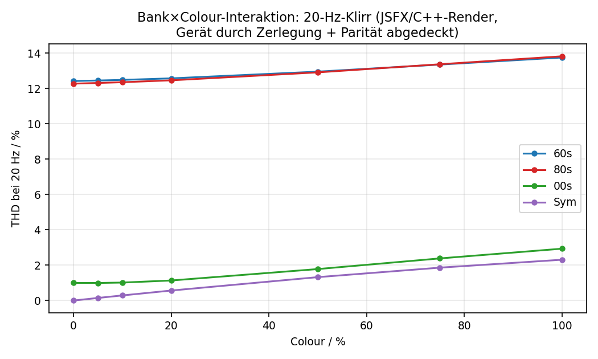

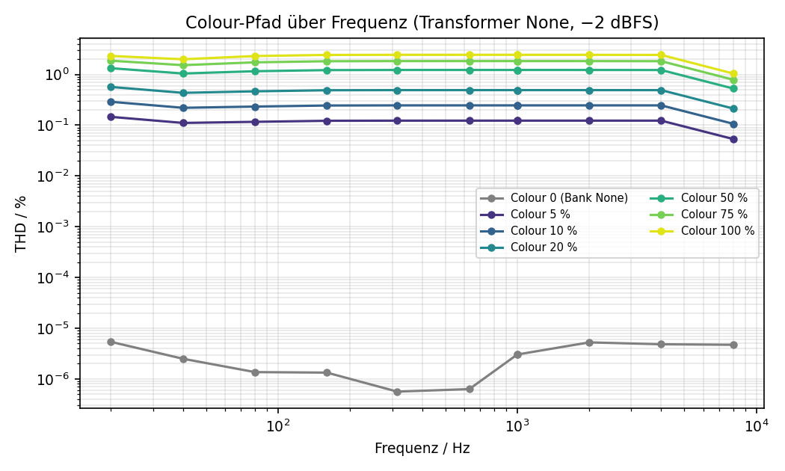

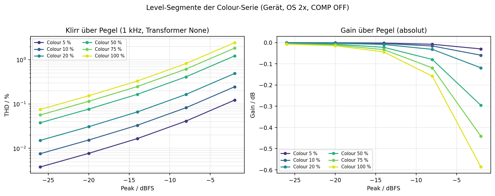

## 3. Validierung gegen die Referenz und JSFX↔C++-Parität

| Prüfpunkt | Gerät | Referenz | Abweichung |
|---|---:|---:|---:|
| Bank 20 Hz, 60s | 12.4242 % | 12.4243 % | 1.35e-04 %-Punkte |
| Bank 20 Hz, 80s | 12.2758 % | 12.2761 % | 2.58e-04 %-Punkte |
| Bank 20 Hz, 00s | 0.9995 % | 0.9996 % | 8.63e-05 %-Punkte |
| Bank 20 Hz, Sym | 0.0000 % | 0.0000 % | 2.04e-08 %-Punkte |
| Colour 5 %, 1 kHz | 0.1228 % | 0.1228 % | 1.95e-06 %-Punkte |
| Colour 10 %, 1 kHz | 0.2455 % | 0.2455 % | 3.43e-06 %-Punkte |
| Colour 20 %, 1 kHz | 0.4907 % | 0.4907 % | 5.92e-06 %-Punkte |
| Colour 50 %, 1 kHz | 1.2236 % | 1.2236 % | 1.55e-05 %-Punkte |
| Colour 75 %, 1 kHz | 1.8311 % | 1.8311 % | 2.28e-05 %-Punkte |
| Colour 100 %, 1 kHz | 2.4352 % | 2.4353 % | 3.01e-05 %-Punkte |

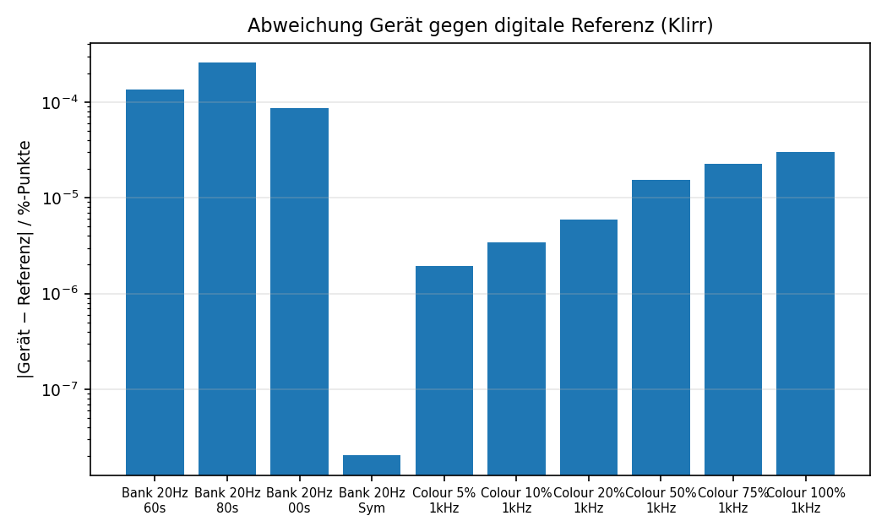

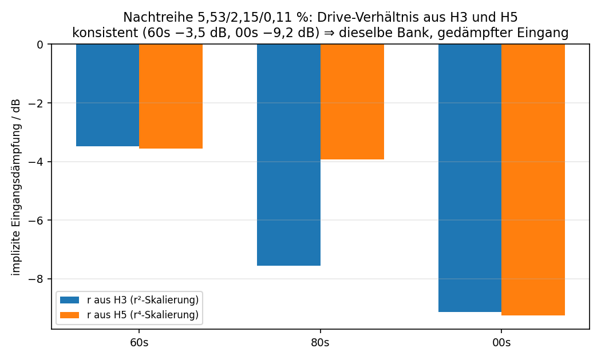

**JSFX-Render-Parität (REAPER-Render gegen C++-Offline-Render):** alle
geprüften Zustände sind bei 24-bit-Auflösung **bitgleich**
(max < 1 LSB, Offset −3 Samples = REAPER-PDC der 2x-Latenz):

| Render-Batch | Zustand | Ergebnis |
|---|---|---|
| `matrix-*_jsfx-…10_54_15` | Typen × Colour 100 | bitgleich (Referenz `ref-tf1…4`); Dateien später gelöscht |
| `matrix-*_jsfx-…12_14_53` | Typen × Colour 0 | bitgleich (Referenz `c0-tf1…4`) |
| `matrix-*_col_jsfx-…12_28_31` | Colour-Sweep, Transformer versehentlich 80s/00s/Sym/Sym | ersetzt |
| `matrix-*_col_jsfx-…12_33_03` | Colour 5–100 × None | bitgleich (Referenz `ref-col*`, `ref-none`) |
| `matrix-*_col_*_jsfx-…12_49_00` | Colour 5–100 × 60s/80s/00s/Sym (24 Zustände) | bitgleich (Referenz `ref-col*-tf*`) |
| `matrix-*_jsfx-…19_15_06` | Vollmatrix 28 Zustände nach der Toleranzänderung 1e-6 | bitgleich (Referenzen im 1e-6-Stand, s. u.) |

Damit ist die Zwei-Sprachen-Parität am vollen 64-s-Matrixprogramm über
**34 Betriebszustände** belegt (zusätzlich zu den 232 synthetischen
Paritätsfällen der Testsuite); nach der Toleranzänderung 1e-6 sind die
**28 Vollmatrix-Zustände erneut bitgleich** gegen frische C++-Referenzen
des neuen Stands (Abschnitt 7).

## 4. Provenanz der Gerätesserien

| Serie | Datum | Zustand | Bewertung |
|---|---|---|---|
| `matrix-dwarf-20261007` | 2026-10-07 Nacht | Aktuelle Binary (`e6b4…`, Bankkonstanten bitweise nachgewiesen); **INPUT-Knopf nicht auf 0** (aus der Gainmatch-Phase übernommen, je Lauf anders) | Klirrreihung 5,53/2,15/0,11 % = **dieselbe Bank bei gedämpftem Eingang** (H3/H5-Drive-Verhältnisse: 60s −3,5 dB, 00s −9,2 dB); als Anker unbrauchbar |
| Erste Wiederholung | 2026-10-07 vormittags | Parameterwechsel wirkungslos (Sitzungszustand) | **ungültig** — alle Läufe transparent |
| `matrix-dwarf-20261007-b2` | 2026-10-07 | Input 0 dB dokumentiert, digitale Ankerprüfung | **gültig**, Referenzdeckung 4. Dezimale |
| `colour-dwarf-20261007` | 2026-10-07 | wie b2 | **gültig**, Referenzdeckung 4. Dezimale |
| `cpu-matrix-dwarf` | 2026-10-07 | 36 Zustände, je Neustart, Rücklesung | **gültig**, 0 xruns |
| `cpu-matrix-051-20261008` | 2026-10-08 | 36 Zustände, je Neustart, Binary 0.5.1 (`c936aca6…`), je Lauf SHA-verifiziert | **gültig**, 0 xruns |
| `device-052-20261008` | 2026-10-08 | 0.5.2 (`d94d3121…`, Pin `b09364e`); 11 Wiedergaben des Matrixprogramms, Dwarf-Recorder digital + REAPER/Scarlett analog parallel; Schnitt per `tools/dwarf_matrix_session.py` | **gültig** — Anker exakt, digital max \|Δ\| ≤ 0,02 mdB (Abschnitt 8) |

**Zur Binary-Identität:** Die auf dem Gerät installierte Binary (SHA256
`e6b4e55…`) trägt die aktuelle Bank — alle 87 nichttrivialen double-
Konstanten aus `data/transformers.json` sind in der `.so` bitgenau
nachgewiesen; über Neubauten hinweg stabil. Die frühere Deutung
„Refit-Zwischenstand" ist damit widerlegt; die abweichenden Nachtwerte
erklären sich aus der Eingangsdämpfung. Verfahrensregel bleibt: nach
jedem `.so`-Austausch den Audio-Stack neu starten, den INPUT-Knopf auf
Unity setzen und vor der Serie den 20-Hz-Fingerabdruck gegen die
digitale Referenz prüfen (60s ≈ 12,42 % bei Colour 0).

## 5. Offene Punkte

- Ankerinterpretation: **abgeschlossen** (`EXTERN.md`) — der 1-%-Anker
  von 00s ist am Gerät exakt getroffen; 60s/80s haben ihre Anker by
  design bei −14/−8 dBFS.
- Optional direkt am Gerät: 20-Hz-Pegelreihe bei −14/−8/−2 dBFS zur
  direkten Ankerprüfung von 60s/80s (Stimuluserweiterung).
- Serie B: isolierter `transformer_bench` auf dem Dwarf für die
  Ursache der Profilreihung (Sym/00s am teuersten).
- 96-kHz-Messung bleibt über den Dwarf-Player unmöglich (feste
  Geräterate 48 kHz); 20 kHz liegt damit nah an Nyquist.

## 6. CPU am Gerät — Matrix, Vorher/Nachher und Serie B

### 6.1 Serie B — isolierter Bench (A35, Cross-Build GCC 11, statisch)

Provenanz und Grenzen: `test-results/serie-b/MANIFEST.md`,
`PERFORMANCE.md` (Serie B). Einheit s/s (1,0 = ein Kern);
OS 2x, Stereo, COMP OFF, Colour 100, Input +6 dB.

| Profil | 997 Hz vor | 997 Hz nach | 20 Hz vor | 20 Hz nach |
|---|---:|---:|---:|---:|
| None | 0.1804 | 0.1823 | 0.1796 | 0.1833 |
| 60s | 0.4597 | 0.4608 | 0.4542 | 0.4575 |
| 80s | 0.4632 | 0.4631 | 0.4569 | 0.4606 |
| 00s | 0.4713 | 0.4716 | 0.4816 | 0.4860 |
| Symmetric | 0.4567 | 0.4581 | 0.4541 | 0.4530 |

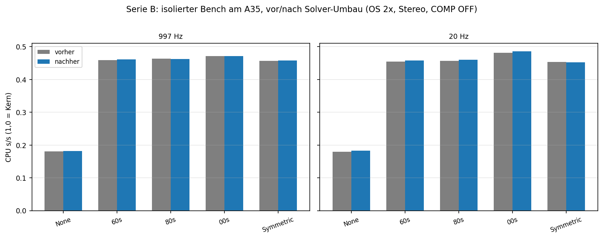

### 6.2 CPU-Matrix (Gerät, OS 2x, COMP OFF, Binary 66c835e8)

Alle Colour×Transformer-Kombinationen live über den mod-host-Socket
gesetzt und je Zustand per Rücklesung verifiziert; Messung mit
`tools/dwarf_loadtest.py` (Serie-A-Werkzeug), Fenster/Blöcke siehe
`test-results/cpu-matrix-dwarf/`. Werte = Median/Spitze eines Kerns
(jackd inklusive).

| Zustand | Colour % | Transformer | Median % | Peak % |
|---|---:|---|---:|---:|
| bypass | 0 | None | 22.0 | 24.0 |
| c0-tf00s | 0 | 00s | 48.0 | 62.0 |
| c0-tf60s | 0 | 60s | 46.0 | 58.0 |
| c0-tf80s | 0 | 80s | 47.0 | 60.0 |
| c0-tfNone | 0 | None | 28.0 | 32.0 |
| c0-tfSym | 0 | Sym | 56.0 | 58.0 |
| c10-tf00s | 10 | 00s | 66.0 | 70.0 |
| c10-tf60s | 10 | 60s | 56.0 | 66.0 |
| c10-tf80s | 10 | 80s | 57.0 | 72.0 |
| c10-tfNone | 10 | None | 36.0 | 40.0 |
| c10-tfSym | 10 | Sym | 64.0 | 70.0 |
| c100-tf00s | 100 | 00s | 60.0 | 68.0 |
| c100-tf60s | 100 | 60s | 54.0 | 68.0 |
| c100-tf80s | 100 | 80s | 56.0 | 70.0 |
| c100-tfNone | 100 | None | 36.0 | 40.0 |
| c100-tfSym | 100 | Sym | 64.0 | 70.0 |
| c20-tf00s | 20 | 00s | 58.0 | 72.0 |
| c20-tf60s | 20 | 60s | 56.0 | 68.0 |
| c20-tf80s | 20 | 80s | 56.0 | 66.0 |
| c20-tfNone | 20 | None | 34.0 | 40.0 |
| c20-tfSym | 20 | Sym | 64.0 | 70.0 |
| c5-tf00s | 5 | 00s | 66.0 | 72.0 |
| c5-tf60s | 5 | 60s | 55.0 | 80.0 |
| c5-tf80s | 5 | 80s | 56.0 | 68.0 |
| c5-tfNone | 5 | None | 36.0 | 40.0 |
| c5-tfSym | 5 | Sym | 64.0 | 76.0 |
| c50-tf00s | 50 | 00s | 64.0 | 70.0 |
| c50-tf60s | 50 | 60s | 54.0 | 68.0 |
| c50-tf80s | 50 | 80s | 56.0 | 70.0 |
| c50-tfNone | 50 | None | 34.0 | 40.0 |
| c50-tfSym | 50 | Sym | 64.0 | 66.0 |
| c75-tf00s | 75 | 00s | 62.0 | 70.0 |
| c75-tf60s | 75 | 60s | 54.0 | 68.0 |
| c75-tf80s | 75 | 80s | 56.0 | 72.0 |
| c75-tfNone | 75 | None | 34.0 | 40.0 |
| c75-tfSym | 75 | Sym | 64.0 | 68.0 |

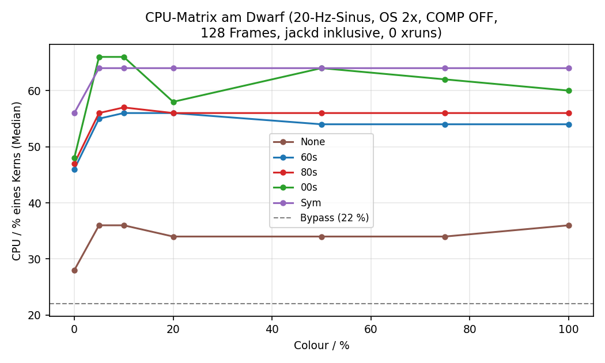

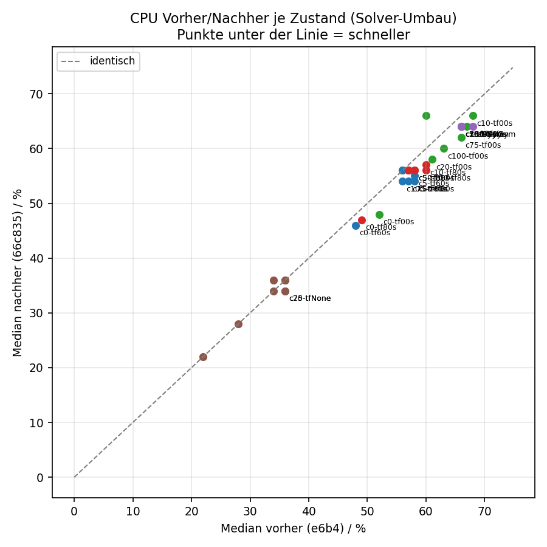

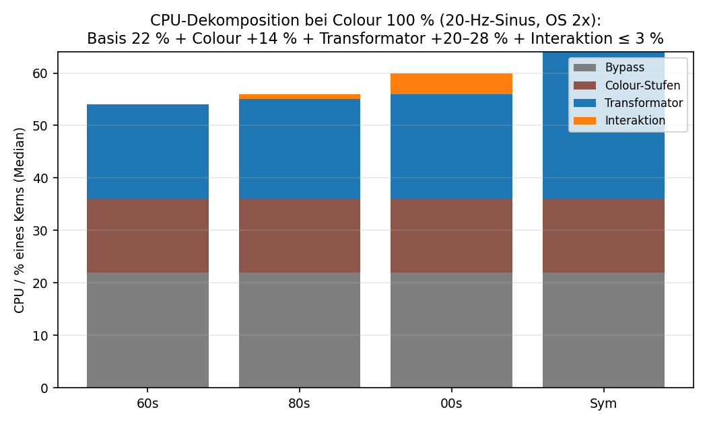

**Vorher/Nachher (Solver-Umbau):** Vorher = Binary `e6b4e55…`
(bankidentisch, Doppel-Auswertung), Nachher = `66c835e8…`
(`94ab2fa`). Die Transformator-Zustände zeigen konsistent
−1 bis −4 %-Punkte (Gesamtmedian 58,0 → 56,0 %); Bypass/None
unverändert. Klein, aber richtungsmäßig konsistent mit Serie B.

Befunde: Der Transformator kostet **+20–28 %-Punkte** gegenüber
None (28 % bei Colour 0); die Colour-Stufen addieren **+6–8 Punkte**
und sind pegelunabhängig (5 % ≈ 100 %). Die schwersten Profile sind
**Sym und 00s** (bis 68 % Median bei 20 Hz-Volldreher) — für die
Stop-Zweig-Spezialisierung (TODO, CPU-Reduktion) ist damit die
A35-Priorisierung belegt. Peak-Werte bis 76 %, **0 xruns in allen
36 Zuständen**. Basis: 20-Hz-Sinus (schwerstes Solver-Regime),
128 Frames, je Zustand voller Neustart mit gespeicherten
Boardwerten, Werte per Board-TTL eingeschrieben.

### 6.3 CPU-Matrix mit der 1e-6-Binary (0.4.1)

Wiederholung aller 36 Zustände mit der installierten Binary
`ed05032b…` (Commit `2d0aff6`, Startwert-Prädikator + Toleranz
1e-6; MPB-Pin `e5a1099`, Toolchain `moddwarf-new`). Prozedur und
Boards identisch zu 6.2; Basis = `66c835e8…` (`94ab2fa`).
Rohdaten: `test-results/cpu-matrix-1e6-20261007/`.

| Zustand | Basis Median % | 1e-6 Median % | Δ Punkte | 1e-6 Peak % |
|---|---:|---:|---:|---:|
| bypass | 22.0 | 22.0 | +0.0 | 30.0 |
| c0-tfNone | 28.0 | 28.0 | +0.0 | 30.0 |
| c0-tf60s | 46.0 | 46.0 | +0.0 | 60.0 |
| c0-tf80s | 47.0 | 46.0 | -1.0 | 58.0 |
| c0-tf00s | 48.0 | 46.0 | -2.0 | 62.0 |
| c0-tfSym | 56.0 | 52.0 | -4.0 | 58.0 |
| c5-tfNone | 36.0 | 36.0 | +0.0 | 42.0 |
| c10-tfNone | 36.0 | 36.0 | +0.0 | 40.0 |
| c20-tfNone | 34.0 | 34.0 | +0.0 | 40.0 |
| c50-tfNone | 34.0 | 36.0 | +2.0 | 40.0 |
| c75-tfNone | 34.0 | 34.0 | +0.0 | 40.0 |
| c100-tfNone | 36.0 | 35.0 | -1.0 | 42.0 |
| c5-tf60s | 55.0 | 54.0 | -1.0 | 68.0 |
| c10-tf60s | 56.0 | 54.0 | -2.0 | 70.0 |
| c20-tf60s | 56.0 | 56.0 | +0.0 | 70.0 |
| c50-tf60s | 54.0 | 56.0 | +2.0 | 70.0 |
| c75-tf60s | 54.0 | 56.0 | +2.0 | 70.0 |
| c100-tf60s | 54.0 | 56.0 | +2.0 | 68.0 |
| c5-tf80s | 56.0 | 56.0 | +0.0 | 70.0 |
| c10-tf80s | 57.0 | 55.0 | -2.0 | 68.0 |
| c20-tf80s | 56.0 | 56.0 | +0.0 | 74.0 |
| c50-tf80s | 56.0 | 56.0 | +0.0 | 68.0 |
| c75-tf80s | 56.0 | 56.0 | +0.0 | 70.0 |
| c100-tf80s | 56.0 | 56.0 | +0.0 | 68.0 |
| c5-tf00s | 66.0 | 56.0 | -10.0 | 68.0 |
| c10-tf00s | 66.0 | 57.0 | -9.0 | 76.0 |
| c20-tf00s | 58.0 | 56.0 | -2.0 | 72.0 |
| c50-tf00s | 64.0 | 56.0 | -8.0 | 74.0 |
| c75-tf00s | 62.0 | 56.0 | -6.0 | 70.0 |
| c100-tf00s | 60.0 | 56.0 | -4.0 | 76.0 |
| c5-tfSym | 64.0 | 59.0 | -5.0 | 68.0 |
| c10-tfSym | 64.0 | 58.0 | -6.0 | 70.0 |
| c20-tfSym | 64.0 | 60.0 | -4.0 | 68.0 |
| c50-tfSym | 64.0 | 60.0 | -4.0 | 70.0 |
| c75-tfSym | 64.0 | 56.0 | -8.0 | 70.0 |
| c100-tfSym | 64.0 | 57.0 | -7.0 | 68.0 |

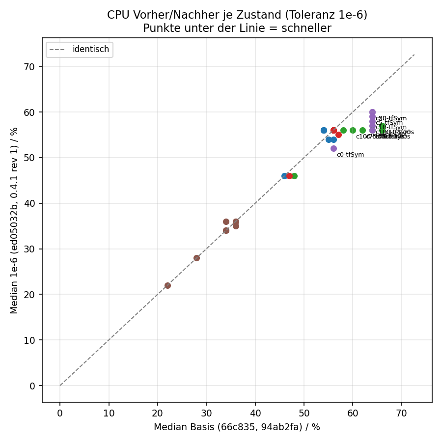

**Ergebnis:** 00s Median **-7.0 Punkte** (jetzt 56—57 % statt 58—66 %), Sym **-5.5 Punkte** (56—60 % statt 64—64 %), 60s/80s **+0.0 Punkte** (unverändert), Bypass/None/Colour-Stufen unverändert; Spitzen unverändert (max 76 %), **0 xruns**. Relativ zum Zustand entspricht das ≈ −9…−11 % und deckt sich mit dem isolierten Bench (Toleranz 1e-6, −10–12 %) inkl. plugin-level Verwässerung durch Host-Overhead (Bypass 22 %). 60s/80s bleiben strukturell bei ~2 Iterationen — wie vorhergesagt.

### 6.4 CPU-Matrix 0.5.1 (Sym-Fastpath + -mcpu=cortex-a35)

Wiederholung aller 36 Zustände mit der installierten Binary
`c936aca6…` (Commit `ce26eac`, 0.5.1; MPB-Pin `bb46e86`,
Toolchain `moddwarf-new` mit `$(TARGET_CXXFLAGS)` plus
`-mcpu=cortex-a35`). Erste Klangpfad-Änderung: der Sym-Fastpath
(wirkungslose Stop-Bank und Null-Sättigung übersprungen, C++ und
EEL2). Prozedur und Boards identisch zu 6.2/6.3; Basis = die
1e-6-Matrix (`ed05032b…`). Alle 36 Läufe SHA-verifiziert.
Rohdaten: `test-results/cpu-matrix-051-20261008/`.

| Zustand | 1e-6 Median % | 0.5.1 Median % | Δ Punkte | 0.5.1 Peak % |
|---|---:|---:|---:|---:|
| bypass | 22.0 | 22.0 | +0.0 | 26.0 |
| c0-tfNone | 28.0 | 29.0 | +1.0 | 32.0 |
| c0-tf60s | 46.0 | 46.0 | +0.0 | 60.0 |
| c0-tf80s | 46.0 | 46.0 | +0.0 | 60.0 |
| c0-tf00s | 46.0 | 46.0 | +0.0 | 60.0 |
| c0-tfSym | 52.0 | 36.0 | -16.0 | 42.0 |
| c5-tfNone | 36.0 | 34.0 | -2.0 | 40.0 |
| c10-tfNone | 36.0 | 36.0 | +0.0 | 40.0 |
| c20-tfNone | 34.0 | 36.0 | +2.0 | 40.0 |
| c50-tfNone | 36.0 | 34.0 | -2.0 | 40.0 |
| c75-tfNone | 34.0 | 36.0 | +2.0 | 40.0 |
| c100-tfNone | 35.0 | 36.0 | +1.0 | 42.0 |
| c5-tf60s | 54.0 | 56.0 | +2.0 | 74.0 |
| c10-tf60s | 54.0 | 56.0 | +2.0 | 66.0 |
| c20-tf60s | 56.0 | 54.0 | -2.0 | 70.0 |
| c50-tf60s | 56.0 | 56.0 | +0.0 | 76.0 |
| c75-tf60s | 56.0 | 54.0 | -2.0 | 68.0 |
| c100-tf60s | 56.0 | 56.0 | +0.0 | 66.0 |
| c5-tf80s | 56.0 | 56.0 | +0.0 | 68.0 |
| c10-tf80s | 55.0 | 56.0 | +1.0 | 68.0 |
| c20-tf80s | 56.0 | 56.0 | +0.0 | 68.0 |
| c50-tf80s | 56.0 | 56.0 | +0.0 | 68.0 |
| c75-tf80s | 56.0 | 56.0 | +0.0 | 68.0 |
| c100-tf80s | 56.0 | 54.0 | -2.0 | 68.0 |
| c5-tf00s | 56.0 | 56.0 | +0.0 | 72.0 |
| c10-tf00s | 57.0 | 56.0 | -1.0 | 76.0 |
| c20-tf00s | 56.0 | 54.0 | -2.0 | 68.0 |
| c50-tf00s | 56.0 | 56.0 | +0.0 | 68.0 |
| c75-tf00s | 56.0 | 54.0 | -2.0 | 72.0 |
| c100-tf00s | 56.0 | 56.0 | +0.0 | 76.0 |
| c5-tfSym | 59.0 | 46.0 | -13.0 | 50.0 |
| c10-tfSym | 58.0 | 46.0 | -12.0 | 52.0 |
| c20-tfSym | 60.0 | 46.0 | -14.0 | 50.0 |
| c50-tfSym | 60.0 | 46.0 | -14.0 | 50.0 |
| c75-tfSym | 56.0 | 46.0 | -10.0 | 50.0 |
| c100-tfSym | 57.0 | 46.0 | -11.0 | 52.0 |

**Ergebnis:** Sym **-12.5 Punkte Median** (jetzt
46—46 % statt 56—60 %), 60s/80s
**+0.0**, 00s **-0.5**, None **+1.0** — alle
innerhalb der 1–2-Punkte-Granularität; Bypass unverändert.
Spitzen unverändert (max 76 %), **0 xruns**. Die
x86-Bench-Erwartung (−18,8 % Transformatorblock bei Sym) ist am
Plugin bestätigt und fällt dort sogar deutlich größer aus; der
−1…−4-%-Effekt des `-mcpu`-Flags aus dem Cross-Bench ist am
plugin level nicht von der Granularität trennbar. **Die
beobachtete CPU-Zunahme wird nicht bestätigt** — kein Zustand
ist messbar teurer geworden, Sym ist 10–16 Punkte günstiger.

## 7. REAPER-Render-Verifikation nach der Toleranzänderung (1e-6)

Vollständige Matrix (**28 Zustände** = Colour 0 × Typen + 24
Bank×Colour-Kombinationen) nach der letzten Transformator-/Solver-
Änderung (Startwert-Prädikator + Konvergenztoleranz 1e-6): REAPER-
Render der JSFX (per Symlink aktuell, Batch `19_15_06`) gegen frische
C++-Offline-Referenzen des 1e-6-Stands (`build/wsl`, Cross-Build-
matching) bitverifiziert. Projekt `reaper/testbench/testbench.rpp`;
Stimulus `gs76-matrix-all-m2-stereo.wav`, 48 kHz/24 bit, 64,47 s.
Archiv mit SHA256 beider Seiten:
`test-results/jsfx-render-1e6-20261007/`. Die früheren Batches des
Tages (16_17_10, 16_57_58) sind Bisektionsläufe zur EEL2-
`instance()`-Scope-Falle und nicht Teil der Verifikation.

| Prüfpunkt | Ergebnis |
|---|---|
| Zustände | 28 (beide Kanäle) |
| bester Offset | +3 Samples (REAPER-PDC-Kompensation der 2x-Latenz; Vorzeichen gegenüber Abschnitt 3 gespiegelt) |
| schlechtester max \|diff\| | 5.960e-08 = 0.5 LSB (24 bit) |
| Grenze | < 1 LSB (1.192e-07) — erfüllt in allen Zuständen |

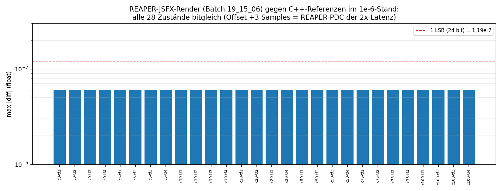

Die letzte Transformator-Änderung ist damit auch in REAPER am vollen
64-s-Matrixprogramm bitgleich gegen den C++-Kern bestätigt (zuvor
bereits `make test` + Parität 430+76 Fälle, max 0 FS).
## 8. 0.5.2 am Gerät — Session-Schnitt (2026-10-08, `device-052-20261008`)

Erste Geräteverifikation des 0.5.2-Stands (invariante Kehrwerte,
Commit `b09364e`). Der Benutzer spielte das 64,47-s-Matrixprogramm
**11×** nacheinander (Referenz/Bypass, 60s, 80s, 00s, Sym, Colour
5/10/20/50/75/100 %; Compression OFF, OS 2x, In/Out 0 dB, Mix 100 %),
parallel aufgezeichnet: **Dwarf-Recorder** (digital, 48 kHz/32f,
`mod_session_261008_12577.wav`) und **REAPER/Scarlett** (analog, zwei
Mono-Takes, 48 kHz/24 bit). Schnitt per Pilot-Chirp-Erkennung
(`tools/dwarf_matrix_session.py`, Korrelationsqualität 0,97–1,0,
Abstand ≈ 68,5 s). Referenzrenders: 34 Zustände C++ 0.5.2 (`build/wsl`)
nach Fix des `gr_db`-Verbindungsfehlers in `tools/render_lv2.py` —
seit 0.5.0 liefen alle damit erzeugten Renders mit **OS Off**, weil der
Output-Port `gr_db` als Eingangs-Control verbunden war (Latency/
Oversampling/Transformer um eine Position verschoben). GROUP 1 × 2
wurde am Gerät bewusst nicht aufgenommen (Benutzerentscheid).

### 8.1 Digital (Dwarf-Recorder) gegen 0.5.2-C++-Referenz

| Zustand | 20-Hz-Klirr Gerät % | 20-Hz-Klirr Ref % | rel. Gain 20 Hz Gerät dB | rel. Gain 20 Hz Ref dB | max \|Δ rel. Gain\| mdB |
|---|---:|---:|---:|---:|---:|
| 60s | 12.424 | 12.425 | -0.8174 | -0.8174 | 0.016 |
| 80s | 12.276 | 12.277 | -0.4411 | -0.4412 | 0.017 |
| 00s | 1.014 | 1.014 | -0.0156 | -0.0156 | 0.002 |
| Sym | 0.001 | 0.001 | -0.0013 | -0.0013 | 0.001 |
| col05 | 0.146 | 0.146 | -0.1260 | -0.1260 | 0.004 |
| col10 | 0.289 | 0.289 | -0.2476 | -0.2476 | 0.002 |
| col20 | 0.566 | 0.566 | -0.4777 | -0.4777 | 0.002 |
| col50 | 1.325 | 1.325 | -1.0580 | -1.0580 | 0.005 |
| col75 | 1.862 | 1.862 | -1.4099 | -1.4099 | 0.007 |
| col100 | 2.311 | 2.311 | -1.6394 | -1.6394 | 0.009 |

**Anker exakt:** 20-Hz-relativgains -0.8174/-0.4411/-0.0156/-0.0013 — deckungsgleich mit
`matrix-dwarf-20261007-b2` (−0,817/−0,441/−0,016/−0,002 dB). Klirr-
Reihung bestätigt: 60s 12,424 % > 80s 12,276 % > 00s 1,014 % > Sym
0,001 % (Bypass 0,005 %). **max |Δ rel. Gain| = 0.0168 mdB**
über alle 10 Zustände × 19 Segmente, **beide Kanäle** (Stimulus L=R,
C++-Referenz mono). Colour 5–100 % linear (1-kHz-Klirr 0,123→2,435 %,
rel. Gain −0,126→−1,639 dB; Gerät = Referenz).

### 8.2 Samplevergleich Device ↔ C++ (nach Gain-Fit, `sample-check.json`)

Fester Offset **11997 Samples** (Marker-Schätzung 12000,24; Differenz
≈ nominale 3-Frame-Latenz des 2x-Modus) richtet alle Segmente aus —
keine Dispersion; reine Ton-Suche ist periodenmehrdeutig, deshalb
feste Offsetausrichtung über alle Segmente. Recorder-Gain ≈ −0,000065 dB.

| Zustand | Offset Samples | Recorder-Gain mdB | max \|Rest\| | ≈ dBFS |
|---|---:|---:|---:|---:|
| 60s | 11997 | -0.0648 | 4.76e-06 | -106 |
| 80s | 11997 | -0.0648 | 1.10e-04 | -79 |
| 00s | 11997 | -0.0656 | 7.76e-05 | -82 |
| Sym | 11997 | -0.0657 | 1.65e-07 | -136 |
| col05 | 11997 | -0.0653 | 1.61e-07 | -136 |
| col10 | 11997 | -0.0649 | 1.70e-07 | -135 |
| col20 | 11997 | -0.0639 | 2.03e-07 | -134 |
| col50 | 11997 | -0.0615 | 2.74e-07 | -131 |
| col75 | 11997 | -0.0595 | 3.49e-07 | -129 |
| col100 | 11997 | -0.0575 | 4.32e-07 | -127 |

Lineare Pfade auf **float32-LSB** (~1,2×10⁻⁷), Solver-Profile mit dem
erwarteten **ULP-Rest** des aarch64-MPB-Builds gegen den x86-Host-Build
(max 1.1e-04 ≈ −79 dBFS bei 80s) — die dokumentierte Rundungs-
verschiebung des 0.5.2-Stands, hörbar irrelevant.

### 8.3 Analogquerreferenz (REAPER/Scarlett)

Der Analogpfad bestätigt die digitale Serie als Eigenabweichung der
Kette: **max |Δ rel. Gain| = 14.9 mdB** über alle Zustände und
Segmente (beide Kanäle) gegen dieselbe C++-Referenz — kein
systematischer Trend, keine Zustandsabhängigkeit über die
1–2-mdB-Analogstreuung hinaus.

### 8.4 Grenzen und offene Punkte

- **GROUP 1 × 2** (24 Bank×Colour-Kombinationen) am Gerät nicht
  aufgenommen; ~~Abdeckung über die einzeln validierten Pfade.~~
  *(Seit 2026-10-08 zusätzlich in REAPER abgedeckt — Abschnitt 9,
  alle 24 Kombinationen bitgleich; die am-Gerät-Lücke bleibt
  bewusst geschlossen, da beide Pfade einzeln am Gerät exakt
  validiert sind.)*
- ~~**REAPER-JSFX-Render (0.5.2) steht aus:** der Batch `12_33_37`
  war ein Altstand (REAPER kompilierte den geänderten JSFX nicht
  neu); Neu-Render nach REAPER-Neustart/FX-Reload, dann Bitvergleich
  gegen frische 0.5.2-C++-Referenzen (PDC ±3 Samples).~~
  *(Erledigt 2026-10-08, Batch `14_14_41` — Abschnitt 9; alle 34
  Zustände + Referenzlauf PASS, max 0,5 LSB.)*
- **CPU-Stichprobe** mit der 0.5.2-Binary steht aus (Erwartung
  Typen −1…−3 Punkte, Sym zusätzlich −1…−2 gegenüber
  `cpu-matrix-051-20261008`).
- `col100`: Take-Ende um 0,89 s gekappt (Session-Rekorder); alle
  Messfenster vollständig, Samplevergleich über 3 051 776 Samples.

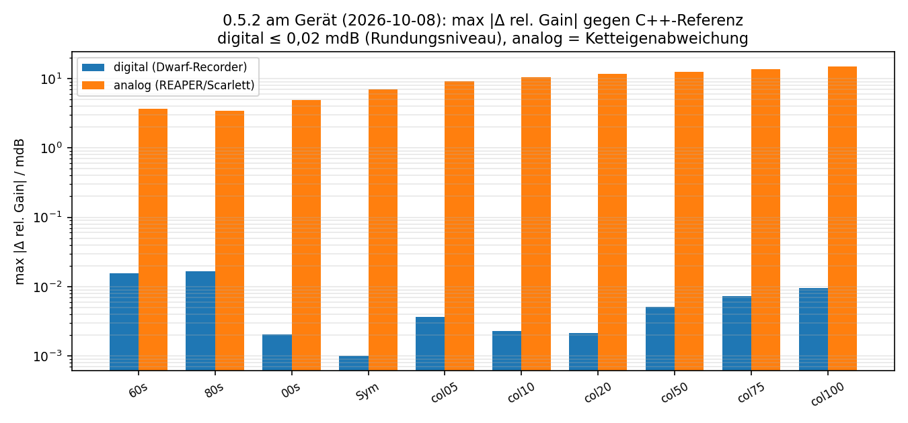

## 9. REAPER-JSFX-Render 0.5.2 — Bitverifikation (2026-10-08)

Nach dem Altstand-Befund (Batch `12_33_37`, REAPER hatte den
geänderten JSFX nicht neu kompiliert) hat der Benutzer die JSFX neu
laden lassen und das Batch erneut erzeugt (Batch `2026-10-08 14_14_41`;
Plugin-GUI zeigt **0.5.2**). **35 Dateien**: Referenzlauf `no_fx` +
34 Zustände — jetzt erstmals inklusive aller **24 GROUP 1 × 2-
Kombinationen**, die in der Geräteserie bewusst übersprungen wurden.
Vergleich gegen die 0.5.2-C++-Referenzrenders (`/tmp/opencode/ref052`,
nach dem `gr_db`-Fix), Offsetsuche ±16, Grenze < 1 LSB (24 bit).

| Prüfpunkt | Ergebnis |
|---|---|
| Zustände | 34 (beide Kanäle) — **alle PASS** |
| bester Offset | einheitlich -3 Samples (REAPER-PDC der 2x-Latenz) |
| schlechtester max \|diff\| | 5.960e-08 = 0.5 LSB (24 bit) |
| Referenzlauf `no_fx` | sampleidentisch zum Stimulus (Offset 0, max \|diff\| 0,0) |

Die 0.5.2-Änderung ist damit auch in REAPER am vollen 64-s-Matrix-
programm bitgleich gegen den C++-Kern bestätigt; der Altstand-Batch
`12_33_37` gilt als überholt. Archiv: `test-results/
jsfx-render-052-20261008/` (MANIFEST, `parity-052.json`, SHA256).
## 10. PluginDoctor-Vergleich Transformer-Harmonics (2026-10-08)

Erneute, diesmal gültige Captures in PluginDoctor (Backend ReaJS,
44,1 kHz, FFT-Raster 2,692 Hz, Sweep-Anregung −0,32 dB) unter
`docs/PluginDoctor messen/Transformer Harmonics/`: GS76 60s/80s/00s/Sym
und die Referenz **SSL Fusion Transformer** in MIN/STOCK/MAX.
Panelsellungen der GS76-Captures (Benutzerangabe): **COMP OFF, 4x
Oversampling, Colour 0 %, Mix 100 %**; je Capture ein 2D-Sweep-
Screenshot, die Klirr-über-Frequenz-Kurve (`THD.txt`, Graph #0) und
eine FFT-Momentaufnahme (`data.txt`). Analyse:
`tools/analyze_pd_transformer.py` → `test-results/pd-transformer-20261008/`.

| Capture | Grundwelle (Snapshot) | Grundwelle dB | THD Snapshot | Δ Kurve↔Snapshot | 20 Hz | 30 Hz | 100 Hz | 1 kHz |
|---|---:|---:|---:|---:|---:|---:|---:|---:|
| GS76 60s | 8.08 Hz | -7.49 | 43.1 % | +0.01 | -15.0 | -23.6 | -53.6 | -83.3 |
| GS76 80s | 8.08 Hz | -7.55 | 56.8 % | +0.08 | -13.1 | -26.7 | -70.6 | -85.1 |
| GS76 00s | 13.46 Hz | -3.45 | 49.8 % | -0.03 | -11.7 | -54.5 | -72.8 | -103.7 |
| GS76 Sym | 69.99 Hz | -0.32 | unter Boden | — | -91.7 | -105.5 | -124.5 | -160.0 |
| SSL MIN | 177.67 Hz | -0.32 | unter Boden | — | -150.9 | -150.9 | -150.7 | -168.1 |
| SSL STOCK | 161.52 Hz | -0.33 | 0.1 % | -25.16 | -5.7 | -3.2 | -37.1 | -86.4 |
| SSL MAX | 333.81 Hz | -0.35 | 2.5 % | -4.27 | -5.2 | -5.2 | -22.7 | -70.6 |

Alle Werte in dB relativ zur jeweiligen Grundwelle; die Spalten
20 Hz…1 kHz stammen aus der THD(f)-Kurve (stufentreu abgerufen, kein
Interpolieren über Klippen). **Gültigkeitsnachweis:** bei den drei
heißeren GS76-Profilen stimmt die aus der FFT-Momentaufnahme
berechnete Klirrsumme mit dem Kurvenwert an derselben Frequenz auf
**Δ ≤ 0,08 dB** (60s +0,01 / 80s +0,08 / 00s −0,03 dB) — Kurve und
Snapshot sind dieselbe Messung; die Exportprobleme der ersten zwei
Versuche (Anzeigeboden, byte-identische Dateien) sind behoben.

### 10.1 Befunde

- **SSL verzerrt im Tieftönen massiv stärker:** SSL MAX liefert
  8–30 Hz **−5,2 dB (≈ 55 %)**, STOCK 24–35 Hz **−3,2 dB (≈ 69 %)**;
  GS76 60s/80s liegen bei 20 Hz bei **−15,0/−13,1 dB (18/22 %)**,
  00s fällt oberhalb 20 Hz steil ab (30 Hz: −54,5 dB), Sym ist flach.
  Das stützt die Klangziel-Entscheidung „stärkerer, eigener
  Charakter" quantitativ.
- **Bei 1 kHz** liegt GS76 60s mit −83,3 dB (0,007 %) zwischen SSL
  STOCK (−86,4 dB) und SSL MAX (−70,6 dB) — die Charakteristik
  konvergiert im Mittelband, die Unterscheidung spielt sich im
  Tieftönen.
- **Reihungsabweichung gegen das Gerät:** PD-Reihung bei 20 Hz ist
  80s ≈ 00s > 60s, die Gerätetreihung (−2 dBFS) ist 60s ≈ 80s ≫
  00s (12,42/12,28/1,01 %). Deutung: die heißere PD-Anregung
  (+1,7 dB) trifft beim scharfen Fröhlich-Hochfeld-Knie des 00s
  das Steilgebiet; eine kalibrierte Klärung (gleicher Pegel,
  protokollierte Stellung) steht aus.
- **Harmonikentyp:** alle GS76-Snapshots sind ungeradedominiert
  (H2 ≤ −47 dB; 80s zeigt bei heißestem Drive Even-Seitenbänder
  −47…−64 dB). SSL STOCK ist bei 161 Hz **H2-dominant** (H2 −62,8 dB),
  SSL MAX bei 334 Hz ungeradedominiert (H3 −32,9 dB, H5 −43,3 dB).
- **Kopplungsverlust sichtbar:** die GS76-Grundwelle liegt im
  Snapshot −7,5 dB (60s/80s) bzw. −3,5 dB (00s) unter der Anregung
  (Koppelungs-Bassabsenkung des Modells), SSL und Sym bei Unity.

### 10.2 Grenzen

- Eingangspegel der GS76-Captures nicht numerisch protokolliert (Sweep-Anregung −0,32 dB laut Screenshot-Toolbar).
- SSL-Knopfstellungen MIN/STOCK/MAX nur als Verzeichnisnamen belegt, keine numerischen Werte.
- FFT-Snapshot landet je Export an einer anderen Tonfrequenz (Sweep-Position beim Export); Vergleich deshalb über die THD(f)-Kurve und Ordnungsprofile.
- GS76-Kurve Graph #1 ist flacher Boden (−100 dB), SSL-Kurve Graph #1 enthält die Grundwelle; Graph-#1-Bedeutung ist nicht kalibriert.
- Die SSL-Kurven sind Treppenzüge mit 7…8 Stufen; der
  Punktvergleich ist nur stufentreu aussagekräftig; für einen
  kalibrierten Vergleich statische Einzeltöne mit protokollierter
  Stellung und gleichem Pegel (Rezept MESSTECHNIK 1i) verwenden.

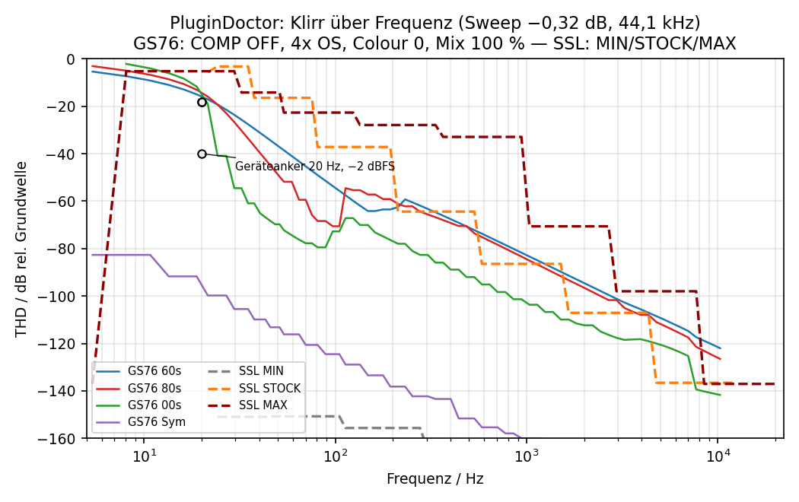

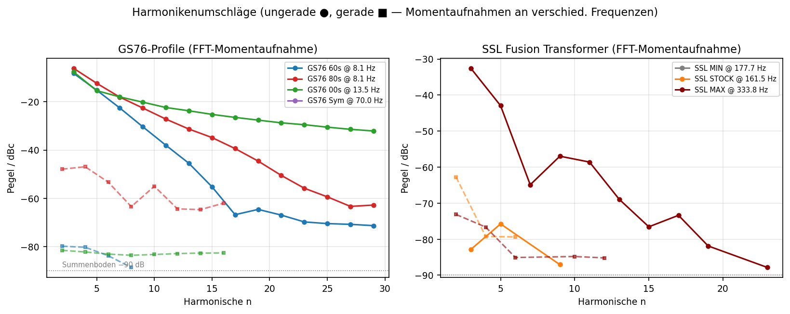

## 11. SSL Fusion Transformer — AMOUNT-Sweep (2026-10-08, kalibriert)

Fünf REAPER-Renders (`reaper/testbench/2026-10-08 15_22_27/SSL GROUP 1`,
AMOUNT 0/50/100/150/200) über dasselbe 64,47-s-Matrixprogramm wie die
Geräteserien (19 Segmente, −2 dBFS, Stimulusplan
`test-results/dwarf-tones/runs/matrix-all-m2`, SHA geprüft).
Digital, paddgenau (Synchronisation < 1 Sample, Kanaldifferenz
L↔R **0,0000 dB**); Analyse `tools/analyze_ssl_amount.py` →
`test-results/ssl-amount-20261008/`. Das ist der erste **kalibrierte**
Vergleichspunkt für das Klangziel — gleicher Stimulus, gleicher Pegel
wie die GS76-Bankwerte.

| AMOUNT | 20 Hz Klirr % | 20 Hz Gain dB | 40 Hz Klirr % | 80 Hz Klirr % | 1 kHz Klirr % | 1 kHz Gain dB | 8 kHz Gain dB |
|---|---:|---:|---:|---:|---:|---:|---:|
| 0 | 0.0000 | +0.012 | 0.0000 | 0.0000 | 0.0000 | +0.013 | +0.711 |
| 50 | 7.7221 | -1.022 | 0.0920 | 0.0542 | 0.0003 | +0.014 | +0.711 |
| 100 | 51.2886 | -6.306 | 7.4504 | 0.4383 | 0.0011 | +0.014 | +0.711 |
| 150 | 64.7275 | -14.630 | 18.8542 | 9.4096 | 0.0043 | +0.014 | +0.711 |
| 200 | 27.4002 | -15.900 | 11.4481 | 6.0686 | 0.0107 | +0.014 | +0.711 |

### 11.1 Befunde

- **AMOUNT = 0 ist kein Bypass:** Klirr 0,0000 % und Gain +0,012 dB
  im Bass, aber ein fester, AMOUNT-unabhängiger Höhen-Tilt
  (+0,048 dB @ 2 kHz, +0,188 dB @ 4 kHz, **+0,711 dB @ 8 kHz**,
  +1,85 dB @ 16 kHz) — vermutlich SHINE/Transformator-Grundcharakter.
- **Verzerrung ist fast rein tieftonbegrenzt:** bei 1 kHz bleibt
  SSL über alle Stellungen ≤ **0,011 %**; unsere Transformator-Bank
  liegt bei 1 kHz bei 0,0008/0,0005/0,0004 % (60s/80s/00s) —
  vergleichbar. Der GS76-**Colour**-Pfad liefert dagegen 0,123→
  **2,435 %** bei 1 kHz (Colour 5→100 %, Gerät) und ist im
  Mittelband damit weit „charakteristischer" als die SSL-Referenz.
- **20 Hz, kalibriert:** A50 **7,72 % @ −1,02 dB** (zwischen GS76
  00s 1,01 % und 60s 12,42 %; Bassverlust wie 60s −0,82 dB),
  A100 **51,3 % @ −6,31 dB** (über 4× heißer als die heißeste
  Bankstellung), A150 64,7 %, A200 27,4 % **@ −15,90 dB** — die
  Grundwelle kollabiert; SSL hat **kein Auto-Makeup**.
- **Harmonikentyp:** A50/A100 ungeradedominiert (A100: H3 −6,3,
  H5 −15,7, H7 −30,4 dBc, Even bei −48…−57 dB), A150 nahezu
  Rechteckstruktur (H3 −5,8, H5 −10,3, H7 −13,8). GS76 60s fällt
  deutlich steiler (H3 −18,2, H5 −36,3, H7 −55,2 dBc) — die
  heißen SSL-Stellungen liefern einen viel fetteren Obertonzug.
- **Positionierung fürs Klangziel:** „mehr Basssättigung ohne
  Bassloch" bleibt ein eigener Charakterzug des Modells (max
  −0,82 dB gegen SSL bis −15,9 dB); der nächste kalibrierte
  Referenzpunkt für eine Stärkung im Bass ist SSL **A ≈ 50**.

### 11.2 Interpretation — kein physikalisches Kernmodell (2026-10-08)

Die Messwerte sprechen dafür, dass die SSL-Umsetzung **kein
physikalisches Transformator-Kernmodell** abbildet:

1. **Verlust ohne begleitende Verzerrung:** −14,6/−15,9 dB
   Grundwellenverlust bei 20 Hz und −2 dBFS Eingang (A150/A200);
   ein realer Line-Pegel-Kern verliert dort ~1–2 dB. −16 dB
   bräuchte eine kollabierende Lm — die käme mit massiver
   Verzerrung und lastabhängigem Atmen; gemessen werden nur
   27,4 % THD (H2…H10, mit 1/n-Schwanz ≤ ~45 %).

2. **Energiebilanz:** von der 20-Hz-Grundwellenleistung bleiben
   bei A200 ≈ 2,5 % übrig, die messbaren Obertöne tragen nur
   ≈ 0,2–0,5 % der Eingangsleistung — Sättigung wandelt Energie
   in Obertöne um, sie löscht sie nicht.

3. **Effektmodell-Signatur:** AMOUNT 0 kein Bypass (fester Höhen-
   Tilt), nichtmonotone THD über AMOUNT (Max bei A150), Klirr
   fast ausschließlich unter ~160 Hz (∝ V/f) — Bauweise
   „flussgewichteter Waveshaper + entworfener Bassverlust".

Nicht beweisbar aus Magnitudenspektren: auch ein getreues Modell
eines absichtlich überfahrenen Mini-Kerns produziert diese Zahlen.
Diskriminierungstests mit Rezepten, Probe-Signalen und Kombi-
programm: MESSTECHNIK 1k.2 —
`reaper/testbench/Probes/diskriminierung/gs76-diskriminierung-stereo.wav`
(45,74 s, fünf REAPER-Renders mit verbindlichen Namen). Konsequenz:
A100–A200 niemals Kalibrierziel; A50 bleibt Intensitätsanker.

- SSL-Knopfstellungen (SHINE, MIX, INPUT/OUTPUT TRIM, HF+/LF+) nicht protokolliert; AMOUNT aus dem Dateinamen.
- MIX steht vermutlich nicht auf 100 % WET (Grundwellengewinn im Befund pruefen).
- AMOUNT = 0 ist die kleinste gemessene Stellung, nicht notwendigerweise bypass.

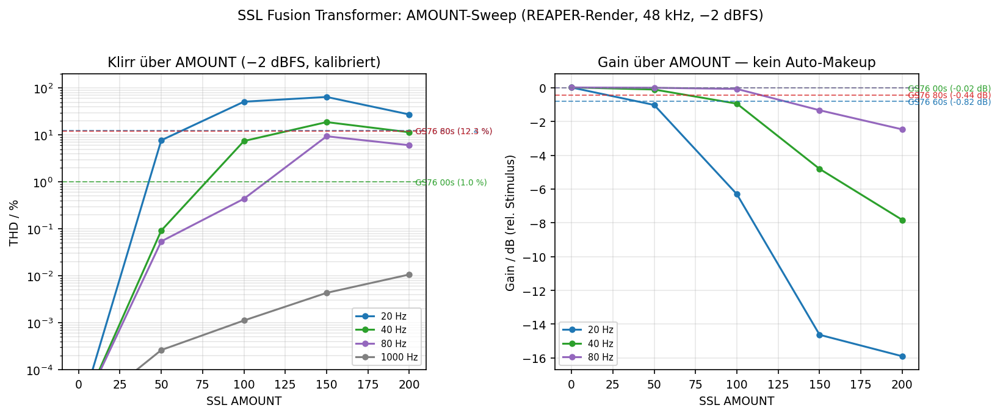

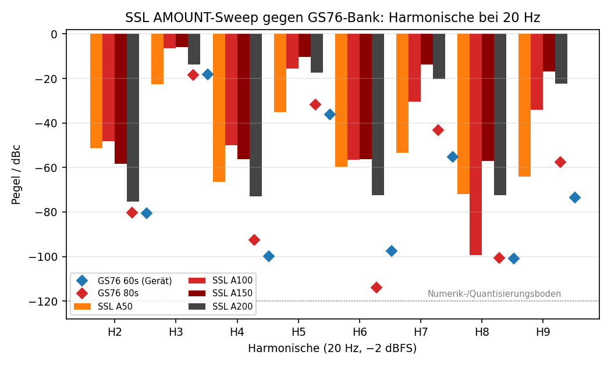

## 12. Diskriminierungstests — SSL Fusion Transformer gegen GS76-Bank (2026-10-08)

Kombiprogramm (MESSTECHNIK 1k.2) je Variante einmal gerendert (0 dB, keine
Absenkung; L=R, Chirp-Alignement und Stille verifiziert, keine Clips):
SSL AMOUNT 0/50/100/150/200 und GS76-JSFX 00s/60s/80s/Sym (COMP OFF, OS 4x,
Colour 0 %, Mix 100 %). Auswertung `tools/analyze_discrimination.py`,
Daten/Provenanz `test-results/diskriminierung-20261008/`. Eine Vorserie
(−3 dB, 23:03) war durch Projektfehler kontaminiert (L-only Programmkopien
−6,4 dB an falschen Offsets + 630-Hz-Oszillation) und wurde verworfen.

### 12.1 Befunde je 1k.2-Kriterium

**1. Remanenz/Bursts.** SSL: alle vier Bursts in **allen** AMOUNT-Stellungen
deckungsgleich (Erst-Halbwelle ±0,01 dB, identischer Nachlauf und DC-Shift)
— keine Operating-Point-Shift, keine Remanenz. Der Nachlauf über dem
Trägerboden (−44…−49 gegen −53 dBFS) existiert nur bei A0–A100 und
verschwindet bei A150/A200 (≈ Boden) — gegenläufig zum Antrieb, kein
Hysterese-Bild. JSFX: 80s zeigt den Kern-Befund — Erstburst −5,57 dB gegen
Folgebürste −5,37/−5,39 dB (−0,2 dB Shift, konsistent auch im DC-Nachlauf
+0,00309 gegen +0,00304); 00s/60s/Sym burstdeckungsgleich, Nachlauf aber
überall über Boden (+0,9…+6,6 dB). Beide Plugins überschießen die erste
Halbwelle (SSL A0 +0,55 dB; JSFX +0,5…+1,1 dB) — fest wiederholbar.

**2. Zweiton-IM (60 Hz + 1 kHz).** SSL: Seitenbänder symmetrisch
(Asymmetrie ≤ 0,8 dB; Einzelanomalie A200 k=1 −26,5 dB), odd-order-dominiert
(k=2/k=4 ≫ k=1/k=3 bei A150/A200) und **30–70 dB unter der speicherfreien
Vorhersage** aus der 20-Hz-Pegelreihe — das Mittelband ist dramatisch
linearer als der Bass (bass-/flussgewichtetes Effektmodell). JSFX: ebenfalls
symmetrisch und unter der Vorhersage (60s: k=2 −67 dB gemessen gegen
−27 dB Vorhersage); 60s/80s mit kleiner Ober-/Unterband-Asymmetrie
(−11,5/−6,9 dB bei k=3/k=4) als Speicher-Spürsignal. A0: IM an der
PCM24-Quantisierungsflur, nicht messbar.

**3. Pegelreihe 20 Hz.** SSL A50: Knie ~−8 dBFS, −1,02 dB @ −2, THD 7,7 %;
A100: −6,31 dB, THD 51 %; A150: Verlust wächst weiter (−9,18 → −14,63 dB),
THD 61 → 65 %; **A200: Verlust satturiert** (−15,49 dB bei −8 → −15,90 dB
bei −2) und die THD **fällt** (50,6 → 27,4 %) — oberhalb −8 dBFS verhält
sich der 20-Hz-Pfad linear mit festem −16-dB-Shelf: entworfene
Pegelabsenkung, keine Sättigungsasymptote. Deckungsgleich mit der
PD-Serie (11: −14,6/−15,9 dB) — Renders gültig. JSFX: 60s/80s Knieform mit
wachsendem Klirr (12,4 % @ −2) bei kleinem Verlust (−0,8 dB), Sym
praktisch klirrfrei (≤ −99 dB), 00s 1,1 % @ −2.

**4. DC-Asymmetrie.** SSL lässt 4–37 % des 0,3-FS-DC durch (A0 0,109,
A50 0,110, A100 0,099, A150 0,037, A200 0,013) — ein realer Kern: ≈ 0.
Nachlauf nach DC-Ende −26,5…−37,9 dBFS, skaliert invers zur AMOUNT;
H2-unter-DC nichtmonoton über AMOUNT (+24 dB A50, +47 dB A100, −24 dB
A150, −61 dB A200) — keine konsistente Even-Order-Antwort. JSFX 00s/60s/
80s blocken DC vollständig (−143…−148 dBFS) und heben H2 unter DC um
+12…+80 dB an (00s: −25,4 gegen −105,7 dB) — Kern-Signaturen. **JSFX Sym
sonderbar: DC-Pumpen** — Ausgangs-DC +0,105/+0,096 während der Plateaus,
negative Nachläufe −0,058 (nach 1. DC-Zyklus) und −0,165 (nach 2. Zyklus):
akkumulierender Zustand unter DC, Verdacht Integrator-Drift im Sym-Modell;
zugleich kaum Even-Order und kaum 20-Hz-Klirr.

### 12.2 Urteil

- **SSL: Effektmodell bestätigt** (1k.1-Hypothese durch Diskriminierung
  belegt): fluss-/bassgewichteter statischer Waveshaper mit entworfener
  Bassabsenkung, DC-durchlässig, ohne Remanenz und ohne IM-Asymmetrie.
  Kein physikalisches Kernmodell. A50 bleibt Intensitätsanker, A100–A200
  niemals Kalibrierziel.
- **GS76-Bank:** zeigt die Kern-Signaturen, die dem SSL fehlen
  (DC-Block, Remanenz-Shift bei 80s, Even-Order unter DC, Nachlauf über
  Boden). Die eigene Bank ist physiknäher als die SSL-Referenz.
- Offen: no_fx-Negativkontrolle optional nachholen; Sym-DC-Pumpen im
  Modell prüfen (integrator drift); SSL-Knopfprovenanz (11.2).

### 12.3 GS76-Bank im Detail — was die Diskriminierung über die eigenen Modelle sagt (2026-10-08)

Die JSFX-Renders (COMP OFF, OS 4x, Colour 0 %, Mix 100 %, I/O 0 dB)
bestätigen die Bank-Rollen und zeigen eine Modell-_Trennschärfe_, die das
SSL nicht hat:

**DC-Verhalten trennt die Modelle sauber.** 00s, 60s und 80s blocken
Gleichspannung vollständig: bei 0,3 FS DC-Eingang liegt der Ausgangs-DC
bei −143,5/−148,5/−145,9 dBFS — Transformator-Physik (die Sekundärseite
sieht dφ/dt, kein Dauergleichanteil). Nach dem ersten DC-Segment zeigt
sich eine kleine negative Erholung (−0,0058…−0,0069 FS im 1-kHz-Fenster
danach, Nachlauf −0,005…−0,008 FS) — flussbezogenes Abklingen im
Promillebereich, nicht akkumulierend. **Sym weicht qualitativ ab:** er
lässt +0,096 FS des DC durch (−20,3 dBFS), und die Nachlauf-Nachläufe
*wachsen* mit jedem DC-Zyklus (−0,058 FS nach dem ersten, −0,165 FS nach
dem zweiten; Erholungstransient −15,4 dBFS RMS nach DC-Ende). Das ist
akkumulierender Zustand unter DC — Verdacht Integrator-Drift im
Sym-Modell. Für Musiksignale harmlos (kein DC-Anteil), aber der einzige
Fund der Serie, der gegen den Modellvertrag „kein versteckter Zustand"
prüfen müsste; als offener Punkt in TODO (Abschnitt Sym).

**Even-Order unter Offset — Kern-Signatur der Bank.** Mit DC-Offset
(0,3 FS auf den 1-kHz-Ton) hebt sich H2 deutlich: 00s −105,7 → −25,4 dB
(+80 dB!), 80s −88,7 → −67,7 dB (+21 dB), 60s −88,1 → −76,1 dB
(+12 dB). Die Halbwellen-Peaks werden erwartbar asymmetrisch (00s:
+8,4/−9,4 dBFS gegen ±8,0/−7,9 ohne DC) — ohne Clipping an beiden Kanten.
Das ist das Verhalten eines echten Kerns unter Offset (Arbeitspunkt
verschoben, gerade Ordnungen leben auf). Sym bleibt davon ausgenommen
(−128,1 gegen −131,9 dB): symmetrische Sättigung erzeugt nur ungerade
Ordnungen — konsistent mit seinem Design-Intent, aber nicht mit seinem
DC-Durchlass (siehe oben).

**Remanenz und Einschwingen.** 80s ist die einzige Variante mit
messbarem Operating-Point-Shift: Erstburst −5,57 dBFS gegen Folgebürste
−5,37/−5,39 dB (−0,2 dB), konsistent auch im DC-Nachlauf nach Burst-Ende
(+0,00309 gegen +0,00304 FS) — der Erstburst verschiebt den
Magnetisierungszustand, die Folgebürste laufen auf verändertem Punkt. Dazu
Nachlauf-RMS über dem Trägerboden in **allen** Varianten (60s +6,7 dB,
80s +6,0, 00s +2,4, Sym +0,9 über −53 dBFS Boden): gedächtnisbehaftetes
Abklingen nach jedem Burst. Die erste Halbwelle überschießt bei allen
JSFX-Varianten um +0,5…+1,1 dB über den transparenten Sollwert (0,496 FS
wegen des 20-ms-Fades) — Inrush-artiges Einschwingen des
Fluss-Integrators; bei SSL A0 existiert derselbe Effekt (+0,56 dB), aber
dort burstdeckungsgleich und ohne 80s-Shift, also fest wiederholbarer
Transient statt Zustandsverschiebung. Randbefund: die Chirps der
Marker werden von 60s (corr 0,97) und vor allem Sym (End-Chirp 0,65)
nachweislich verändert — das Alignement bleibt exakt (REAPER-PDC), die
Modelle prägen aber selbst den Sync-Ton.

**Pegelreihe = Designvertrag bestätigt.** 60s verliert bei −2 dBFS
exakt −0,82 dB Grundwelle — deckungsgleich mit dem Modellvertrag
„max −0,82 dB Kopplungsverlust, kein verstecktes Make-up" (1k.1); 80s
−0,45 dB, 00s −0,02 dB, Sym −0,00 dB. Keine Stufe kommt auch nur nahe an
die SSL-Verluste (A100 −6,3 dB, A200 −15,9 dB bei gleichem Pegel). Der
Klirr folgt der Knieform eines echten Sättigers: 60s flach ~1,2 % bis
−14 dBFS, dann 3,85 % (−8) und 12,5 % (−2); 80s 12,4 % @ −2; 00s mild
(1,1 % @ −2); Sym praktisch klirrfrei (≤ −99 dB über alle Stufen). Das
Mittelband-Klirr (IM) liegt unter der statischen Vorhersage aus der
20-Hz-Kurve (60s: k=2 −67 dB gemessen gegen −27 dB Vorhersage) —
flussgewichtete, nicht pegelglobale Nichtlinearität, wie beabsichtigt.

**Einordnung fürs Klangziel.** Die Bank bedient ihr Regime wie
entworfen: kleine Kopplungsverluste, kontrollierte Sättigung ab
−8…−2 dBFS, DC fester Block bis auf Sym. Die Diskriminierung liefert
damit erstmals einen **messbaren Gegenbeweis zur SSL-Referenz** im
Direktvergleich: die GS76-Modelle zeigen Kernphysik-Signaturen
(DC-Block, Remanenz-Shift bei 80s, Even-Order unter DC), das SSL nicht.
A50 bleibt Intensitätsanker; für Physikreferenzen gelten die eigenen
Modelle, nicht das SSL. Vom Sym-Befund hängt ab, ob vor der nächsten
Klangänderungsrunde eine Modellkorrektur (DC-Ableitung im
Fluss-Integrator) mit Paritätslauf und Revision nötig wird.

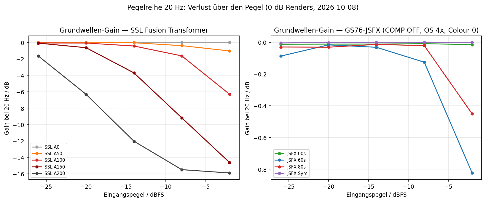

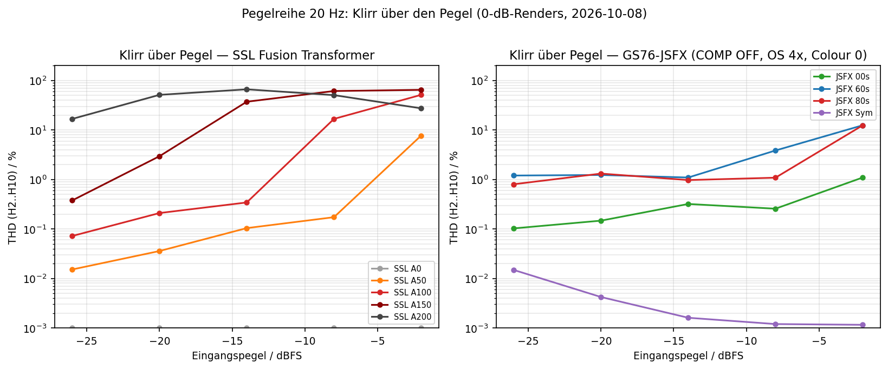

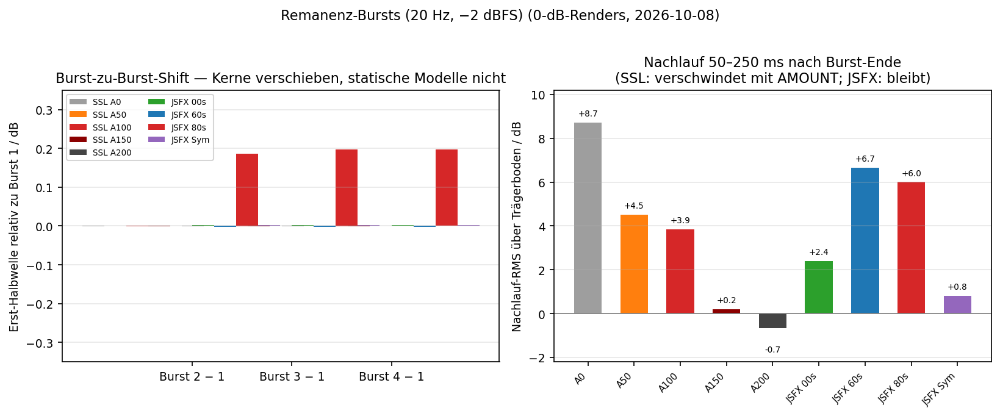

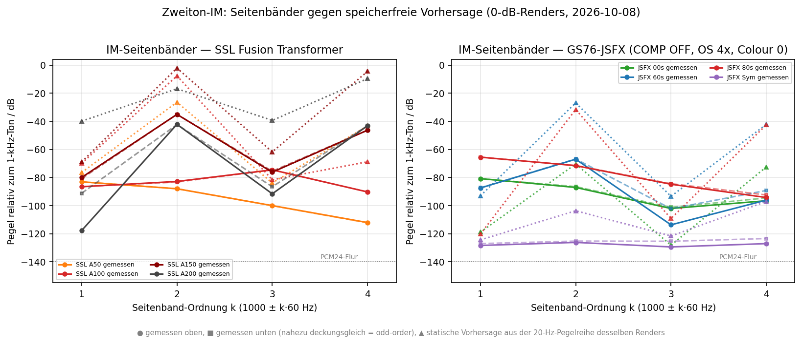

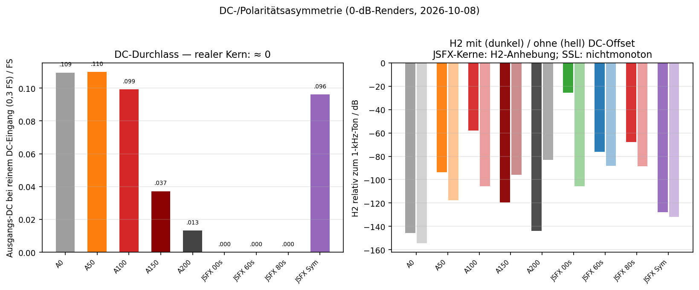
