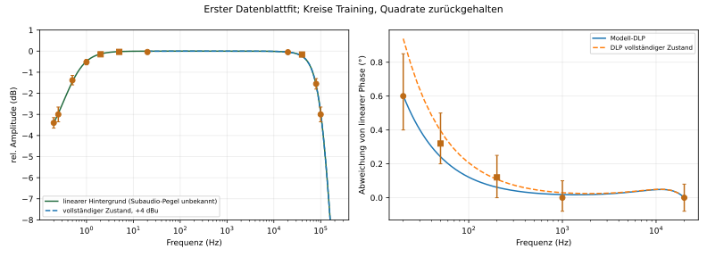
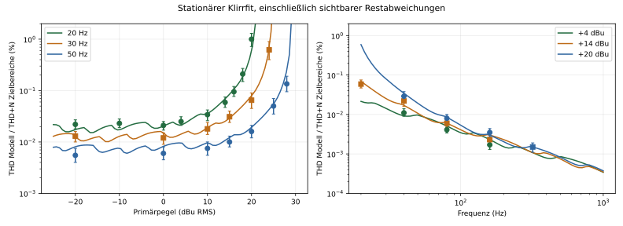
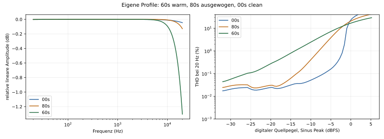
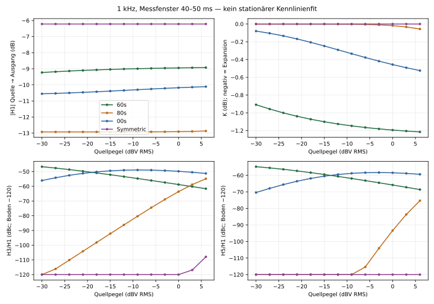
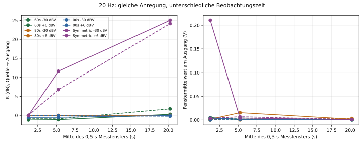
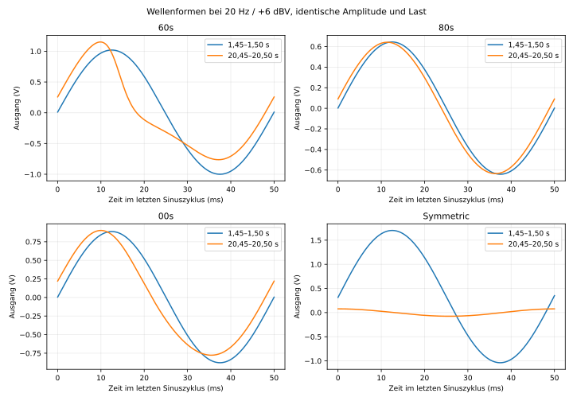
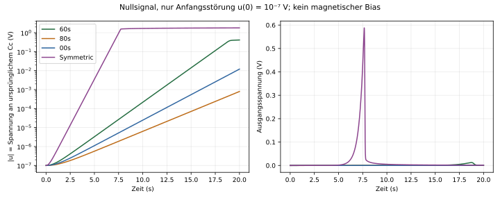

# Green Stripe 76 — Quellen, Lizenzen und Forschung

Quellenkatalog, Fremdlizenzen, NAM-Profile, Literatur- und Simulationsauswertungen.

**Konsolidiert am 2026-10-06** aus den bisherigen Einzeldokumenten; Inhalt inhaltlich unverändert, Pfadangaben auf die neue Struktur angepasst.

## Inhalt

1. SOURCES.md — *(Quelle: SOURCES.md)*
2. THIRD_PARTY.md — *(Quelle: THIRD_PARTY.md)*
3. NAM_PROFILES.md — *(Quelle: NAM_PROFILES.md)*
4. RESEARCH.md — *(Quelle: RESEARCH.md)*
5. TRANSFORMER_PAPER_REVIEW.md — *(Quelle: TRANSFORMER_PAPER_REVIEW.md)*
6. SPICE_AUFTRAG.md — *(Quelle: SPICE_AUFTRAG.md)*
7. QUELLEN.md — *(Quelle: QUELLEN.md)*
8. QUELLEN.md — *(Quelle: QUELLEN.md)*
9. QUELLEN.md — *(Quelle: QUELLEN.md)*
10. QUELLEN.md — *(Quelle: QUELLEN.md)*
11. QUELLEN.md — *(Quelle: QUELLEN.md)*
12. QUELLEN.md — *(Quelle: QUELLEN.md)*
13. QUELLEN.md — *(Quelle: QUELLEN.md)*
14. QUELLEN.md — *(Quelle: QUELLEN.md)*
15. QUELLEN.md — *(Quelle: QUELLEN.md)*


---

<!-- ===== Teil 1: Quelle docs/SOURCES.md ===== -->

# Quellenverzeichnis und Zugriffsstand

Ausgewertet in dieser Session am **2026-10-03**. Webseiten können sich ändern.
„Gelesen“ heißt bei PDFs: extrahierbarer Volltext via pypdf; eine nicht lesbare
Raster-Schaltzeichnung wurde nicht stillschweigend als verifizierte Netlist
behandelt. Quellen mit eingeschränktem Zugriff sind ausdrücklich aufgeführt.

IDs werden in `data/presets.json`, `PRESETS.md` und `QUELLEN.md` verwendet.
Technische Primärbelege haben Vorrang vor Praxisblogs/Forummeinungen.

## 1. Vom Benutzer gelieferte lokale Materialien

| ID | Material | Zugriff / Verwendung |
|---|---|---|
| STILLWELL | `../1176.js`, Thomas Scott Stillwell, 2006, 1175 Compressor | Volltext gelesen; beschädigte EEL2-Ausdrücke; nicht überschrieben/kopiert |
| EICHAS | `../PhD_Thesis_Felix_Eichas.pdf`, Felix Eichas, 2019 | Volltext aller Kapitel, 166 PDF-Seiten; 1176-Fallstudie Rev.-D-Nachbau, S.60–78; Modell 6.4–6.5 |
| USER-LINKS | `../quellen.txt` | Alle sechs ursprünglichen URLs untersucht |
| NAM-LOCAL | `../UREI_Universal Audio 1176/desc.txt` und vier `.nam` | JSON/Metadaten/Hashes aller vier; siehe NAM_PROFILES; keine Capture-Settings erfunden |
| PAIVA-TRANSFORMER-2011 | `docs/sauce/Real-Time_Audio_Transformer_Emulation_for_Virtual_.pdf` | Volltext und ausgewählte Formel-/Schaltbildseiten geprüft am 2026-10-05; GC-/WDF-Modell, Messverfahren und publizierter Fender-Parametersatz; siehe TRANSFORMER_PAPER_REVIEW |
| TRAFO-DATASHEETS | drei lokale PDFs in `docs/transformer/` | Hammond 140TEX/560Q und Lundahl LL1930, alle sechs Seiten und acht Rasterkennlinien geprüft am 2026-10-05; siehe transformer/AUSWERTUNG |
| WHITLOCK-AUDIO | `docs/sauce/Audio-Transformers-Chapter.pdf` | vollständig gelesen; Audio-Grundlagen, Messbedingungen und eingebettetes JT-11P-1-Datenblatt als neue 1:1-Fitreferenz |
| MCLYMAN-2004 | `docs/sauce/ourdev_725050HHOGA4.pdf` | 534-seitiges Entwurfshandbuch; relevante Abschnitte zu Magnetisierung/Materialien, Entwurfszusammenhängen und Kapitel 17 zu Parasiten ausgewertet |
| LUNDAHL-PSW-6 | `docs/sauce/PSW_WhitePaper_Download_Chapter_6.pdf` | sieben Seiten vollständig gelesen; Ken DeLoria, elektrische Ersatzbilder und Quellen-/Lastabhängigkeit |
| BAL-ONCU-CT-2014 | `docs/sauce/Effects of a current transformers magnetizing current on the dri.pdf` | vollständiger Artikel, lineares Stromwandler-/Zener-Treibermodell bei 40 kHz; Methodik, keine Audio-Koeffizienten |
| SHADID-IFRA-2022 | `docs/sauce/Application_of_the_Impulse_Response_of_Transformer_Winding_for_Detection_of_Internal_Turn-to-Turn_Short_Circuits.pdf` | sechs Seiten vollständig, Impuls-FRA; gedruckte Zeitdivisions-/Statistikfehler dokumentiert |
| WU-NN-2019 | `docs/sauce/Research_on_Calculation_Method_of_Transformer_Magnetizing_Current_Based_on_Neural_Network_Fitting.pdf` | fünf Seiten vollständig, statischer Kennwertfit eines PSCAD-500-kV-Modells; keine Audio-Wellenformsynthese |
| MACAK-SCHIMMEL-2011 | `docs/sauce/05_e.pdf` | vier Artikelseiten plus Bereinigungsseite; Fröhlich/Jiles–Atherton in Push-pull-Gitarrenendstufe, eigener Modellvergleich angeregt |

Eichas: gedruckte Seite +15 = lokale PDF-Seite. Offizieller PDF ohne vorgeschaltete
Bereinigungsseite: +14. DOI-/Repositorybeleg:

- [HSU-Eintrag, DOI 10.24405/9132](https://openhsu.ub.hsu-hh.de/handle/10.24405/9132)
- [Offizieller Dissertation-PDF](https://openhsu.ub.hsu-hh.de/bitstreams/0b6f9c6f-c444-45f7-b392-e2ff4188d25b/download)
- [Automatisch extrahierter HSU-Text](https://openhsu.ub.hsu-hh.de/bitstreams/deba230f-d0e8-4e26-bcc6-82e71bf9f24e/download)
- [Eichas-Publikationsseite](https://www.hsu-hh.de/ant/en/team/m-sc-felix-eichas)
- [Gerat-Publikationsseite](https://www.hsu-hh.de/ant/en/team/etienne-gerat)
- [HSU ANT Publikationen](https://www.hsu-hh.de/ant/en/publications/)

Keine veröffentlichten 1176-LUT-/WAV-/MAT-Beilagen im geprüften Repository gefunden.
Gerats Masterarbeit 2016 nicht öffentlich im Volltext gefunden.

## 2. Hersteller- und historische Schaltungsquellen

### TRAFO-DATASHEETS — reale Audioübertrager

Vom Benutzer bereitgestellte lokale Herstellerdatenblätter, am 2026-10-05
vollständig gelesen; Diagramme zusätzlich als Seitenbilder und vergrößerte
Original-Raster geprüft. Keine externen Messdateien ergänzt.

| Datei unter `docs/transformer/` | Umfang / Stand | Inhalt |
|---|---|---|
| `ArHamm140TEX_140TEX.pdf` | 2 S.; PDF-Erstellung 2012-07-13 | 1:1, 1-kΩ-Lineübertrager, Nickel-Kern; Frequenzgang und THD+N bei 1 Vpp / 10 / 19 dBm |
| `ArHamm560Q_560Q.pdf` | 3 S.; PDF-Erstellung 2014-01-27 | 1:1 mit geteilten Wicklungen; Frequenzgang/Phase/THD+N bei 0 / 10 / 27 dBm, Serie 40k/40k und parallel 10k/10k |
| `ArLL1930_Lundahl_LL1930.pdf` | 1 S.; R181217 | **5,8:1 bzw. 11,6:1**, kein regulär 1:1 spezifizierter Typ; tabellierte Frequenzgang-/Verzerrungsgrenzen bei +30 dBu Primärsignal |

SHA256 in obiger Reihenfolge:

```text
710d7f729bd951414c25028408046d46c555cbb934bee25c55a210721d3ed314
05631df2c160b4b15197b5dd87878ab92a72b6a0d95b8c47465b35f7b0b4ff0f
6a7fee4d50094ee3ff3a1465a2e2748598201a237f1c78784d436c4464a49863
```

**Quellenkritik:** Beim 140TEX steht im Frequenzgangtitel `RL=1000`, im
THD+N-Titel `RL=100`; offen, ob andere Messung oder Druckfehler. Hohe
Pegelkurven überlagern sich, y-Achse des Frequenzgangs fälschlich/uneindeutig
`dBm`. Beim 560Q passen tabellierte Induktivität, Impedanz und Tieffrequenz-
phase nicht ohne weitere Modell-/Messkonventionen in ein einfaches
konstantes-L-Ersatzbild. dBm-Pegelmessstelle und Normalisierung sind bei
beiden Hammond-Blättern unzureichend bezeichnet. LL1930-PDF-Metadatentitel
lautet `LL1931`, das sichtbare Blatt eindeutig `LL1930`.

Auswertung: [`QUELLEN.md`](QUELLEN.md).
47 eigene **grobe visuelle Ableseintervalle**, ausdrücklich keine
Hersteller-Rohdaten: `transformer/KENNLINIEN_ABLESUNG.csv`.
THD+N ist keine H3/H5-Auflösung; keine B-H-/H-Φ-Schleifen enthalten.
Diese Quellen liefern Referenzbedingungen für ein Line-Übertragermodell,
keinen identifizierten vollständigen GC-/Hystereseparametersatz und keine
1176-Revisionskalibrierung.

### WHITLOCK-AUDIO / MCLYMAN-2004 / LUNDAHL-PSW-6

Zusätzliche lokale Transformatorquellen, am **2026-10-05** ausgewertet:

**Bill Whitlock, *Audio Transformers***, ursprünglich Kapitel 11 im
*Handbook for Sound Engineers*, 3. Auflage, Glen Ballou (Hrsg.), 2001;
lokale Fassung mit Copyright 2001/2006. 31 PDF-Seiten einschließlich
Bereinigungs- und Titelseite; gedruckte Seite +2 = PDF-Seite. Volltext
vollständig gelesen, zentrale Abbildungen 17–23 und die eingebetteten
Datenblattseiten zusätzlich visuell geprüft.

- S. 9–12: Pegel-/Frequenz-/Quellenabhängigkeit von Klirr, relative
  Kleinpegeldistorsion durch Hysterese, LF-Permeabilität und HF-Dämpfung.
- S. 24–25: explizite Messbedingungen und Grenzen unvollständiger Angaben.
- **PDF 28–29:** historisches Jensen **JT-11P-1**-Datenblatt, Stand 1/01,
  1:1-Line-Eingang, 600-Ω-Quelle / 10-kΩ-Last. Primär-/Sekundär-DCR
  1,45/1,55 kΩ; typische THD 0,025 % bei +4 dBu/20 Hz; typischer
  1-%-THD-Punkt **+20 dBu/20 Hz**, mindestens +18 dBu. Kurven über
  Pegel und Frequenz, 0,25-Hz–100-kHz-Bandbreite, DLP. Pegel als
  Eingangspegel bezeichnet; Schirmkapazitäten nicht mit differentieller
  Wicklungskapazität verwechseln. DLP ist keine rohe Phase. Grafiken
  tragen THD+N-Achsen, Tabelle nennt THD; Restnoise/Analyzerbandbreite offen.
- SHA256:
  `0e7a82774a90eee784897962ec3ed8ae17ac26122225a57596ef6c383f3bcc2d`.

**Colonel Wm. T. McLyman, *Transformer and Inductor Design Handbook*,
Third Edition, Revised and Expanded**, Marcel Dekker, 2004,
ISBN 0-8247-5393-3. Lokale Datei `ourdev_725050HHOGA4.pdf`, 534 Seiten.
Gezielte Lektüre, **keine behauptete Komplettlektüre des Buchs**:
Kap. 1 (PDF 22–49), relevante Teile von Kap. 2 (PDF 51–60, 73–75,
83–99), Beginn Kap. 5 (192–197), Kap. 17 vollständig (448–461),
Faraday Gl. 21-B12 (PDF 522). OCR teils beschädigt; Tabelle 2-1,
Materialschleifen und relevante Kapazitäts-/Ersatzbildseiten visuell geprüft.

- Permeabilitätsdefinitionen, Material-/Luftspalt-/Biasabhängigkeit,
  B-H-Schleifen und Verlustgesetze; Materialbereiche als Priors, nicht
  als identifizierte Hammond-/Jensen-Werte.
- Kap. 17: Streuinduktivität, verteilte Wicklungs-/Kopplungskapazitäten,
  Resonanzformel und Messschaltung. Identifizierte Ersatzglieder statt
  ungeprüfter Übernahme von Leistungswandlerparametern.
- SHA256:
  `7c40a46c8c541a1fb4b50029765f968e2be8f131949dcf425026132e48fae680`.

**Ken DeLoria, *Chapter 6: Exploring the Electrical Characteristics of
Audio Transformers***, Lundahl Transformers / ProSoundWeb, sieben Seiten,
PDF-Metadaten 2014. Volltext vollständig, Ersatzbilder S. 2–3 visuell
geprüft. `Lp/R/Ll/Ct`, Quellen-/Last- und Kabelabhängigkeit; vereinfachte
Ersatzbilder und Herstellerdarstellung, kein neuer nichtlinearer Datensatz.
SHA256:
`c2c9285bdf87da26d1587d515ace16169cbad8234757cc1962ea51962ad1a875`.

Gemeinsame Auswertung, verbleibende Fitdaten und **eigene Startschätzungen**:
[`QUELLEN.md`](QUELLEN.md).
`transformer/FIT_STARTWERTE.json` / `transformer/estimate_fit_start.py` kennzeichnen feste
Quellenwerte, abgeleitete Ersatzwerte und frei gewählte Annahmen. Noch kein
Fit-/Simulationsnachweis für den Jensen-Kandidaten.

### UA-MANUAL-2009

[1176LN Manual, 2009](https://media.uaudio.com/assetlibrary/1/1/1176ln_manual.pdf)

Gelesen, S.7–9 Bedienung, S.20–22 Kompression/All, S.26 Bias, S.29–33
Theorie/Feedback-Abgriff/Gleichrichtung, S.38 Spezifikation. Reissue/D/E-
orientiert. Alte THD-Zeile hat eine widersprüchliche `>`-Notation; frühere und
aktuelle Herstellerdokumente schreiben „less than“.

### UA-MANUAL-2026

- [1176LN Owners Manual v260904](https://media.uaudio.com/support/manuals/hardware/analog/1176LN_Owners_Manual_v260904.pdf)
- [UA Hardware-Support](https://help.uaudio.com/hc/en-us/articles/206007816-1176LN-Classic-Limiting-Amplifier)

Gelesen, S.3–8 und 18–20: Output beeinflusst GR nicht, aber Distortion;
Attack/Release/Ratiowechsel und Color/Compression-Off; neue Spezifikation.
Nicht rückwirkend als Messung der NAM-Captureeinheit behandeln.

### UA-HISTORY / UA-ALL

- [UA Classic 1176 History](https://www.uaudio.com/blog/analog-obsession-1176-history/)
  — aktueller alter Pfad problematisch; [archivierte Herstellerfassung](https://web.archive.org/web/20250226100836id_/https://www.uaudio.com/blog/analog-obsession-1176-history/) gelesen.
- [1176/LA-2A Revision History](https://www.uaudio.com/blog/1176-la2a-hardware-revision-history/)
  — [archivierte Herstellerfassung](https://web.archive.org/web/20241109050502id_/https://www.uaudio.com/blog/1176-la2a-hardware-revision-history/) gelesen.
- [UA April 2003, All Buttons](https://web.archive.org/web/20040623110735id_/http://www.uaudio.com/webzine/2003/april/content/content4.html)
  — gelesen, Bias-/Transienten-/Ratioänderung.
- [UA Mai 2003, Schaltungsfunktion](https://web.archive.org/web/20040623110701id_/http://www.uaudio.com/webzine/2003/may/content/content4.html)
  — gelesen, Ausgangstransformator in Gegenkopplung.

### UREI-SERVICE

- [Historische UREI/JBL-Service-Sammlung, Spiegel-PDF](https://medias.audiofanzine.com/files/urei-1176lnmanual-473217.pdf)
- [Älterer UA-Guide Rev 1.02, Spiegel-PDF](https://medias.audiofanzine.com/files/urei-1176ln-manual-473204.pdf)
- [Weiterer vom Mason-Projekt verlinkter UREI-PDF](https://thehistoryofrecording.com/Manuals/UREI/Urei%201176LN%2001.pdf)
- [Werkstest Ratios, OCR-Seite 35](https://www.manualslib.com/manual/4166721/Universal-Audio-1176ln.html?page=35)
- [Werkstest Timing, OCR-Seite 36](https://www.manualslib.com/manual/4166721/Universal-Audio-1176ln.html?page=36)
- [Thresholds, OCR-Seite 37](https://www.manualslib.com/manual/4166721/Universal-Audio-1176ln.html?page=37)
- [1176-SA-Link, OCR-Seite 43](https://www.manualslib.com/manual/4166721/Universal-Audio-1176ln.html?page=43)

Text und Werkstestteile gelesen. Hauptmanual ab S/N 7652 ist späterer Rev.-H-
Stand. Raster-Schaltplanseiten sind kein textverifizierter früher A-Netlist.
Linkadapter-Hinweise belegen nicht, dass Green Stripes max-detector elektrisch
identisch mit dem historischen Adapter wäre.

### Allgemeine Übersicht

[1176 Peak Limiter, Wikipedia](https://en.wikipedia.org/wiki/1176_Peak_Limiter)
— gelesen, Einstieg und Primärlinks; keine alleinige Kalibrierreferenz.

## 3. DIY-Schaltungen und Messdaten

### SPICE-Netzmodelle in `docs/sauce/` (vom Benutzer geliefert)

Lokale Originalmaterialien, vom Benutzer in `docs/sauce/` abgelegt. Sie sind
**Referenzmaterial**, kein Nachbau und keine Kalibrierungsquelle für unser Modell.

**`xformer.lib`** — Audio-Transformatoren auf Gyrator-Kapazität-Basis. Enthält die
Subckt-Blöcke `CORE_GC` (magnetische Kapazität, Sättigung, Hysteresezweig),
`SingleEnded` und `PushPull` sowie vier einsatzbereite Instanzen:

| Subckt | Geräte laut Originalkommentar | Topologie | Kern-Parameter |
|---|---|---|---|
| `GCOT-SE-01` | Fender Blackface/Silverface, AA764, AB764 Tweed, 5C1, 5E1, 5F1, Vibro Blackface — 5 W, 70 Hz–15 000 Hz | single-ended | `C=0.000709428 a=8792.792558 n=13 R=31.39505785 b=58.96858796 m=2 Np=2012 Ns=72` |
| `GCOT-PP-03` | Marshall JMP, JCM 800 100 Watts | push-pull | `C=0.012790087 a=11683.51058 n=6 R=6.259141117 b=4.89849808 m=3 Np=668 Ns=48` |
| `GCOT-PP-04` | Fender Deluxe Reverb 65 Reissue, Deluxe 68 Custom Reverb | push-pull | `C=0.002610317 a=11434.182 n=8 R=8.860791571 b=10.401883352 m=2 Np=1996 Ns=64` |
| `GCSYMETRICAL` | **„IMPORTANT: Only for testing purposes"** im Original | push-pull | `C=2e-3 a=1e-5 n=25 R=2.3 b=8.4 m=4 Np=200 Ns=100` |

Der Kopfkommentar nennt als Erzeuger „Audio Transformer Models v3.xlsm". Ein
Hersteller ist nicht angegeben; die Gerätebezeichnungen stehen nur im Kommentar
der Fremdquelle und werden in unserer Oberfläche **nicht** verwendet.

**`tube.lib`** — Röhrenmodell `6V6GT` (Triode) mit Triode-Arbeitspunkt-,
Gitter-, Schirm- und Kathodenstromquellen sowie den Kapazitäten `Cg1=7.5p`,
`Cak=9p`, `Cg1a=0.7p`. **Nicht Teil unseres DSP** und nicht mit `Colour`
verknüpft.

**`Push-Pull Transformer (Gyrator-Capacitor).cir`** — Testschaltung des
Fremdautors, die `xformer.lib` und `tube.lib` einbindet und `GCOT-PP-04` mit zwei
`6V6GT`-Röhren treibt. Dient nur als Beleg für die vorgesehene Verwendung, nicht
als Messergebnis.

Zugriffsstand **2026-10-05**: Originalmodelle gelesen und jetzt offline mit
**ngspice 45.2** untersucht. Die Röhren-Testschaltung selbst wurde nicht
simuliert. Die folgenden Ergebnisse sind **eigene Rechnungen**, keine externe
Quelle und keine übernommene Hardwarekalibrierung.

#### Eigener Rechenweg: SPICE-Transformatorprüfung

- Auftrag: `docs/QUELLEN.md`; Ergebnisse gemäß Benutzerpfad in
  [`docs/QUELLEN.md`](QUELLEN.md), alle 260 Arbeitspunkte in
  `QUELLEN.md` und den vier `*-results.csv`.
- Original `xformer.lib`, SHA256:
  `8b5c6ce4015c34abe57ef133063cf4afb1d049f30475c46d8f6b91e6cb0f37ca`.
  Originaldatei und sämtliche acht Modellkoeffizienten je Typ erhalten.
- 4 × 5 Frequenzen × 13 Pegel, 20 Hz–20 kHz, −30…+6 dBV; 48-kHz-Export,
  zusätzliche native adaptive Zeitpunkte für H3/H5 oberhalb Nyquist.
  200 Ω differentielle Quelle / 8 Ω Last sind ausdrücklich **eigene
  Prüfbedingungen**, keine aus der Fremdquelle belegte Charakterisierung.
- Direkte `DDT(I(...))`-Includes brechen in ngspice ab; Logs archiviert.
  Simulation mit algebraisch äquivalenter Zustands-Netlist; unabhängige
  Hilfsinduktor-DDT-Realisierung, Zeitschritt-/Solver-/Last- und Langzeitproben.
  Insgesamt 76 Diagnoseläufe neben Hauptmatrix und vier Original-Abbruchversuchen.
- Befund: alle vier Netze haben einen instabilen Nullzustand und keine
  Last-Rückwirkung. `m` ist kein Kopplungsfaktor, `Rr`/`Br` liegen parallel.
  Die geplante `φ_k`-Formel setzt Spannung und Strom gleich und ist nicht
  durch die Simulation bestätigt. Kein belastbarer Transformator-Knie-Fit;
  nicht bestimmbare Werte in `spice_sim/coefficients.json` ausdrücklich `null`.
- Simulatorherkunft: Ubuntu-Paket `ngspice 45.2+ds-1`, unprivilegiert unter
  `/tmp/opencode` entpackt; Versionsausgabe und Binärhash im Run-Manifest.
  Keine neuen Bauteilmodelle heruntergeladen. Die erzeugten Includes sind
  abgeleitete Darstellungen des lokalen Materials, keine zusätzliche
  externe Modellquelle.

Die bisherige GC-/Flux-Planung in `DSP.md`, Abschnitt 11, ist
damit als unbestätigt gekennzeichnet; der nächste Schritt ist die Klärung
einer konsistenten Netzform, bevor Echtzeit-Koeffizienten abgeleitet werden.

### MASON

- [Building DIY 1176 Compressor](https://www.masonaudio.org/diy/comp1176) — vollständig gelesen.
- [Ratio-Messwerte XLS](https://www.masonaudio.org/ma_files/1176_ratio.xls) — numerisch gelesen.
- [FET-Matching XLS](https://www.masonaudio.org/ma_files/1176_fet_matching.xls) — numerisch gelesen.
- [BOM XLS](https://www.masonaudio.org/ma_files/1176_bom.xls) — als Nachbauteilliste untersucht.
- [G1176-Kalibrier-PDF](https://www.masonaudio.org/ma_files/G1176_Calibration.pdf) — ergänzende Nachbauanleitung.
- [Drums raw](https://www.masonaudio.org/ma_files/clips/Drums_1_raw.wav)
  / [4:1 bearbeitet](https://www.masonaudio.org/ma_files/clips/Drums_1_4s.wav) — Metadaten, Pegel und Korrelation im RAM untersucht.
- [Bass raw](https://www.masonaudio.org/ma_files/clips/Bass_raw.wav)
  / [Bass 4:1](https://www.masonaudio.org/ma_files/clips/Bass_4.wav) — dito.
- Weitere Akustik-/Drum-WAVs sind auf der Seite verlinkt, nicht als eigener
  vollständiger kalibrierter Messdatensatz ausgewertet.

Rev.-F-/Gyraf-/MNATS-Nachbau mit Lundahl, nicht ursprüngliche Rev. A. Messdaten-
 und Formelgrenzen in `QUELLEN.md`. Hörclips sind keine gesicherten knob-/dBu-
Trainingspaare für den neuen Kern.

### AXT

- [AXT-Projekt](https://axtsystems.com/axtsystems/proj_1176.php)
- [Input amplifier](https://axtsystems.com/axtsystems/proj_1176_inputamp.php)
- [Troubleshooting](https://axtsystems.com/axtsystems/proj_1176_troubleshooting.php)
- [Slam mode](https://axtsystems.com/axtsystems/proj_1176_slammode.php) — **AXT-SLAM**
- [FET matching](https://axtsystems.com/axtsystems/proj_1176_fetmatching.php)
- [Calibration](https://axtsystems.com/axtsystems/proj_1176_calibration.php)
- [Ratio measurement](https://axtsystems.com/axtsystems/proj_1176_ratios.php)
- [Testreport XLSX](https://axtsystems.com/axtsystems/resources/projects/1176lnr/1176lnr-testreport.xlsx)
- [FET-Matching XLSX](https://axtsystems.com/axtsystems/resources/projects/1176lnr/1176lnr-fetmatching.xlsx)
- [Ratio-Snapshot XLSX](https://axtsystems.com/axtsystems/resources/projects/1176lnr/1176lnr-ratios.xlsx)
- [AC-Schalterdeck-Bild](https://axtsystems.com/axtsystems/projects/dual_1176LN/proj_1176lnr_slam-b.jpg)
- [DC-Schalterdeck-Bild](https://axtsystems.com/axtsystems/projects/dual_1176LN/proj_1176lnr_slam-a.jpg)

HTML und Tabellen gelesen, Schalterbilder zur Teiler-/Thevenin-Größenordnung
ausgewertet. A/B sind die **Schalterdecks**, keine Revision A/AB. Moderne LN-
Nachbauwerte/aktive Eingänge nicht mit A-Transformatorgerät verwechseln.

### HAIRBALL / MNATS / GYRAF

- [Hairball Build Guide](https://www.hairballaudio.com/blog/resources/build-guides/fetrack-v2-build-and-calibration-guide)
- [Hairball Theory of Operation](https://www.hairballaudio.com/blog/resources/build-guides/welcome-to-diy)
- [Hairball Calibration](https://www.hairballaudio.com/blog/resources/build-guides/fetrack-v2-buildbrstep-4-calibration)
- [Hairball A-Dokumentation V1.12](https://library.hairballaudio.com/docs/fet_rack_a_doc_v1.12.pdf)
- [Hairball D-Dokumentation V1.11](https://library.hairballaudio.com/docs/fet_rack_d_doc_v1.11.pdf)
- [MNATS Rev A, Archiv](https://web.archive.org/web/20140718130739id_/http://mnats.net/1176_revision_a.html)
- [MNATS frühe A V1.0, Archiv-PDF](https://web.archive.org/web/20150311075443id_/http://mnats.net/files/DIY_1176_REVA_V1.pdf)
- [MNATS A/AB V1.2.5, Archiv-PDF](https://web.archive.org/web/20110516172421id_/http://mnats.net:80/files/1176REVA_125_DOCUMENTATION.pdf)
- [Original >S/N125-Scan](https://web.archive.org/web/20160312034051id_/http://mnats.net/files/1176_125.pdf)
- [MNATS D, Archiv](https://web.archive.org/web/20140718130739id_/http://mnats.net/1176_revision_d.html)
- [Gyraf G1176](https://www.gyraf.dk/gy_pd/1176/1176.htm)
- [UREI/F-Schematic GIF](https://www.gyraf.dk/gy_pd/1176/1176sch.gif)

Text/BOM/Erklärungen genutzt. Schaltplanbeschriftungen sind keine Netzliste.
Nachbau-Ersatzhalbleiter/-Potentiometer nicht als vollständige Originalbestückung
übernehmen. Früh-A-Dokumente enthalten teilweise eigene BOM/Zeichnungsabweichungen.

FET-Datenblätter und Simulationsmodell:

- [onsemi 2N5457](https://www.onsemi.com/download/data-sheet/pdf/2n5457-d.pdf)
- [onsemi J309](https://www.onsemi.com/download/data-sheet/pdf/j309-d.pdf)
- [ngspice JFET level 1](https://nmg.gitlab.io/ngspice-manual/jfets/jfetmodels_njf_pjf/jfetlevel1modelwithparkerskellernmodification.html)
- [ngspice transient options](https://nmg.gitlab.io/ngspice-manual/analysesandoutputcontrol_batchmode/simulatorvariables__options/transientanalysisoptions.html)

Parameterstreuung/Ohmik-/Solverkontext; kein bauteilidentischer Green-Stripe-
Transistorfit daraus behauptet.

## 4. Wissenschaftliche und Antialiasingquellen

### Eigene Rechnung: erster Jensen-Datenblattfit, 2026-10-05

Die in WHITLOCK-AUDIO enthaltenen historischen JT-11P-1-Kurven wurden
in `docs/transformer/offline_fit/targets.csv` als Herstellergrenzen und
eigene Ableseintervalle aufbereitet. **Das Fitergebnis ist keine externe
Quelle**, sondern eine eigene Gray-Box-Rechnung gegen diese Quelle.

- 53 Zielbedingungen, 33 Training / 20 Validierung. Seiten-/Hash- und
  Betrags-/Pegelbezüge geführt; Subaudio-Amplitudenpegel unbekannt, daher
  dort nur elektrischer linearer Hintergrund, keine Großsignalzertifizierung.
- 36 Basis-Kernfits, acht lineare Starts und Verfeinerungen. Fröhlich-
  artiger Flux-Kern mit eigener Stop-Gedächtnis-/Relaxationsnäherung;
  HF-Kaskade effektives Surrogat, keine identifizierte parasitäre Bauteilbank.
- **Partieller Fit:** 18/20 zurückgehaltene Intervalle, 24/33 Training.
  Fehlende Magnetisierungs-/Harmonischen-/Transientenreferenzen bleiben
  sichtbar. Kein „Jensen identisch“ aus dieser Offline-Rechnung ableiten.
- Drei Profile nach Benutzerwahl warm/ausgewogen/clean sind **eigene
  Ableitungen** mit gemeinsamen 1:1-/Quellen-/Lastbedingungen,
  −14/−8/−2-dBFS-1-%-THD-Ankern. Keine Jahrzehnt-/Revisionstreue.
- Tatsächliche Offlineprüfungen und Abhängigkeiten in
  [`QUELLEN.md`](QUELLEN.md).
  NumPy/SciPy-Optimierung, eigener C++11-Referenzrenderer,
  GNU g++15.2, high-rate WAV-Render. Keine Änderung der Originalquelle.

### Weitere Transformator-/Identifikationsarbeiten, 2026-10-05

Alle vier folgenden lokalen PDFs vollständig als Text gelesen; zentrale
Modellgleichungen, Tabellen und Ergebnisgrafiken zusätzlich visuell geprüft.
Detailauswertung:
[`QUELLEN.md`](QUELLEN.md).

**BAL-ONCU-CT-2014:** Güngör Bal, Selim Öncü, *Effects of a current
transformer's magnetizing current on the driving voltage in self-oscillating
converters*, Turk J Elec Eng & Comp Sci 22 (2014), S. 191–201,
DOI **10.3906/elk-1205-38**. 13 PDF-Seiten; Artikel beginnt auf PDF 3.
Stromwandler 1:40/45/50, 3F3-Ferrit, 40 kHz, Zener-Treiberlast.
Lineare ungesättigte Magnetisierung; Kernverluste und Kapazitäten explizit
vernachlässigt. Stromaufteilung/Lastinteraktion methodisch nutzbar,
Millihenry-/Zenerparameter nicht als Line-Übertrager-Fit übernommen.
SHA256:
`8cf8e6fedd5c5140cad5d8f0bfee7df7149644ab73370a744965431d738b06e4`.

**SHADID-IFRA-2022:** Mozon Shadid, Noureddine Harid, Braham Barkat,
Ashwin Manjunath, *Application of the Impulse Response of Transformer
Winding for Detection of Internal Turn-to-Turn Short Circuits*, UPEC 2022,
DOI **10.1109/UPEC55022.2022.9917862**, sechs Seiten.
10-kVA-/0,4-kV-/50-Hz-Dreiphasentrafos, Fehlerdiagnose über Impuls-FRA.
Messkonfigurationen methodisch nützlich; Gl. 1/2 (`h(t)=Vout/Vin`) nicht
als korrekte Entfaltung übernehmen. Korrelationszähler fehlerhaft gedruckt,
2-/20-MHz-Bereichsangabe widersprüchlich. Keine Audio-Sättigungsdaten.
SHA256:
`cd5a7fc2966a27d86db4c062b2f4a8956d63276f2cfa044d38472eb5edc0adbb`.

**WU-NN-2019:** Guoxing Wu, Peng Wang, Yonghao Ren, Yuanda Song,
Sheng Lin, *Research on Calculation Method of Transformer Magnetizing
Current Based on Neural Network Fitting*, IEEE APAP 2019, S. 969–973,
DOI **10.1109/APAP47170.2019.9225003** (zusätzlich per Crossref abgeglichen).
Fünf Seiten. Vier statische Kennwertnetze auf Daten eines PSCAD-Modells
eines 500-kV-Autotransformators; DC-Biasraster als Eingang, kein
sampleweises Audiomodell. DC-/Extremwertgrafiken ohne erklärte Skalierung
nicht zueinander konsistent. Keine veröffentlichten Audiofitdaten oder
verifizierte Generalisierung auf unsere Anwendung.
SHA256:
`b6dbf690f748cc7f13ee5409eac7e89c6d38e6483251417a947a0519605aef0c`.

**MACAK-SCHIMMEL-2011:** Jaromir Macak, Jiri Schimmel, *Simulation of
a Vacuum-Tube Push-Pull Guitar Power Amplifier*, DAFx-11, Proceedings
S. 59–62. Lokale Datei `05_e.pdf`, fünf Seiten einschließlich
Bereinigungsseite. Dynamischer Fröhlich-Sättigungskern und modifizierter
Jiles–Atherton-Kern, Vergleich mit kompletter Engl-Combo. Im untersuchten
Aufbau ähnliche Ergebnisse und Unterschiede vor allem unter etwa 150 Hz;
kein genereller Nachweis entbehrlicher Hysterese bei Line-Pegeln.
Kernwerte experimentell gewählt, kein isolierter 1:1-Hardwarefit.
SHA256:
`a2f04f897eb7cfbe8efa23a141f859cefaf6cf371670bbe65786537c85027d63`.

### PAIVA-TRANSFORMER-2011

Rafael Cauduro Dias de Paiva, Jyri Pakarinen, Vesa Välimäki und Miikka Tikander:
*Real-Time Audio Transformer Emulation for Virtual Tube Amplifiers*, EURASIP
Journal on Advances in Signal Processing, 2011, Artikel 347645, 15 Seiten.
DOI: [10.1155/2011/347645](https://doi.org/10.1155/2011/347645).
Ausgewertet wurde die **lokale Benutzer-PDF**, nicht eine neu beschaffte
Webfassung. Titelseite: Creative Commons Attribution, Version nicht angegeben.

- 16 lokale PDF-Seiten einschließlich vorgeschalteter Bereinigungsseite;
  gedruckte Seite +1 = lokale PDF-Seite.
- SHA256 der gelesenen Datei:
  `2eec0c710e8d3927e5f412032cbe1b5bc2a5e17b3d57e01b6a44fe4428b35dd5`.
- Volltext aller Artikelseiten mit `pypdf` gelesen; Abb. 6/7, Gl. 16–33
  und Tabelle 1 zusätzlich an gerenderten Seitenbildern geprüft.
- S. 6–9: bidirektionale GC-/WDF-Struktur mit gemeinsamem Kern,
  Wicklungsverlusten und parasitären Elementen. S. 7–8: Leerlaufmessung
  von Strom/Spannung, H–Φ-Schleife, gewichteter Sättigungsfit, Verlustfit.
- **Tabelle 1, S. 11:** konkreter Parametersatz für Fender NSC041318;
  `N1=100`, `N2=6.47`, `C=24.7 mF`, `a=900`, `n=7`, `r=0.077 Ω`,
  `b=4.46`, `m=4` plus Wicklungs-/Streu-/Kapazitätswerte. Modellnormierung,
  keine identifizierten realen Windungszahlen. Für Hammond T1750V
  Vergleichsmessungen, keine zweite vollständige Parametertabelle.
- Aussagegrenzen: periodische Messungen, 80-Hz-Schleifenfit, 20-Hz–10-kHz-
  Sweeps; Transienten offen. WDF benutzt verzögerte Nichtlinearitätszustände,
  deren Instabilitätsrisiko ausdrücklich genannt wird. Historische
  96-kHz-/PC-Echtzeitdemonstration ist kein Dwarf-Leistungsnachweis.
- Eigene Formelprüfung: Sekanten-/Differentialpermeanz unterscheiden;
  `b`-Normierung von Gl. 17/18 und Vorzeichen von Gl. 29–32 vor Portierung
  klären. Keine stillschweigende Korrektur veröffentlichter Koeffizienten.

Auswertung und nächste Schritte:
[`QUELLEN.md`](QUELLEN.md).
Die Paper-Struktur ist **nicht identisch** mit der zuvor simulierten lokalen
`xformer.lib`; deren negativer Befund widerlegt nicht die GC-Methode.
In diesem Literaturarbeitsschritt wurde das Paper-Modell nicht simuliert.

### MOORE

Austin Moore, *All Buttons In: An investigation into the use of the 1176 FET
compressor in popular music production*, JARP Issue 06, Juni 2012.

- [Benutzer-PDF](https://eprints.hud.ac.uk/id/eprint/27391/1/Journal%20on%20the%20Art%20of%20Record%20Production%20%C2%BB%20All%20Buttons%20In_%20An%20investigation%20into%20the%20use%20of%20the%201176%20FET%20compressor%20in%20popular%20music%20production.pdf)
- [Repository-Metadaten](https://eprints.hud.ac.uk/id/eprint/27391/)
- [Aktuelle HTML-Fassung](https://www.arpjournal.com/asarpwp/all-buttons-in-an-investigation-into-the-use-of-the-1176-fet-compressor-in-popular-music-production/)

Vollständig gelesen. 31 PDF-Seiten inklusive Titelseite. Qualitative Praxis-
Evidenz; keine vollständigen Koeffizienten-/Harmonischenmesswerte. Attack-200-µs-
Fehler korrigiert; Audio-Beispieldateinamen aktuell keine Downloadlinks.

#### Ausgewertete Preset-relevanten Stellen

| Fundstelle | Inhalt | Verwendung |
|---|---|---|
| S. 4–5 | Attack 200–800 µs, Release 50 ms–1,1 s; höheres Verhältnis hebt die Schwelle **und** macht das Knie härter; Knie bei 4:1/8:1 weicher, bei 12:1/20:1 härter | Plausibilität unseres Gain Laws, kein Zahlenwert übernommen |
| S. 5 | Shanks (UA Webzine 2003): 4:1 und 8:1 für Kompression, 12:1 und 20:1 für Peakbegrenzung | Preset-Ratio-Wahl nach Quelle |
| S. 7 | All Buttons In: Verhältnis „somewhere between 12:1 and 20:1" (UA-Handbuch 2009); Attack/Release ändern sich mit; anfängliche Transientenverzögerung; Kennlinie ähnelt einem Plateau; „almost resembles a brick wall limiter" | All-Presets 06/27/29, aktueller Ratio-Index 5; keine Brickwall-Garantie |
| S. 9 | Crane (UA Webzine 2003) „1176 Comp-Distortion Trick": extrem schnelle Zeiten erzeugen bewusst Tieffrequenzverzerrung, wenn der Kompressor innerhalb jeder Periode arbeitet | Presets mit sehr schnellen Zeiten und parallelem Mix |
| S. 9–10 | Bass: 4:1 häufigster Wert; kombinierte Tasten und Zeitkonstanten weg vom schnellsten Ende als eigene Praxisvarianten | Presets 16/17/20 mit mittleren Skalenwerten; 18/19 bewusst schnelle Grit-Ausnahmen, keine elektrische Gleichsetzung einzelner Tastenkombinationen mit All |
| S. 9–10 | Owsinski (2006) Bass: 8:1, Attack „around noon", Release „around 3 or 4 o'clock" — „long attack and short release … to increase articulation" | Presets 17/20 als eigene Ableitungen; keine Uhrzeitkalibrierung |
| S. 10 | Gesang: Lord-Alge 4:1 mit **schnellem** Release; Elmhirst sehr schnelle Attacke und sehr schneller Release, ~10 dB | Presets 03/05/07; Ratio und Drive teilweise eigene Abstimmung |
| S. 10 | Dr Pepper: „attack at 10 o'clock, release at 2 o'clock, and 4:1 ratio with tons of input level" (Jim Scott, Clouser/Vdovin 2004) | Preset 02, Wirkung statt Uhrzeit |
| S. 16 | Vokal-Testtabelle: (4:1, A7, R7, 7–10 dB), (4:1, A6, R6, 7–10 dB), (4:1, A3, R5, 7–10 dB) | Preset 07 eng angelehnt; 05 mit eigener 8:1-Ratio, 03 mit geringerem GR-Ziel |
| S. 21 | Bass-Testtabelle: (A4, R4, 4:1, 3–5 dB), (A4, R4, 8:1, 7–10 dB), (A7, R7, 8:1, 7–10 dB) | Presets 16/17/19 |
| S. 24 | Raummikro-Testtabelle, durchgehend **lange Attacke und kurzer Release** (A3, R6), bei 4:1 / 8:1 / 12:1 / 20:1 / All Buttons In, 3–10 dB | Preset 27, Raummikro-Einstellung |
| S. 25–26 | Fazit: FET-Verzerrung im Bass bei schnellen Zeiten, aggressiver Charakter bei stark komprimiertem Gesang, All Buttons verändert Transientenschlag und Decay | Begründung der Preset-Namen und Notizen |

Die angegebenen Gain-Reduction-Werte (3–5, 7–10, 10–20 dB) sind **Zielwerte für
den Benutzer**, keine Preset-Felder: unserer Regler hat bewusst keinen
Threshold. Sie stehen deshalb in `target_gr` und nicht als Zahl im Preset.

### METHODIK

- Parker/Zavalishin/Le Bivic 2016:
  [DAFx-PDF](https://www.dafx.de/paper-archive/2016/dafxpapers/20-DAFx-16_paper_41-PN.pdf),
  [Begleitrepository](https://github.com/julian-parker/DAFX-AntiAliasing).
- Bilbao et al. 2017:
  [Aaltodoc Autorenmanuskript](https://aaltodoc.aalto.fi/server/api/core/bitstreams/e4bf0f6f-cf73-4311-bd9f-69c0f484064d/content).
- Kahles/Esqueda/Välimäki 2019:
  [Aaltodoc Artikel](https://aaltodoc.aalto.fi/server/api/core/bitstreams/5ba98d43-a250-43c3-84e4-854834a10db2/content).
- Holters/Corbach/Zölzer 2009:
  [DAFx-PDF](https://www.dafx.de/paper-archive/2009/papers/paper_26.pdf).
- Novák et al. 2010:
  [Synchronisierte Sweeps, DAFx](https://www.dafx.de/paper-archive/2010/DAFx10/NovakSimonLottonGilbert_DAFx10_P23.pdf).

Artikeltexte gelesen. Methodik/Filter-/ADAA-Kontext, keine Green-Stripe-/Dwarf-
Realtime-Benchmarks. ADAA-Delay und falsche Antiderivative-Zuordnung beachten.

Nicht vollständig zugänglich:

- [AES 1176-Paper elib19249](https://www.aes.org/e-lib/browse.cfm?elib=19249) — 403.
- [AES DRC elib18628](https://www.aes.org/e-lib/browse.cfm?elib=18628) — 403.
- Alter Giannoulis/Massberg/Reiss-QMUL-PDF-Pfad — Zertifikat/Weiterleitungsproblem,
  keine Originalartikelbestätigung aus dieser URL.
- Hollis-Circuit-Seite — Timeout/Proxyfehler.

## 5. Software-, Plattform- und Optimierungsquellen

### MOD

- [MOD Audio Organisation](https://github.com/mod-audio)
- [MOD Plugin Builder](https://github.com/mod-audio/mod-plugin-builder)
- [moddwarf-new Toolchainconfig](https://raw.githubusercontent.com/mod-audio/mod-plugin-builder/master/toolchain/moddwarf-new.config)
- [Dwarf Buildrootflags](https://raw.githubusercontent.com/mod-audio/mod-plugin-builder/master/plugins-dep/configs/moddwarf-new_defconfig)
- [local.env](https://raw.githubusercontent.com/mod-audio/mod-plugin-builder/master/local.env)
- [Dockerfile](https://raw.githubusercontent.com/mod-audio/mod-plugin-builder/master/docker/Dockerfile)
- [Lokales Packagebeispiel](https://raw.githubusercontent.com/mod-audio/mod-plugin-builder/master/plugins/package/eg-amp-lv2-labs/eg-amp-lv2-labs.mk)
- [MOD Pitchshifter](https://github.com/mod-audio/mod-pitchshifter)
- [Capo TTL](https://raw.githubusercontent.com/mod-audio/mod-pitchshifter/master/Capo/ttl/Capo.ttl)
- [MOD LV2 Wiki](https://wiki.mod.audio/wiki/LV2)
- [Preparing the Bundle](https://wiki.mod.audio/wiki/Preparing_the_Bundle)
- [Deploy a Plugin](https://wiki.mod.audio/wiki/Deploy_a_plugin_to_MOD)
- [MPB Package](https://wiki.mod.audio/wiki/How_To_Make_a_MPB_Package)
- [Dwarf Specs](https://wiki.mod.audio/wiki/MOD_Dwarf_Technical_Specs)
- [MOD Releases](https://wiki.mod.audio/wiki/Releases#Release_1.13)
- [MOD Host effects.c](https://raw.githubusercontent.com/mod-audio/mod-host/master/src/effects.c)
- [MOD UI modgui.js](https://raw.githubusercontent.com/mod-audio/mod-ui/master/html/js/modgui.js)
- [Dwarf audio-settings manual](https://raw.githubusercontent.com/mod-audio/mod-dwarf-manual/main/docs/settings/audio-io.md)
- [Dwarf web-access manual](https://raw.githubusercontent.com/mod-audio/mod-dwarf-manual/main/docs/first-pedalboard/web-ui-access.md)

Ziel/Flags/ABI/Bundles/Ports/GUI/BYPASS und SDK-Protokoll anhand der Dokumente
und Code geprüft. Hersteller-DD-Kernel/Codecfähigkeit nicht mit Hostrate
verwechseln. MPB-Defaults enthalten Fast-Math; Projekt override dokumentiert.
Historisch wurde das GUI-Rotationswidget untersucht. Aktuell Aluminium-Filmstrip
und echte Switch-/Bypass-Widgets; lokaler Browsertest bestanden, Gerätetest offen.

### LV2 / JSFX / YSFX

- [LV2 core specification](https://lv2plug.in/ns/lv2core)
- [LV2 ABI header](https://raw.githubusercontent.com/lv2/lv2/master/include/lv2/core/lv2.h)
- [REAPER JSFX Hauptreferenz](https://www.reaper.fm/sdk/js/js.php)
- [EEL2 language](https://www.reaper.fm/sdk/js/basiccode.php)
- [Special Variables](https://www.reaper.fm/sdk/js/vars.php)
- [Atomic/Slider/Host API](https://www.reaper.fm/sdk/js/advfunc.php)
- [Namespaces/functions](https://www.reaper.fm/sdk/js/userfunc.php)
- [Graphics](https://www.reaper.fm/sdk/js/gfx.php)
- [JoepVanlier JSFX](https://github.com/JoepVanlier/JSFX)
- [Tight Compressor](https://github.com/JoepVanlier/JSFX/blob/cbc998702d7eba96bcb4238f002c0b7268b564d2/Basics/Tight_Compressor.jsfx)
- [saike_upsamplers](https://github.com/JoepVanlier/JSFX/blob/cbc998702d7eba96bcb4238f002c0b7268b564d2/Basics/saike_upsamplers.jsfx-inc)
- [ysfx gepflegter Fork](https://github.com/JoepVanlier/ysfx)
- [ysfx API, gepinnter Teststand](https://github.com/JoepVanlier/ysfx/blob/5c3452fee62583aa3d1b7e877d0c758c4024af89/include/ysfx.h)
- [ysfx slider_next_chg Stub](https://github.com/JoepVanlier/ysfx/blob/5c3452fee62583aa3d1b7e877d0c758c4024af89/sources/ysfx_api_reaper.cpp)

Dokumente/Code gelesen; ysfx tatsächlicher lokaler Testhost. Seine Host-/
Automationseinschränkungen bleiben dokumentiert.

### HIIR

[HIIR Referenzcommit](https://github.com/unevens/hiir/tree/4589fedb4d08b899514cb605ccd7418bf262ab18):
`PolyphaseIir2Designer`, `StageProcFpu.hpp`, `Upsampler2xFpuTpl.hpp`,
`Downsampler2xFpuTpl.hpp`. Koeffizientenentwurf/Normalisierung und Gruppenlaufzeit
untersucht; siehe Architektur/Lizenzdoku.

### Andere Kompressoren / neue Benutzerlinks

- [ZeroComp](https://github.com/Jun-Murakami/ZeroComp),
  [Compressor.cpp](https://raw.githubusercontent.com/Jun-Murakami/ZeroComp/main/plugin/src/dsp/Compressor.cpp),
  [plugin CMake](https://raw.githubusercontent.com/Jun-Murakami/ZeroComp/main/plugin/CMakeLists.txt)
  — gelesen; allgemeiner Feed-forward-FET-Flavour, kein kopierter Code.
- **FETCOMP** [Paulllux/fetcomp-dsp](https://github.com/Paulllux/fetcomp-dsp), Commit
  `de18f5ac793e36397c725abdca7fcb8c08760ce2`:
  [FetLimiterDsp.h](https://github.com/Paulllux/fetcomp-dsp/blob/de18f5ac793e36397c725abdca7fcb8c08760ce2/FetLimiterDsp.h),
  [MathUtils.h](https://github.com/Paulllux/fetcomp-dsp/blob/de18f5ac793e36397c725abdca7fcb8c08760ce2/MathUtils.h),
  MIT — gelesen, Schaltungs-/Plugin-Fit-Vergleich; keine Tabellen/Implementierung
  übernommen. Kritische Delay-/Transformer-/Kalibriergrenzen siehe RESEARCH.
- **TANH** [J. Tom Schroeder: Approximating Hyperbolic Tangent](https://jtomschroeder.com/blog/approximating-tanh/),
  22.04.2026 — vollständig gelesen, mathematische Padé-Formel genutzt.
- [Reddit JUCE: free 1176-style compressor](https://www.reddit.com/r/JUCE/comments/1vjhlnm/free_1176style_compressor_modelled_from_the/)
  — nur Reddit-Seitenhülle, kein auswertbarer Threadtext. Kein Forumsinhalt erfunden.
- [jakesonderman 1176_model_2](https://github.com/jakesonderman/1176_model_2)
  — untersucht als Blackbox-Hinweis; fehlende Originaldaten/Lizenz/Kalibrierung,
  nicht genutzt als Koeffizientenquelle.

## 6. NAM-Ökosystem

- [NAM Trainer](https://github.com/sdatkinson/neural-amp-modeler)
- [NAM Core](https://github.com/sdatkinson/NeuralAmpModelerCore)
- [NAM Plugin](https://github.com/sdatkinson/NeuralAmpModelerPlugin)
- [Trainer WaveNet aktueller Stand](https://github.com/sdatkinson/neural-amp-modeler/tree/0072676419459f5d39e36f5b9fd4172f28d62cbf/nam/models/wavenet)
- [0.5-kompatible WaveNet-Exportordnung](https://github.com/sdatkinson/neural-amp-modeler/blob/8191f36c97261cb6e24967e45332aab2c638adcd/nam/models/wavenet.py)
- [Core loader](https://github.com/sdatkinson/NeuralAmpModelerCore/blob/0b3d3c97b0859a3a8c92a8628c4dd89a25eb5842/NAM/get_dsp.cpp)
- [Core WaveNet](https://github.com/sdatkinson/NeuralAmpModelerCore/blob/0b3d3c97b0859a3a8c92a8628c4dd89a25eb5842/NAM/wavenet/model.cpp)
- [Core Conv1d](https://github.com/sdatkinson/NeuralAmpModelerCore/blob/0b3d3c97b0859a3a8c92a8628c4dd89a25eb5842/NAM/conv1d.cpp)
- [Core Container](https://github.com/sdatkinson/NeuralAmpModelerCore/blob/0b3d3c97b0859a3a8c92a8628c4dd89a25eb5842/NAM/container.cpp)
- [Core Renderer CLI](https://github.com/sdatkinson/NeuralAmpModelerCore/blob/0b3d3c97b0859a3a8c92a8628c4dd89a25eb5842/tools/render.cpp)
- [Plugin unknown-rate 48k fallback](https://github.com/sdatkinson/NeuralAmpModelerPlugin/blob/16be869746b8915885c7a35bafdcc0061faeb50e/NeuralAmpModeler/NeuralAmpModeler.h#L84-L95)

Code/Format/History-/Fallbacksemantik gelesen. Keine offizielle NAM-Core-
Ausführung der lokalen Profile in dieser Implementation als abgeschlossen
behauptet. Explorative NumPy-Recherche nicht als Hardware-Kalibrierfit genutzt.

## 7. Benutzer-Praxislinks

### HIFIHAVEN-REPEAT-COILS / SE-EXCITATION

- [HiFiHaven, Thread 10495](https://hifihaven.org/index.php?threads/why-you%E2%80%99re-not-crazy-to-use-repeating-coils-bridging-transformers-between-digital-and-analog-audio.10495/):
  **alle sechs Seiten / 110 Beiträge**, 24.06.2023–18.01.2025, am
  2026-10-05 gelesen. Hinweise auf Last-/Kabel-/Dämpfungsabhängigkeit,
  FFT, Tiefbassklirr und Ringing. Subjektive Berichte und Scope-Fotos
  belegen weder „fehlende digitale Information“ noch eine vollständige
  Übertragerkennlinie. Die konkreten 150-mH-/220-pF-/RC-Werte in
  #60–76 gehören zu einem **separaten Ausgangsfilter**, nicht zum
  identifizierten Kernmodell eines WE/Jensen. Vorschaubilder zugänglich;
  Original-Scope-Anhänge HTTP 403. Kein behaupteter vollständiger
  Attachment-/Audio-Amateur-PDF-Test.
- [Electronics StackExchange, Frage 606060](https://electronics.stackexchange.com/questions/606060/difference-between-the-excitation-current-of-a-transformer-and-the-magnetizing-c):
  Direktseite HTTP 403, StackPrinter ohne Inhalt; **Frage und alle drei
  Antworten über offizielle StackExchange-API gelesen**, zusätzlich die
  Fragekommentare. Antworten Andy aka / Louis / Eng. Omar Eyad;
  CC BY-SA 4.0 laut API. Erregerstrom als Summe aus Magnetisierung und
  Verlustanteil im Ersatzmodell; Inrush als Anfangszustandsvorgang.
  Belastungsunabhängigkeit nur bei entsprechend festgehaltener
  Kernspannung; keine universelle momentane Stromzerlegung aus RMS-Werten.

Gemeinsame Auswertung mit Korrekturen zur Mess-/Modellmethodik in
`QUELLEN.md`. Keine neuen
Audio-Referenzmesswerte aus den Forumsmeinungen abgeleitet.

### GROUPDIY-CATHODE-2017

[help with 1:1 transformer choice for cathode follower](https://groupdiy.com/threads/help-with-1-1-transformer-choice-for-cathode-follower.65719/),
22 Beiträge vom 14.–17.04.2017, am 2026-10-05 vollständig zugänglich
gelesen. Kontext: kapazitiv gekoppelter Kathodenfolger, etwa 55 Ω
Quellimpedanz, Last-/Stromlieferfähigkeit und Auswahl eines Ausgangsübertragers.

- #2/#5/#7: DCR, Magnetisierungs-/Streuinduktivität und Kapazitäten
  zusammen mit Quelle/Last beurteilen. #10–12: kleinere Induktivität bei
  Parallelverschaltung kann den Treiber belasten.
- Quellenkritik: #8 enthält `atan(0,5)=45°`; eigene Nachrechnung ergibt
  **26,565°**. Die +22-dBu-/Peak-Angabe in #3 ist ebenfalls nicht
  rechnerisch konsistent. Produkt-/Klangempfehlungen und 2000-H-Angabe
  in #13 nicht als unabhängig verifizierte Daten übernehmen.
- Kein kalibrierter Messsatz; Attachment und nachgelagerte Fremdlinks
  nicht als verifizierte Schaltung gelesen. Fachlicher Zusammenhang in
  `QUELLEN.md`.

| ID | Quelle | Zugriff und Entwurfsnutzen |
|---|---|---|
| UA-TIPS | [1176 Classic Limiter Collection: Tips & Tricks](https://www.uaudio.com/blogs/ua/1176-collection-tips) | Vollständig gelesen; Regler, Dr Pepper, All/Parallel/Grit/Colour-only. Ursprünglichen Trackingparameter weggelassen. |
| MUSICGUY | [How to Use 1176 Compressor](https://www.musicguymixing.com/how-to-use-1176-compressor/), 20.12.2023 | Gelesen; 4/8, Mix, All. Input-/Knopfnummern teils missverständlich; kein technischer Kalibrierbeleg. |
| BLACKBIRD | [The 1176 Compressor](https://blog.insideblackbird.com/the-1176-compressor), Bryan Clark | Gelesen; Bedienung/Varianten/Praxis, nicht jede vereinfachte Gain-Aussage als Schaltungsbeweis nutzen. |
| REDDIT-USE | [How do you use an 1176?](https://www.reddit.com/r/mixingmastering/comments/s3dayx/how_do_you_use_an_1176/) | Nur Seitenhülle; JSON-Nachfrage 403. Kein verwertbarer Threadtext. |
| GEARSPACE | [Anything you wouldn't use 1176 on?](https://gearspace.com/threads/anything-you-wouldnt-use-1176-on.625208/) | HTTP 403; keine abgeleiteten Benutzerempfehlungen. |
| VOCAL-GUIDE | [How to Use the UAD 1176 on Vocals](https://www.electronicproduction.co.uk/post/1176-vocal-compression-guide), Leiam Sullivan | Vollständig gelesen; Frontkante/Body/Release, Extreme als Lernübung, danach Levelmatching. |
| PENNY | [The Urei Universal Audio 1176 Compressor](https://penny.cool/tips-and-techniques/the-urei-universal-audio-1176-compressor/), Robert Conlon, Penny Cool Presets | Vollständig gelesen; **Quicksheet-Tabelle** mit Angriffs-/Release-Bereichen je Quelle und Dr.-Pepper-Referenz. Sekundäre Praxis-Zusammenfassung ohne Messwerte, daher nur als Startwert-Ableitung verwendet. |

| TOZZOLI | Three Nifty Tricks for the UA 1176, Rich Tozzoli | Vom Benutzer als Text geliefert, vollständig gelesen; Drum Room Smasher, Vocal Transformer, Guitar Cruncher. Drei benannte Techniken, davon nur eine mit Verhältnisangabe (4:1). Kein Messwert, keine Versionszuordnung. |
| MTM-SNARE | [How to Compress a Snare Drum Properly](https://www.masteringthemix.com/blogs/learn/how-to-compress-a-snare-drum-properly), Tom Frampton, 12.07.2022 | Vollständig gelesen; 4:1, langsame Attacke, Release musikalisch getaktet, 2–6 dB GR, Farbe/Sättigung statt mehr Kompression. Der Artikel empfiehlt außerdem einen 30-Hz-Hochpass vor dem Kompressor — **das können wir nicht abbilden**, Green Stripe 76 hat keinen EQ. |
Alle daraus entwickelten Presets sind **eigene Startwerte**. Es wurde kein
geschützter Artikelvolltext oder fremde Presetbank im Paket nachgebildet.

Erneute Presetprüfung 2026-10-05: `EXTERN.md` und `PRESET_AUDIT.json`
dokumentieren alle 36 aktuellen Zuordnungen und eigene Signalproben. Die
2:1-Vorschläge für **31 Piano Gentle / 35 Stereo Bus Subtle** sind eigene
Interpretationen, keine Belege für eine 2:1-Stellung historischer Hardware.
Die Presetnotizen zu 21/22/23/24/36 unterscheiden jetzt tatsächliche digitale
Attackzeiten, eigene aggressive GR-Ziele und Input/Output/Mix-Funktionen.
Die eigene Signalprüfung fand außerdem den EEL2-Rundungsfall im Newton-Nenner
bei Preset 29; Diagnose und Korrektur sind Entwicklungsbefunde, keine neue
Literaturquelle oder Hardwaremessung.
**Folgeauftrag 0.4.1:** 21/22 erhalten langsamere Attackwerte; die eigenen
2:1-Vorschläge werden als 37/38 ergänzt. Der neue Scarlett-Testworkflow
bezieht sich auf digitale Pegel und eine direkte Kabelreferenz, nicht auf
übernommene nominale Volt-/dBu-Maximalwerte der Hardware.

### Umrechnung der Quellen-Angaben auf unsere Regler

Beide neuen Quellen nennen **Reglerstellungen**, keine Messwerte. Wir übernehmen
daraus ausschließlich die *musikalische Absicht*, nicht eine Reglerkalibrierung.

Unsere `attack`- und `release`-Parameter liegen ohnehin auf derselben **1–7er
Skala** wie die Quellen, und die Quellen sind sich über die Leserichtung einig:

- MOORE, S. 16 und 21: „a setting of 7 represents the fastest attack and release
  times. The control for attack and release works counter clockwise".
- PENNY: „faster settings are to the right, slower to the left", Vocals 1–3,
  Drums 5–7.

**Höhere Zahl = schneller.** Wir übernehmen daher direkt die Zahlen der
Quellen-Tabellen, ohne Umrechnung. Die Preset-Notizen nennen zusätzlich immer
die *Wirkung* (schnell/langsam, Transienten/Dynamik), damit die Absicht auch
dann lesbar bleibt, wenn jemand die Zahl nicht kennt.

Nicht übernommen wurden: Uhrzeit-Angaben wie „10 o'clock" oder „2 o'clock". Die
beiden Quellen beziehen sich auf die **Uhrzeitstellung der Hardware**, und wir
können die Uhr-Geometrie des Geräts nicht belegen. Stattdessen wird die
Formulierung in Wirkung übersetzt (langsame Attacke, mittlerer Release) und als
eigene Näherung gekennzeichnet.

## 8. Toolchain-Quelle

[Arm GNU-A 9.2-2019.12 AArch64 archive](https://developer.arm.com/-/media/Files/downloads/gnu-a/9.2-2019.12/binrel/gcc-arm-9.2-2019.12-x86_64-aarch64-none-linux-gnu.tar.xz)
— tatsächlich lokal für den zusätzlichen Cross-Build verwendet; Downloadgröße,
MD5-Transportheader und SHA256 überprüft. Exakte Herkunft/ABI in `BETRIEB.md`.
Native Toolchain aus Ubuntu-26.04-Paketen unprivilegiert unter `/tmp/opencode`
extrahiert; Paket-SHA512 beim Bootstrap geprüft.

## 9. Externe JSFX-Messungen / PluginDoctor-Methodik

- Benutzerdateien in `evaluation_plugindoc/Versuch 1..7/`: insgesamt
  **29 Textdateien und 26 JPEGs**, vollständig ausgewertet.
  Erste 27 Dateien aus Messdaten-Commit `424501a`; später vier Versuche
  hinzugefügt. Originalnamen `hamonics1.txt`/`hamonics2.txt` und
  `hamemrstein5.txt` bleiben erhalten.
- [DDMF PluginDoctor](https://ddmf.eu/plugindoctor/) — Produkt-/Methodenbeschreibung
  gelesen: Delta-/Random-, Harmonic-, Dynamics-/Performance-Modi.
- [PluginDoctor PDF-Handbuch](https://ddmf.eu/pdfmanuals/PlugindoctorManual.pdf)
  — neun Seiten Text im Speicher gelesen; S. 3–5 Delta/Fundamental-Analyse,
  S. 7 Ramp/Attack-Release/Hammerstein, S. 8 Settings/Offline-Speed.
- [Cockos ReaPlugs/ReaJS](https://www.reaper.fm/reaplugs/) — Hostkontext und
  Veröffentlichungsstand gelesen. Sichtbares ReaJS ≠ automatisch REAPER 7.

Bericht/Dateihashes in `EXTERN.md` und `.json`. Diese Daten
sind reale Messungen unserer Mono-JSFX, kein Referenzhardwaredatensatz und kein
Beleg einer bestimmten Revision. Versuch 4/5 sind Colour-only, Versuch 6
20:1/Clean und Versuch 7 zwei Delta-Frequenzspektren, keine Zeitkurven.
Native periodische Impuls- und kohärente Sinusproben reproduzieren die Daten;
gefaltete-Harmonischenkandidaten sind als Qualitätsprüfpunkte dokumentiert.
Keine Zeit-/Stereo-/Geräte-Abnahme ergänzen, die in den Dateien nicht vorhanden ist.
## Laufzeitzuordnung 0.4.0

Die Transformator-Laufzeit verwendet den eigenen partiellen Jensen-Offlinefit
und die davon abgeleiteten Profile aus `transformer/offline_fit/profiles.json`.
`data/transformers.json` enthält Bankrevision, Import-SHA256 und Fit-SHA256.
Die früheren xformer.lib-Knie-/Wicklungszuordnungen sind historische Planung,
keine aktuellen Produktkoeffizienten. Importvertrag und Grenzen:
[`DSP.md`](DSP.md).

MOD-Widgetprüfung: `mod-audio/mod-ui`, Commit
`7a35aac69781af28997aee7e560a92da7146f318`, `html/js/modgui.js` SHA256
`49ef2446f4990955f9f1e4ad9085aef3c1e8cd35a60ceba98242cd146d14b06f`.
Filmstrip-Größenbestimmung, `switchWidget`/`bypassWidget` und Drag-Handle aus
dieser Quelle tatsächlich im lokalen Chromium ausgeführt. Assetvorlagen vom
Benutzer bereitgestellt; Herkunftseinordnung in `QUELLEN.md`.


---

<!-- ===== Teil 2: Quelle docs/THIRD_PARTY.md ===== -->

# Codeherkunft, Lizenzen und Referenzimplementierungen

## Verteilte Software

| Bestandteil | Herkunft | Lizenz/Verwendung |
|---|---|---|
| Green Stripe DSP/JSFX/Paneel/Tools/Dokumentation | Eigenimplementierung dieser Session; bereitgestellte Assets separat unten | MIT, `LICENSE` |
| `src/lv2_abi.h` | Schmale ABI-Deklarationen aus LV2 core | ISC-Hinweis vollständig im Header |
| Halfband-Allpass-Prinzip | Laurent de Soras HIIR, Designer/Rekursion | Mathematisches Prinzip unabhängig implementiert; Referenz WTFPL v2 |
| Padé-[7/6]-tanh-Formel | Mathematische Approximation, Schroeder-Artikel/weitere Referenzen | Formel eigenständig in C++/EEL; kein Rust-/JUCE-Quellcode kopiert |
| Transformator-Runtime | Eigener Offline-Datenblattfit/Flux-Kern, `transformer/offline_fit/` | MIT-Code, Referenzdaten/Herkunft in `QUELLEN.md`, keine Hardwarekalibrierung |
| Paneel/CSS/JSFX-Grafik | Eigene Gestaltung | MIT |
| `lv2/green-stripe-76.lv2/modgui/assets/aluminium.png`, `lv2/green-stripe-76.lv2/modgui/assets/toggle.png`, `pilot_on.svg`, `pilot_off.svg` | Vom Benutzer im Projekt bereitgestellte Assets | Als Vorlagen übernommen; keine zusätzliche Urheber-/Lizenzherkunft behauptet |

Quellreferenz LV2:
`https://raw.githubusercontent.com/lv2/lv2/master/include/lv2/core/lv2.h`.
Originalheader nennt zusätzlich Furse/Barton-Davis/Westerfeld; die hier
adaptierten Kern-ABI-Deklarationen sind mit ISC-Copyright/Disclaimer gekennzeichnet.

HIIR-Referenzcommit `4589fedb4d08b899514cb605ccd7418bf262ab18`:
`StageProcFpu.hpp`, `Upsampler2xFpuTpl.hpp`, `Downsampler2xFpuTpl.hpp`,
`PolyphaseIir2Designer`. Filterkoeffizienten und Normalisierung sind in der
Architekturdokumentation nachvollziehbar. Kein vollständiger Fremdbibliotheksbaum.

## Nur Entwicklungs-/Testabhängigkeiten

- **JoepVanlier/ysfx**, Commit `5c3452fee62583aa3d1b7e877d0c758c4024af89`,
  Library Apache-2.0 mit eigenen Drittkomponenten. Nur extern gegen Testprogramme
  gelinkt; nicht im Runtime-Plugin/JSFX-Paket enthalten.
- **Playwright/Chromium und Pillow** für HTML/CSS-Vorschauen, nur Entwicklung.
- **MOD-UI** `7a35aac69781af28997aee7e560a92da7146f318`: echte Widgets und
  enthaltenes jQuery/jQuery UI für den externen Browsertest; nicht ins Plugin kopiert.
- **NumPy** für den unabhängigen Runtime-/Offlinevergleich, SciPy für den
  Offlinefit; beide nicht Teil des Laufzeitplugins.
- **sounddevice/PortAudio, SoundFile/libsndfile und NumPy** für das optionale
  Scarlett-Testwerkzeug. Separat über pip/OS installiert, keine Aufnahme oder
  Bibliothek im DSP. Lokale Offlineprüfung mit SoundFile 0.14.0 und
  sounddevice 0.5.6 (Live-Backend in Tests simuliert).
- Die neue Presetprüfung (`tools/audit_presets.py`/`tools/preset_probe.cpp`) benötigt nur
  Python-Standardbibliothek und den eigenen C++11-Kern; keine Musikdateien
  oder fremden Presetbanken. ysfx prüft zusätzlich alle Bankzustände mit Signal.
  Die Nennerkorrektur nutzt weiterhin diesen gepinnten ysfx-Host; dessen
  Compiler/JIT wurde nicht verändert.
- **rdflib 7.6.0 / pyparsing** für strengere TTL-Prüfung, nur Entwicklung.
- **Arm GNU-A GCC 9.2-2019.12** für ergänzenden Cross-Build; separate
  Toolchain-Lizenzen, keine Toolchain im Projektpaket.
- Native GCC/Make/CMake temporär unter `/tmp/opencode` extrahiert; keine
  Rootinstallation oder Änderung des Systempaketbestands nötig.

## Nicht kopierte Bibliotheken

- JoepVanlier/JSFX (MIT): Beispiele zu DSP-/Meterstruktur und FIR-Oversampling
  gelesen; keine Großbibliothek in die Distribution übernommen.
- Paulllux/fetcomp-dsp (MIT; Paul Ulrix 2026): Prinzip-/Codevergleich, keine
  JUCE-Header, Kalibriertabellen oder Transformerimplementierung übernommen.
  Dessen `MathUtils.h` verweist selbst auf chowdsp/BSD — nicht blind als
  ausschließlich originaler MIT-Code behandeln, falls zukünftig kopiert.
- ZeroComp (AGPL): nur untersucht; kein Code übernommen.
- Stillwell-1175 (permissive BSD-artige Originalbedingungen): lokale beschädigte
  Datei als Quelle untersucht, nicht Grundlage einer redistribuierten Kopie.
- NAM trainer/Core (MIT): nur Metadaten/Inferenzrecherche und zukünftige
  Referenzprüfung. Capturegewichte haben separate unbekannte Provenienz.

## Marken und Quellen

1176, UREI und Universal Audio benennen technische Referenzen. Green Stripe 76
hat eigenes Design und behauptet keine Herstellerautorisierung. Onlineartikel,
Dissertation und Hersteller-PDFs werden verlinkt/zitiert, nicht vollständig
mitverteilt. Quellenzugriff und wesentliche Einschränkungen in `QUELLEN.md`.


---

<!-- ===== Teil 3: Quelle docs/NAM_PROFILES.md ===== -->

# Lokale NAM-Profile — Inventar und Verwendung

Pfad relativ zum Repository: `../UREI_Universal Audio 1176/`.
Werkzeug: `python3 tools/inspect_nam.py` (read-only; keine Inferenz/Änderungen).

## 1. Beschreibung der Quelle

`desc.txt` enthält:

```text
Clean 2-channel captures of the compressor tone; Stereo aligned
~-21dBFS=0dBu
UREI 1176 Rev A
```

Das sind mitgelieferte Aussagen, nicht unabhängig geprüfte Capturebedingungen.
Autor, Download-URL, Reglerstellung, GR-Bypass, Converterkalibrierung und Profil-
Lizenz fehlen. Nach letzter Benutzerkorrektur muss Green Stripe nicht genau
Rev. A nachbilden; die Profile bleiben nützliche Zusatzreferenzen.

## 2. Identität (ursprüngliche Bytes)

| Datei | Bytes | SHA256 |
|---|---:|---|
| 1176 A1 L.nam | 421560 | `1a3222861bcd17273e6c5fba9781bc261bed194f61bb5a85f61d1465c5b9c9ac` |
| 1176 A1 R.nam | 421608 | `a7ec47e455bd034d3307b9127764f6e1d98c0c08e45e8921abed0d5093b27bb4` |
| 1176 A2 L.nam | 297026 | `5557307b670db31a86aa45b4cc801f7501538a4339cb8e3653fa5320c42ec44d` |
| 1176 A2 R.nam | 296969 | `69dc7637d4833d4fef009d39094ecf58307d9083866320af715fcc12ce6a8a5d` |

## 3. Modelle

### A1

- Format 0.5.0, Architektur WaveNet.
- Keys: version, architecture, config, weights.
- Keine metadata und **keine sample_rate**.
- Zwei Arrays: 1→16/ch16/head8, dann 16→8/ch8/head1.
- Kernel 3, jeweils dilations 1/2/4/8/16/32/64/128/256/512.
- Tanh, ungated, globale zusätzliche Head null, head_scale 0.02.
- 13.802 Exportwerte je Datei, davon 13.801 Gewichte/Bias und eine Scale.
- Receptive field 4093 Samples, maximaler Lookback 4092.

Nur **unter ausdrücklich protokollierter 48-kHz-Annahme** entsprechen 4092
Samples 85,25 ms. Ein Plugin-Fallback auf 48 kHz ist keine nachgewiesene
Training-/Capture-Rate. L/R-Konfig identisch, Gewichte verschieden.

### A2

- Format 0.7.0, **SlimmableContainer**, sample_rate 48000.
- Top-level weights leer, zwei vollständige verschachtelte WaveNets.
- Small: max_value=0.5, 3 Kanäle, 1871 Exportwerte.
- Full: max_value=1.0, 8 Kanäle, 12146 Exportwerte.
- Je Kind 23 Layer, LeakyReLU 0.01, ungated, residual 1×1 aktiv, FiLM inaktiv.
- Kernelgrößen 6, außer zwei 15; Head kernel 16.
- Receptive field 6347 Samples, Lookback 6346 = 132,208 ms bei 48 kHz.
- A2 L head_scale 0.00619239345715992; R 0.006460437986258447.

„Slimmable“ ist ein Rechen-/Modellgrößenwähler, **kein Signalpegel-Crossover**.
Nach geprüftem NAM-Core: default Full, `SetSlimmableSize(0)` Small,
`SetSlimmableSize(1)` Full. Kindmodelle werden nicht miteinander kaskadiert.
Kleine Modelle können klanglich wesentlich abweichen und dürfen nicht still
als äquivalente Referenz benutzt werden.

Top metadata: UREI 1176 Rev A, studio-gear/outboard, date/loudness/gain.
Exportdatumsfelder 15.05.2026; `gain` in NAM ist eine normalisierte
Nichtlinearitätsheuristik, **kein Gain-dB-/Ratio-/GR-Messwert**.

Alle extrahierten Gewichte sind endlich. Kein eingebauter stereoseitiger
Regel-/Linkkanal: alle Profile sind mono. „Stereo aligned“ muss durch L/R-
Phase-/Laufzeitmessung bestätigt werden.

## 4. Gedächtnis ist nicht Latenz

Kausale WaveNets berechnen heutiges Output mit früheren Inputs. Receptive field
ist kein erzwungener Plugin-Delay. Es begrenzt aber, welche frühere
Programmhistorie unabhängig beeinflussen kann: beliebige Release-Historien über
eine Sekunde können diese endlichen Fenster nicht exakt behalten.

`gated=false/none` beschreibt eine neuronale Aktivierungsarchitektur, nicht
Hardware-GR-Bypass. Auch ein statisches Tone-Capture kann pegelabhängige Gain-
Änderungen enthalten; von Sättigung gegen dynamische Kompression unterscheiden.

## 5. Raten und Kalibrierung

Core meldet bei unbekannter Modellrate `−1`; offizieller Pluginwrapper nutzt
für ältere unbekannte Modelle 48 kHz. Die rohe Core-Renderfunktion übernimmt
bei unbekannter Rate die Input-WAV-Rate. Keines davon identifiziert A1s Rate.

Ein Capture darf nicht einfach im 192-kHz-Oversamplingloop abgespielt werden:
das ändert physische Gedächtnis-/Frequenzskalen. NAM stets in seiner expliziten
Modellraten-Domäne testen, gegebenenfalls korrekt resamplen.

`−21 dBFS=0 dBu` lässt Peak/RMS offen. Peakamplitude wäre 0,089125; reale
Volts-RMS-/Output-Kalibrierung ist damit nicht abschließend dokumentiert.
Nicht automatisch die NAM-Metadaten-Gain/Loudness auf Green Stripe übertragen.

## 6. Vorgehen auf dem Testrechner

1. Hashes vergleichen.
2. NAM-Core auf dokumentierter Revision bauen; Formate 0.5…0.7 unterstützen.
3. A2 Full zuerst bei 48 kHz rendern; Small getrennt kennzeichnen.
4. A1 mit expliziter 48-kHz-Annahme und anschließend gegebenenfalls alternative
   Rate beurteilen; Annahme im Bericht stehen lassen.
5. Nullsignal/DC, Kleinsignal-Frequenz/Phase, H2/H3/THD über Level, Polarität,
   IMD, kurzen/längeren Carrier-Burst testen.
6. Core-Output mit jeder selbst geschriebenen Inferenz vergleichen. Frühere
   NumPy-Exploration in dieser Recherche war **keine offizielle Core-Zertifizierung**.
7. Capture und GreenStripe Compression Off pegelgleichen, erst dann Färbung
   beurteilen. Ganzes Capture nicht ungeprüft hinter den Kompressor hängen.

Pinned API: `nam::get_dsp(path)`, `GetExpectedSampleRate()`, `Reset(rate,maxBlock)`,
`process(inputPointers,outputPointers,n)`. Core-CLI:

```bash
loadmodel "1176 A1 L.nam"
render --slim 1.0 "1176 A2 L.nam" "48k-probe.wav" "a2-full-output.wav"
render --slim 0.0 "1176 A2 L.nam" "48k-probe.wav" "a2-small-output.wav"
```

CLI-/API-Beleg: NAM-Core Commit
`0b3d3c97b0859a3a8c92a8628c4dd89a25eb5842`, siehe Quellen.

## 7. Projektentscheidung

Kein NAM-Core im Dwarf-/JSFX-Laufzeitkern. Beide Formate behalten ein kompaktes
gemeinsames Modell. Ein späterer dokumentierter Färbungsfit ist möglich, wenn
Rate, Inferenz und Messbedingungen belastbar sind. Profil-Dateien werden weder
kopiert noch mit Distributionspaketen verschickt; der Testagent erhält sie
gegebenenfalls separat. MIT-Lizenz der NAM-Software ≠ Lizenz dieser Capturegewichte.


---

<!-- ===== Teil 4: Quelle docs/RESEARCH.md ===== -->

# Recherche und Modellierungsgrundlage

Gesamter Quellenkatalog: `QUELLEN.md`. Im Folgenden stehen die fachlichen
Erkenntnisse und ihre Aussagegrenzen. Letzte Zielkorrektur des Benutzers:
**eigener Green Stripe, Revision A oder D unerheblich**.

**Produktstand seit 0.4.0:** Die am Ende dieses Dokuments beschriebenen Offlinefits
sind inzwischen als refit-fähige Eingangsstufe portiert. Der konkrete
Runtime-Vertrag und die getrennten Amplituden-/Phasengrenzen stehen in
`DSP.md`. Historische Quellen-/Fitberichte bleiben inhaltlich
erhalten und sind keine zusätzliche Geräte- oder Hardwareabnahme.

## 1. Lokale Materialien

### `../1176.js`

JSFX/EEL2-Datei mit Stillwell-1175-Quelltext, keine JavaScript-Datei. Die lokale
Fassung enthält offenbar verlorene Multiplikationen und beschädigte Ausdrücke
(etwa `1srate`, `gfx_w20`, wet-output ohne Eingangsmultiplikation). Zudem mehrere
nicht initialisierte/ungenutzte Variable. Die permissive Stillwell-Lizenz ist
enthalten. Sie wurde **nicht überschrieben oder als neuer Kern kopiert**.

Das vereinfachte Feed-forward-Modell eignet sich als historischer Ausgangspunkt,
aber nicht als schaltungsgetreue 1176-Referenz. Der neue Code besitzt eigene
Namens-/Regler-/State-Struktur und einen tatsächlich rückgekoppelten Detektor.

### Felix Eichas: Dissertation, 2019

Titel: *System Identification of Nonlinear Audio Circuits*. HSU Hamburg,
Verteidigung 24.10.2019. Lokale Fassung 166 PDF-Seiten einschließlich
Bereinigungsseite; gedruckte Seite +15 = lokale PDF-Seite. Der vollständige
extrahierbare Text wurde ausgewertet; Grafiken/Schaltzeichnungen nicht visuell
digitalisiert. Der offizielle HSU-PDF hat eine Seite weniger.

Kapitelübersicht: Virtual-Analog/Identifikation (1–2), Filter/Nichtlinearitäten/
Antialiasing (3), Optimierung/Messung (4), Metriken/Hörtestmethoden (5),
Kompressoren (6), Verzerrer (7–8), Verstärker (9), Grenzen (10), Symbole/Bibliografie.

**1176-Fallstudie steht in 6.3**, nicht 6.2 (dort Flatline-Optokompressor):
Rev.-D-DIY-Nachbau, kein ursprünglicher Rev.-A- oder Vintage-Datensatz.
Kapitel 6.4–6.5 beschreiben ein flexibles **Feed-forward-Verhaltensmodell**, obwohl
die Hardware Feedback nutzt. Diese Vereinfachung ist ausdrücklich auf S. 68
genannt und darf nicht stillschweigend mit Schaltungsidentität gleichgesetzt werden.

Nutzbare Struktur, S. 63–75:

- Linearen Eingangsblock unter Kompressionseinsatz messen.
- Statische Kurven pro Ratio, Gain-LUT mit Interpolation.
- Pegeldetektor mit vier positiven/negativen Attack-/Release-Koeffizienten.
- Drei Einpolfilter: einer vorgeschaltet, zwei parallel; zwei Mischgewichte.
- Zusammen 14 anpassbare Parameter.
- Zuerst Hüllkurvenfehler, dann Zeitbereichsfehler auf Musik minimieren.
- Gemeinsame Attack-/Release-Fläche: Release-Stellung verändert Attack.
- Ein gezeigter Hüllkurventest verbessert sich von ~1 dB auf <0,1 dB Fehler.

Die Gleichungen/Optimierungsinitialisierung sind nutzbar, aber endgültige LUTs,
Polynom-/Filterkoeffizienten und gepaarte WAV-Aufnahmen wurden im PDF/Repository
**nicht veröffentlicht gefunden**. Kein Datenanhang. Vorsicht bei verwendeten
Filterzeitformeln: Faktor 2,2 entspricht etwa 10–90-%-Zeit, nicht klassischem RC-τ.

Die guten Gitarren-/Basswerte sind nicht gleich gut für Drums: auf S. 76 weist
der 1176-Drum-Test ESR etwa 0,266 auf. Hörtest 63 Teilnehmer, 31 ausgeschlossen;
keine allgemeine Ununterscheidbarkeit aller Reglerstellungen. Der Autor nennt
interaktiven Echtzeitvergleich als weitere Arbeit.

ADAA+2× (S. 20–25) gehört speziell zu Waveshaping und ist **kein bewiesener
Oversampling-Faktor für den Kompressorkreis**. ADAA bringt Phase/Delay mit und
kann im Feedbackkreis nicht beliebig ergänzt werden.

## 2. Hardwareprinzipien aus UA/UREI

Belegt sind: Input steuert Kompressionsmenge, Ratio steuert auch Threshold,
Soft Knee, schnelle Attack, programmabhängige Erholung, All-Buttons-Biasänderung,
GR-FET als Shunt-Spannungsteiler und Feedback-Abgriff vor dem Output-Regler.
Bei D/E Vollwellendetektion mit zwei phaseninvertierten Verstärkerzweigen.

Output beeinflusst den GR-Kern nicht, aber die Aussteuerung der Ausgangsstufe.
Attack OFF lässt Audiopfad und Färbung aktiv. Der UA-Plugin-Tippartikel beschreibt
auch No-Ratio-Buttons als Colour-only; das ist keine umfassende historische
Schalter-Netlistbestätigung. Green Stripe hat dafür explizit Compression Off.

Unterschiede A/AB/C/D/E/F/G/H sind real: LN-Linearisierung ab C, andere
Verstärkertransistoren/-strukturen, F Class-AB-Ausgang, später elektronischer
Eingang. Ursprüngliche A versus typische AB-Nachbauunterlagen nicht verwechseln.
Nach Benutzerkorrektur sind diese Daten Inspiration/Provenienz, keine feste
Green-Stripe-Revisionseinschränkung.

Nominale 20–800 µs / 50 ms–1,1 s nicht ohne Messdefinition als digitale τ
einsetzen. Der spätere UREI-Service-Test nutzt Burst-/Ausgangsamplitude und
63-%-Erholung; neuere Reissue-Specs/Thresholdtabellen nicht ungeprüft für alle
früheren Einheiten übernehmen.

## 3. Mason und AXT: zusätzliche numerische Evidenz

Mason: Gyraf/MNATS-F-abgeleiteter Nachbau mit Lundahl, ausdrücklich keine
Original-A-Referenz. Die `.xls` enthalten reale Kennlinien-/FET-Messwerte.

Mason-Ratio-Sekanten 0 bis −3,01 dBu Eingang:
**5,129 / 8,167 / 11,515 / 20,473**. 20:1 basiert auf nur 0,147 dB Output-
Änderung, daher Messauflösung wichtig. Grundgain aus unteren Punkten etwa
+0,263 dB; echte GR gegen Compression-Off-Referenz bestimmen.

AXT hat mehrere verschiedene Ratio-Snapshots, teilweise Zusatzratios. Sie nicht
als einheitliche Solltabelle zusammenführen. Die Testreport-Daten und die
separate Ratio-Datei ergeben für 20 verschiedene Werte (~19,45 versus ~13,64).
Input-/Outputstellungen bestimmen den externen Kompressionseinsatz.

FET-Matching: BF245A/2N5457-Lastlinien. Korrekt ist
`Id=(V_supply−Vds)/Rd`; Masons Fließtext verwechselt diese Formel, sein
Spreadsheet rechnet korrekt. Flaches Id-Plateau ist durch Versorgung/Rd
limitiert, nicht automatisch Idss; Vds/Id nur Sekantenwiderstand. Fehlende
Kleinsignal-/Polaritätskennfelder verhindern direkte vollständige GR-FET-Fits.

All Buttons bei AXT: AC-/DC-Pegel **und Quellenimpedanz** ändern sich. Für dessen
gezeigtes AC-Netz: 4-Tap 0,1661 / 20-Tap 0,8021 / All 0,4563. Thevenin etwa
39,19 / 44,92 / 25,55 kΩ. „~10:1-Tap“ ist eine Teiler-Heuristik, kein gemessener
geschlossener Ratio-Wert. Äußere Tasten können All elektrisch entsprechen.

Mason-WAV-Paare existieren: Drum-Beispiel Stereo 48 kHz/16 Bit, Bass Mono
44,1 kHz/16 Bit. Sie korrespondieren, benötigen jedoch Zeit-/Pegelabgleich und
haben keine vollständige dBu-/Regler-/Normalisierungsdokumentation.
Nutzbar als Hörtest, nicht präzise 20-µs-Identifikation.

## 4. Austin Moore: All Buttons In, 2012

UA-Reissue, musikalische Untersuchungen für Vocals/Bass/Drum-Room. 24-Bit/44,1-kHz-
Quellen und ungefähr −18 dBFS Sendpegel, keine absolute dBu-Kalibrierung.
Schnelle Basszeiten erzeugen hörbare Tieftonverzerrung; All auf Drum-Room
andere Textur und teilweise Überschwinger. Keine vollständigen Harmonischen-
oder Reglerparameterdaten und keine kontrollierte Hardwareidentifikation.

Der Artikel nennt 200–800 µs: **200 ist gegenüber Hersteller 20 µs fehlerhaft**.
Die aktuellen HTML-Beispiele sind Dateinamen ohne nutzbare WAV-Links. Verfügbarkeit
von Abbildungen beweist nicht Verfügbarkeit der Audioreferenzen.

## 5. Andere DSPs und Mathematik

### ZeroComp

Allgemeiner Feed-forward-Kompressor mit nachgelagerter asymmetrischer FET-`tanh`-
Färbung, JUCE/WebView/X11-Umgebung. Nützlicher Softwarevergleich, keine
1176-Schaltungsreferenz und nicht als Dwarf-Laufzeitgrundlage kopiert.

### Joep Vanlier

Tight Compressor zeigt EEL2-Namespaces, GR-Anzeige und Dynamikdarstellung.
Seine große `saike_upsamplers`-Bibliothek ist FIR, nicht die hier gesuchte IIR-
Kette. Bei 4× etwa 32 Samples Up+Down-Verzögerung. Nicht pauschal als
„low latency allpass“-Bibliothek bezeichnen. Die Codebibliothek wurde nicht in
Green Stripe kopiert; der gepflegte ysfx-Fork ist der separate Testhost.

### Paulllux/fetcomp-dsp

MIT, Commit `de18f5ac793e36397c725abdca7fcb8c08760ce2`, zwei Header mit JUCE-
Abhängigkeit. Divider-Gleichung aus JFET-Ohmik/LN-Gatefeedback, feedbackseitige
Ratio-Gain-Law `R−1`, getrennte Detektor-/Release-/Iron-Stufen.

README erklärt den Fit gegen ein **Referenzplugin**, nicht Originalhardware;
Transformer ist nach Autorangabe schwächster Teil. Die Aussage, ein einzelner
Sampledelay sei gegenüber allen Zeitkonstanten vernachlässigbar, darf bei 20 µs
und 48 kHz nicht ungeprüft übernommen werden. Green Stripe verwendet deshalb
weiterhin seine zeitkonsistente implizite Lösung.

Der Header enthält mehrere fortlaufende Experiment-/Kalibrierzweige; Kommentare
sind keine unabhängige Evidenz für deren Hardwaretreue. Die dortigen
Potentiometertabellen und Transformerwerte sind hier nicht importiert.

### Approximating Hyperbolic Tangent

J. Tom Schroeder (2026) vergleicht Taylor, Padé, Splines und Float-Format-Hacks.
Green Stripe nutzt die mathematische [7/6]-Padé-Formel (C++ und EEL identisch),
nicht Rust-/JUCE-Code und keine Bit-Hacks. Wichtig: begrenzte Approximation,
identische Biaskorrektur, passende Ableitung und gesonderte Aliasingprüfung.
Eine schnelle Approximation alleine liefert keine originalgetreue Färbung.

## 6. Praxisquellen → Presetentwurf

UA: 4:1, Attack 10 Uhr, Release 2 Uhr („Dr Pepper“), musikalischer Release,
All bei Raum/Parallel, Fast/Fast für Grit, Colour-only bei DI-Gitarre.
Die Clock-Positionen werden als **eigene Skalenannäherung** dokumentiert.

Vocal-Guide: Frontkante, Body und Platzierung hören; Lernübung Extreme mit
12–15 dB GR, danach zurücknehmen. MusicGuy nennt 4/8 und Mix/All als Start,
verwechselt aber stellenweise Knopfzahlen/Inputbezeichnung. Primärunterlagen
haben bei technischen Konflikten Vorrang. Blackbird beschreibt Praxis/Revisionen,
doch nicht jede Gain-/Transformerbehauptung ist als Schaltplanbeleg belastbar.

Reddit-/Gearspace-Inhalte waren nicht sinnvoll zugänglich. Keine erfundenen
Forumtipps als Presetbegründung. Instrumentwerte in `data/presets.json` sind
musikalische Startpunkte, nicht aus einem Thread übernommene „beste Settings“.
Die erneute 0.4.0-Prüfung aller 36 Presets steht in `EXTERN.md`.
Die Vorschläge 31 Piano Gentle / 35 Stereo Bus Subtle mit 2:1 stammen aus
eigener Signal-/Modellbewertung; dafür wird keine zusätzliche externe Quelle
behauptet. In dieser 0.4.0-Prüfung blieben Factory-Werte erhalten. Mix beeinflusst den Wet-Anteil,
nicht die vor Mix gemeldete FET-GR.
Nach anschließendem ausdrücklichem Auftrag setzt **0.4.1** die beiden
2:1-Varianten als Presets 37/38 um und korrigiert Attack in 21/22.
Die neue Scarlett-Messschleife (`MESSTECHNIK.md`) liefert zukünftig eigene
Referenzdaten, ist hier aber noch nicht an echter Hardware ausgeführt.

## 7. NAM

Siehe `QUELLEN.md`. Sourcebeschreibung „Clean captures of compressor tone“
passt zu Färbung, belegt aber keinen GR-Off-Zustand. Die endlichen WaveNet-
Historyfenster können keine beliebig lange unabhängige Release-Historie
speichern. Ein ganzes Hardware-Capture ist nicht eindeutig in Input/GR/Output
zerlegbar. Kein automatisches Kaskadieren mit der expliziten Kompressorregelung.

## 8. Konsequenz

Quellenwissen bestimmt Struktur, Vergleichsverfahren und dokumentierte Grenzen.
Der funktionsfähige Green Stripe ist eine prüfbare erste Abstimmung.
Weitere Färbungs-/Zeitkalibrierung wird anhand dokumentierter Messungen und
pegelgleicher Musiktests entschieden, nicht durch alleinigen Revisionstitel.

## 9. Erneuter Dissertation-Abgleich für CPU, 0.1.1

Gedruckte S.63–75 erneut geprüft: die Arbeit setzt bewusst einen reduzierten
Feed-forward-Pegel-/LUT-/Dreieinpolkern statt transistor-/solverintensiver
Onlineauswertung ein. Diese Richtung ist für ein weiteres CPU-Ziel plausibel,
aber kein direktes Drop-in für denselben Feedback-/Slam-Klang. Die Arbeit
veröffentlicht weder fertige Tabellen noch Echtzeitkosten für Dwarf.

0.1.1 entfernt zunächst belegte Verschwendung im bestehenden Kern: drei immer
aktive Stereoregler, Off-/Bypass-Reglerarbeit, Sample-exp/log bei Entladung,
mehrfacher Bias und EEL2-RAM-Schleifen. Stationäres Verhalten gegen gesicherte
0.1.0 geprüft. Details, Messzahlen und weitere LUT-/Mehrzeitkonstanten-
Kalibrierempfehlung in `PERFORMANCE.md`.

## 10. Transformator-Identifikation nach de Paiva et al., 2011

Am 2026-10-05 wurde die vom Benutzer bereitgestellte PDF *Real-Time Audio
Transformer Emulation for Virtual Tube Amplifiers* vollständig ausgewertet.
Detailbericht mit Formeln, Tabelle 1 und Seitenbelegen:
[`QUELLEN.md`](QUELLEN.md).

Die Arbeit schließt eine konkrete Lücke: Sie liefert ein **bidirektionales
GC-/WDF-Modell**, einen **elektrischen Mess-/Fitablauf** und einen
**vollständigen Referenzparametersatz** für einen Fender NSC041318.
Die beiden Wicklungen teilen einen Kern; Laständerungen wirken auf den
Treiber zurück. Damit unterscheidet sich die Struktur wesentlich von der
instabilen lokalen `xformer.lib`, die zuvor in `spice_sim/` untersucht wurde.

Der Fit benötigt keine bekannte Kerngeometrie: Strom an der angeregten
Wicklung und Spannung an der offenen Wicklung liefern die H–Φ-Schleife.
Die Mittellinie bestimmt `C/a/n` über gewichtete kleinste Quadrate;
Schleifenbreite, Remanenz und Koerzitivpunkte informieren den Verlustzweig.
Windungszahlen dürfen bei erhaltenem Verhältnis als Normierung gewählt
werden. Ein neuer Green-Stripe-Parametersatz braucht dennoch elektrische
Referenzdaten oder ausdrücklich eigene Klangziele und eine Volt-/dBFS-Skalierung.

Die Formel `H_s=Φ/C+a|Φ/C|^n·sgn(Φ/C)` macht zudem deutlich:
Eine selbst definierte Gleichheit der linearen/nichtlinearen Beiträge führt
zu `Φ_k=C·a^(-1/(n-1))`, nicht zur bisherigen Projektformel mit `ω`.
Das ist eine algebraische Definition in gewählter Normierung, kein
gemessener 1-dB-Kompressionspunkt. Frequenzabhängigkeit entsteht durch
Spannungsintegration und Beschaltung.

Offen bleiben vor Reproduktion die `b`-Normierung des Widerstandszweigs
und die Unterscheidung von Sekanten- zu Differentialpermeanz. Der Paper-WDF
verwendet Ein-Sample-Verzögerungen; der Artikel nennt selbst Stabilitäts-
und Transientengrenzen. Empfohlen ist deshalb zuerst eine **separate
Offline-Referenz mit Tabelle 1**, dann der Vergleich des günstigen WDF-
Kandidaten bei 48/96/192 kHz. Noch kein Paper-Modell implementiert oder
validiert, kein neuer Echtzeit-/Presetparametersatz.

## 11. Reale Line-Übertrager: Hammond und Lundahl

Die drei lokalen Datenblätter in `docs/transformer/` wurden am 2026-10-05
vollständig einschließlich aller acht Diagramme ausgewertet.
Bericht: [`QUELLEN.md`](QUELLEN.md),
47 grobe Ableseintervalle in `transformer/KENNLINIEN_ABLESUNG.csv`.

- **140TEX:** 1:1, 1-kΩ-Anwendung, nahezu ebener Audioband-Frequenzgang,
  auffällige Großsignal-Absenkung/THD+N hauptsächlich unter etwa 20–30 Hz.
  Die Lastangaben der beiden Diagramme unterscheiden sich (1000/100 Ω);
  absolute Schwelle und einzelne hohe Pegelkurven daher nicht präzise fitten.
- **560Q:** 1:1, Serien-/Parallelschaltung separat bei 40k/40k bzw.
  10k/10k vermessen. Neben Tiefbass-THD+N ist die HF-Anhebung relevant:
  bei 20 kHz grob +0,5 dB (Serie) bzw. +0,3 dB (parallel), mit etwa
  −10° Phase für die niedrigeren Pegel. Die echte Resonanzspitze liegt
  außerhalb des sichtbaren Amplitudenbereichs. Mittelband-THD+N teilweise
  mit Messrauschboden vereinbar, keine direkte H3-Zielkurve.
- **LL1930:** spezifiziert 5,8:1/11,6:1, nicht 1:1; keine Diagramme,
  nur Grenzen bei +30 dBu Primärsignal: <0,1 % bei 50 Hz, <1 % bei
  25 Hz und 20 Hz–30 kHz ±0,1 dB unter den genannten Bedingungen.

Konsequenz: de Paiva liefert Modellstruktur/Identifikation, die Hammond-
Blätter liefern für Green Stripe passendere **Line-Übertrager-Zielkurven**.
Amplitude und Phase zuerst gemeinsam abstimmen, dann die Tiefbass-
Nichtlinearität. Vor einem physikalischen Zahlenfit müssen dBm-Bezug,
Normalisierung und L-/Impedanzkonventionen geklärt werden. Eine skalare
breitbandige Sättigung oder ein eindeutiger Hysteresefit lässt sich aus
diesen Kurven allein nicht begründen.

## 12. Parameterfit mit Schätzungen: neue Literatur und Jensen-Referenz

Die zusätzliche Recherche vom 2026-10-05 ist in
[`QUELLEN.md`](QUELLEN.md)
zusammengeführt. Whitlocks *Audio Transformers* und DeLorias/Lundahls
Chapter 6 wurden vollständig gelesen, McLymans 534-seitiges Handbuch
gezielt in den relevanten Magnetisierungs-/Material-/Parasitenabschnitten.
Der GroupDIY-Thread war vollständig mit 22 Beiträgen zugänglich.

**Wichtigster neuer Datensatz:** Whitlock enthält das historische
**Jensen JT-11P-1**-Datenblatt mit 1:1, 600-Ω-Quelle, 10-kΩ-Last,
1,45/1,55-kΩ-DCR, THD-Kurven über Pegel/Frequenz und definierten dBu-
Eingangspegeln. Typisch +20 dBu bei 20 Hz für 1 % THD ist ein belastbarerer
Kalibrieranker als die uneindeutig bezeichneten Hammond-dBm-Kurven.
Als erste saubere Line-Eingangsreferenz ist der Jensen daher empfohlen;
Hammond bleibt jeweils eigenes Zielbild.

Eine erste **effektive** Identifikation kann mit expliziten Annahmen beginnen:
Fluxverkettung statt unbekannter Kerngeometrie, positive Verlustglieder,
effektives HF-`f0/Q`, symmetrischer Null-Bias, eigene Volt-/dBFS-Zuordnung.
Reproduzierbare Startrechnungen in `transformer/estimate_fit_start.py` und
`transformer/FIT_STARTWERTE.json`; keine fertigen DSP-Koeffizienten. Breiter LF-L-Suchraum
ist nötig: einzelne Bandbreiten-/Amplitudenpunkte implizieren verschiedene
Einpolwerte; ein konstantes L muss nicht das ganze Band beschreiben.

Für einen eindeutigen Bauteilfit fehlen weiter Magnetisierungsstrom,
getrennte H2/H3/H5, Minor-Loops/Transienten und eine zweite Last-/
Quellenbedingung. Schätzungen machen diese Information nicht überflüssig,
ermöglichen aber einen nachvollziehbaren ersten Gray-Box-Kandidaten.

**Korrektur einer möglichen Fehlinterpretation:** Sinkender relativer
Kleinpegelklirr muss kein Messrauschen sein. Whitlock zeigt auch reale
Hystereseverzerrung bei kleinen Pegeln. THD+N-Plateaubereiche deshalb als
unsicher behandeln, nicht pauschal als Noise entfernen. Außerdem ist
Jensens DLP keine rohe Phase. GroupDIY #8 enthält einen Rechenfehler
(`atan(0,5)` ist 26,565°, nicht 45°); Erfahrungsbeiträge sind keine
Bauteilparameterbank.

## 13. Erregerstrom und Vergleich einfacher/detaillierter Kernmodelle

Die sechs Seiten des HiFiHaven-Threads (110 Beiträge), StackExchange-Frage
606060 mit drei Antworten und vier zusätzliche Papers wurden am 2026-10-05
ausgewertet. Details:
[`QUELLEN.md`](QUELLEN.md).

- Leerlaufmessung liefert zunächst **Erregerstrom** inklusive Kernverlust-
  und gegebenenfalls kapazitiver Anteile. Phasen-/Wirkleistungsinformation
  ist für einen separaten Magnetisierungs-/Verlustfit wichtig. Ein
  Hysteresemodell kann Verluste bereits enthalten; nicht doppelt addieren.
- `05_e.pdf` ist Macak/Schimmel DAFx-11, S. 59–62. Es vergleicht einen
  **dynamischen Fröhlich-Kern ohne Hysterese** mit Jiles–Atherton in einer
  vollständigen Röhrenendstufe. Ähnliche Resultate in diesem Aufbau
  rechtfertigen eine einfache Baseline; sie qualifizieren keinen Jensen-
  Kleinpegelkern. Eigene Umformung in `L0` und `lambda_sat` erlaubt eine
  geometriefreie Fitparametrisierung; Polstelle und numerische Lösung prüfen.
- Bal/Öncü 2014: lineares 40-kHz-Stromwandlermodell und Zenerlast,
  brauchbare Strom-/Lastinteraktion, keine Audio-Sättigungsbank.
- Shadid et al. 2022: mehrere Impuls-/Anschlussbedingungen zur
  Wicklungsdiagnose, methodisch nützlich. Gedrucktes `h(t)=Vout/Vin`
  nicht übernehmen: `H=FFT(out)/FFT(in)` bzw. regularisierte Entfaltung.
  Eine LTI-Impulsantwort ersetzt keine nichtlineare Identifikation.
- Wu et al. 2019: NN schätzt statische Stromkennwerte aus bereits
  vorhandenen 500-kV-PSCAD-Simulationen; keine Audio-Wellenform und
  kein Ersatz fehlender Trainings-/Messdaten.
- HiFiHaven enthält Hörberichte, Filtervorschläge und Scope-Deutungen.
  Die Zusatzfilterwerte sind keine gemessenen Übertragerparameter;
  Rekonstruktionsbilder, Aliasing, lineares Ringing und nichtlineare
  Harmonische müssen sauber unterschieden werden.

Empfehlung: Jensen-Referenz beibehalten, einfache lastgekoppelte
Flux-/Sättigungsbaseline gegen schwaches GC-Gedächtnis vergleichen,
J-A erst bei zusätzlichem Bedarf. H2/H3/H5, phasenrichtiger Leerlaufstrom
und Einschalt-/Vorbelastungsbursts bleiben die wichtigsten neuen Messdaten.

## 14. Tatsächlich ausgeführter Jensen-Offlinefit

Auftrag und Benutzerwahl **„warm → ausgewogen → clean“** sind am 2026-10-05
als Offlinearbeit umgesetzt. Ergebnisse:
[`QUELLEN.md`](QUELLEN.md).

Ein reduziertes lastgekoppeltes Flux-Netz, 14 positive Stop-Zweige,
ein RL-Relaxationszweig und effektives HF-`f0/Q` wurden gegen die historischen
Jensen-JT-11P-1-Ziele untersucht. 36 Basisfits (18 Varianten × 2 Starts),
acht lineare Starts und Verfeinerungen; keine Produkt-DSP-Änderung.
Ausgewählt wurde ein Fröhlich-artiger Kern mit schwachem Gedächtnis.
Ein zusätzlicher dynamischer Sättigungszweig verbesserte den Fit nicht
und wurde nicht als weitere freie Parameterquelle übernommen.

53 Zielbedingungen, 20 davon zurückgehalten: **18/20** innerhalb der
Intervalle. **24/33** Trainingstreffer; der Fit bleibt partiell. Typischer
1-%-THD-Punkt des Modells bei +20,49 dBu / 20 Hz statt +20 dBu.
Kleinpegel- und steile Hochpegelkurven bleiben teilweise abweichend;
Gedächtnis-/Materialidentität folgt nicht aus dem stationären Fit.
Subaudio-Amplitude mit unbekanntem Herstellerpegel wird nur als linearer
Hintergrund fitten, nicht als bestätigte vollständige Großsignalantwort.

Daraus sind eigene Profile abgeleitet: 60s warm (p=3, 26-kHz-HF),
80s ausgewogen (p=5, 48-kHz-HF), 00s clean (Jensen-artig,
108-kHz-HF). 1-%-THD-Anker bei 20 Hz auf −14/−8/−2 dBFS Peak;
gemeinsame Volt-Skalierung und feste explizite Mittelbandnormalisierung.
Sieben WAV-Proben und 168 Messpunkte liegen vor. Numerische
Konvergenz, unabhängige ODE-Gegenprobe, Lastkopplung, positive
Kern-Zyklusverluste und kausale Bursts sind überprüft. Hörabgleich,
RT-Ratekonzept und C++/EEL2-Port bleiben nächste Schritte.


---

<!-- ===== Teil 5: Quelle docs/TRANSFORMER_PAPER_REVIEW.md ===== -->

# Transformator-Modell nach de Paiva et al. (2011)

Auswertung **2026-10-05** für Green Stripe 76. Quelle: *Real-Time Audio
Transformer Emulation for Virtual Tube Amplifiers*, Rafael Cauduro Dias de
Paiva, Jyri Pakarinen, Vesa Välimäki und Miikka Tikander, EURASIP Journal on
Advances in Signal Processing, 2011, Artikel 347645,
DOI **10.1155/2011/347645**.

## 1. Ergebnis für unser Projekt

**Diese Arbeit liefert einen konkreten, brauchbaren Ausgangspunkt:** ein
bidirektionales Gyrator-Kapazitäts-Modell, einen Mess-/Identifikationsablauf
und einen veröffentlichten Referenzparametersatz. Die Anwendung auf Green
Stripe muss deshalb nicht mit frei erfundenen Kennlinien beginnen.

Der negative Befund aus [`QUELLEN.md`](QUELLEN.md) gilt für
die vorhandene `xformer.lib`. Er widerlegt **nicht** die GC-Methode der Arbeit.
Das Paper verbindet beide Wicklungen über **einen gemeinsamen Kern und
leistungsgekoppelte Gyratoren**. Genau diese bidirektionale Kopplung fehlt
unserer gelieferten Netlist.

Empfehlung: Zuerst die Paper-Topologie und den Parametersatz aus Tabelle 1 als
**separate Offline-Referenz** rekonstruieren. Danach die WDF-Näherung gegen
diese Referenz untersuchen; erst anschließend Green-Stripe-Klangvarianten
und Echtzeitparameter festlegen.

## 2. Zugriff und Provenienz

- Lokale Datei:
  `docs/sauce/Real-Time_Audio_Transformer_Emulation_for_Virtual_.pdf`.
- SHA256 der tatsächlich gelesenen Datei:
  `2eec0c710e8d3927e5f412032cbe1b5bc2a5e17b3d57e01b6a44fe4428b35dd5`.
- **16 PDF-Seiten**, davon eine vorgeschaltete Bereinigungsseite und
  **15 Artikelseiten**. Gedruckte Seite **+1 = lokale PDF-Seite**.
- Vollständiger extrahierbarer Text gelesen mit `pypdf`. Abbildung 6,
  Abbildung 7, Gleichungen 16–33 und Tabelle 1 zusätzlich an gerenderten
  Seitenbildern geprüft (Poppler 26.01.0). Die Normaltext-Extraktion ist
  hier zuverlässiger als der Layoutmodus.
- Der Hash auf der vorgeschalteten Bereinigungsseite bezeichnet eine andere,
  hier nicht vorliegende Originalfassung; er ist nicht der Hash dieser Datei.
- Die Titelseite nennt eine **Creative Commons Attribution License**;
  eine konkrete Lizenzversion wird dort nicht angegeben.

Diese Auswertung ist Literaturarbeit und algebraische Plausibilitätsprüfung.
Das Paper-Modell wurde in diesem Schritt **nicht implementiert oder simuliert**.
Die gemessenen SPICE-Ergebnisse der vorherigen Untersuchung bleiben getrennt
und unverändert archiviert.

## 3. Was das Modell tatsächlich beschreibt

### 3.1 Aufbau — S. 6–9, Abb. 5–7

Je Wicklung:

- Gyrator zur Umrechnung zwischen elektrischem und magnetischem Modellbereich,
- Wicklungswiderstand `R_w`,
- elektrische Wicklungskapazität `C_w`,
- Streuflussanteil als magnetische Kapazität `C_lw`.

Gemeinsam für alle Wicklungen:

- Kernpermeanz `C`,
- nichtlineare Sättigungsbeziehung mit `a` und `n`,
- nichtlinearer Verlustzweig mit `r`, `b` und `m` zur Annäherung von
  Hystereseschleifen.

Die Sekundärlast beeinflusst die vom Treiber gesehene Impedanz. Bei Sättigung
steigt vor allem der Magnetisierungsstrom; daraus entstehen in Wechselwirkung
mit Treiber und Quellenimpedanz weitere Veränderungen der Ausgangsspannung.
Die Arbeit zeigt eine stärkere Verzerrung des Eingangsstroms als der
Ausgangsspannung (S. 11).

Die GC-Analogie ordnet magnetischen Fluss einer **Ladungsgröße** und
Flussänderung einem **Strom** zu. Die GC-Kondensatorspannung entspricht einer
magnetischen Anregungsgröße; sie ist nicht unmittelbar der Fluss.
Die Gyratorgleichungen und die Orientierung der Ports müssen zusammen
übernommen werden, damit Energieübertragung und Vorzeichen stimmen.

**Notation beachten:** Das Paper schreibt `H = N·i`. Ohne magnetische
Weglänge ist das eine Durchflutung/MMK-artige Größe, nicht unmittelbar die
übliche SI-Feldstärke in A/m. Ein Fit in dieser Normierung ist möglich;
eine absolute Material-B-H-Kurve folgt daraus noch nicht.

### 3.2 Abgleich mit der lokalen `xformer.lib`

| Eigenschaft | Paper | Gelieferte lokale Netlist |
|---|---|---|
| Wicklungskopplung | zwei leistungsgekoppelte Gyratoren | Ableitung einer Messstromquelle und einseitig gesteuerte Ausgangsspannung |
| Rückwirkung der Sekundärlast | Bestandteil des Modells | fehlt, durch Lastvariation nachgewiesen |
| Magnetischer Kern | gemeinsam, auch im Mehrwicklungsmodell | bei Push-pull zwei unabhängige `CORE_GC`-Blöcke |
| Wicklungs-/Streu-/Kapazitätsparasiten | explizit je Wicklung | die entsprechenden elektrischen Zweige fehlen |
| Sättigung | Fluss-/Anregungsrelation, GC-Zustand | lokale Gleichungen besitzen einen instabilen Nullzustand |
| Parameterbedeutung | `n` Sättigungsform, `m` Verlustkennlinienexponent | `m` bleibt ebenfalls Exponent, kein Kopplungsfaktor |

Die ähnlichen Potenzausdrücke sind kein Nachweis dafür, dass die Bibliothek
die Paper-Schaltung korrekt implementiert. Eine Herkunft des lokalen
Tabellengenerators aus diesem Paper ist nicht belegt.

## 4. Konkrete Parameterbestimmung — S. 7–8, Gl. 19–33

### 4.1 Leerlaufmessung

Sinus an einer Wicklung, zweite Wicklung unbelastet. Gemessen werden:

- Strom `i_1` in der angeregten Wicklung,
- Spannung `V_2` an der offenen Wicklung.

In der Modellkonvention der Arbeit:

\[
H=N_1i_1,\qquad
\Phi=-\frac{1}{N_2}\int V_2\,dt.
\]

Das ergibt eine `H–Φ`-Schleife. Vorzeichen folgen der Wicklungsorientierung.
Bei einer eigenen Messauswertung sind Kanalphase, Offset und
Integrationsdrift zu kontrollieren; ein ungeprüfter DC-Offset würde den
integrierten Fluss verfälschen. Das ist eine praktische Ergänzung zur
beschriebenen Methode, kein aus dem Paper übernommener Messwert.

Die Versuche der Autoren speisen wegen der verfügbaren Verstärkerspannung
die **Niederspannungswicklung** des Ausgangsübertragers. Der elektrische
Versuch ist somit gegenüber der normalen Röhrenanwendung umgekehrt
angeschlossen. Die Zuordnung von Messkanal und `N_1/N_2` darf dabei nicht
versehentlich vertauscht werden.

### 4.2 Sättigungsfit

Zunächst wird die Mittellinie der gemessenen Hystereseschleife bestimmt.
An diese statische Kurve wird angepasst:

\[
H_s=\frac{\Phi_s}{C}
 +a\left|\frac{\Phi_s}{C}\right|^n
      \operatorname{sgn}(\Phi_s/C).
\]

Für ein festes `n` ist das linear in zwei Hilfsparametern:

```text
X = [Φ_s, |Φ_s|^n · sign(Φ_s)]
α = [1/C, a/C^n]
```

Die Autoren benutzen gewichtete kleinste Quadrate, probieren mehrere `n`
und wählen den kleinsten Fehler. Sie empfehlen stärkere Gewichtung des
Kniebereichs und vorherige Normalisierung für gute numerische Kondition.
Rückrechnung: `C=1/α₀`, `a=α₁·C^n`.

Für unsere Umsetzung wäre eine QR-/SVD-Lösung statt der expliziten
Matrixinversen aus Gl. 27 sinnvoll. Positive Parameter und Prüfung an
zurückgehaltenen Pegeln/Frequenzen sind zusätzliche eigene Fit-Kriterien.

### 4.3 Verlust-/Hysteresefit

Anschließend werden Remanenz, Koerzitivpunkte und Flussänderung verwendet,
um den nichtlinearen Widerstandszweig zu bestimmen (Gl. 29–32).
Die Auswahl von `m` wird nicht so ausführlich als Suchverfahren spezifiziert
wie die Auswahl von `n`; Tabelle 1 verwendet `m=4`.

Für einen neuen Datensatz wäre ein gemeinsamer Fit an mehreren
Schleifenpegeln und Frequenzen robuster als das Auswerten einzelner Punkte.
Vorher ist die unten beschriebene `b`-/Vorzeichenkonvention zu klären.

### 4.4 Übersetzung und parasitäre Elemente

- Verhältnis im Paper: `k=N₂/N₁=√(L₂/L₁)` aus gemessenen Induktivitäten.
  Für eigene Messungen zusätzlich mit einem Kleinsignal-Spannungsverhältnis
  plausibilisieren; parasitäre Beiträge und Messfrequenz berücksichtigen.
- Unbekannte tatsächliche Windungszahlen sind kein Hindernis: `N₁` kann
  als Modellnormierung gewählt werden, `N₂=kN₁`.
- Wicklungswiderstände direkt messen.
- Streuinduktivität mit kurzgeschlossener anderer Wicklung bestimmen;
  Umrechnung ins GC-Modell: `C_lw=L_lw/N_w²` (Gl. 33).
- Wicklungskapazitäten gehören in den Frequenzgangabgleich. Dafür liefert
  die Arbeit keine ebenso detaillierte separate Identifikationsanleitung.

**Folge der freien Windungsnormierung:** `C`, `a`, Flusszahlen und weitere
magnetische Parameter sind nicht unabhängig von `N₁/N₂` zu übernehmen.
Zum Beispiel erhält `L≈N²C` denselben Wert, wenn `N` mit Faktor `s`
und `C` mit Faktor `1/s²` skaliert werden. Ein direkter Vergleich der
`C`-Zahlen verschiedener Parametertabellen allein ist daher wenig aussagekräftig.

## 5. Veröffentlichter Referenzparametersatz

**Tabelle 1, gedruckte S. 11 / lokale PDF-Seite 12.** Das sind veröffentlichte
Modellparameter für den untersuchten **Fender NSC041318**, keine eigenen
Messungen und keine Green-Stripe-/1176-Kalibrierung.

| Parameter | Paperwert | Bedeutung im Modell |
|---|---:|---|
| `N₁` | 100 | gewählte Windungsnormierung |
| `N₂` | 6,47 | Übersetzung zur zweiten Wicklung; keine Behauptung über reale Windungszahl |
| `C` | **24,7 mF** | GC-Kernkapazität / normierte Permeanz |
| `a` | 900 | Sättigungskoeffizient |
| `n` | 7 | Sättigungsexponent |
| `r` | 0,077 Ω | GC-Verlustzweig, kein Kupferwiderstand |
| `b` | 4,46 | nichtlinearer Verlustkoeffizient, Konvention prüfen |
| `m` | 4 | Verlustkennlinienexponent |
| `C_l1`, `C_l2` | je **500 nF** | magnetische Streufluss-Ersatzkapazitäten |
| `R₁` | 206 Ω | elektrischer Wicklungswiderstand |
| `R₂` | 0,7 Ω | elektrischer Wicklungswiderstand |
| `C₁`, `C₂` | je **1 nF** | elektrische parasitäre Wicklungskapazitäten |

Die Unterscheidung `C_lw` versus `C_w` ist wesentlich. Beispielsweise sind
500 nF hier nicht als 500-nF-Kondensator direkt an einer Audiowicklung
anzuschließen.

Für den **Hammond T1750V** werden Vergleichsmessungen gezeigt, aber kein
zweiter vollständiger Parameterfit in einer Tabelle veröffentlicht. Die
Arbeit liefert somit **einen** konkreten Referenzsatz, keine vier
Klangstufenparameterbanken.

## 6. Was sich an unserer Knie-Herleitung ändert

Gl. 20 verwendet `v_c=Φ/C` und `H_s=v_c+a|v_c|^n·sgn(v_c)`.
Definiert man das Knie **selbst** als Gleichheit des linearen und
nichtlinearen Anteils, folgt:

\[
a|v_{c,k}|^{n-1}=1,\qquad
|v_{c,k}|=a^{-1/(n-1)},\qquad
|\Phi_k|=C\,a^{-1/(n-1)}.
\]

**Eigene algebraische Ableitung, keine gemessene Knieschwelle des Papers.**
Für Tabelle 1 ergibt das `v_c,k≈0,321830` und `Φ_k≈0,00794920`
in dessen gewählter Normierung. Es ist kein universeller Wb- oder dBFS-Wert
und nicht automatisch der Punkt von 1 dB Audiokompression.

Anders als die alte Projektformel `(C·ω/a)^(1/(n−1))` benötigt diese
statische Kernrelation **kein ω**. Die Frequenzabhängigkeit bei
Spannungsanregung entsteht durch die Integration:

\[
|\Phi_\text{Peak}|\approx \frac{|V_\text{Wicklung,Peak}|}{2\pi f N}.
\]

Die Näherung setzt eine passende Wicklungsspannung und vernachlässigte
weitere Spannungsabfälle voraus. Quellenimpedanz, Last und Verluste
entscheiden weiter darüber, welche hörbare Übertragungsänderung entsteht.

## 7. Stellen, die vor einer Umsetzung geklärt werden müssen

Die folgenden Punkte wurden am gerenderten PDF bestätigt; sie sind keine
bloßen Text-Extraktionsartefakte.

### 7.1 Sekanten- und differentielle Kapazität

Gl. 16 lautet:

```text
C_e = C / (1 + a·|v_c|^(n−1))
```

Aus Gl. 20 ist dies das Verhältnis `Φ/H_s`, also eine **Sekantenpermeanz**.
Die Ableitung derselben statischen Beziehung ergibt dagegen:

```text
dΦ/dH_s = C / (1 + n·a·|v_c|^(n−1))
```

Die beiden Größen sind verschieden. Die WDF-Konstruktion benutzt Gl. 16
mit zeitveränderlichem Übersetzer und verzögertem Zustand. Ein impliziter
Zustandsport der ursprünglichen Serienkapazität/-spannungsquelle darf
deshalb nicht ohne Vergleich als identisch zu dieser WDF-Näherung gelten.

### 7.2 `b`-Normierung des Verlustzweigs

Gedruckt stehen:

```text
Gl. 17: I_R(v_r) = b·|v_r|^m·sign(v_r)
Gl. 18: R_c(v_r) = r / (1 + b·|v_r|^(m−1))
```

Zählt man die Parallelströme von `r` und der Quelle aus Gl. 17 in derselben
passiven Richtung, ergibt sich algebraisch stattdessen:

```text
i_total = v_r/r + b·|v_r|^m·sign(v_r)
v_r/i_total = r / (1 + r·b·|v_r|^(m−1))
```

Ohne zusätzliche Normierung von `b` sind die gedruckten Ausdrücke somit
nicht identisch. Außerdem müssen Quellpfeil, Flussrichtung und Vorzeichen
der Remanenz-/Koerzitivformeln 29–32 konsistent festgelegt werden.
Gl. 18 mit Koeffizient `b_R` entspräche bei gleichgerichteter Parallelquelle
Gl. 17 mit `b_I=b_R/r`; das ist eine **Umrechnung der Konvention**, keine
Berechtigung zum stillen Ändern veröffentlichter Daten.

Für eine Paper-Reproduktion beide Lesarten benennen und gegen die
veröffentlichten Kurven bzw. verfügbare Referenzimplementierung prüfen.
Die Arbeit beschreibt für ihren WDF explizit die Verwendung von Gl. 18.

### 7.3 Numerische Lösung und Verzögerungen

S. 5–6 und 9: Nichtlinearer Widerstand und nichtlineare Kapazität verwenden
**um ein Sample verzögerte Steuergrößen**, um algebraische Schleifen und
globale Iterationen zu vermeiden. Für die Kapazität wird ein variabler
WDF-Übersetzer mit

```text
N_c = sqrt(1 / (1 + a·|v_c|^(n−1)))
```

verwendet, gespeist vom verzögerten `v_c` (Gl. 34).

Die Autoren nennen selbst mögliche **Instabilität bei starker Sättigung**
und ein höheres Risiko durch weitere künstliche Verzögerungen.
„WDF“ bedeutet für diese nichtlineare, verzögerte Realisierung daher
nicht automatisch bedingungslose Stabilität.

Eigene Zeitumrechnung: ein Sample entspricht 20,83 µs bei 48 kHz,
10,42 µs bei 96 kHz und 5,21 µs bei 192 kHz. Das sind interne
Rückkopplungsverzögerungen, keine unmittelbar daraus abzuleitende
zusätzliche Host-Latenz. Die Rate beeinflusst die Näherung; für Green
Stripe müssen insbesondere OS Off/2×/4× konsistent untersucht werden.

Die Referenzexponenten `n=7` und `m=4` sind ganzzahlig. Für einen festen
Parametersatz lassen sich die benötigten Potenzen durch wenige
Multiplikationen berechnen; ein allgemeiner `pow`-Aufruf ist dafür nicht
zwingend. Das ist eine mögliche eigene Implementierungsentscheidung,
kein bereits gemessener CPU-Gewinn.

## 8. Wie gut ist die Arbeit validiert?

**Berichtet im Paper:**

- Fender NSC041318 und Hammond T1750V elektrisch vermessen.
- Leerlauf und ohmsche Last, Eingangsstrom und Ausgangsspannung;
  Messstrom über einen **2,4-Ω-Serienwiderstand**.
- Logarithmische Sweeps **20 Hz–10 kHz**, Harmonische 1–5.
- Fender: deutliche Nichtlinearität vor allem unter etwa **100 Hz**;
  Hammond: vor allem unter etwa **30 Hz**, jeweils im untersuchten Aufbau.
- Fender-`H–Φ`-Fit bei **80 Hz** (Abb. 11), Vergleich der
  Harmonischenverläufe (Abb. 9/12).
- Echtzeitdemonstration der vollständigen Röhren-Ausgangskette mit
  BlockCompiler bei **96 kHz**, Intel Core 2 Quad 3 GHz, ungefähr **7 % CPU**.

**Von den Autoren benannte Grenzen:**

- Ergebnisse zur Schleifenübereinstimmung gelten ausdrücklich für die
  benutzten periodischen Testsignale (S. 11).
- Transientenverhalten ist weitere Arbeit (S. 14).
- Hochfrequenzabweichungen durch nicht enthaltene Verluste, etwa
  Wirbelströme, und vereinfachte verteilte Wicklungskapazitäten (S. 11–12).
- Einzelne Hochfrequenzspitzen der Sweep-Harmonischen sind Messartefakte
  und keine reale Trafonichtlinearität (S. 11).

Für unseren Zielprozessor liefert die historische CPU-Zahl keine belastbare
Kostenabschätzung; auch 48-kHz-Betrieb und Aliasqualität werden damit nicht
automatisch nachgewiesen.

## 9. Konkrete Folgerung für Green Stripe

1. **Referenz aufbauen:** Paper-Topologie Abb. 6(b), Tabelle 1, gemeinsame
   Kernzustände, definierte Portorientierung; elektrische R/C- und
   magnetische GC-Größen konsequent unterscheiden.
2. **Konventionsfragen offen lösen:** Verlustzweig und Sekanten-/
   Differentialbeziehung nachvollziehbar festlegen, beide relevanten
   Interpretationen bei Bedarf offline gegenüberstellen.
3. **Physikalische Grundprüfungen:** Last-Rückwirkung, Kleinsignalübersetzung,
   Nullsignal/Anfangszustände, Energie-/Passivitätsprüfung, 80-Hz-Schleife,
   Frequenz-/Pegelsweeps. Aus einer optisch ähnlichen Abbildung allein
   keinen numerisch exakten Paper-Fit behaupten; Rohmessreihen liegen in
   dieser PDF nicht als Tabelle vor.
4. **Echtzeitkandidat vergleichen:** verzögerten Paper-WDF bei 96 kHz gegen
   eine fein aufgelöste implizite Referenz; dann 48/96/192 kHz, Bursts,
   DC/Bias und hohe Aussteuerung. Das beantwortet, ob der günstigere
   verzögerte Ansatz für Green Stripe ausreicht.
5. **Eigene Stufen kalibrieren:** Erst nach stabiler Referenz digitale
   Volt-Skalierung, Quellen-/Lastimpedanz und musikalische Zielwerte
   festlegen. Das Paper stellt einen Röhren-Ausgangsübertrager vor;
   es kalibriert unsere geplante Kompressor-Eingangsstufe nicht direkt.
6. **Späterer DSP-Port:** Zustände pro Audiokanal, C++/EEL2 gemeinsam,
   Parität und Dwarf-CPU/Hören. Kein Übersprechen durch einen zwischen
   linkem und rechtem Audiokanal geteilten Kernzustand.

Damit ist die vorher nur allgemein empfohlene Gray-Box-Identifikation nun
durch einen veröffentlichten Rechenweg und einen konkreten Testparametersatz
unterlegt. Materialgeometrie und reale Windungszahlen sind für diesen
Ansatz nicht zwingend nötig; gemessene elektrische Größen und eine
konsistente Normierung reichen für die Identifikation.


---

<!-- ===== Teil 6: Quelle docs/SPICE_AUFTRAG.md ===== -->

# Auftrag: Transformatorstufen nach den SPICE-Netzmodellen simulieren

Dieses Dokument ist die **vollständige Arbeitsanweisung für einen Folgeagenten**.
Ziel ist, die vier Stufen `60s`, `80s`, `00s` und `Symmetric` des Ports
`transformer` nicht mehr über eine skalare Sättigungskennlinie anzunähern,
sondern aus einer SPICE-Simulation der vorhandenen Netzmodelle abzuleiten.

Stand: Green Stripe 76, Version 0.3.0. Noch **nicht** ausgeführt.

**Durchführung 2026-10-05:** Der obige Stand beschreibt die Auftragserstellung.
Simulation und Auswertung liegen gemäß Benutzerauftrag unter
[`docs/spice_sim/`](QUELLEN.md), insbesondere
[`QUELLEN.md`](QUELLEN.md). 260 Hauptarbeitspunkte und 76 Diagnosefälle
sind gerechnet. Die Modelle besitzen einen instabilen Nullzustand; die
bisherige Knie-Herleitung ist nicht bestätigt. Nicht identifizierbare
Klangkoeffizienten sind ausdrücklich als solche ausgewiesen. Die nachfolgenden
Vorgaben bleiben als ursprünglicher Auftrag erhalten; notwendige
Syntax-/Messdefinitionskorrekturen sind im Bericht begründet.

## 0. Ausgangslage

Aktuell ist die Sättigung eine **skalare Kennlinie**, keine Netzsimulation. In
`src/dsp/GreenStripe.hpp` gilt:

```
φ_k = (C · ω / a)^(1/(n-1))          Knieschwelle der Stufe
u   = φ / φ_k                          normierter Fluss
u_knee = 1.0
```

Für `u > u_knee` greift eine weiche Sättigung, für `u ≤ u_knee` bleibt der Fluss
linear. Die Schwellen stammen aus den Koeffizienten in `docs/sauce/xformer.lib`:

| Stufe      | Kennung          | Aufbau         | `C`         | `a`         | `n` | `φ_k`    |
|------------|------------------|----------------|-------------|-------------|-----|----------|
| `60s`      | `GCOT-SE-01`     | single-ended   | `0.000709428` | `8792.792558` | `13` | `0.532` |
| `80s`      | `GCOT-PP-03`     | push-pull      | `0.012790087` | `11683.51058` | `6` | `0.337` |
| `00s`      | `GCOT-PP-04`     | push-pull      | `0.002610317` | `11434.182`  | `8` | `0.368` |
| `Symmetric`| `GCSYMETRICAL`   | push-pull      | `0.002`      | `1e-5`      | `25` | `1.761` |

`GCSYMETRICAL` trägt im Originalmodell den ausdrücklichen Hinweis
**„IMPORTANT: Only for testing purposes"**. Es ist **keine** Klangstufe und darf
nicht als Reziprokenstellung einer echten Revision verkauft werden. Es bleibt im
Port, weil die Presets ihn referenzieren, und wird ausschließlich als
Prüfreferenz simuliert.

Weitere Koeffizienten derselben Modelle: `R`, `b`, `m` (Kopplung), `Np`, `Ns`
(Primär-/Sekundärwindungen). Vollständige Tabellen in `docs/QUELLEN.md`,
Abschnitt „SPICE-Netzmodelle in `docs/sauce/`".

Nicht simuliert und nicht Gegenstand dieses Auftrags: Kompressorregelung, Var-
istor, TAPE-Färbung, Ausgangsstufe. Nur der Transformator.

## 1. Verbindliche Randbedingungen

- **Kein Echtzeitcode in diesem Schritt.** Ergebnis dieses Auftrags ist eine
  **gemessene Tabelle plus abgeleitete Koeffizienten**, kein C++-Patch. Der
  DSP-Umbau ist ein separater Auftrag mit eigener Paritätsprüfung.
- **Simulation offline.** ngspice oder LTspice headless. Kein Download von
  Modellen aus dem Netz, keine fremden Bauteilbibliotheken: die Modelle liegen
  bereits in `docs/sauce/xformer.lib`.
- **Referenzfrequenz 20 Hz bis 20 kHz**, Abtastrate der Simulation 48 kHz,
  damit das Ergebnis direkt zur internen Rate passt.
- **Kein veränderter Koeffizient.** `C`, `a`, `n`, `R`, `b`, `m`, `Np`, `Ns`
  sind Eingangsdaten. Wer sie anpasst, um das Ergebnis schöner zu machen,
  hat den Auftrag nicht erfüllt.
- **Herkunft trennen.** Jede Zahl in der Ergebnis-Tabelle muss aus der
  Simulation stammen und mit dem Dateinamen und der Netlist benannt sein.
  Alles, was interpretiert wird, wird als Interpretation gekennzeichnet.

## 2. Schritt für Schritt

### 2.1 Modelle prüfen

`docs/sauce/xformer.lib` lesen und für jede der vier Kennungen den
Übertragungsweg bestimmen:

- Eingangsseite, Ausgangsseite, Primär- und Sekundärwindungszahl
- Kopplungsart der drei Modelle (`single-ended` vs. `push-pull`) und der
  Kopplungsfaktor `m`
- Serien- und Parallelanteile aus `R` und `b`
- Quelle und Last, mit denen die Kennungen ursprünglich charakterisiert wurden

Notiere, ob die Modelle eine **Übertrager**- oder eine **ZF-Übertragung**
beschreiben. Das entscheidet, ob ein Transformator- oder ein
Übertragungsmodell gebaut wird. Bei Zweifeln: beide Varianten simulieren und
im Ergebnisbericht nebeneinander stehen, mit Begründung, welche passt.

### 2.2 Simulationsaufbau bauen

Für **jede** der vier Kennungen eine Netlist nach diesem Muster:

```
* Sinusquelle am Primär, ohmsche Last am Sekundär.
* Pegelreihe: -30 dBV ... 0 dBV ... +6 dBV in 3-dB-Schritten.
* Frequenzreihe: 20 Hz, 100 Hz, 1 kHz, 10 kHz, 20 kHz.
* Für push-pull beide Wicklungen symmetrisch anregen.
* Für single-ended den Mittelabgriff (falls vorhanden) mitführen.

.ac  dec 200 20 20k          * Übertragungsfunktion
.tran 0 40m 48k              * Einschwingen, danach auswerten
```

Für die Sättigung ist ein reiner Kleinsignal-`.ac`-Lauf **nicht ausreichend**,
weil die Sättigung genau das ist, was wir suchen. Er braucht ein großes
Eingangssignal. Deshalb:

- `.step` oder eine Schleife über die Pegelreihe, damit der Übergang sichtbar
  wird
- Je Pegel und Frequenz den **Frequenzgang der Übertragungsfunktion** und die
  **Wellenform** auswerten, nicht nur den RMS-Wert
- Aus dem Verhältnis Eingangs- zu Ausgangsamplitude die **Kompression** dieses
  Stufenübergangs bilden. Das ist die Größe, die unser Skalar `u` abbilden soll.

### 2.3 Messgrößen

Für jede Kennung und jeden Arbeitspunkt mindestens:

| Größe | Einheit | Wofür |
|---|---|---|
| Spannungsübertragung `|H|` | dB | Frequenzgang der Stufe |
| Phasendrehung | Grad | Gruppenlaufzeit, ob die Stufe im Passband dreht |
| Kompression `20·log10(1/M)` | dB | **Zielgröße für unser Knie** |
| 3. Harmonische `H3/H1` | dB | Klirrverzerrung im Passband |
| 5. Harmonische `H5/H1` | dB | Klirrverzerrung im Passband |
| Differenzverzerrung `H3−H5` | dB | Weichheit des Knies |
| Gleichanteil der Ausgangsspannung | V | Einseitige Stufen können DC erzeugen |

Zusätzlich, **nur wenn** die Netlist es hergibt:

-_GROUPdelay`_ über die Frequenz
- Ausgangs-Spitzenpegel gegen Eingangs-Spitzenpegel, um Übersteuern sichtbar zu
  machen

Falls eine Größe im Modell nicht bestimmbar ist, wird sie als
**„nicht bestimmbar, Grund"** notiert und nicht geschätzt.

### 2.4 Auswertung

Ziel ist eine Tabelle, die die drei Skalarparameter je Stufe ersetzt oder
verifiziert:

| Parameter | heute | neu aus der Simulation |
|---|---|---|
| Knieschwelle `φ_k` | `(C·ω/a)^(1/(n-1))` | Frequenzabhängig? Wenn ja, als Kurve `φ_k(f)` |
| Kniebreite | implizit, `u_knee = 1.0` | Breite im dB-Maß, aus `H3` gegen Kompression |
| Sättigungstyp | ein skalares `tanh`-ähnliches Knie | Potenzzahl `n` je Stufe, falls die Kennlinie es hergibt |
| DC-Offset | keiner | aus der Messung, falls vorhanden |

**Prüffall.** Berechne aus den Simulationsdaten `φ_k` neu und vergleiche mit
dem Wert aus Schritt 0. Eine Abweichung unter 10 % gilt als Bestätigung des
bisherigen Ansatz und ist ein gültiges Ergebnis: *„Die skalare Näherung ist für
diese Stufe ausreichend."* Eine größere Abweichung ist das eigentliche
Ergebnis und gehört ausführlich beschrieben.

## 3. Zu liefernde Artefakte

1. `docs/sauce/sim/<Kennung>.cir` — die Netlist, eine Datei je Stufe
2. `docs/sauce/sim/<Kennung>-results.csv` — Rohmesswerte, im Kopf mit allen
   Betriebspunkten
3. `docs/sauce/sim/BERICHT.md` — Auswertung mit den Tabellen aus 2.3, dem
   Vergleich zu Schritt 0 und einer klaren Aussage je Stufe
4. Nächster Schritt-Abschnitt in `docs/DSP.md`: welchen
   Koeffizienten die Simulation liefert und was der DSP-Umbau daraus machen
   müsste
5. `docs/QUELLEN.md`: die Simulation ist **keine externe Quelle**, sondern
   unsere eigene Rechnung. Sie wird als Rechenweg dokumentiert, nicht als
   Zitat. Modelldatei-Herkunft bleibt bei `docs/sauce/`.

## 4. Was dieser Auftrag ausdrücklich nicht liefert

- Keine Änderung an `src/dsp/GreenStripe.hpp` oder `jsfx/`
- Keine neuen Presetwerte
- Kein Hörtest und kein Test auf dem Dwarf
- **Keine Aussage über Klangrevisionen.** Eine simulierte Übertragungsfunktion
  sagt nichts darüber aus, wie sich eine reale 1176 des Originalherstellers
  anhört. Revisionszuordnung bleibt, wie in `docs/QUELLEN.md` beschrieben,
  ausdrücklich offen.

## 5. Fertigkeitsprüfung

Der Auftrag gilt als erfüllt, wenn

- [ ] alle vier Netlists vorliegen und reproduzierbar laufen
- [ ] `QUELLEN.md` je Stufe eine klare Aussage enthält: passt die skalare
      Näherung, oder nicht, und wenn nicht, warum
- [ ] jede Zahl auf eine Netlist und eine Messung zurückführbar ist
- [ ] Unsicherheiten und nicht bestimmbare Größen benannt, nicht geglättet sind
- [ ] keine Aussage getroffen wurde, die über eine Simulation hinausgeht
- [ ] der Rechenweg in `docs/QUELLEN.md` als **eigener** gekennzeichnet ist


---

<!-- ===== Teil 7: Quelle docs/QUELLEN.md ===== -->

# Transformatorarbeit — aktueller Einstieg

Seit **0.4.0** sind die gefitteten Profile in C++/LV2 und EEL2/JSFX eingebaut.
Aktueller Produkt-/Refit-Vertrag: [`DSP.md`](DSP.md).
Normative Laufzeitbank: `data/transformers.json`; Import:

```bash
python3 tools/transformer_model.py \
  --import-profiles docs/transformer/offline_fit/profiles.json \
  --revision gs76-input-2026-10-05-v1
python3 tools/generate.py
make test
```

Die Dokumente und Hashmanifeste in `offline_fit/` dokumentieren den
**abgeschlossenen Offlineauftrag vor dem Produktport**. Die dortige Aussage
„noch nicht in LV2/JSFX“ beschreibt diesen historischen Messstand. Dessen
Skripte, Parameter, Ergebnisse und ursprüngliche Hashes bleiben erhalten;
neue Runtime-Messungen und Grenzen stehen im Vertrag und `PROJEKT.md`.

- [`QUELLEN.md`](QUELLEN.md): erste Herstellerkennlinien.
- [`QUELLEN.md`](QUELLEN.md): Quelle/Last, Jensen-Referenz und Schätzbereiche.
- [`QUELLEN.md`](QUELLEN.md): Modellauswahl und Quellenkritik.
- [`QUELLEN.md`](QUELLEN.md): ausgeführter partieller Fit, Restfehler und Reproduktion.
- [`transformer/offline_fit/profiles.json`](transformer/offline_fit/profiles.json): Austauschformat für den Bankimport.

Audio-Vorschauen und gepackte Hördateien sind lokale Diagnoseartefakte und
werden nicht in Source-/JSFX-Distributionspakete aufgenommen. Hersteller-PDFs
und NPZ-Rohdaten liegen ebenfalls außerhalb der Distribution.


---

<!-- ===== Teil 8: Quelle docs/QUELLEN.md ===== -->

# Reale Audioübertrager: Datenblätter und Kennlinien

Ausgewertet **2026-10-05** für Green Stripe 76. Alle sechs Seiten der drei
lokalen Datenblätter wurden als Text und als gerenderte Seiten gelesen.
Die Diagramme liegen in den PDFs als Rasterbilder vor; sie wurden zusätzlich
in nativer Auflösung vergrößert geprüft.

## 1. Ergebnis

**Die Hammond-Kennlinien sind deutlich passendere Zielkurven für einen
1:1-Line-Übertrager als der Röhren-Ausgangsübertrager aus dem de-Paiva-Paper.**
Das Paper liefert weiterhin eine mögliche Modellstruktur; diese Datenblätter
liefern Randbedingungen für deren Abstimmung.

- **Hammond 140TEX:** echtes 1:1, Nickel-Kern, 1-kΩ-Anwendung, im Audioband
  weitgehend eben; sichtbare Großsignalprobleme vor allem im tiefsten Bass.
- **Hammond 560Q:** echtes 1:1 bei gleichartiger Verschaltung beider Seiten;
  Frequenzgang, Phase und THD+N für Serien- und Parallelschaltung. Die
  vollständigste der drei Kennliniensammlungen, mit einigen offenen
  Zahlen-/Bezugsfragen.
- **Lundahl LL1930:** **in den spezifizierten Schaltungen kein 1:1**, sondern
  5,8:1 oder 11,6:1. Keine grafischen Kennlinien, nur tabellierte
  Frequenzgang-/Klirrgrenzen für eine Röhren-Parafeed-Line-Ausgangsanwendung.

Die wichtigste klangliche Folgerung: **Tiefbass-Nichtlinearität,
frequenzabhängige Phase und Beschaltung sind die belegten Effekte.** Ein
starker breitbandiger Waveshaper wird durch diese Kurven nicht begründet.

Das ist eine **Datenblattauswertung**, keine eigene Hardwaremessung oder
neue Simulation. Die Daten erlauben Zielkurven und Parametergrenzen, aber
keine eindeutige Identifikation sämtlicher GC-/Hystereseparameter.

**Spätere Ergänzung:** Whitlocks neu ausgewertetes Kapitel enthält mit dem
Jensen JT-11P-1 eine besser bezeichnete 1:1-Fitreferenz. Ein erster
effektiver Fit kann mit expliziten Schätzungen beginnen; Details in
[`QUELLEN.md`](QUELLEN.md). Dort wird auch
präzisiert, dass geringer relativer Klirr bei steigendem Pegel sowohl
Messrauschen als auch Hystereseverhalten widerspiegeln kann.

## 2. Quellen und Identität

| Lokale Datei | Seiten | Stand / Identität |
|---|---:|---|
| `ArHamm140TEX_140TEX.pdf` | 2 | Hammond; PDF-Erstellung 2012-07-13, keine gesonderte Revisionsnummer sichtbar |
| `ArHamm560Q_560Q.pdf` | 3 | Hammond; PDF-Erstellung 2014-01-27, keine gesonderte Revisionsnummer sichtbar |
| `ArLL1930_Lundahl_LL1930.pdf` | 1 | Lundahl, gedruckt **R181217**; PDF-Metadatentitel irreführend `LL1931`, sichtbares Datenblatt eindeutig **LL1930** |

SHA256:

```text
710d7f729bd951414c25028408046d46c555cbb934bee25c55a210721d3ed314  ArHamm140TEX_140TEX.pdf
05631df2c160b4b15197b5dd87878ab92a72b6a0d95b8c47465b35f7b0b4ff0f  ArHamm560Q_560Q.pdf
6a7fee4d50094ee3ff3a1465a2e2748598201a237f1c78784d436c4464a49863  ArLL1930_Lundahl_LL1930.pdf
```

Ausgewertet wurden die vom Benutzer bereitgestellten lokalen Fassungen.
Tabellenangaben unten sind Herstellerangaben; Werte mit „ca.“ sind eigene
**visuelle Ablesungen** dieser Diagramme. Die Original-PDFs wurden nicht
verändert. Es wurden keine fehlenden Messreihen aus anderen Quellen ergänzt.

## 3. Messbedingungen sind Teil jeder Kennlinie

| Datenblatt / Seite | Konfiguration | Quellenwiderstand `R_s` | Last `R_L` | Pegel laut Legende |
|---|---|---:|---:|---|
| 140TEX / 2, Frequenzgang | 1:1 | 1 kΩ | **1 kΩ** | 1 Vpp, 10 dBm, 19 dBm |
| 140TEX / 2, THD+N | 1:1 | 1 kΩ | **100 Ω** | 1 Vpp, 10 dBm, 19 dBm |
| 560Q / 2 | beide Seiten Serie | 40 kΩ | 40 kΩ | 0, 10, 27 dBm |
| 560Q / 3 | beide Seiten parallel | 10 kΩ | 10 kΩ | 0, 10, 27 dBm |
| LL1930 / 1 | Primärhälften Serie, reguläre Übersetzung 5,8:1 bzw. 11,6:1 | 4,5 kΩ | für Frequenzgang **10 kΩ** genannt | **+30 dBu an Primär** |

Die Hammond-Testzeichnung enthält jeweils `R_s/2` in beiden Primärleitungen;
die Überschrift nennt also den **gesamten differentiellen** Quellenwiderstand.
Für den 560Q steht ausdrücklich „no D.C. saturation“ in den
Frequenzgangbedingungen. Eine DC-vormagnetisierte Kennlinie liegt nicht vor.

**140TEX:** Die abweichende Last `R_L=100` im THD+N-Titel ist auch im
Original-Raster lesbar. Ob dies ein Druckfehler oder eine andere Messung ist,
lässt sich aus der Datei nicht entscheiden. Sie wird nicht still auf 1 kΩ
korrigiert. Frequenzgang und THD+N sind somit vorläufig keine unter
identischer Last vermessene gemeinsame Datenreihe.

## 4. Hammond 140TEX

### 4.1 Tabellierte Ausgangsdaten — Seite 1

- Übersetzung **1:1**, nominal 1000 Ω : 1000 Ω.
- Gleichstromwiderstände **89,7 Ω pro Wicklung**.
- Leerlauf-Induktivität je **7,20 H**, gemessen bei 1 kHz / 1 V.
- Leerlauf-Impedanz je **62,7 kΩ**, ebenfalls 1 kHz / 1 V.
- Übertragungsbereich **20 Hz–20 kHz ±1 dB**; Einfügedämpfung **<1 dB**.
- Nickel-Kern, magnetisch schirmendes Gehäuse.
- Tabelle nennt **+10 dBm** Ausgangsleistung, die Gehäusezeichnung dagegen
  **5 mW**. Diese Angaben sind nicht gleich: 5 mW entsprechen rund +7 dBm.
  Daraus keinen präzisen Sättigungsgrenzpunkt ableiten.

Die nominalen 1000 Ω sind **keine konstanten internen Widerstände**. Die
Klemmenimpedanz hängt von Frequenz, Pegel und Sekundärlast ab.

### 4.2 Frequenzgang — Seite 2, oberes Diagramm

Die Darstellung liegt im Mittelband bei 0; die y-Achse ist inkonsistent als
`RESPONSE (dbm)` beschriftet. Sie eignet sich zur relativen Formbeurteilung,
nicht als eindeutig dokumentierter absoluter Spannungsgewinn.

Visuell abgelesen:

| Punkt | Beobachtung |
|---|---|
| 10 Hz, 1 Vpp | etwa **−0,3 dB** |
| 20 Hz, 1 Vpp | etwa **−0,1 dB** |
| 10 Hz, höhere Pegel | starke Absenkung bis zum unteren Rand bei **−3 dB** |
| ab etwa 20–30 Hz | die drei Kurven nähern sich stark an |
| 100 Hz–20 kHz | nahezu eben auf dem dargestellten Maßstab |
| 50 kHz | ungefähr **−0,1…−0,25 dB** |
| etwa 80–100 kHz | steiler Absturz; genaue Ursache und unbeschnittener Verlauf nicht belegt |

Die 10-/19-dBm-Kurven überdecken sich weitgehend. Ihre einzelnen
Tiefbassverläufe sind aus dem Raster nicht robust zu trennen. Die Pfeile
mit Pegelbeschriftungen sind **Annotationen, keine zusätzlichen Kennlinien**.

**Interpretation:** ausgeprägte pegelabhängige Tieffrequenzgrenze bei
ansonsten weitgehend ebenem Audioband. Daraus folgt keine generelle
Höhenverdunkelung und keine breitbandige Sättigung.

### 4.3 THD+N — Seite 2, unteres Diagramm

Bei den hohen Pegeln erreicht die dargestellte Kurvenhülle ungefähr
**35–40 % bei 10 Hz**, fällt auf **2–5 % bei 20 Hz** und liegt bei
etwa 30 Hz nahe der Grundlinie. 1 Vpp liegt auf diesem groben Maßstab
nahezu auf der Grundlinie.

Die y-Achse reicht von −10 bis +40 %. Negative THD+N sind keine realen
Messwerte, sondern ein unzweckmäßiger Darstellungsbereich. Der Maßstab
erlaubt insbesondere **keine Aussage wie „oberhalb 30 Hz exakt 0 %“** oder
einen präzisen Vergleich von 0,01 % und 0,1 %.

Zusammen mit Last-/Pegelunklarheiten ist die Kurve ein gutes qualitatives
Ziel für einen Tiefbass-Übersteuerungsbereich, aber noch keine belastbare
absolute Volt-/Flux-Knieschwelle.

## 5. Hammond 560Q

### 5.1 Tabellierte Ausgangsdaten — Seite 1

- Geteilte Wicklungen auf beiden Seiten, gleiche Verschaltung → **1:1**.
- Nominal **10 kΩ / 40 kΩ** je Seite, abhängig von Verschaltung.
- DCR Primär **339 Ω**, ausdrücklich Pins 1–4; Sekundär **291 Ω**, Pins 5–8.
- Leerlauf-Induktivitäten je **7,30 H** bei 1 kHz / 1 V; genaue
  Wicklungsverschaltung dieser Induktivitätsmessung nicht bezeichnet.
- Streuinduktivität **1,230 mH**; Messseite/Verschaltung nicht näher bezeichnet.
- Leerlauf-Impedanzen **246 kΩ / 244 kΩ** bei 1 kHz / 1 V.
- Tabelle nennt ±1 dB von **30 Hz–30 kHz**. Der darüberstehende Text nennt
  bei 0 dBm **30 Hz–15 kHz ±1 dB**, bei +10/+27 dBm denselben Bereich
  ohne Toleranz. Diese Angaben nicht zu einer stärkeren Garantie vermischen.

### 5.2 Serienverschaltung: 40 kΩ / 40 kΩ — Seite 2

**Frequenzgang:** bei 10 Hz ca. **−0,1…−0,2 dB**, Mittelband nahezu eben.
Oberhalb ungefähr 10 kHz wächst eine Anhebung: bei 20 kHz ca.
**+0,4…+0,55 dB**, bei 30 kHz ungefähr **+1 dB**. Im Bereich über etwa
40 kHz läuft die Kurve aus der +2-dB-Skala. **Die Resonanzspitze selbst ist
nicht abgebildet.** Man kann weder ihre genaue Frequenz noch ihre Höhe
aus diesem Ausschnitt bestimmen.

**Phase:** bei 10 Hz etwa **+5…+6°** für 0 dBm, **+4,5…+5,5°** für
10 dBm und **+2,5…+3,5°** für 27 dBm. Im Mittelband nahe 0°; bei 20 kHz
etwa **−9…−10°** für 0/10 dBm, bei 27 dBm eher **−6°**.
Die Phase ist also trotz nahezu gleicher Amplitudenkurven pegelabhängig.

**THD+N**, ungefähre Ablesung:

| Frequenz | 0 dBm | 10 dBm | 27 dBm |
|---:|---:|---:|---:|
| 10 Hz | 0,09 % | 0,11 % | >0,2 %, oberhalb der Skala |
| 20 Hz | 0,03–0,04 % | 0,045–0,055 % | 0,08–0,10 % |
| 1 kHz | etwa 0,01–0,02 % | etwa 0,003–0,008 % | nahe Grundlinie, grob <0,005 % |

Dass der relative Mittelbandwert mit höherem Pegel fällt, ist **mit einem
Messrauschboden vereinbar**. Es beweist keine mit Pegel sinkende
Kernverzerrung. THD+N darf nicht als H3 oder als ausschließlich magnetischer
Klirr in einen Waveshaperfit eingehen.

### 5.3 Parallelschaltung: 10 kΩ / 10 kΩ — Seite 3

**Frequenzgang:** etwas stärkere Tiefenabsenkung, bei 10 Hz ca.
**−0,35…−0,45 dB**, bei 20 Hz ca. **−0,2…−0,3 dB**. Im Mittelband erneut
nahe 0. Bei 20 kHz ca. **+0,25…+0,35 dB**, bei 30 kHz
**+0,5…+0,65 dB**. Das Diagramm endet vertikal schon bei +1 dB;
auch hier ist die tatsächliche Resonanzspitze nicht gezeigt.

**Phase:** bei 10 Hz ca. **+10°** für 0 dBm, **+7°** für 10 dBm und
**+6°** für 27 dBm. Bei 20 kHz ca. **−10…−11°** für 0/10 dBm und
**−6°** für 27 dBm.

**THD+N:** bei 10 Hz ca. **0,25–0,30 %** für 0 dBm,
**0,30–0,36 %** für 10 dBm und ungefähr **2 %** für 27 dBm.
Bei 20 Hz ca. **0,1–0,16 %** für 0/10 dBm und **0,3–0,42 %**
für 27 dBm. Ab ungefähr 100 Hz sind alle auf diesem gröberen
0,5-%-Raster nahe der Grundlinie; der Restklirr ist dort nicht präzise
ablesbar.

**Interpretation:** Die komplette geprüfte Parallel-Konfiguration zeigt mehr
Tiefbass-THD+N. Das darf nicht allein einer „anderen Kernsättigung“
zugeschrieben werden: Windungszahl, Anschluss, Quellen-/Lastimpedanz und
eventuell Pegelbezug verändern sich gemeinsam. Insbesondere ist nicht
belegt, dass beide Diagramme dieselbe tatsächliche Spannung pro Windung
verwenden.

## 6. Lundahl LL1930

Das Datenblatt spezifiziert **5,8 + 5,8 : 1 + 1**, mit Primärhälften in
Serie und Sekundärhälften in Serie für **5,8:1** bzw. parallel für **11,6:1**.
Das ist eine Röhren-Line-Ausgangsanwendung mit Parafeed-Kopplung, kein
als 1:1 spezifizierter Line-Isolator.

Zwei gleichartige Teilwicklungen könnte man prinzipiell gegeneinander als
1:1 verwenden. **Die veröffentlichten Kennwerte qualifizieren diese
abweichende Beschaltung aber nicht.**

Tabellierte Angaben, keine abgelesenen Kurven:

- hochpermeabler Mu-Metall-Kern,
- je Primärhälfte **610 Ω**, je Sekundärhälfte **16 Ω**,
- Verzerrung bei **+30 dBu Primärsignal**, `R_s=4,5 kΩ`, Primär Serie:
  **<0,1 % bei 50 Hz**, **<1 % bei 25 Hz**,
- Frequenzgang mit obiger Anregung und **10 kΩ Sekundärlast**:
  **20 Hz–30 kHz innerhalb ±0,1 dB**.

Die Last wird explizit in der Frequenzgangzeile genannt, nicht nochmals
in der Verzerrungszeile. +30 dBu entsprechen für einen Sinus ungefähr
**24,5 V RMS**; diese Umrechnung ist eigene Rechnung. Die beiden
Verzerrungsgrenzen sind **Ungleichungen**, keine exakten Messpunkte und
keine vollständig bestimmte Sättigungskurve.

## 7. Was sich für ein Modell ableiten lässt

### 7.1 Gut belegte Größen

- Wicklungsverhältnis und Anschlussvarianten.
- DCR unter den bezeichneten Anschlussbedingungen.
- Relative Amplitudengänge; beim 560Q zusätzlich Phasengänge.
- Frequenz-/Pegelbereiche steigender THD+N sowie einzelne obere Grenzen.
- Induktivitäts-/Impedanzangaben als **Messwerte bei einer konkreten
  Frequenz und Spannung**, nicht automatisch als frequenzunabhängige
  ideale Bauteilwerte.

### 7.2 Noch nicht eindeutig identifizierbar

- H2/H3/H5-Verteilung, Asymmetrie und zeitliche Wellenform.
- Remanenz, Koerzitivfeld und Hystereseschleifen.
- Ein eindeutiger Satz `C/a/n/r/b/m` des de-Paiva-Modells.
- Digitale dBFS-zu-Volt-Skalierung, solange Pegelbezug der Herstellerkurven
  offen ist.
- Aus den mittelbandbezogenen Frequenzgängen eine absolute
  Eingang-Ausgang-Kompressionskennlinie.
- Genaue Resonanzfrequenz/-güte oberhalb des sichtbaren Kurvenbereichs.

THD+N begrenzt die Verzerrung unter dem jeweiligen Messaufbau, enthält aber
auch Rauschen und Restfehler des Aufbaus. Die Plot-Grundlinie darf kein
exaktes Nullziel für einen Parameteroptimierer sein.

### 7.3 Drei Konsistenzprüfungen vor einem Fit

**1. Relativer Frequenzgang versus absolute Einfügedämpfung.**
Die Hammond-Frequenzgänge liegen ungefähr bei 1 kHz auf 0 dB. Mit
endlicher Quelle und Last kann das nicht ohne weiteres das Verhältnis zur
unbelasteten Quellspannung sein. Beim 140TEX ergibt ein einfacher
Mittelband-Kupfercheck aus `R_s=R_L=1000 Ω` und zweimal 89,7 Ω:

```text
Vout/Vsource ≈ 1000/(1000 + 89.7 + 89.7 + 1000)
             ≈ −6,77 dB
Zusatzverlust gegenüber direkter 1k/1k-Verbindung ≈ −0,75 dB
```

Das passt als Plausibilität zur angegebenen Einfügedämpfung <1 dB,
beweist aber nicht die genaue Normalisierung der Abbildung.

**2. dBm ist keine feste Spannung.**
Bei tatsächlicher Leistung in einer bekannten ohmschen Last gilt
`V_RMS=√(R·0,001·10^(dBm/10))`. Beispiel +27 dBm: **141,6 V RMS in
40 kΩ**, **70,8 V RMS in 10 kΩ**. Die Datenblätter sagen nicht eindeutig,
ob ihre Legenden Lastleistung, verfügbare Quellleistung oder eine auf
anderer Referenzimpedanz beruhende Geräteeinstellung meinen. Diese
Spannungen sind daher **bedingte Umrechnungen, keine belegte Anregung**.
Die Einheiten nicht still durch dBu ersetzen. Ebenso ist die Messstelle
von „1 Vpp“ nicht eindeutig bezeichnet.

**3. L-, Impedanz- und Frequenzgangangaben nicht blind zusammenstecken.**
Eine ideale 7,20-H-Induktivität hätte bei 1 kHz `ωL≈45,2 kΩ`, während
der 140TEX **62,7 kΩ** nennt. Für 7,30 H sind es **45,9 kΩ**, während
der 560Q **246/244 kΩ** nennt. Verlustbehaftete Messmodi, parasitäre
Kapazitäten, Pegel-/Frequenzabhängigkeit oder uneindeutige Anschlussangaben
müssen vor einer Gleichsetzung untersucht werden; die Zahlen werden
nicht als falsche Daten ersetzt.

Auch ein einfaches 1:1-Modell mit 7,30 H als reinem Magnetisierungsshunt
und `R_s=R_L=40 kΩ` hätte näherungsweise
`f_c=(R_s||R_L)/(2πL)≈436 Hz` und bei 10 Hz fast **+89° Phase**.
Das reproduziert die gezeigten etwa +3…+6° offensichtlich nicht.
Die Rechnung widerlegt dieses **einfache Ersatzmodell mit dieser
Wertzuordnung**, nicht den realen Übertrager. Für einen physikalischen
Fit ist die genaue Bedeutung der tabellierten Induktivität offen.

## 8. Empfohlener Weg für Green Stripe

1. **1:1-Klangziel anhand dieser Line-Übertrager definieren.** Der 140TEX
   gibt einen passenden 1-kΩ-Anwendungsrahmen; der 560Q liefert die
   informativere Amplituden-/Phasen-/Pegelmatrix. Die zwei 560Q-
   Verschaltungen als getrennte Referenzbedingungen behandeln.
2. **Linearen Anteil zuerst fitten:** relative Amplitude **und Phase**
   beim 560Q gemeinsam, mit der dokumentierten Quelle/Last. Unaufgelöste
   Resonanzspitzen nicht extrapolieren. Die gemessene Phasendrehung ist
   auch für interne Parallelmischung relevant, selbst bei flachem Betrag.
3. **Nichtlinearität danach:** zunächst Tiefbass-THD-Bereiche und
   Pegelabhängigkeit; Mittelband-Rauschboden als Unsicherheitsgrenze
   behandeln. Ein flacher Pegelgang allein ist keine Klirrfreiheit.
4. **Physikalischer GC-Fit erst mit geklärten Bezugsgrößen:**
   Leerlauf-Strom/Spannung bzw. Schleifenmessungen nach de Paiva oder
   zusätzliche Herstellerangaben. Bis dahin sind mehrere
   Parametersätze mit denselben Datenblattkurven vereinbar.
5. **Volt-Skalierung explizit festlegen:** Der spätere virtuelle Drive
   bestimmt, ob die Schwelle bei normalem Programmmaterial erreicht
   wird. Eine absichtlich stärker färbende Variante wäre eine eigene
   Abstimmung, keine aus diesen Datenblättern belegte Eigenschaft.

Die Daten legen eine sparsame, überwiegend saubere 1:1-Stufe nahe, deren
Nichtlinearität bei genügend **V/f** im Bass wächst. Sie begründen weder
eine bestimmte „60s/80s/00s“-Zuordnung noch einen Nachbau eines 1176-
Übertragers.

## 9. Ablesedatei und Aussagegenauigkeit

[`transformer/KENNLINIEN_ABLESUNG.csv`](transformer/KENNLINIEN_ABLESUNG.csv) enthält **47 bewusst
grob abgegrenzte Ablesepunkte/-bereiche** mit Dateiname, Seite, Verschaltung,
Quellen-/Lastwiderstand, Kurvenlabel und Einheit.

- `visual_interval`: visueller Bereich für einen bezeichneten Verlauf.
- `visual_envelope`: Bereich über mehrere angegebene, teilweise
  überlagerte Pegelkurven; keine statistische Unsicherheit eines Einzelpunkts.
- `visual_upper_range`: auf dem Raster nur eine grobe obere Größenordnung.
- `*_bound_*`: durch Bildrand begrenzter Wert; leere Schranke = unbekannt.

Das sind **keine Original-Rohmessdaten und kein automatisch digitalisierter
hochpräziser Kurvensatz**. Bei einem späteren Fit sind diese Bereiche als
schwach gewichtete Intervalle zu verwenden, nicht als Gleichungen mit
sechs Nachkommastellen. Bildgröße, Strichbreite, Überlagerung und
Beschriftungen begrenzen die Ablesbarkeit.


---

<!-- ===== Teil 9: Quelle docs/QUELLEN.md ===== -->

# Erregerstrom, Impulsantwort und Transformator-Modellvergleich

Auswertung **2026-10-05** für Green Stripe 76. Ergänzt
[`QUELLEN.md`](QUELLEN.md) um den vollständigen
HiFiHaven-Thread, die StackExchange-Frage 606060 und vier weitere PDFs.

## 1. Ergebnis für den nächsten Fit

**Die neuen Quellen verbessern vor allem Modellwahl und Messverfahren. Sie
liefern keinen neuen kalibrierten Parametersatz für unseren 1:1-Line-
Übertrager.** Die Jensen-JT-11P-1-Kurven bleiben die bisher klarste
erste Fitreferenz.

Vier konkrete Konsequenzen:

1. **Gemessener Leerlaufstrom ist nicht automatisch reiner
   Magnetisierungsstrom.** Verlust- und kapazitive Anteile gehören zur
   Auswertung. Für den Fit benötigen wir phasenrichtige Strom-/
   Spannungsdaten oder müssen deren Aufteilung als Modellannahme behandeln.
2. **Ein dynamischer Kern mit einfacher Sättigung ist ein sinnvoller
   erster Kandidat.** `05_e.pdf` vergleicht Fröhlich und Jiles–Atherton
   in einer realen Audioanwendung. Die dort geringe Differenz rechtfertigt
   einen eigenen Modellvergleich; sie beweist nicht, dass Hysterese bei
   unseren kleinen Line-Pegeln bedeutungslos wäre.
3. **Kleinsignal-Frequenzgang und Großsignalverhalten brauchen getrennte
   Messungen.** Eine Impulsantwort identifiziert unter geeigneten Bedingungen
   den linearen Anteil, nicht die Sättigung oder sämtliche Gedächtniseffekte.
4. **Neuronale Verfahren ersetzen keine fehlenden Referenzdaten.** Die
   vorgelegte NN-Arbeit interpoliert Kennwerte aus einem bereits vorhandenen
   500-kV-Transformator-Simulationsmodell; sie erzeugt keine identifizierte
   Audio-Kernkennlinie.

Dies ist eine Quellen-/Formelprüfung, kein ausgeführter neuer Fit,
SPICE-Render, DSP-Umbau oder Hörtest. Die bisherigen Startschätzungen
werden dadurch nicht zu verifizierten Bauteilwerten.

## 2. Erregerstrom, Magnetisierungsstrom und Inrush

### 2.1 StackExchange: Zugriff und Inhalt

[Frage 606060](https://electronics.stackexchange.com/questions/606060/difference-between-the-excitation-current-of-a-transformer-and-the-magnetizing-c),
Frage vom 27.01.2022; drei Antworten, zuletzt ergänzt am 06.12.2024.
Direkter Webzugriff: **HTTP 403**. Der StackPrinter-Versuch lieferte keine
Seite. Über die **offizielle StackExchange-API** waren Frage, alle drei
Antworten und die zwei Fragekommentare zugänglich:

- `https://api.stackexchange.com/2.3/questions/606060?site=electronics&filter=withbody`
- `https://api.stackexchange.com/2.3/questions/606060/answers?site=electronics&filter=withbody`

Antworten: Andy aka (akzeptiert, ID 606093), Louis (606064),
Eng. Omar Eyad (732732). API-Inhaltslizenz: CC BY-SA 4.0. Die verlinkten
Inrush-Bilder waren direkt nicht zugänglich; daraus keine eigene
Bildauswertung behauptet.

Die ersten beiden Antworten erklären sinngemäß: Leerlauf-Erregerstrom
enthält Magnetisierung und Kernverluste; Inrush entsteht beim Einschalten
durch den Anfangszustand und gegebenenfalls starke Sättigung. Die spätere
Antwort grenzt Inrush terminologisch als Einschaltvorgang ab. Für unsere
Modellierung ist die Unterscheidung **Betriebszustand versus Zweigstrom**
wichtiger als eine einzig mögliche Benennung.

### 2.2 Präzise Arbeitsdefinition für Green Stripe

Im einfachen, primärbezogenen Ersatzschaltbild mit
`n=Nsek/Nprim`, festgelegter Stromorientierung und ohne kapazitive
Verschiebungsströme gilt:

```text
i_prim = n · i_sek + i_exc
i_exc  = i_mag + i_loss          gewählte Ersatzmodell-Aufteilung
```

- **`i_exc`**: gesamter Erregerstrom des Kernzweigs.
- **`i_mag`**: Strom des überwiegend energiespeichernden,
  gegebenenfalls nichtlinearen Magnetisierungszweigs.
- **`i_loss`**: im gewählten Modell gesondert geführte Kernverlustanteile.

Bei einer realen Leerlaufmessung ist `i_prim` zusätzlich um Ströme in
Wicklungs-/Kopplungskapazitäten, Messgeräten und gegebenenfalls anderen
angeschlossenen Wicklungen zu bereinigen. Bei tiefen Frequenzen kann
dieser Zusatz klein sein, bei hohen Frequenzen nicht voraussetzen.

**Wichtig:** Diese Aufteilung ist ein Ersatzmodell. Eine dynamische
Hysteresekennlinie kann die dissipative Wirkung bereits im Kernstrom
enthalten. Dann nicht noch einmal denselben Verlust durch einen frei
addierten Widerstand nachbilden. Aus einer einzigen gemessenen Stromkurve
folgt keine eindeutige momentane Zerlegung in zwei physikalisch separat
messbare Ströme.

Im linearen Sinusfall ist eine Zeigerzerlegung möglich:

\[
\underline I_{exc}=\underline V_c
\left(G_c+\frac{1}{j\omega L_m}\right).
\]

Wirk- und Blindanteil addieren sich **komplex**, nicht als einfache Summe
von RMS-Beträgen. Bei Sättigung ist der Strom nicht sinusförmig; eine
einzige 90°-Annahme für seine gesamte Wellenform reicht nicht.

Für den kleinen, sinusförmigen Messfall, nach Korrektur der Parasiten:

```text
Y1 = Iexc,1 / Vcore,1
Gc = Re(Y1)
Lm = -1 / [omega · Im(Y1)]       nur bei netto induktivem Blindanteil
```

`Rc=Vcore,RMS²/Pcore` ist ein äquivalenter Wirkleistungswert am jeweiligen
Arbeitspunkt, keine vollständige Hysteresekennlinie.

### 2.3 Was künftig gemessen beziehungsweise gefittet werden sollte

Phasenrichtig und gleichzeitig: **Primärspannung, Primärstrom und
Sekundärspannung**, unter Last möglichst auch Sekundärstrom. Dazu Quelle,
Last, Kopplungskondensatoren und Messbandbreite dokumentieren.

Eine mögliche Rekonstruktion lautet:

\[
v_c=v_p-R_p i_p-L_{\sigma p}\frac{di_p}{dt},\qquad
\lambda(t)=\lambda(0)+\int v_c(t)\,dt.
\]

Im Leerlauf kann die Sekundärspannung eine alternative Flussinformation
geben, nach Übersetzungs-/Orientierungs- und Parasitenkorrektur. Die
Integration darf nicht durch einen Messoffset wegdriften. Das Korrigieren
eines Instrumentenoffsets ist aber nicht dasselbe wie das willkürliche
Entfernen einer realen Remanenz.

Für eine geschlossene periodische Kernschleife liefert
`∮ i_exc dλ = ∫ v_c i_exc dt` die aufgenommene Energie pro Zyklus.
Bei dynamischer Anregung enthält sie auch weitere Kernverluste wie
Wirbelströme; sie ist nicht automatisch reine quasistatische Hystereseenergie.

### 2.4 Einschaltstrom ist kein eigener dauerhafter Klangparameter

Bei einer ideal angelegten Sinusspannung ab `t=0`, Null-Anfangsfluss und
Einschalten im Spannungsnulldurchgang ergibt die Integration:

\[
\lambda(t)=\frac{V_{pk}}{\omega}\left(1-\cos\omega t\right).
\]

Der erste Flusshub kann doppelt so groß wie der stationäre Scheitel sein;
Remanenz und Serienverluste verändern dies. Der anschließende Stromanstieg
hängt von der nichtlinearen Kernbeziehung ab. Das ist ein sinnvoller
**Anfangszustands-/Bursttest**, kein Beleg für permanenten H2-Klirr.

Eine symmetrische stationäre Anregung eines zentrierten symmetrischen
Modells liefert vorwiegend ungerade Harmonische. DC-/Remanenzverschiebung
oder asymmetrisches Einschwingen kann gerade Anteile erzeugen. H2 darf
deshalb nicht allein wegen eines Inrush-Beispiels in die normale
Line-Übertrager-Kennlinie eingebaut werden.

## 3. HiFiHaven: alle sechs Seiten

[Thread 10495](https://hifihaven.org/index.php?threads/why-you%E2%80%99re-not-crazy-to-use-repeating-coils-bridging-transformers-between-digital-and-analog-audio.10495/),
**110 Beiträge**, 24.06.2023–18.01.2025, alle sechs Seiten am 2026-10-05
gelesen. Seite 4 war der vom Benutzer genannte Einstieg.

| Seiten / Beiträge | Inhalt und Verwendbarkeit |
|---|---|
| 1, #1–20 | Oszilloskop-Vorher/Nachher bei etwa 200 Hz, subjektive Eindrücke, Übertragerlisten; #15 erläutert sinnvoll die quadratische Impedanztransformation |
| 2, #21–40 | Erfahrungsberichte, Bandbreitenspezifikationen und Ringing; #35 berichtet eine Blindbox, aber ohne ausreichendes Pegel-/Versuchs-/Statistikprotokoll für eine Abnahme |
| 3, #41–60 | Diskussion von Rekonstruktion/Filterung; ab #46 konkrete **separate LCL-/LC-Filter**, kein identifizierter Übertrager |
| 4, #61–80 | Kabel-/Lastkapazität, zusätzliche Dämpfung, FFT- und 20-Hz-Klirrtests, Aufbau des Filters und weitere Höreindrücke |
| 5, #81–100 | Wicklungstaps, Anschluss-/Massefragen, Produktberichte; keine neue Messmatrix |
| 6, #101–110 | weitere Erfahrungsberichte, Produktlinks und Anschlussvarianten; kein neues kalibriertes Referenzsignal |

### 3.1 Verwertbare Hinweise

- **Quelle, Last, Kabel und Dämpfung gemeinsam betrachten.** Eine
  externe Kabelkapazität ist nicht automatisch innere Wicklungskapazität.
- **Ringing zusätzlich zum Frequenzgang prüfen.** Ein nominelles
  Übertragungsband sagt noch nicht, ob der Übergang stark überhöht ist.
- **Spektren vor und hinter dem Gerät** bei definiertem Pegel erfassen,
  insbesondere auch tiefere Sinustöne. Das ist aussagekräftiger als ein
  optisch „glatterer“ einzelner Scope-Trace.
- **150:600 ist ein Impedanzverhältnis**, bei passender Verschaltung
  typischerweise 1:2 Spannungsübersetzung, nicht 1:4. Eine andere
  Verschaltung ändert auch Induktivität, Verluste und Headroom.

### 3.2 Konkrete Schaltung auf Seite 3/4 ist ein Zusatzfilter

Die zugängliche Bildvorschau zu **#60** wurde gelesen:
`76,8 Ω` Serie, `150 mH` Serie, `220 pF` gegen Masse,
`27 kΩ + 10 nF` als Serien-RC-Dämpfungszweig gegen Masse,
`100 kΩ` Last. Später kommen Drossel-DCR und Kabelkapazität hinzu.
Diese Größen sind **keine gemessenen Streu-/Kernparameter** eines
WE111C oder Jensen.

Die grobe LC-Eigenfrequenz von 150 mH und 220 pF beträgt **27,7 kHz**.
Das ist nicht automatisch der −3-dB-Punkt: Quellenwiderstand, Dämpfungs-
zweig und Last verschieben den tatsächlichen Verlauf. Die im Thread
genannten Simulationen sind nicht hier selbst reproduziert.

Einheiten-/Kontextfehler nicht übernehmen: #55 nennt zunächst 220 µF,
#56 korrigiert auf **220 pF**; #65 bezeichnet eine Drossel als „150 mF“.
#66 verwendet „185 pF für 3 Meter“, obwohl zuvor 1-m-Kabel und pF/m-Werte
genannt werden. Solche Angaben benötigen Klärung, bevor sie ein Fit-Ziel
werden.

### 3.3 Nicht als Modellbeleg übernehmen

Die Behauptung, ein Transformator fülle fehlende digitale Information auf,
ist nicht durch die Scope-Bilder belegt. Ein korrekt rekonstruiertes
bandbegrenztes Signal besteht nicht aus hörbaren Lücken zwischen Samples.
Ein analoges Netz kann Rekonstruktionsbilder oder HF-Störungen dämpfen,
Amplitude/Phase verändern und bei Nichtlinearität neue Spektralanteile
erzeugen; diese neu erzeugten Anteile sind keine wiedergewonnenen Samples.

Auch **lineares Ringing erzeugt keine stationären neuen Harmonischen**
eines reinen Sinus. Es ist die transiente Antwort eines frequenzselektiven
Systems. Nichtlineare Harmonische und lineares Nachschwingen sind
unterschiedliche Prüfgrößen.

Scope-Treppen oder gestrichelte Linien allein identifizieren weder Aliasing
noch Hörbarkeit. Im Thread werden mehrfach „Aliases“ und analoge
Rekonstruktionsbilder vermischt. Eine nachgeschaltete analoge Filterung
entfernt keine schon im digitalen Audioband gefalteten Aliasanteile.

Die Aussage „Impulsantwort und Frequenzgang enthalten dieselbe Information“
gilt vollständig für **LTI-Verhalten**. Für den arbeitenden nichtlinearen
Kern fehlt damit die Pegel-/Historienabhängigkeit. Ebenso folgt aus einem
Nulltest an einem Signal keine universelle Gleichheit zweier nichtlinearer
Systeme unter allen Einstellungen und Anfangszuständen.

**Zugriffsgrenze:** Scope-Vorher/Nachher-Vorschaubilder und die Filter-
Schaltungsvorschau waren abrufbar. Die Original-Scope-Anhänge gaben
HTTP 403 zurück; Achsen/Spannungen wurden daraus nicht quantifiziert.
Der zusätzliche Audio-Amateur-Scan und ausgehende Produkt-/Bloglinks
wurden nicht als neue Primärmessungen ausgewertet.

## 4. Bal / Öncü: Magnetisierungsstrom im Stromwandler

**Güngör Bal, Selim Öncü**, *Effects of a current transformer's magnetizing
current on the driving voltage in self-oscillating converters*, Turkish
Journal of Electrical Engineering & Computer Sciences **22 (2014),
191–201**, DOI **10.3906/elk-1205-38**.

Lokale Datei hat 13 Seiten: Bereinigungsseite, Repositorydeckblatt und
elf Artikelseiten. Artikel S. 191 = PDF 3. Volltext gelesen;
Modellgleichungen/-tabellen PDF 5–7 zusätzlich visuell geprüft.

### Was untersucht wurde

- **Stromgetriebener** Ferrit-Toroid Philips TN23/14/7, Material **3F3**.
- Primär eine Windung, Sekundär **40/45/50 Windungen**.
- Primärstrom etwa **2 A Peak bei 40 kHz**; Last aus **15-V-Zenerdioden**
  zur Ansteuerung selbstschwingender Leistungselektronik.
- Kern als **ungesättigte lineare Magnetisierungsinduktivität**;
  Kernverluste, Wicklungskapazitäten und Temperatur ausdrücklich ignoriert.

Die Autoren vergleichen gekoppeltes Induktivitätsmodell, reduziertes
Ersatzbild und Hardware. Ein Teil des sekundärbezogenen Stroms fließt
in den Magnetisierungszweig, der Rest in die Zenerlast. Das verschiebt
die Umschaltzeit der Ausgangsspannung. Die Grundidee der Stromaufteilung
und der Lastwechselwirkung ist übertragbar, die Millihenry-/Zenerwerte
sind es auf unseren 1:1-Line-Fit nicht.

**Plausibilitätscheck:** Für 40 kHz, 15 V und `Lm=3,044 mH`
ergibt eine symmetrische Rechteckspannung einen dreieckförmigen Strom
mit `ΔIpp=V/(2fLm)≈61,6 mA`, also `Ipk≈30,8 mA`.
Das passt zum berichteten rund 31-mA-Wert. Die Gleichungen auf S. 194
wechseln zwischen Halbperiodenhub, Anfangsstrom und Peak; bei einer
Übernahme ist der Faktor 2 explizit zu prüfen.

Der Text nutzt `Ll=(1−k)Ls` und `Lm=kLs` für seine Aufteilung. Das ist
nicht ungeprüft gleichzusetzen mit der am kurzgeschlossenen zweiten Port
gemessenen Gesamtstreuinduktivität `Lsc=L1(1−k²)` eines idealisierten
gekoppelten Spulenpaars. Ersatzbild, Bezugsseite und Kopplungsdefinition
müssen übereinstimmen.

**Nutzen:** Leerlauf-/Laststrom und Zustand beeinflussen Amplitude und
Phase. **Kein** Nachweis einer Audio-Sättigungs-/Hysteresekennlinie, da
diese im Modell gerade ausgeschlossen ist.

## 5. Shadid et al.: Impulsantwort zur Wicklungsfehlererkennung

**Mozon Shadid, Noureddine Harid, Braham Barkat, Ashwin Manjunath**,
*Application of the Impulse Response of Transformer Winding for Detection
of Internal Turn-to-Turn Short Circuits*, UPEC 2022,
DOI **10.1109/UPEC55022.2022.9917862**. Sechs PDF-Seiten vollständig
gelesen; Formeln, Messaufbau und Ergebnistabellen auf S. 2–4 visuell geprüft.

### Übertragbare Methode

Vergleich gesunder und absichtlich fehlerhafter **10-kVA-/0,4-kV-/50-Hz-
Dreiphasentransformatoren**. Fünf unterschiedlich schnelle Doppel-
Exponentialimpulse decken verschiedene Frequenzbereiche ab; Vergleich
gegen eine Referenzsignatur. Gezeigt werden Leerlauf-, Kurzschluss-,
kapazitive und induktive Zwischenwicklungs-Messkonfigurationen.

Für Audio nützlich ist die Idee, durch **mehrere Messkonfigurationen**
Magnetisierung, Streuung und kapazitive Kopplung besser zu unterscheiden.
Eine kleine Impuls-/Sweepmessung kann lineare Pole und Dämpfung liefern.
Die Wicklungsfehler-Signaturen selbst sind keine Audio-Zielkurven.

### Gedruckte Formelfehler beachten

Auf S. 2 steht tatsächlich

```text
h(t) = Vout(t)/Vin(t)                        Gl. 1
H = Fourier{h(t)}                            Gl. 2
```

**Das ist für ein dynamisches System im Allgemeinen falsch.**
Korrekt ist im LTI-Fall bei geeigneter Anregung und Messung:

\[
y=h*x,\qquad H(f)=\frac{Y(f)}{X(f)},\qquad h=\mathcal F^{-1}\{H\}.
\]

Die zeitpunktweise Division von Wellenformen ist keine Entfaltung.
Gl. 3 des Papers benutzt anschließend das richtige Verhältnis der
Spektralbeträge in dB; das behebt die Inkonsistenz der vorigen Definition
nicht. Ohne Quellcode ist unklar, welcher Weg tatsächlich programmiert
wurde.

Weitere sichtbare Probleme: Gl. 4 enthält im Korrelationszähler eine
**Differenz statt des Kovarianzprodukts**; „t-test=0“ ist eine
Entscheidungskennzahl, keine Aussage exakter Gleichheit; Tabellen nennen
20 MHz als obere Grenze, der beschriebene Versuch 2 MHz.
Keine dieser unklaren Formeln wird in unsere Auswertung übernommen.

Für unseren linearen Messpfad wäre z. B. ein regularisierter Schätzer

```text
H(f) = Y(f) · conj(X(f)) / [|X(f)|² + epsilon(f)]
```

vertretbar, mit phasenrichtigem Zeitbezug und brauchbarer Anregungsenergie
im jeweiligen Bin. `epsilon` ist ein dokumentierter Mess-/Noiseparameter,
kein frei kaschierender Klangfaktor. Überlappende Bänder mehrerer Anregungen
müssen Betrag und Phase konsistent liefern. Bei großem Pegel ist ein
einzelnes `H(f)` keine vollständige Beschreibung der Nichtlinearität.

## 6. Wu et al.: neuronaler Fit von Magnetisierungsstrom-Kennwerten

**Guoxing Wu, Peng Wang, Yonghao Ren, Yuanda Song, Sheng Lin**,
*Research on Calculation Method of Transformer Magnetizing Current Based
on Neural Network Fitting*, IEEE APAP **2019, S. 969–973**,
DOI **10.1109/APAP47170.2019.9225003**. Titel/DOI zusätzlich über
Crossref-Metadaten abgeglichen. Fünf PDF-Seiten vollständig gelesen;
Definitionen, Netzwerk und Ergebnisplots auf S. 970–972 visuell geprüft.

### Was tatsächlich gefittet wird

- Bereits vorhandenes **PSCAD-Modell eines 500-kV-Autotransformators**.
- Eingang des Fits: **DC-Strom am Neutralpunkt**.
- Vier Ausgänge über separate Netze: Mittelwert/DC, Maximum, Minimum
  und THD des Magnetisierungsstroms. **Keine sampleweise Audiowellenform.**
- Training: −100…+100 A in 2-A-Schritten. Test: versetztes Raster
  −99…+101 A. Das ist überwiegend Interpolation derselben Simulationsfamilie,
  am letzten Punkt leicht darüber hinaus.
- Je Netz 50 Hidden-Neuronen, `logsig` → `purelin`, `trainbr`.

Damit kann ein teures vorhandenes Modell durch einen schnellen
Kennwertschätzer ersetzt werden. Das Netz identifiziert weder aus dem
Nichts den Kern noch ersetzt es Messdaten eines anderen Bauteils.
Kein vollständiger Gewichtssatz oder Audio-Referenzdatensatz ist angegeben.

### Grenzen der vorliegenden Zahlen

Fig. 3 bezeichnet Werte bis ungefähr **700–800 A** als DC-Mittelwert,
während Fig. 4/5 Extrema etwa zwischen **−20 und +15 A** zeigen.
Ohne eine zusätzlich erklärte Skalierung können dies nicht Mittelwert
und Extrema desselben Stroms sein. Auch die empirische Hidden-Layer-
Formel erklärt die gewählten 50 Neuronen nicht unmittelbar. Die Kurven
sind daher kein quantitatives Fit-Ziel für uns.

**Übernehmbar:** Mess-/Simulationsdaten und Testpunkte trennen;
Rechenzeit durch einen erst später trainierten Ersatzschätzer reduzieren.
**Nicht geliefert:** zustandsbehaftetes Audiomodell, Energie-/
Passivitätsgarantie, Generalisierung auf andere Frequenzen/Quellen/Lasten
oder ein Satz Hysteresekoeffizienten.

## 7. `05_e.pdf`: direkt relevanter Audio-Modellvergleich

**Jaromir Macak, Jiri Schimmel**, *Simulation of a Vacuum-Tube Push-Pull
Guitar Power Amplifier*, DAFx-11, Paris, 2011, Proceedings **S. 59–62**.
Die lokale PDF hat fünf Seiten, davon eine Bereinigungsseite; Artikel
Seite 1 / Proceedings 59 = PDF 2. Volltext und alle Modell-/Ergebnisseiten
gelesen, Formeln und Tabellen visuell geprüft.

### 7.1 Die zwei Kernvarianten

**Fröhlich-Sättigung, ohne Hysterese:**

\[
B=\frac{H}{c+b|H|}.
\]

**Jiles–Atherton:** zusätzliche Magnetisierungshistorie, mit Korrektur
unphysikalischer kleiner Hystereseschleifen nach einer weiteren Quelle.
Die Gleichungen werden zusammen mit der Röhrenstufe und einer
frequenzabhängigen Lautsprecherlast implizit gelöst.

Wichtig für unser Modellverständnis: „ohne Hysterese“ heißt hier **nicht
zustandsloser Audio-Waveshaper**. Der Fluss wird weiterhin aus der
Wicklungsspannung integriert. Die algebraische B-H-Beziehung wird in
einen dynamischen, lastgekoppelten Kreis eingesetzt.

### 7.2 Ergebnis und Aussagegrenze

Verglichen wird die vollständige Endstufe mit einer **Engl-Combo**, nicht
ein isolierter 1:1-Übertrager. Lautsprecherimpedanz hat einen deutlichen
Einfluss. Unterschiede zwischen Fröhlich und J-A sind für diese
Versuche klein und vor allem unter etwa **150 Hz** sichtbar.

Tabelle 2 nennt eine „normalized computational complexity“ von
0,04 / 0,05 / 0,12 / 0,27 % für konstante Last / Lautsprecher / Fröhlich /
J-A. Diese Zahlen sind historisch und unzureichend für eine Übertragung
auf Dwarf oder unseren Solver; keine Zielgeräte-CPU-Aussage daraus ableiten.
Die Offlineimplementation verwendet Matlab/MEX-C, Newton mit bis zu
100 Iterationen und numerischem Jacobian. Das ist kein unmittelbar
übernehmbares Echtzeit-Budget unseres Plugins.

Die Autoren sagen ausdrücklich, dass Kernparameter experimentell
gewählt wurden. Die Fröhlich-Beispielwerte `c=113,38`, `b=0,71`,
`A=0,003 m²`, `l=0,2 m`, `N1=1560`, `N2=60` sind ein
**Röhren-Ausgangsübertragerbeispiel**, keine Jensen-/Hammond-Kalibrierung.
Beim J-A-Satz steht im PDF außerdem „3a = 8,56“; diese Schreibweise ist
kein eindeutiger Wert `a=8,56` und wird nicht still korrigiert.

### 7.3 Geometriefreie Form als zusätzlicher Kandidat

**Eigene algebraische Umformung** von Fröhlich, bei festgelegter
Bezugswicklung und ohne Hysterese:

```text
lambda = N · A · B
i_mag  = l · H / N
L0     = N² · A / (c · l)
lambda_sat = N · A / b

i_mag(lambda) = (lambda/L0) / (1 - |lambda|/lambda_sat)
```

Gültig für `|lambda| < lambda_sat`. Damit reichen für diese
Kernkennlinie zunächst **Kleinsignalinduktivität und Flussverkettungsmaßstab**;
Windungszahl und Geometrie müssen nicht einzeln identifiziert werden.
Nahe der Polstelle ist ein geeignet begrenzter impliziter Lösungsweg
erforderlich; bloßes Abschneiden des Flusszustands wäre keine äquivalente
Implementierung. Ein glattes Potenzmodell bleibt eine weitere
Baseline ohne diese Polstelle.

Die vorher aus +20 dBu/20 Hz abgeschätzten etwa **0,08 V·s** bleiben
ein **Startmaßstab**, nicht automatisch `lambda_sat` oder ein genauer
Fröhlich-Kniepunkt. Kernform und Netzwerk müssen gemeinsam an den
Ausgangsdaten gefittet werden.

Eine einfache 1:1-Netz-Baseline zeigt zugleich die nötige Rückwirkung:

```text
Ra = Rsource + Rprimary
Rb = Rsecondary + Rload
i_exc = F(lambda) + Gcore · vcore

d(lambda)/dt = vcore
             = [vsource - Ra·F(lambda)] / [1 + Ra/Rb + Ra·Gcore]
vout = vcore · Rload/Rb
```

Hier sind Streuung und HF-Kapazitäten zur Herleitung weggelassen.
Für positive Widerstände, `Gcore≥0` und monotones `F` ist der
Nullzustand rückstellend statt der zuvor gefundenen positiven
DDT-Rückkopplung. Das ist eine **Modellkonstruktion**, noch kein
Simulations-/Stabilitätsnachweis einer diskreten Implementierung.

## 8. Aktualisierte praktische Empfehlung

### Modellvergleich statt sofortiger großer Hysteresefit

1. **Baseline A:** lineares Referenznetz plus dynamischer
   Sättigungskern (glattes Potenzgesetz oder Fröhlich), ohne Remanenz.
2. **Kandidat B:** dieselbe elektrische Beschaltung plus schwacher
   dissipativer Gedächtniszweig nach konsistent formulierter GC-Methode.
3. **J-A erst als weiterer Vergleich**, wenn B mit den verfügbaren
   Messungen nicht genügt oder gezielt Remanenz/Minor-Loops benötigt werden.

Baseline A kann Hystereseplateaus bei kleinen Pegeln verfehlen. Das ist
eine messbare Modellauswahlfrage und darf nicht mit einem beliebigen
statischen Noise-/Klirrterm verdeckt werden. Die DAFx-Ergebnisse
belegen nicht, dass A beim Jensen unter allen Pegeln ausreicht.

### Was die Messliste jetzt genauer festlegt

- Leerlauf-Erregerstrom **einschließlich Phase und Wirkleistung** aufzeichnen;
  Strom-, Verlust- und Parasitenaufteilung konsistent modellieren.
- Linearer Frequenzgang: ausreichend kleiner Pegel, gespeicherte
  Eingangs-/Ausgangssignale, komplexes Spektralverhältnis; kein
  punktweises Teilen von Zeitkurven.
- Harmonische: mehrere Pegel/Frequenzen, H2/H3/H5 und Grundtongain;
  Grundtonspannung vor/nach Quellenwiderstand unterscheiden.
- Gedächtnis: zwei Einschaltphasen (Nulldurchgang/Maximum), kurze/lange
  Bassbursts und Wiederanlauf nach Vorbelastung.
- HF: Lastkapazität und Dämpfung einschließlich externer Kabel getrennt
  dokumentieren, nicht alle Höhenänderungen dem magnetischen Kern zuordnen.

Ohne neue Hardwaredaten kann der bereits vorgeschlagene Jensen-
Gray-Box-Fit weiterhin mit Schätzbereichen starten. Ein neuronales
Kennwertmodell oder eine Hochspannungs-Wicklungsdiagnose löst die
verbleibende Mehrdeutigkeit nicht. Für die erste Umsetzung ist ein kleiner
transparenter Zustandskern mit nachvollziehbarer Verlustbehandlung
die am besten begründete Richtung.

## 9. Quellenidentität

Alle vier lokalen PDFs wurden vollständig als Text gelesen; genannte
Modell-/Methoden-/Ergebnisseiten zusätzlich mit Poppler gerendert und
visuell geprüft. Keine der lokalen Originaldateien wurde verändert.

```text
8cf8e6fedd5c5140cad5d8f0bfee7df7149644ab73370a744965431d738b06e4
  Effects of a current transformers magnetizing current on the dri.pdf
cd5a7fc2966a27d86db4c062b2f4a8956d63276f2cfa044d38472eb5edc0adbb
  Application_of_the_Impulse_Response_of_Transformer_Winding_for_Detection_of_Internal_Turn-to-Turn_Short_Circuits.pdf
b6dbf690f748cc7f13ee5409eac7e89c6d38e6483251417a947a0519605aef0c
  Research_on_Calculation_Method_of_Transformer_Magnetizing_Current_Based_on_Neural_Network_Fitting.pdf
a2f04f897eb7cfbe8efa23a141f859cefaf6cf371670bbe65786537c85027d63
  05_e.pdf
```

Die auf Bereinigungsseiten genannten Hashes früherer Originalfassungen
sind davon zu unterscheiden. Webzugriff am 2026-10-05; StackExchange
über API, HiFiHaven alle sechs Textseiten. Die eigenen Zahlenprüfungen
betreffen Einheiten, Integral-/Spektralbeziehungen und einfache
Ersatzbildrechnungen, keine neuen Gerätemessungen.


---

<!-- ===== Teil 10: Quelle docs/QUELLEN.md ===== -->

# Parameterfit: zusätzliche Quellen, fehlende Daten und vertretbare Schätzungen

Stand **2026-10-05**, Green Stripe 76. Auswertung der drei neu genannten PDFs
und des GroupDIY-Threads. Schätzungen sind entsprechend dem Benutzerwunsch
als Ausgangspunkt zulässig; sie sind nachfolgend von Herstellerwerten und
eigenen algebraischen Ableitungen gekennzeichnet.

## 1. Entscheidung: Ein erster Fit ist jetzt möglich

**Für eine plausible, eigenständige 1:1-Emulation reicht die vorliegende
Datenbasis für einen ersten eingeschränkten Gray-Box-Fit.** Zusätzliche
Hardwaremessungen sind dafür keine zwingende Vorbedingung. Sie wären nötig,
um die derzeit mehrdeutigen inneren Parameter und das Gedächtnisverhalten
eines konkreten Übertragers eindeutig zu identifizieren.

Die wichtigste neue Information ist das **im Whitlock-Kapitel enthaltene
Datenblatt des Jensen JT-11P-1**: ein 1:1-Line-Eingangsübertrager mit
definierten Eingangspegeln in dBu, 600-Ω-Quelle, 10-kΩ-Last, Widerständen,
Amplitudengang und THD-Kurven über Frequenz **und** Pegel. Das ist für den
ersten Fit eindeutiger als die zuvor betrachteten Hammond-Blätter.

Empfehlung:

1. **JT-11P-1 als erste saubere 1:1-Referenzbedingung** benutzen.
2. Fehlende Größen als wenige effektive Parameter mit Suchbereichen führen.
3. Reale Windungszahl, Kerngeometrie und absolute B-H-Kurve zunächst durch
   einen Zustand in **Flussverkettung `λ` [V·s]** ersetzen.
4. Hammond 140TEX und 560Q anschließend als **weitere, getrennte Zielbilder**
   untersuchen. Deren Kurven nicht zu einem vermeintlich gemessenen
   Jensen-/Hammond-Mischübertrager zusammenfügen.

Diese Arbeit liefert Analyse und **vorläufige Startwerte**, noch keinen
optimierten oder simulierten Klangkern. Rechenweg:
[`transformer/estimate_fit_start.py`](transformer/estimate_fit_start.py), maschinenlesbare Werte:
[`transformer/FIT_STARTWERTE.json`](transformer/FIT_STARTWERTE.json).

**Anschließende Durchführung:** Der erste Fit ist inzwischen tatsächlich
ausgeführt; Ergebnisse und drei eigene Profile unter
[`offline_fit/`](QUELLEN.md). Die vorliegenden Startwerte bleiben
als Herkunft der Schätzungen erhalten. Der tatsächliche Fit ist partiell;
maßgeblich sind `QUELLEN.md` und die dokumentierten Restfehler.

**Weitere Quellen, ebenfalls 2026-10-05:**
[`QUELLEN.md`](QUELLEN.md)
präzisiert die Messgröße Erregerstrom einschließlich Verlusten/Parasiten
und ergänzt eine dynamische Fröhlich-Baseline zum Modellvergleich.
HiFiHaven, StackExchange sowie Stromwandler-/FRA-/NN-Papers liefern
dafür Methoden und Grenzen, aber keine neuen Jensen-Koeffizienten.

## 2. Quellenprüfung

### 2.1 Bill Whitlock: `Audio-Transformers-Chapter.pdf`

*Audio Transformers*, zuerst 2001 als Kapitel 11 des *Handbook for Sound
Engineers*, 3. Auflage, Herausgeber Glen Ballou; vorliegende Fassung trägt
Copyright 2001/2006. **31 lokale PDF-Seiten** einschließlich einer
Bereinigungsseite und Titelseite. Gedruckte Seite **+2 = lokale PDF-Seite**;
die eingebetteten Datenblattseiten liegen auf PDF 28–29.

Volltext vollständig gelesen; Abb. 17–23 und die beiden Jensen-
Datenblattseiten zusätzlich visuell geprüft.

**Für den Fit besonders wertvoll:**

- S. 3–5: Magnetisierungsstrom, V/f-Abhängigkeit, pegel-/frequenzabhängige
  Permeabilität und DC-/Remanenzeinfluss. Bei zentriertem Kern vorwiegend
  ungerade Verzerrung, bei Verschiebung des Arbeitspunkts auch gerade Anteile.
- S. 9–10, Abb. 17–19: gemessene THD über Pegel, Frequenz und
  Quellenwiderstand für Stahl-/Nickel-Kernbeispiele. **Relative Verzerrung
  kann schon bei kleinen Pegeln durch Hysterese entstehen** und mit Pegel
  zunächst sinken. Bei hohem Pegel kommt der Sättigungsanstieg.
- S. 10–12, Abb. 20–24: Niederfrequenzersatzbild, HF-Resonanz und
  Dämpfung, Definition von Einfügedämpfung. Quellen- und
  Wicklungswiderstand wirken gemeinsam auf Bassgang und Spannungsverzerrung.
- S. 11: steigende Permeabilität zu tiefen Frequenzen kann den Abfall
  flacher als einen konstanten Einpol-Hochpass machen. Ein einzelner
  tabellierter L-Wert muss den gesamten Bassgang nicht erklären.
- S. 24–25: definierte Messschaltung, Quellen-/Lastbedingungen und Kritik
  unvollständiger Datenblätter. Ein Maximumpegel ohne Frequenz,
  Verzerrungsgrenze und Quellenimpedanz reicht nicht.
- PDF 28–29: vollständiges historisches **JT-11P-1-Datenblatt, Stand 1/01**.

Die materialbezogenen Kurven sind Beispiele konkreter Konstruktionen,
keine universellen THD-Werte für jedes Stück Nickel oder Stahl. Aussagen
des Herstellers über besonders günstige Klangwirkung sind kein eigener
Hörbefund.

**Präzisierung unserer früheren Auswertung:** Ein sinkender THD+N-Prozentwert
kann durch Messrauschen erklärt werden, aber ebenso eine reale
Hysteresecharakteristik enthalten. Die Hammond-Blätter unterscheiden das
nicht. Ohne Messrauschkurve dürfen wir den niedrigen Pegelbereich weder
vollständig als Rauschen abziehen noch vollständig als Hysterese fitten.

### 2.2 McLyman: `ourdev_725050HHOGA4.pdf`

Die kryptisch benannte Datei ist **Colonel Wm. T. McLyman, *Transformer and
Inductor Design Handbook*, Third Edition, Revised and Expanded, 2004**,
Marcel Dekker, ISBN 0-8247-5393-3. **534 lokale PDF-Seiten**, einschließlich
Bereinigungsseite. Das Buch ist überwiegend ein Entwurfsbuch für
Leistungselektronik, keine spezielle Audio-Parameterbank.

Für diese Fragestellung geprüft: Inhaltsverzeichnis; Kapitel 1
(PDF 22–49); relevante Material-/Hysterese-/Verlustabschnitte aus Kapitel 2
(insbesondere PDF 51–60, 73–75, 83–99); Einleitung/Trade-offs aus Kapitel 5
(PDF 192–197); **Kapitel 17 vollständig, PDF 448–461**; Faraday-
Zusammenhang in Kapitel 21, Gl. 21-B12 (PDF 522). Nicht als vollständige
Detaillektüre aller 534 Seiten zu verstehen. OCR vorhanden, aber teils
beschädigt; verwendete Materialtabelle und wichtige Schaltungen/Formeln
wurden an Seitenbildern gegengeprüft.

**Nutzbare Beiträge:**

- Anfangs-, Sekanten-, inkrementelle und effektive Permeabilität sind
  verschieden. `L_m` ist material-, pegel-, bias- und frequenzabhängig.
- Kernform, Luftspalt und Verarbeitung ändern Materialschleifen erheblich.
  Eine B-H-Kurve einer toroidalen Materialprobe ist nicht unverändert die
  Kennlinie eines aufgebauten Audioübertragers.
- Tabelle 2-1 und Abb. 2-3…2-7 liefern Größenordnungen als **Material-Priors**.
  Hoch-Nickel-Beispiele: `B_s≈0,65…0,82 T`; Orthonol 50/50:
  `B_s≈1,42…1,58 T`; Siliziumeisen: `B_s≈1,5…1,8 T`.
- Kap. 17: getrennte Wicklungskapazitäten, Kopplungskapazitäten und
  Streuinduktivitäten; sie sind in Wirklichkeit verteilt, für ein
  reduziertes Modell können Ersatzglieder benutzt werden.
- Gl. 17-7: `C=1/((2πf_r)²L)` zur Kapazitätsabschätzung, **wenn klar ist,
  welches L in welcher Messschaltung resoniert**.
- Faraday für Sinus: `V_RMS≈4,44·f·N·A_e·B_peak` bei SI-Flächen in m².
  Die Buchform mit cm² enthält den zusätzlichen Einheitenfaktor.

**Nicht aus dem Buch gewinnen wir** den exakten Kernquerschnitt, die
Windungszahl, Legierung, Glühung, den Luftspalt oder die Minor-Loops eines
Hammond/Jensen-Exemplars. Die tabellierten Verlustgesetz-Exponenten
`P∝k f^m B^n` sind **nicht** die gleich benannten GC-Koeffizienten
`m/n` aus de Paiva. Sie dürfen nicht zwischen diesen Formeln ausgetauscht
werden.

Materialwerte sind als Bereich nützlich, aber für einen Audiofit ist es
zweckmäßiger, erst `λ`, Strom und Spannung zu identifizieren. Ohne `N A_e`
liefert auch ein exakt angenommenes `B_s=0,75 T` keine Spannungsschwelle.

### 2.3 Ken DeLoria / Lundahl / ProSoundWeb: Chapter 6

*Exploring the Electrical Characteristics of Audio Transformers*,
**sieben PDF-Seiten**, Metadaten von 2014. Vollständig gelesen;
Ersatzschaltungen auf S. 2–3 visuell geprüft.

Das Whitepaper reduziert die wichtigsten elektrischen Eigenschaften auf
`L_P`, Kupferwiderstand, Streuinduktivität und interne Kapazität.
Es betont, dass alle gemessenen Eigenschaften von Quelle und Last
abhängen. Bei niedrigem Lastwiderstand ist Streuinduktivität besonders
relevant; bei hochohmigen Anwendungen die kapazitive Belastung.
Zusätzliche Kabelkapazität kann mit Streuinduktivität resonieren.

Die Vereinfachungen „L ignorieren“ oder „C ignorieren“ sind
**bereichsabhängig**. Beim 560Q mit sichtbarer HF-Anhebung wäre ein
vollständiges Weglassen der Wechselwirkung gerade nicht gerechtfertigt.
Der Rest des Textes enthält auch Hersteller-/Fertigungsargumente;
keinen neuen THD-Kurvensatz und keine komplette Bauteilwerttabelle.

### 2.4 GroupDIY, Thread 65719

[Vollständiger Thread](https://groupdiy.com/threads/help-with-1-1-transformer-choice-for-cathode-follower.65719/),
22 Beiträge vom 14.–17.04.2017, am 2026-10-05 zugänglich gelesen.
Kontext: kapazitiv gekoppelter Kathodenfolger, etwa 55 Ω Quellimpedanz,
unterschiedliche Lasten. Erfahrungsdiskussion, keine kalibrierte Messreihe.

- Beiträge **#2, #5, #7**: Last, Pegel und verfügbare Stromlieferfähigkeit
  gehören zur Transformatorauswahl; DCR wirkt auf LF-Gang und Klirr;
  primäre Induktivität auf Bass, Streu-L und Kapazitäten auf Höhen.
- Beiträge **#10–12**: Parallelschaltung der Primärhälften kann wegen
  kleinerer Induktivität den Treiber stärker belasten.
- Beitrag **#13**: Jensen JT-10K61-1M und angeblich 2000 H werden genannt;
  das ist hier nur ein Forumsbeleg, kein verifiziertes Produktdatum.

**Ein nachweisbarer Rechenfehler:** Beitrag #8 nennt `atan(0,5)=45°`.
Richtig ist **26,565°**. Überdies gilt eine solche einfache Phasenformel
nur für das entsprechende reduzierte RL-Netz; Sekundärlast und weitere
Widerstände verändern das Ergebnis. Auch die Pegelumrechnung in #3 ist
nicht belastbar: +22 dBu bedeuten etwa 9,76 V RMS bzw. 13,80 V Peak,
nicht die dort genannten 8,75 V Peak.

Die Schaltungsanlage und verlinkten Fremd-Datenblätter wurden nicht als
zusätzliche verifizierte Netlist/Parameterbank übernommen. Weder „geringe
Ausgangsimpedanz“ noch „1:1“ alleine bestimmt den Klang.

## 3. Neu verfügbare Fitdaten: Jensen JT-11P-1

Quelle: Whitlock-PDF **28–29**, eingebettetes Jensen-Datenblatt 1/01.
Die folgende Tabelle enthält **veröffentlichte Werte**, keine Schätzungen:

| Größe | Wert / Bedingung |
|---|---|
| Übersetzung | 1:1; angegeben 0,999…1,001 |
| Quelle | 600 Ω differentiell für die bezeichneten Übertragungstests |
| Last | 10 kΩ in Testschaltung 1 |
| Primär-DCR / Sekundär-DCR | 1,45 kΩ / 1,55 kΩ |
| Eingangsimpedanz | typisch 13,0 kΩ, min. 12,3 / max. 13,7 kΩ, 1 kHz / +4 dBu |
| Spannungsgewinn | typisch −2,3 dB, min. −2,6 / max. −2,0 dB, 1 kHz / +4 dBu |
| Frequenzgang, relativ 1 kHz | typisch −0,04 dB bei 20 Hz, −0,05 dB bei 20 kHz; jeweils Grenze −0,15…0 dB |
| −3-dB-Bandbreite | 0,25 Hz bis 100 kHz, laut erster Datenblattseite |
| Abweichung von linearer Phase | typisch +0,6°, Grenze ±2° über 20 Hz–20 kHz |
| THD bei 20 Hz / +4 dBu | typisch 0,025 %, maximal 0,10 % |
| THD bei 1 kHz / +4 dBu | <0,001 % |
| 20-Hz-Eingang bei 1 % THD | typisch **+20 dBu**, mindestens **+18 dBu** |
| Ausgangsimpedanz | typisch 2,34 kΩ, 1 kHz, Quelle 50 Ω, Testschaltung 1 |
| Kapazität Primär → Schirm/Gehäuse | 98 pF bei 1 kHz |
| Kapazität Sekundär → Schirm/Gehäuse | 110 pF bei 1 kHz |

Zusätzlich gibt es:

- Amplitudengang etwa 0,2 Hz bis 200 kHz,
- Phasenabweichung von einer linearen Phase,
- THD+N über Frequenz bei +4/+14/+20 dBu,
- THD+N über Eingangspegel bei **20/30/50 Hz**, etwa −25 bis +30 dBu.

Die beiden Klirrplots heißen in ihrer Überschrift THD, ihre Achsen aber
**THD+N**. Die Tabelle bezeichnet THD; eine vollständige Messbandbreite und
der Analysator-Rauschboden fehlen. Die Plateauwerte der Kurven können also
nicht ohne Weiteres in einzelne Harmonische zerlegt werden.

**Zwei wichtige Bezugsdetails:**

1. Die Kapazitäten 98/110 pF sind **Schirmkapazitäten**. Sie sind nicht
   automatisch die differentielle Wicklungskapazität eines
   Zweipol-HF-Ersatzmodells.
2. `DLP`, also *Deviation from Linear Phase*, ist die **Abweichung von
   einer linearen Phasenfunktion**, nicht die rohe Phase. Eine flache
   DLP-Kurve bedeutet nicht Null-Gruppenlaufzeit. Beim Fit muss eine
   gemeinsame lineare Phasenreferenz benutzt werden.

Das Beispiel-Anwendungsbild enthält ein sekundäres Serien-RC-Dämpfungsnetz
von 13 kΩ und 620 pF, mit ausdrücklichem Hinweis, es für `R_L=10 kΩ`
wegzulassen. Für den Fit der Testschaltung 1 wird es daher **nicht zusätzlich
parallel zur bereits vorhandenen 10-kΩ-Last eingebaut**.

### 3.1 Konsistenz der Widerstands- und Gainangaben

Ein einfaches 1:1-Mittelbandmodell liefert aus den veröffentlichten DCR:

```text
Zin ≈ 1450 + 1550 + 10000 = 13000 Ω
Vout/Vprimary ≈ 10000/13000 = −2,279 dB
Vout/Vsource,unbelastet ≈ 10000/13600 = −2,671 dB
Zout bei Rs=50 Ω, mit 10k-Testlast ≈ (50+1450+1550)||10000 = 2337 Ω
```

Die Werte stimmen gut mit 13 kΩ, −2,3 dB und 2,34 kΩ überein.
Damit ist **Primärklemmenpegel als Arbeitskonvention** für die genannten
Eingangspegel plausibel. Es ist weiterhin eine aus dem Schaltbild und den
Zahlen gestützte Auslegung, keine zusätzlich gemessene Spannung.

Bei einer Offline-Reproduktion wird die Sinusquellenamplitude so
kalibriert, dass der gewünschte RMS-Pegel an den Primärklemmen erreicht
wird. Den 600-Ω-Quellenwiderstand nicht entfernen: Eine direkt ideale
Spannungsquelle an der Primärseite würde gerade die Quellimpedanzwirkung
auf die Verzerrung verändern.

## 4. Welche Informationen fehlen wirklich?

| Größe / Information | Stand | Für ersten Fit handhabbar? | Was einen genaueren Fit ermöglichen würde |
|---|---|---|---|
| Referenzgerät und Anschluss | Jensen 1:1 / 600 Ω / 10 kΩ jetzt klar nutzbar | **Ja, fixieren** | weitere Lastbedingungen |
| Digitale Volt-Skalierung | Produktentscheidung, kein Materialparameter | **Ja, bewusst festlegen** | gewünschter Arbeits-/Drivebereich |
| Kupferwiderstände | vorhanden | **Ja, fest übernehmen**, ggf. Sensitivitätsband | eigene DCR-Messung mit definiertem Zustand |
| `L_m(f,Pegel)` / komplexe Permeanz | für Jensen nicht tabelliert | **Ja, effektive Größen fitten** | komplexe Leerlaufimpedanz oder phasenrichtiger Strom |
| Streuinduktivität und differentielles Kapazitätsnetz | fehlen bei Jensen; 560Q nur unvollständig spezifiziert | **Ja, zunächst `f₀/Q` bzw. wenige Ersatzglieder** | Kurzschlussimpedanz, zusätzliche Lasten, Resonanz-/Ringmessung |
| Kernverlust / Frequenzdispersion | nur indirekt in Betrag/Phase sichtbar | **Ja, schwacher positiver Verlust-/Relaxationszweig** | Wirk-/Blindstrom über Frequenz und Pegel |
| Sättigungseinsatz | 1-%-THD-Pegel und Pegelkurven vorhanden | **Ja, in V·s fitten** | H3/H5/Wellenformen bei mehreren hohen Pegeln |
| Knieform / Sättigungsexponent | aus gesamten THD-Kurven nur eingeschränkt | **Ja, wenige Kandidaten vergleichen** | Harmonischenverteilung und Grundtonkompression |
| Hysterese, Minor-Loops, Remanenz | nur qualitativ/materialbezogen | **Ja, als schwache Annahme; nicht eindeutig** | auf-/absteigende Schleifen, Bursts und Wiederanlauf |
| Gerade Harmonische / Asymmetrie | keine getrennten Daten | **Ja, zunächst symmetrisch und DC-frei** | Polaritätstest, DC-Vorbelastung, H2/H4 |
| Treiberstromgrenze und Clipping | für das Transformatorziel nicht beschrieben | **Ja, linearen Treiber annehmen** | Treiberschaltung, Lastkennlinien, Stromgrenze |
| Rauschboden und Messbandbreite | nicht vollständig angegeben | **Ja, untere Plotwerte als Grenze behandeln** | Messung des leeren Aufbaus, Filter-/Analyzerangaben |
| Absolute Kerngeometrie, Legierung und Windungszahl | nicht bekannt | **Für effektiven Audiofit nicht erforderlich** | nur für material-/bauteilidentische Rekonstruktion nötig |

**Für einen eindeutigen physikalischen Fit fehlen vor allem drei
Informationsarten:** Magnetisierungsstrom, getrennte Harmonische und
Gedächtnis-/Transientendaten. Weitere Literatur liefert dafür
Plausibilitätsbereiche, aber keine eindeutige Identifikation des Exemplars.

## 5. Konkreter Schätzstart

### 5.1 Feste, veröffentlichte Randbedingungen

```text
Nsek/Nprim = 1
Rsource   = 600 Ω
Rprimary  = 1450 Ω
Rsecondary= 1550 Ω
Rload     = 10000 Ω
DC-Bias   = 0                 eigene Erstmodell-Annahme
```

Die hohen DCR sind für diesen Line-**Eingangs**übertrager belegt; sie
werden nicht durch für andere Ausgangsübertrager genannte 40 Ω ersetzt.

### 5.2 Effektive Magnetisierung und LF-Verluste

Für das einfache 1:1-LF-Modell lautet der wirksame Widerstand

```text
R_eff = (Rsource+Rprimary) || (Rsecondary+Rload) ≈ 1741 Ω
L_m ≈ R_eff/(2π f_c)
```

Mit `f_c=0,25 Hz` ergibt das etwa **1,11 kH**. Betrachtet man die
Übertragung bezogen auf die tatsächliche Primärklemmenspannung, entfällt
der Quellenanteil in dieser vereinfachten Formel: etwa **820 H**.
Ein **Startwert von 1 kH** ist daher als effektiver LF-Wert nachvollziehbar.

Aber: −0,04 dB bei 20 Hz entspräche für einen idealen Einpol einem
`f_c≈1,92 Hz` und nur **107–144 H**, je nach Bezug. Beide Angaben lassen
sich also **nicht exakt mit einem einzigen konstanten L** erklären.
Whitlocks frequenzabhängige Permeabilität bietet eine plausible physikalische
Erklärung; zusätzlich spielen Messgenauigkeit und Definitionen hinein.

**Vorschlag:** zunächst 100–2000 H als breiten **eigenen Suchbereich**,
Start 1000 H. Einpol als Baseline gegen die garantierten Amplitudenbereiche
prüfen; bei Bedarf genau einen passiven Verlust-/Relaxationszweig ergänzen,
der die Übergänge kausal modelliert. Kein frequenzabhängiger Tabellenwert
pro Audiosample ohne dynamisches Modell.

Ein konstanter Kernverlust-Shunt wäre vorerst nur ein Hilfsparameter:
Start **2 MΩ**, Suchbereich **0,2–20 MΩ**. Die Untergrenze hat eine
Plausibilitätsstütze: Mit einer rein ohmschen Magnetisierungsparallele
und `Zin≥12,3 kΩ` ergibt sich näherungsweise `R_loss≥179 kΩ`.
Das ist keine gemessene Verlustimpedanz und kein Hystereseparameter.

### 5.3 Hochfrequenz: zuerst zwei effektive Parameter

Ein normiertes Zweipolmodell

\[
H_{HF}(j\omega)=\frac{1}{1-(f/f_0)^2+jf/(Qf_0)}
\]

lässt sich als **Startapproximation** an −0,05 dB bei 20 kHz und den
ungefähren Halb-Leistungspunkt bei 100 kHz anpassen:

```text
f0 ≈ 107,8 kHz
Q  ≈ 0,659
```

Das ist eine **eigene Zwei-Punkte-Rechnung, kein abgeschlossener Fit**.
Vorgeschlagener Suchbereich: `f0=80…200 kHz`, `Q=0,45…1,0`.
Alle vorhandenen Amplitudenpunkte und DLP müssen die spätere Auswahl
prüfen. Daraus noch keine präzisen Wicklungskapazitäten/Leckinduktivitäten
behaupten; verschiedene Netze können denselben Zweipol liefern.

McLymans Resonanzformel kann Grenzen eingrenzen, wenn ein L belegt ist.
Beispiel nur für den **560Q**: Bei angenommenen `f_r=60…150 kHz` und
dem tabellierten `L_σ=1,230 mH` ergäben sich **C≈0,9…5,7 nF**.
Da Resonanzspitze und Messseite hier offen sind, ist auch das nur ein
bedingter Suchbereich. Er wird nicht als Jensen-Kapazität übernommen.

### 5.4 Sättigungsmaßstab in Flussverkettung

Für einen Sinus gilt bei geeigneter Kernspannung:

\[
\lambda_\text{Peak}=\frac{V_\text{Peak}}{2\pi f}.
\]

Der veröffentlichte typische Anker **+20 dBu / 20 Hz / 1 % THD**
entspricht **7,75 V RMS** an der Primärseite. Daraus folgen **0,0872 V·s**
aus der Klemmenspannung. Mit einer einfachen Kupfer-Spannungsteiler-
Näherung bleiben am Kern ungefähr **0,0775 V·s**.

**Startwert `λ_scale≈0,08 V·s`, Suchbereich 0,02…0,2 V·s** ist daher
für eine erste Optimierung sinnvoll. Es ist **kein direkt gemessener
Kniefluss**: 1 % THD hängt auch von Quellenwiderstand, Last, Verlusten
und Kennlinienform ab. Der Optimierer soll diesen Ausgangspunkt anhand
der gesamten 20/30/50-Hz-Pegelkurven justieren.

Eine konstante V/f-Schwelle würde von +20 dBu bei 20 Hz ungefähr zu
**+23,5 dBu bei 30 Hz** und **+28,0 dBu bei 50 Hz** wandern. Die
Jensen-Kurven steigen in diesen Bereichen steil an; das ist eine
qualitative Plausibilitätsprüfung, keine exakte weitere Herstellerangabe.

Für eine strom-/flussbasierte Nichtlinearität zunächst wenige Exponenten
prüfen, beispielsweise **3, 5, 7, 9**; sie sind eigene Kandidaten, keine
gemessenen Materialexponenten. Ein einfaches Beispiel wäre

```text
i_mag = (lambda_scale/L0) · [u + |u|^(p−1)·u] + i_history
u = lambda/lambda_scale
```

Hier ist der nichtlineare Vorfaktor zur Definition von `lambda_scale`
fixiert. **Nicht gleichzeitig einen freien Vorfaktor und eine freie
Flux-Normierung fitten**, wenn beide nur dieselbe Kennlinienverschiebung
ausdrücken. Die Formel allein enthält noch keine Hysterese; dafür braucht
`i_history` einen definierten dissipativen Zustand und separate Prüfung.

### 5.5 Hysterese und Materialannahmen

Ein symmetrischer Start mit Null-Bias und schwacher Hysterese ist
vertretbar. Whitlock stützt eine überwiegend **H3-dominierte** Verzerrung
als Anfangsannahme; für die konkreten Bauteile ist deren genaue
H2/H3/H5-Verteilung trotzdem nicht gemessen. Ein reines statisches
Sättigungsgesetz dürfte die niedrigen Pegelplateaus der Jensen-Kurven
nicht automatisch erklären.

McLyman liefert z. B. für Permalloy/Supermalloy Materialbereiche:
`B_s≈0,65…0,82 T`; Koerzitivfelder zwischen ungefähr
`0,003…0,04 Oe` über diese beiden Materialfamilien. Sie gelten für
die beschriebenen Materialproben, **nicht als nachgewiesene Jensen-Legierung**.
Für ein effektives Modell sollten sie lediglich unwahrscheinliche
Lösungen ausschließen, nicht unbekannte Remanenz-/Hysteresekoeffizienten
scheinpräzise ersetzen.

Für Hysterese gibt es hier daher bewusst keinen erfundenen „richtigen“
Zahlenwert. Sinnvoll ist ein Vergleich von wenigen schwachen
Gedächtnisvarianten bei gleichem stationärem Fehler; deren Unterschiede
auf Bursts bleiben als Prognoseunsicherheit sichtbar.

### 5.6 Empfohlene digitale Pegelkonvention

**Eigene Produktannahme:** Ein 1-kHz-Sinus mit **−18 dBFS Peak** soll
unter Referenzbeschaltung **+4 dBu RMS an den Primärklemmen** entsprechen.
„Peak“ ist hier absichtlich genannt, damit keine 3,01-dB-RMS-Verwechslung
entsteht.

Das entspricht einer nominalen Primärskalierung von **13,80 V pro
digitaler Sampleeinheit**, für die unbelastete Quelle mit obiger
Kupfernäherung etwa **14,43 V pro Sampleeinheit**. Ein Full-Scale-Sinus
entspricht damit nominal +22 dBu. Der typische 20-Hz-/1-%-THD-Anker
liegt in dieser nominalen Zuordnung ungefähr bei **−2 dBFS Peak**;
bei niedrigen Frequenzen/hohem Drive verändert das Netz selbst die
tatsächliche Klemmenspannung.

Das ist ein sinnvoller sauberer Ausgangspunkt. Eine hörbar stärker
färbende Variante kann später bewusst früher angesteuert werden. Ein
solcher Drive-Offset wäre eigene Abstimmung, keine neue Herstellerangabe.

## 6. Wie der erste Fit konkret ablaufen sollte

1. **Datenaufbereitung:** Jensen-Kurven als Ableseintervalle digitalisieren;
   Tabellenwerte mit Toleranzen übernehmen. Keine sechs Nachkommastellen
   aus dünnen Plotlinien erzeugen. Datenblattversion und Messschaltung
   an jedem Zielpunkt führen.
2. **Linearen Anteil bestimmen:** DCR, Übersetzung, Quelle/Last fixieren;
   effektive LF-Größen und HF-Zweipol fitten. DLP mit einer gemeinsamen
   linearen Phasenreferenz vergleichen. Absolute Verstärkung separat
   prüfen, nicht durch freie Normalisierung kaschieren.
3. **Nichtlinearität bestimmen:** 20-/30-/50-Hz-Pegelkurven und
   Frequenzkurven gemeinsam verwenden; Source-Amplitude auf den
   angegebenen Primärpegel kalibrieren. Exponent und Flux-Skala zuerst,
   danach höchstens wenige Verlust-/Hystereseparameter nachziehen.
4. **Mehrdeutigkeit prüfen:** verschiedene Starts, Profil-/Sensitivitäts-
   kurven und Intervalle statt nur eines besten Zahlenvektors. Zeigen
   zwei Parameter nahezu dieselbe Wirkung, einen fixieren oder die
   äquivalente Kombination berichten. THD und Gainabfall nicht als
   voneinander unabhängige frei nachstellbare Effekte behandeln.
5. **Zurückgehaltene Fälle:** beispielsweise 30-Hz-Pegelkurve oder
   +14-dBu-Frequenzkurve erst zur Validierung verwenden. Bursts, Stille
   und Anfangszustände auf Stabilität prüfen. Nicht gemessene
   Quellen-/Lastwechsel sind Modellprognosen, keine zusätzliche Abnahme.
6. **Echtzeit später:** kontinuierliche/fein aufgelöste Referenz vor
   48/96/192-kHz-Diskretisierung; Alias-/Übergangsprüfung, C++/EEL2-
   Parität und Dwarf-CPU gemäß Projektworkflow.

Als Fehlerfunktion eignen sich gewichtete Amplituden-/Phasenfehler und
logarithmische Klirrfehler nur im aufgelösten Bereich. Bei einem Zielintervall
gibt es innerhalb des Bereichs keinen Grund, eine bestimmte Pixelmitte zu
erzwingen. Obergrenzen wie `<0,001 %` sind **einseitige Bedingungen**.

Rauschen wird dafür nicht in den DSP eingefügt. Für THD+N kann der
Messprozess mit einem unbekannten Rausch-/Restfehleranteil modelliert
werden; ohne Messbandbreite und Leeraufnahme bleibt dieser ein
Unsicherheitsparameter der Auswertung.

## 7. Welches kleine Messpaket später den größten Nutzen hätte

Für eine präzisere Bauteilemulation wäre folgende Ergänzung besonders
wertvoll, in dieser Reihenfolge:

1. **Phasenrichtige Leerlaufmessung von Eingangsstrom und Sekundärspannung**
   bei 20/50/100/1000 Hz und mehreren Pegeln. Daraus effektive
   Magnetisierung, Verluste und H–Φ-/i–λ-Schleifen bestimmen.
2. **H2/H3/H5 und Eingangs-/Ausgangsgrundton** bei etwa 20/30/50/100 Hz,
   vom kleinen Pegel bis knapp über den gewünschten 1-%-Punkt.
3. **Eine zweite Beschaltung**, z. B. Quelle 50 statt 600 Ω und Last
   100 statt 10 kΩ, bei ausgewählten Pegeln. Das trennt Quellenwirkung
   von inneren Parametern besser als sehr viele weitere Punkte im
   gleichen Aufbau.
4. **Kurzer/langer Bassburst und Wiederanlauf nach Vorbelastung**, möglichst
   mit aufgezeichnetem Strom. Damit unterscheiden sich Modelle, die im
   stationären THD-Fit fast gleich gut sind.
5. Falls physikalische Einzelwerte gewünscht sind: **Kurzschlussimpedanz
   und Hochfrequenz-Impedanz/Resonanz unter definierten Lasten**.

Reale Windungszahl, Kernquerschnitt und Legierung sind nützlich, müssen
für den ersten effektiven Audiofit aber nicht beschafft werden. Der
entscheidende Schritt ist jetzt die Festlegung einer Referenzbeschaltung
und weniger identifizierbarer Freiheitsgrade, nicht weitere pauschale
Material- oder „Vintage“-Zuordnung.

## 8. Quellenidentität und Prüfstand

```text
0e7a82774a90eee784897962ec3ed8ae17ac26122225a57596ef6c383f3bcc2d  Audio-Transformers-Chapter.pdf
7c40a46c8c541a1fb4b50029765f968e2be8f131949dcf425026132e48fae680  ourdev_725050HHOGA4.pdf
c2c9285bdf87da26d1587d515ace16169cbad8234757cc1962ea51962ad1a875  PSW_WhitePaper_Download_Chapter_6.pdf
```

Hashes beziehen sich auf die lokalen Dateien, nicht auf die auf den
Bereinigungsseiten genannten Vorgängerversionen. GroupDIY-Beiträge
werden nach Beitragsnummer und URL zitiert, nicht als Hardwaremessung.

Die Zahlen in `transformer/FIT_STARTWERTE.json` werden aus dem kurzen, ausführbaren
Rechenweg `transformer/estimate_fit_start.py` reproduziert. Die Referenzwerte,
algebraischen Schätzungen, gewählten Produktannahmen und noch fehlenden
Größen sind dort ausdrücklich bezeichnet. **Kein Fitlauf, SPICE-Render,
DSP-Port oder Hörtest des Jensen-Kandidaten wurde hier ausgeführt.**


---

<!-- ===== Teil 11: Quelle docs/QUELLEN.md ===== -->

# Erster Jensen-Offlinefit und drei Profile

- [QUELLEN.md](QUELLEN.md): Fit, Grenzen, numerische Prüfungen und Profilvergleich
- [jensen-fit.json](transformer/offline_fit/jensen-fit.json): ausgewähltes reduziertes Referenzmodell
- [transformer/offline_fit/profiles.json](transformer/offline_fit/profiles.json): eigene Varianten **60s warm → 80s ausgewogen → 00s clean**
- [targets.csv](transformer/offline_fit/targets.csv): Datenblattangaben und eigene Ableseintervalle
- [jensen-evaluation.csv](transformer/offline_fit/jensen-evaluation.csv): Training/Validierung und alle Restfehler
- [profile-matrix.csv](transformer/offline_fit/profile-matrix.csv): 168 gemessene Offline-Arbeitspunkte
- [audio/](audio/): 48-kHz-Float-WAV-Testproben, bei 768 kHz gerendert
- [plots/](plots/): Fitkurven, Profilvergleich und Wellenformen

**Status:** erster eingeschränkter Gray-Box-Datenblattfit. 18/20
zurückgehaltene Intervalle getroffen; verbleibende Abweichungen sichtbar.
Keine identifizierte Hardwaregleichheit. Profile sind eigene Klangvarianten,
die Profileinstellungen sind noch nicht in LV2/JSFX eingebaut.

Hörvergleich: `*-AB-input-output.wav` führt links den Eingang und rechts
den Ausgang mit **fester** 1-kHz-Gainnormalisierung. Kein automatischer
Lautheits-/Peakabgleich und keine nachträgliche Phasenausrichtung.


---

<!-- ===== Teil 12: Quelle docs/QUELLEN.md ===== -->

# Erster Jensen-Offlinefit und eigene Profile 60s / 80s / 00s

Stand **2026-10-05**, Green Stripe 76 **0.3.0**. Ausgeführt ist eine
eigenständige Offline-Identifikation, anschließend die vom Benutzer gewählte
Abstimmung **„warm → ausgewogen → clean“**.

## 1. Ergebnis

**Ein stabiler, lastgekoppelter erster Referenzkern und drei verwendbare
Offline-Profilentwürfe liegen vor.** Der Jensen-Fit ist ausdrücklich ein
**partieller Datenblattfit**, keine eindeutige Rekonstruktion der Hardware.

- Referenz: historisches Jensen **JT-11P-1**-Datenblatt 1/01, eingebettet
  in Whitlocks *Audio Transformers*, lokale PDF-Seiten 28–29.
- **53 Zielbedingungen**, davon **33 Training / 20 zurückgehalten**.
- Der abschließend ausgewählte vollständige Zustand trifft **18/20
  Validierungsintervalle**, **24/33 Trainingsintervalle**. Ein Treffer ist
  eine Übereinstimmung mit den beschriebenen groben Ablese-/
  Herstellerbereichen, kein unabhängiger Gerätestest.
- Stationärer Jensen-Kandidat: **0,02145 % THD bei +4 dBu / 20 Hz**
  gegenüber typisch 0,025 %. **−2,28468 dB** Gain gegenüber typisch −2,3 dB.
- Der typische **1-%-THD-Punkt** wird bei etwa **+20,49 dBu / 20 Hz**
  erreicht statt genau +20 dBu. Bei +20 dBu sind es etwa **0,591 %**;
  diese verbleibende Abweichung ist sichtbar und nicht als perfekter Fit
  ausgewiesen.
- Die drei eigenen Profile sind mit gemeinsamer digitaler Skalierung
  bei **−14 / −8 / −2 dBFS Peak** auf 1 % THD bei 20 Hz abgestimmt.
- Kausale Wellenformproben bei **768 kHz** gerendert, antialiasgefiltert
  auf **48 kHz** exportiert. Sie liegen unter `audio/` als Float-WAV vor.

Die numerischen Signal-/Konvergenz-/Lastprüfungen sind bestanden. Ein
Hörtest, REAPER-/Dwarf-Prüfung und C++/EEL2-Produktport sind nächste Arbeit.

## 2. Referenz und Herkunft

Originalquelle: `docs/sauce/Audio-Transformers-Chapter.pdf`, SHA256
`0e7a82774a90eee784897962ec3ed8ae17ac26122225a57596ef6c383f3bcc2d`.
Das Original wurde nicht verändert. Quellenkritik und Vorgeschichte:
[`QUELLEN.md`](QUELLEN.md),
[`QUELLEN.md`](QUELLEN.md).

Fixierte Hersteller-/Beschaltungswerte:

| Größe | Wert |
|---|---:|
| Übersetzung | 1:1 |
| Quellenwiderstand | 600 Ω differentiell |
| Primär-DCR | 1450 Ω |
| Sekundär-DCR | 1550 Ω |
| Sekundärlast | 10 kΩ |
| Quellsignal | Sinus, auf gewünschten **Primärklemmen-RMS-Pegel** kalibriert |
| DC-Bias | 0, eigene Erstmodellannahme |
| Sekundärdämpfungsnetz | im 10-kΩ-Testaufbau laut Blatt weggelassen |

Die in der Quelle genannten 98/110 pF sind Schirm-/Gehäusekapazitäten.
Sie wurden nicht ohne Begründung als differentielle HF-Kapazität eingesetzt.
Streuinduktivität und das gesamte kapazitive Netz sind nicht eindeutig
identifiziert; dafür gibt es einen **effektiven HF-Zweipol**.

## 3. Zielaufbereitung und Validierungstrennung

`transformer/offline_fit/targets.csv` enthält je Bedingung Quelle, Seite, Größe, Frequenz, Pegel,
Intervall, etwaigen typischen Wert und Training/Validierung.

- Amplitudenpunkte im Bass-/HF-Übergang, absolute Gain-/Impedanzgrenzen.
- DLP (*deviation from linear phase*), mit **einer gemeinsamen
  linearen Phasenreferenz**, nicht mit einer je Frequenz frei gesetzten Phase.
- THD+N-Pegelkurven bei 20/30/50 Hz und Frequenzkurven bei +4/+14/+20 dBu.
  Das Modell berechnet THD ohne synthetischen Rauschzusatz; Messnoise und
  Kennlinienablesung bleiben als Unsicherheit bestehen.
- Die **30-Hz-Pegelkurve** und die **+14-dBu-Frequenzkurve** wurden
  beim Fit nicht verwendet. Einzelne zusätzliche Amplituden-/Phasenpunkte
  bleiben ebenfalls zurückgehalten.

**Zwei bei genauerer Aufbereitung geklärte Punkte:**

1. Der Verlauf bei 150 kHz verlässt die y-Skala. Er wird nur als
   **einseitige Grenze** verwendet, nicht als erfundener −6,1-dB-Mittelpunkt.
2. Für den Subaudio-Amplitudensweep ist der Signalpegel nicht eindeutig
   angegeben. Die Punkte 0,2–5 Hz werden ausschließlich zur Identifikation
   des **linearen elektrischen Hintergrunds** benutzt. Sie werden nicht
   als nachgewiesene +4-dBu-Großsignalantwort oder als jungfräulicher
   Kleinstsignal-Stopzustand bezeichnet. Vollständige Zustandsmessungen
   mit bekanntem Pegel beginnen bei 20 Hz.

Der 20-Hz-Amplitudenpunkt benutzt die **veröffentlichte garantierte
Spanne −0,15…0 dB** mit schwachem Bezug zum typischen −0,04-dB-Wert.
Die einzelne typische Zahl hat keine erfundene Garantie ±0,025 dB.
Alle THD-Ableseintervalle bleiben grobe eigene Schätzintervalle.

## 4. Modellgleichungen

`transformer/offline_fit/core.cpp` ist eine **separate Offline-Referenz**, nicht Produkt-DSP.
`transformer/offline_fit/reference.py` bindet sie per `ctypes` ein.

### 4.1 Lastgekoppelter Flux-Zustand

Mit `Ra=Rsource+Rp`, `Rb=Rs+Rload`:

```text
lambda_dot = vcore
vcore = [vsource - Ra·iexc] / [1 + Ra/Rb + Ra·Gcore]
vout_raw = vcore · Rload/Rb

iexc = F(lambda) + (lambda-z)/Lrelax + Sum(wj·sj)
z_dot = omega_relax · (lambda-z)
```

Der Relaxationszweig ist ein dissipatives Serien-RL-Ersatzglied mit
`Rrelax=omega_relax·Lrelax`. Die lineare Leitfähigkeit `Gcore` ist eine
fixierte **Annahme** aus der Vorstudie, kein neu identifizierter Herstellerwert.

### 4.2 Sättigungsfamilien

Verglichen wurden vier glatte Potenzkerne, Fröhlich und vier verallgemeinerte
rationale Kerne, jeweils ohne und mit Stop-Gedächtnis:

```text
Potenz: F(lambda) = lambda/L0 · [1+(|lambda|/lambdaScale)^(p-1)]
         p = 3, 5, 7, 9

Fröhlich erweitert:
F(lambda) = lambda/L0 · [1+s·u/(1-u)] ; u=|lambda|/lambdaScale

Rational erweitert:
F(lambda) = lambda/L0 · [1+s·u^q/(1-u^q)] ; q=2,4,6,8
```

`s=1` ergibt den einfachen Fröhlich-Kern. Ein zusätzlich fitbares `s`
entkoppelt den steilen Hochpegelanstieg etwas vom kleinen Kernstrom;
das ist eine ausdrücklich eigene reduzierte Erweiterung.

### 4.3 Gedächtniszweig

Vierzehn symmetrische **Stop-Operatoren** mit festen Schwellen:

```text
rj = 0.00002, 0.00005, 0.0001, 0.0002, 0.0005, 0.001,
     0.002, 0.005, 0.01, 0.02, 0.05, 0.1, 0.2, 0.5 V·s
sj_new = clamp(sj_old + lambda_new-lambda_old, -rj, rj)
wj = k_history · (rj/0.001)^beta
```

Das ist ein kleiner **Iwan-/Prandtl–Ishlinskii-artiger** Ersatz für
schmale Gedächtnisschleifen, keine identifizierte Material-Hysterese und
kein behaupteter vollständiger Jiles–Atherton-Kern. Positiv gewichtete
Stopzweige können Energie speichern und beim Gleiten dissipieren.
Ihre Zahl und Schwellen sind Modellannahmen; lediglich Gewichtsmaßstab
und Spektralsteigung werden gefittet.

Der Stop-`clamp` begrenzt den internen Hysteresezweig entsprechend dessen
Definition. Er ist **kein Audio-Limiter und kein Clamp des Flux-Zustands**.

### 4.4 HF-Ersatzfunktion

```text
HHF(jw) = 1/[1-(f/f0)^2 + j·f/(Q·f0)]
```

Sie wird als **effektive Kaskade** zum gemessenen Ausgang gerechnet.
Ihre innere kapazitive Last-Rückwirkung ist damit nicht vollständig
physikalisch aufgelöst. Die LF-Last-/Kernrückwirkung im Netz ist real
vorhanden; das HF-Netz bleibt ein Gray-Box-Surrogat.

## 5. Fitverfahren und abgeleitete Werte

- Deterministisch gesetzter Zufallsseed, SciPy `least_squares`.
- Acht Starts für die linearen Hintergrundparameter.
- **18 Kernvarianten × 2 Starts = 36 Basis-Fitläufe**, danach
  Verfeinerungen. Ein zusätzlicher Serien-R-Wirbelstrom-/Sättigungszweig
  wurde in vier Läufen untersucht und als unnötiger freier Parameter
  zurückgestellt: er fiel an die untere Grenze und verbesserte den Fit nicht.
- Primärpegel wird je Arbeitspunkt mit realem Quellenwiderstand kalibriert.
- Periodischer Zustand durch symmetrisches **Halbperioden-Shooting**;
  danach Harmonische H1…H31. Das beschleunigt das stationäre Fitting,
  ersetzt aber keine kausale Einschwingprüfung. Die Audio-Renderer verwenden
  **kein Shooting, keine Zustandskorrektur und keinen Reset pro Burst**.
- Trapezintegration, safeguarded Newton mit maximal 40 Schritten,
  deterministische Operationsreihenfolge; kein Fast-Math.
- Hauptresidual: Abstand zum Zielintervall. Innerhalb des Intervalls
  gibt es nur eine **schwache 0,15-Gewichtung** zum typischen/abgelesenen
  Mittelpunkt; einseitige Grenzwerte haben keinen Mittelpunktzwang.

**Ausgewählter Kandidat:** Fröhlich-artig mit schwachem Stop-Gedächtnis.

| Parameter | Abgeleiteter Wert | Aussage |
|---|---:|---|
| `L0` | ca. **3606 H** | effektiver Hauptflusszweig, nicht direkt gemessene Wicklungsinduktivität |
| `Lrelax` | ca. **1333 H** | effektiver Dispersions-/Verlustzweig |
| `frelax` | **0,2657 Hz** | niedrige Relaxationspolstelle |
| `Gcore` | **0,5 µS** | fixierte Vorannahme, 2 MΩ Ersatzverlust |
| `lambdaScale` | **0,09012 V·s** | gefitteter rationaler Kernmaßstab |
| `s` | **0,8372** | gefittete Stärke des nichtlinearen Anteils |
| `k_history` | **8,429×10⁻⁵ A/(V·s)** | Gewichtsstärke des angenommenen Stop-Spektrums |
| `beta` | ca. **0,00109** | nahezu gleiche Gewichte auf logarithmischen Stop-Schwellen |
| `f0_HF` | **108,257 kHz** | effektiver HF-Parameter |
| `Q_HF` | **0,66267** | effektive HF-Dämpfung |

Viele dieser Werte können mit einer anderen Stop-/Verluststruktur
anders ausfallen. Das JSON enthält volle numerische Präzision zur
Reproduktion, keine behauptete Materialgenauigkeit.

## 6. Wie gut passt der Jensen-Kandidat?

| Prüfpunkt | Quellenwert / Ziel | Vollständiges Modell |
|---|---|---:|
| 1 kHz Gain | typisch −2,3 dB, −2,6…−2,0 dB | **−2,28468 dB** |
| 1 kHz Eingangsimpedanz | 12,3…13,7 kΩ | **12,932 kΩ** |
| 20 Hz, +4 dBu THD | typisch 0,025 %, Ablese 0,021…0,031 % | **0,02145 %** |
| 1 kHz, +4 dBu THD | <0,001 % | **0,000342 %** |
| 20 Hz, +20 dBu THD | typisch 1 %, Ablese 0,72…1,30 % | **0,591 % — außerhalb** |
| 20 Hz 1-%-Pegel | typisch +20 dBu | **ca. +20,49 dBu** |
| 20 Hz Amplitude relativ 1 kHz | −0,15…0 dB, typisch −0,04 | **−0,00825 dB** |
| 20 kHz Amplitude relativ 1 kHz | −0,15…0 dB, typisch −0,05 | **−0,04568 dB** |
| 20 Hz DLP | abgelesen 0,4…0,85°, typisch ca. 0,6 | **0,939° — außerhalb der eigenen Ablese**, innerhalb ±2° Herstellergrenze |

Die zurückgehaltene 30-Hz-Pegelkurve wird **5/6** innerhalb der
Intervalle getroffen. Der fehlende 0-dBu-Punkt liegt nur knapp darüber:
0,01517 % gegenüber oberer Ablesegrenze 0,015 %. Die +14-dBu-
Frequenzbedingungen liegen **3/4** innerhalb; der 160-Hz-Punkt
ebenfalls minimal darüber. Ein dort guter Fit hebt die bleibenden
Trainingsfehler nicht auf.

Die größten sichtbaren Trainingsfehler liegen am steilen Hochpegelanstieg
und in einigen Kleinpegel-/Frequenzbereichen. Ein zusätzlicher rationaler
oder polynomialer Kandidat verbessert nicht alle zugleich. Die vielen
Pixelintervalle rechtfertigen keine unbeschränkte Modellkomplexität.




**Kein perfektes PASS des gesamten Datenblattfits.** Die Signal-/
Numerikprüfungen bestehen; die Referenz gilt als erster brauchbarer,
ausdrücklich unvollständiger Gray-Box-Kandidat.

## 7. Eigene Profile nach Benutzerentscheidung

Die Profilnamen bedeuten musikalische Abstimmung, **keine Jahrzehnt-,
Hersteller- oder 1176-Revisionsidentität**. Die alten Gitarrentrafo-
Koeffizienten aus `xformer.lib` werden nicht weiterverwendet.

Gemeinsam: 1:1, gleiche Quelle/Last/DCR, gleiche digitale Eingangszuordnung,
symmetrisch, Null-DC, getrennte Zustände je gerendertem Signal.

| Eigenschaft | 60s | 80s | 00s |
|---|---:|---:|---:|
| Ziel | warm, weich/früh | ausgewogen | clean/Jensen-nah |
| Kennlinie | glattes Potenzgesetz `p=3` | glattes Potenzgesetz `p=5` | Fröhlich-artig wie Jensen |
| `L0` | 2344 H | 2885 H | 3606 H |
| `lambdaScale` | 0,007552 V·s | 0,024349 V·s | 0,085107 V·s |
| Hysteresestärke gegen Referenz | 2× | 1,5× | 1× |
| HF-`f0` | 26 kHz | 48 kHz | 108,257 kHz |
| HF-`Q` | 0,7071 | 0,7071 | 0,6627 |
| 20-kHz-Abweichung, linear rel. 1 kHz | **−1,304 dB** | **−0,129 dB** | **−0,046 dB** |
| 20-Hz-1-%-THD-Anker, digital Peak | **−14 dBFS** | **−8 dBFS** | **−2 dBFS** |
| Primärpegel an diesem Anker | ca. +7,99 dBu | ca. +13,99 dBu | ca. +19,99 dBu |
| THD bei +4 dBu / 20 Hz | **0,407 %** | **0,0289 %** | **0,0220 %** |
| THD bei +4 dBu / 50 Hz | **0,0406 %** | **0,0128 %** | **0,00969 %** |

Die Flussschwellen verschiedener Kennlinien sind nicht direkt als
gleiche physikalische Kniegrößen zu vergleichen. Die **einheitlichen
gemessenen 1-%-THD-Anker** sind der Vergleichsmaßstab.

`00s` ist leicht gegenüber dem partiellen Jensen-Fit nachkalibriert,
damit der eigene digitale Referenzanker genau erreicht wird. `60s`
verwendet bewusst einen weicheren p=3-Kern: ein früh erreichter
rationaler Grenzfluss führte zu unnötig abruptem Bassklirr. `80s`
liegt mit p=5 und höherem Maßstab dazwischen.

Für `00s` wird oberhalb **0,98·lambdaScale** ein monotoner C¹-
Hochfeldanschluss mit endlicher Steigung benutzt. Der angenommene
Hochfeld-L-Anteil ist `1e-4·L0`. Das verhindert eine unphysikalische
unendliche Kernstrompolstelle bei Stressproben; es ist **keine gefittete
Luftkerninduktivität**. Unterhalb dieses Anschlusses bleibt die
ausgewertete rational-förmige Kennlinie erhalten. `60s/80s` brauchen
diesen Anschluss nicht.



## 8. Digitale Skalierung und Gain

Gemeinsame Zuordnung: **−18 dBFS Peak des 1-kHz-Sinus → +4 dBu RMS
an den Primärklemmen** unter der Referenzbeschaltung. Der Quellmaßstab
liegt etwa bei 14,435 V pro digitaler Sampleeinheit.

Die Rohnetze enthalten ihre Einfügedämpfung. Für die mitgelieferten
Hörproben wird zusätzlich eine **explizite feste 1-kHz-/+4-dBu-
Normalisierung** verwendet, ungefähr Faktor **1,3612** je Profil.
Sie wird im Profil-JSON gespeichert. **Keine pegeldynamische
Auto-Makeup-Funktion**, keine Peaknormalisierung nach dem Rendern,
kein verdeckter Limiter.

Die Tabellen/CSVs dokumentieren Rohgain und Grundtonkompression weiter.
Die Normalisierung soll die Charaktere vergleichbar hörbar machen,
nicht die frequenz- oder pegelabhängige Abschwächung entfernen.

## 9. Numerische und kausale Prüfungen

Tatsächlich ausgeführt, Ergebnisse in `transformer/offline_fit/validation.json`:

| Prüfung | Befund |
|---|---|
| Periodisches Shooting / Newton-Residual | endliche Lösungen, Symmetrieabschluss <5×10⁻¹³ Größenordnung |
| 2048 gegen 8192 Punkte/Periode, 6 Fälle | größte THD-Differenz **<0,00008 dB**, Gain **<3×10⁻⁸ dB** |
| Unabhängiges DOP853-ODE-Verfahren, glatter Kern ohne Stops | THD-Differenz etwa **−0,000050 dB** |
| 30-s-Einschwingen dieser Gegenprobe | nötig, weil LF-Zustand langsam; frühes 8-s-Fenster wurde nicht als stationär akzeptiert |
| 3 Profile × 48/96/192 kHz, kausale Bassbursts/Stille | endlich, ausklingend, kein Zustandsshifting im Renderer |
| Positive/negative Eingangsprobe | gemessene Odd-Symmetrieabweichung **0 V** |
| Quellen-/Lastvariation | THD wächst bei höherem Quellenwiderstand; Lastabsenkung verändert Gain deutlich |
| Periodische Rohnetz-Leistungsbilanz | Quelle = Kupfer + Last + Kern; Kern-Zyklusmittel nicht negativ |
| 10-kHz-Kausalton 192/384/768 kHz | größte Gainänderung 384→768 kHz **0,00063 dB** |

Die Leistungsprüfung betrifft das **physikalisch gekoppelte Kern-/
Widerstandsnetz**, nicht eine vollständige Energieidentifikation des
nachgeschalteten HF-Surrogats. Jedes einzelne Power-Residual zu null
allein wäre nur KCL/KVL; zusätzlich wurden tatsächlich positiver
Kern-Zyklusverlust, Quell-/Lastverhalten und Konvergenz geprüft.

Die direkte 48-kHz-Tustin-HF-Näherung ist **nicht als produktionsreif
aliasfrei qualifiziert**. Bei HF-Polen oberhalb Nyquist bildet sie die
analoge Funktion nicht im ganzen Band unverzerrt ab. Die Audio-
Vorschauen werden deshalb bei 768 kHz erstellt und antialiasgefiltert
heruntergerechnet. Ein späterer Off/2×/4×-Port benötigt eine eigene
Rate-/Antialias-/Paritätsentscheidung.

## 10. Hörproben und Artefakte

Alle Proben: **12 s / 48 kHz / IEEE-Float**, 576000 Frames, ungeclippt.
Eingang: kurze 20-/50-/100-Hz-Töne bei −18/−8/−2 dBFS Peak und ein
80/240/1200-Hz-Multitone. Keine Musik-Hardwareaufnahme und kein bereits
durchgeführter Hörtest.

| Datei | Zweck |
|---|---|
| `audio/00-input.wav` | unveränderter synthetischer Eingang |
| `audio/60s-output.wav`, `80s-output.wav`, `00s-output.wav` | feste gainnormalisierte Profilausgänge |
| `audio/*-AB-input-output.wav` | Stereo: Eingang links / Profilausgang rechts; nicht phasenausgerichtet |
| `transformer/offline_fit/profile-matrix.csv` | **168 Arbeitspunkte**: 3 × 7 Frequenzen × 8 Primärpegel |
| `profile-waveforms.npz` | native periodische Roh-Kernwellenformen und gefilterte Ausgangsharmonische getrennt |
| `preview-waveforms.npz` | 48-kHz-Vorschauen und Flux-Auszüge |
| `transformer/offline_fit/targets.csv`, `transformer/offline_fit/fixture.json` | Original-/Ableseziel und Bedingungen |
| `transformer/offline_fit/linear-fit.json`, `transformer/offline_fit/fit-progress.json`, `transformer/offline_fit/jensen-fit.json` | Fitläufe, Auswahl, Starts und Parameter |
| `transformer/offline_fit/jensen-evaluation.csv`, `transformer/offline_fit/jensen-sweep.csv` | sämtliche Einzelabweichungen und Kurven |
| `transformer/offline_fit/profiles.json` | reproduzierbare eigene Profilparameter und Anker |
| `transformer/offline_fit/validation.json`, `transformer/offline_fit/artifact-audit.json`, `transformer/offline_fit/SHA256SUMS` | Signalprüfungen, Provenienz und Integrität |
| `plots/*.svg` | alle vier Abbildungen im Bericht |

Die WAVs sind absichtlich von der allgemeinen `*.wav`-Ignore-Regel
ausgenommen, ausschließlich in diesem Diagnoseordner. Sie gehören
nicht zu einem Plugin-Distributionspaket.

## 11. Reproduktion

Python-Abhängigkeiten unter `transformer/offline_fit/requirements.txt`; tatsächlich verwendet
Python 3.14.4, NumPy 2.5.3, SciPy 1.18.1, Matplotlib 3.11.2.
C++11, GNU g++ 15.2.0, `-O3 -ffp-contract=off`, kein Fast-Math.
Compiler und SciPy wurden für diese Umgebung unprivilegiert unter
`/tmp/opencode` bereitgestellt.

Bei vorhandener Standardtoolchain aus dem Repositoryroot:

```bash
g++ -std=c++11 -O3 -fPIC -shared -ffp-contract=off -Wall -Wextra \
  docs/transformer/offline_fit/core.cpp -o /tmp/opencode/transformer-reference.so

OPENBLAS_NUM_THREADS=1 python3 docs/transformer/offline_fit/fit.py \
  --library /tmp/opencode/transformer-reference.so --steps 1024 --max-nfev 60
OPENBLAS_NUM_THREADS=1 python3 docs/transformer/offline_fit/fit.py \
  --library /tmp/opencode/transformer-reference.so --resume-linear --refine-only --steps 2048 --max-nfev 40
OPENBLAS_NUM_THREADS=1 python3 docs/transformer/offline_fit/create_profiles.py \
  --library /tmp/opencode/transformer-reference.so
OPENBLAS_NUM_THREADS=1 python3 docs/transformer/offline_fit/render_and_plot.py \
  --library /tmp/opencode/transformer-reference.so
OPENBLAS_NUM_THREADS=1 python3 docs/transformer/offline_fit/validate.py \
  --library /tmp/opencode/transformer-reference.so
OPENBLAS_NUM_THREADS=1 python3 docs/transformer/offline_fit/finalize.py \
  --library /tmp/opencode/transformer-reference.so
```

`--dynamic-saturation` reproduziert die optionalen zusätzlichen
Serien-R-Experimente; sie wurden nicht zum benötigten Modellbestandteil.
Mehrfache Refinements lassen die gespeicherten Iterationshistorien wachsen,
ohne dass daraus eine neue unabhängige Datenbasis entsteht.

## 12. Nächster Schritt

1. Die drei WAV-Varianten auf dem Hörrechner vergleichen, insbesondere
   warme p=3-Bassfärbung und HF-Rundung des 60s-Profils.
2. Entscheiden, ob der erreichte **partielle Jensen-Fit** für eine eigene
   Klangstufe genügt oder ob die genannten Restfehler weitere
   Magnetisierungs-/Harmonischenmessungen rechtfertigen.
3. Für einen Produktport die Stop-Spektrum-Komplexität und interne
   Rate/HF-Approximation beurteilen, dann C++/EEL2 gemeinsam bauen.
4. Link-/Bypass-/Mix-/Preset-/Latencyverhalten und Dwarf-CPU nach den
   bestehenden Vorgaben prüfen. Kein Produkt-DSP wurde in diesem Fitauftrag
   geändert.


---

<!-- ===== Teil 13: Quelle docs/QUELLEN.md ===== -->

# SPICE-Simulation — Green Stripe 76

**Auswertung:** [QUELLEN.md](QUELLEN.md) · **alle 260 Arbeitspunkte:**
[QUELLEN.md](QUELLEN.md)

ngspice 45.2, vier lokale Netzmodelle, 20 Hz–20 kHz, −30…+6 dBV.
48-kHz-Punktabtastungen und zusätzliche hochaufgelöste analoge
Harmonischenmessung. Netlists, CSVs, Wellenformauszüge, Logs und
Reproduktionsskripte liegen in diesem Ordner.

**Hauptergebnis:** Alle vier Modelle haben einen instabilen Nullzustand und
keine Rückwirkung der Sekundärlast. Die bisherige Knie-Herleitung wird nicht
bestätigt; aus diesen Netzen sind keine belastbaren Transformator-
Klangkoeffizienten ableitbar. `spice_sim/coefficients.json` bezeichnet die nicht
bestimmbaren Größen ausdrücklich.

Details zu Definitionen, Gegenprüfungen und Reproduktion stehen im Bericht.


---

<!-- ===== Teil 14: Quelle docs/QUELLEN.md ===== -->

# SPICE-Auswertung der vier Transformator-Netzmodelle

Stand: **2026-10-05**, Green Stripe 76 **0.3.0**, Ausgangscommit
`77a25fdf895f0bada552426f47d1b6c2d50c84ff`.
Auftrag: [`QUELLEN.md`](QUELLEN.md).

## 1. Ergebnis

**Die Simulation bestätigt die bisherige skalare Knie-Herleitung für keine der
vier Stufen. Aus den gelieferten Netzen lässt sich keine belastbare,
zeitunabhängige Transformator-Kalibrierung ableiten.**

Die vollständige Hauptmatrix ist gerechnet: **4 Modelle × 5 Frequenzen ×
13 Pegel = 260 Transientenläufe**, jeweils zusätzlich `.ac dec 200 20 20k`.
Dazu kommen **76 Diagnoseläufe** und **vier dokumentierte Abbruchversuche** mit
der wörtlich eingebundenen Originalbibliothek. Simulator: **ngspice 45.2**.

Wesentliche Befunde:

1. Die Modelle sind laut Kommentar **Audio-Ausgangsübertrager für
   Röhrenverstärker**, keine ZF-Modelle. Ihre tatsächlichen Gleichungen bilden
   jedoch **keinen passiven, reziproken Transformator**: Die Sekundärspannung
   wird durch eine ideale gesteuerte Spannungsquelle ausgegeben; der
   Sekundärstrom wirkt nicht auf den Primärkreis zurück.
2. Alle vier Netze haben um den Nullzustand einen **positiven reellen Pol**.
   Eine Anfangsstörung von nur `10⁻⁷ V` an der modellinternen Kapazität wächst
   bei **Nullsignal** an. Der Effekt bleibt bei halbiertem Zeitschritt und
   anderer Integrationsregel erhalten.
3. Die kurzen Messfenster zeigen überwiegend **Expansion**, keine Sättigungs-
   kompression. Spätere Fenster liefern andere Gains und Gleichanteile.
   Ein optisch glatter Frequenzgang oder ein kurzer nahezu konstanter Sinus
   ist daher kein Nachweis eines eingeschwungenen, stabilen Übertragers.
4. `φ_k`, Kniebreite, ein aus der Übertragung gefitteter Sättigungsexponent
   und stationärer DC-Offset sind **nicht bestimmbar**. In
   [`spice_sim/coefficients.json`](spice_sim/coefficients.json) stehen dafür ausdrücklich `null`
   mit Begründung, keine Ersatzschätzungen.

Die klaren Aussagen je Stufe und der geforderte Vergleich stehen in Abschnitt 7.
Alle 260 Messzeilen sind zusätzlich lesbar in
[`QUELLEN.md`](QUELLEN.md); die CSVs enthalten mehr Stellen und sämtliche
Betriebspunkte. Die Ergebnisse sind eigene Rechnungen, keine Gerätemessung.

## 2. Modellprüfung und Korrekturen am Auftragsverständnis

### 2.1 Tatsächliche Ausgangslage

Im aktuellen `src/dsp/GreenStripe.hpp` ist `transformer` nur ein mitgeführter
Steuerwert. Eine aktive skalare Transformator-Sättigung, wie in Abschnitt 0 des
Auftrags beschrieben, existiert dort **nicht**. Die verglichenen `φ_k`-Werte
stammen aus der bisherigen **Architekturplanung**.

`GCSYMETRICAL` bleibt entsprechend dem Originalhinweis **„Only for testing
purposes“** eine Prüfreferenz. Seine Zahlen werden nicht als Klangrevision
interpretiert.

### 2.2 Ports, Bauteile und Herkunft

Die folgenden Zahlen sind **Eingangsdaten aus `xformer.lib`**, keine Messwerte:

| Stufe / Kennung | Primär / Sekundär | `C` | `a` / `n` | `R` | `b` / `m` | `Np` / `Ns` |
|---|---|---:|---|---:|---|---|
| 60s / GCOT-SE-01 | P1–P2 / S1–S2, kein CT | 0,000709428 | 8792,792558 / 13 | 31,39505785 | 58,96858796 / 2 | 2012 / 72 |
| 80s / GCOT-PP-03 | P1–CT und P2–CT / S1–S2 | 0,012790087 | 11683,51058 / 6 | 6,259141117 | 4,89849808 / 3 | 668 / 48 |
| 00s / GCOT-PP-04 | P1–CT und P2–CT / S1–S2 | 0,002610317 | 11434,182 / 8 | 8,860791571 | 10,401883352 / 2 | 1996 / 64 |
| Symmetric / GCSYMETRICAL | P1–CT und P2–CT / S1–S2 | 0,002 | 0,00001 / 25 | 2,3 | 8,4 / 4 | 200 / 100 |

- Push-pull benutzt je Halbwicklung `Np/2`, aber **zwei unabhängige
  `CORE_GC`-Blöcke**, nicht einen gemeinsamen Kern.
- `m` ist der Exponent von `b·|V(N3,N4)|^m·sgn(V(N3,N4))`, **kein
  Kopplungsfaktor**. Es gibt kein `K`-Element und keine definierte
  magnetische Kopplungskonstante.
- `Rr N3 N4` und `Br N3 N4` liegen **parallel**. Der Kommentar „resistor in
  series with a nonlinear source“ ist unzutreffend. Dieser Parallelzweig
  liegt hinter der Spannungsquelle `Bc`. `R` ist kein ausgewiesener
  Wicklungs-Serienwiderstand; `b` ist kein weiterer Widerstand.
- `Bc` erzeugt eine **Spannung**, keinen Magnetisierungsstrom.
  Die als „flux“ kommentierte Größe `V(N1,N2)` ist zunächst eine
  Kondensatorspannung in Volt. Eine Abbildung auf Weber ist nicht angegeben.
- Der Quelltext verwendet `Bp = Np·DDT(I(Vp))`, nicht
  `Np·DDT(V(N1,N2))`. `Bs = Ns·I(Bp)` ist eine Transimpedanzbeziehung.
  Der erwartete Spannungsfaktor `Ns/Np` folgt daraus nicht.

Die lokale Begleitschaltung
`../sauce/Push-Pull Transformer (Gyrator-Capacitor).cir` zeigt für `GCOT-PP-04`
zwei `6V6GT`-Modelle, **394 V** am CT und **8 Ω** Sekundärlast.
Der auskommentierte `GCSYMETRICAL`-Test benutzt gegenphasige **150-V-Peak /
30-Hz**-Quellen, **100 Ω je Primärzweig** und **1 kΩ** Last. Das sind
Verwendungsbeispiele, **keine dokumentierten Charakterisierungsmessungen**.
Für SE-01 und PP-03 sind ursprüngliche Quellenimpedanz, Last und Bias unbekannt;
auch für PP-04 liegt keine identifizierte Charakterisierungsquelle vor.

Der Kommentar „5 W, 70 Hz–15 kHz“ steht nur bei SE-01. Die in der bisherigen
Planung verwendeten 20-Hz–20-kHz-Bänder für PP-03/04 sind kein zusätzlicher
Messbeleg aus dieser Bibliothek.

**Einordnung:** Kein Anlass für eine zweite, erfundene ZF-Schaltung. Simuliert
wird die tatsächliche Audio-Verhaltensschaltung. Ein physikalisch reparierter
Übertrager wäre ein neues Modell und ist durch diese Messung nicht abgedeckt.

## 3. Simulationsaufbau

### 3.1 Randbedingungen

| Größe | Verwendete Einstellung / Definition |
|---|---|
| Frequenzen, transient | 20, 100, 1000, 10000, 20000 Hz |
| Pegel | −30 bis +6 dBV in 3-dB-Schritten, 13 Werte |
| Pegelbezug | Effektivwert der **unbelasteten differentiellen Quelle**; Sinuspeak `√2·10^(dBV/20)` |
| Quelle SE | ein Sinus, 200 Ω in Serie, P2 an Masse |
| Quelle PP | zwei gegenphasige Sinusse, jeweils halbe differentielle Amplitude, je 100 Ω in Serie, CT an Masse |
| Sekundärlast | 8 Ω, S2 an Masse |
| DC / Initialisierung | 0 V Quelloffset, SPICE-DC-Arbeitspunkt; separat bezeichnete Störungsprüfung mit `UIC` |
| Temperatur | ngspice-Default 27 °C; keine temperaturabhängigen Bauteile im Netz |
| Basisausgabe | 48 kHz, `TSTEP=1/48000 s`; zusätzlich native adaptive Zeitpunkte |
| Solver | Trapez, `reltol=1e-7`, `abstol=1e-14`, `vntol=1e-12`, SPARSE 1.3 |
| Maximaler Schritt | `min(1/48000, 1/(256·f)) s` |
| Hauptfenster | Start `max(40 ms,20/f)`, Länge `10/f` |
| AC | 601 Frequenzpunkte, `.ac dec 200 20 20k`, Nullarbeitspunkt |

200 Ω / 8 Ω sind **eigene, offengelegte Testbedingungen**. Die
Primärklemmenpegel werden zusätzlich gemessen (`primary_h1_rms_v`,
`gain_primary_db` usw.). Der Unterschied zum Quellenpegel ist erheblich;
die CSV verschweigt die Belastung der Quelle nicht.

Keine Wicklungs- oder Kernkoeffizienten wurden angepasst. Zusätzliche Lasten
4 Ω / 1 kΩ und Quellenimpedanzen 20 Ω / 2 kΩ sind **separate Diagnoseläufe**.
Ein Ruhestrom einer realen Single-ended-Röhrenstufe wurde nicht erfunden.

Die Anweisung `.tran 0 40m 48k` ist keine 48-kHz-Abtastratenangabe:
Der dritte Wert wäre ein Startzeitpunkt von 48000 Sekunden. Außerdem sind
40 ms bei 20 Hz weniger als eine Periode. Deshalb stehen in jeder Netlist
gültige Zeitparameter und frequenzabhängige Beobachtungsfenster.

### 3.2 48-kHz-Ausgabe und Harmonische

Eine analoge SPICE-Transientenanalyse besitzt keine feste Audio-Abtastrate.
Hier ist **48 kHz das Exportgitter**, der Solver arbeitet feiner. Der Export
enthält linear interpolierte **Punktabtastungen ohne Antialiasfilter** und
ist kein fertiger Audio-Render für einen Hörvergleich.

Bei 10 kHz liegen H3/H5 bei 30/50 kHz, bei 20 kHz bei 60/100 kHz.
Diese Harmonischen lassen sich aus einem 48-kHz-Signal nicht unverfälscht
bestimmen. Die angegebenen analogen H3/H5 werden daher an den **nativen,
adaptiven SPICE-Zeitpunkten** gemessen. Die Schrittgrenze entspricht
mindestens 256 Punkten pro Grundperiode; H5 erhält mindestens rund
51 Punkte pro Periode. Werte oberhalb 24 kHz sind entsprechend bezeichnet.

### 3.3 ngspice-Portierung ohne Koeffizientenänderung

1. **Originalbibliothek direkt:** Alle vier Transienten brechen mit
   `singular matrix` / `Timestep too small` ab. Die AC-Ausgabe ergibt dabei
   Ausgang 0 und ist als Referenz unbrauchbar. Netlists und Logs heißen
   `*__literal__f1000__p0dBV.*`. Ein Exitcode 0 wurde nicht mit erfolgreicher
   Simulation verwechselt; der Runner prüft Log, Endzeit und endliche Daten.
2. **Ableitungsrealisierung:** `spice_sim/xformer-ddt.inc` bildet
   `N·dI(Vp)/dt` durch eine stromgesteuerte Stromquelle mit Faktor 1 und
   eine Hilfsinduktivität mit Wert `N` ab. Ihr Strom ist `I(Vp)` und ihre
   Spannung exakt `N·dI(Vp)/dt`. Diese Induktivität ist **keine zusätzlich
   angenommene Wicklungsinduktivität**. Lediglich vier falsche `.ENDS`-Namen
   wurden außerdem berichtigt. Diese Schaltung ermöglicht die unabhängige
   Gegenprüfung, ist bei hohen Frequenzen aber numerisch schlecht konditioniert.
3. **KCL-Zustandsrealisierung:** `spice_sim/xformer-ngspice.inc` eliminiert die
   differenzierende algebraische Schleife mit den **gleichen
   Netzwerkgleichungen**. Damit laufen sämtliche 260 Fälle. Die Herleitung
   folgt in Abschnitt 5; auch das problematische Vorzeichen bleibt erhalten.

Alle acht DDT-Gegenproben bei 20 Hz / −30 und +6 dBV stimmen mit der
KCL-Fassung überein: maximale Gain-Differenz **3,28×10⁻⁹ dB**, maximale
H3-Differenz **1,12×10⁻⁶ dB**. Die 601-Punkte-AC-Kurven unterscheiden sich
höchstens um **6,83×10⁻¹³ V**. Belege:
`spice_sim/diagnostic-manifest.json`, Einträge `ddt_equivalent`.

## 4. Messdefinitionen und Ergebnisse

### 4.1 Definitionen

- `H1 = Vout,1 / Vsource,1`, zusätzlich `H1,port = Vout,1 / Vprimary,1`.
- `M = |H1|/|H_ac|`; **K = 20·log10(1/M)**. Positive K bedeuten
  Kompression, negative K Expansion. `−20·log10(|H1|)` allein wäre nur
  Einfügedämpfung und kein Kompressionsmaß.
- Harmonische: zeitgewichtete Least-Squares-Anpassung von DC,
  linearer/quadratischer Drift sowie H1…H9 an sämtliche nativen Punkte
  des Beobachtungsfensters. `H3/H1`, `H5/H1` in dBc. `H3−H5` ist die
  Differenz dieser dB-Werte, kein separates Intermodulationsprodukt.
- Berichtsschwelle **−120 dBc**. Darunter stehen in der CSV rohe
  Diagnosezahlen mit `below_reporting_floor`; daraus wird keine
  Kniehärte abgeleitet.
- DC: zeitgewichteter Fenstermittelwert. Weil SPICE `TSTART` geringfügig
  überschreiten kann, ist das native Fenster leicht kürzer als zehn volle
  Perioden. Zusätzlich gespeichert: DC-Fit, Drift, Min/Max und Fitresidual.
  Sehr kleine DC-Zahlen sind **keine nachgewiesene Gleichrichtung**.
- Gruppenlaufzeit: `−d unwrap(arg H_ac)/dω` nur für die formale
  AC-Linearisierung. Die Phase eines einzelnen driftenden Großsignals
  liefert keine belastbare allgemeine Gruppenlaufzeit.
- `within_thresholds` prüft nur das jeweilige kurze Fenster: Änderung
  des Gains zwischen Hälften <0,01 dB, Ausgangsdrift <10⁻⁴ der
  Ausgangsgrundwelle, Cc-Drift <10⁻³ seiner Grundwelle. **Keine Aussage
  über Langzeitstabilität.**

Die Schwäche einer reinen Polynom-Driftentfernung wird gerade beim langsamen
`Symmetric`-Versuch sichtbar: bei 20 Hz / +6 dBV gibt der Fit H3 ≈ −87,69 dBc
aus, bei 1 kHz dagegen ≈ −107,91 dBc. Der langsame wachsende Anteil kann in
einem endlichen Fenster in Harmonische hineinprojizieren. Auch ein
zeitschrittkonvergenter Fit ist deshalb nicht automatisch stationärer Klirr.

### 4.2 Hauptfenster bei 1 kHz / +6 dBV

Messfenster 40–50 ms. Je Zeile `*-results.csv`, Fall
`<Kennung>__main__f1000__p6dBV`, gleichnamige Netlist in `netlists/`.

| Stufe | H Quelle→Out dB | Phase ° | K dB | H3/H1 dBc | H5/H1 dBc | H3−H5 dB | DC-Fenstermittel V |
|---|---:|---:|---:|---:|---:|---:|---:|
| 60s | −8,925879 | 0,000013 | **−1,214553** | −61,61 | −68,62 | 7,00 | 4,90×10⁻⁶ |
| 80s | −12,866654 | <0,000001 | **−0,056448** | −54,84 | −75,31 | 20,48 | 8,92×10⁻⁷ |
| 00s | −10,110006 | −0,000002 | **−0,524425** | −51,25 | −59,38 | 8,13 | 2,36×10⁻⁶ |
| Symmetric | −6,218032 | <0,000001 | **−0,000082** | −107,91 | <−120 | nicht bestimmbar | 4,90×10⁻⁵ |

Die drei eigentlichen Typen liefern **mehr Gain als ihre
Kleinsignal-Linearisierung**, nicht die erwartete komprimierende Kniekurve.
Bei `60s` sinkt H3 mit steigendem Pegel im 1-kHz-Fenster sogar von etwa
−46,67 dBc bei −30 dBV auf −61,61 dBc bei +6 dBV. Eine Ableitung von `n`
aus einer angenommenen monotonen Sättigung wäre hier unbegründet.



### 4.3 Gleiche Anregung, andere Beobachtungszeit

20 Hz / +6 dBV, K jeweils auf dieselbe AC-Referenz bezogen.
Quelle: Haupt-CSVs und `spice_sim/diagnostic-results.csv`, Tags `late5`, `late20`.

| Stufe | K bei 1,0–1,5 s dB | K bei 5,0–5,5 s dB | K bei 20,0–20,5 s dB | DC bei 1,0–1,5 s V | DC bei 20,0–20,5 s V |
|---|---:|---:|---:|---:|---:|
| 60s | −1,212935 | −1,132837 | +0,278806 | 0,005138 | 0,000327 |
| 80s | −0,056447 | −0,056430 | −0,008167 | 0,001589 | 0,001646 |
| 00s | −0,524421 | −0,508830 | −0,037990 | 0,003707 | 0,000452 |
| Symmetric | +0,000875 | +11,609387 | +25,035808 | 0,210561 | 0,000801 |

Alle späten Fenster sind als driftend erkannt. Besonders aufschlussreich:
bei **−30 dBV** hat `60s` nach 20 s bereits **+1,711672 dB** K, also mehr
als bei +6 dBV. Bei `Symmetric` sind es **+24,155641 dB**. Das ist keine
brauchbare monotone, nur von Amplitude/Frequenz bestimmte Sättigungskennlinie.




### 4.4 AC, Phase und Last

Die formalen AC-Gains bei 20 Hz → 20 kHz betragen:

| Stufe | H(20 Hz) dB | H(20 kHz) dB | AC-Phase / Gruppenlaufzeit |
|---|---:|---:|---|
| 60s | −10,140817 | −10,140432 | numerisch 0° / 0 s |
| 80s | −12,923230 | −12,923101 | numerisch 0° / 0 s |
| 00s | −10,634641 | −10,634430 | numerisch 0° / 0 s |
| Symmetric | −6,220862 | −6,218113 | numerisch 0° / 0 s |

Quelle: vier `*-ac.csv`, jeweils 601 Punkte mit komplexen Spannungen und
numerischer Phasenableitung. Das ist die erzwungene AC-Lösung um einen
**instabilen Arbeitspunkt**, kein stabiler LTI-Frequenzgang eines realen
Übertragers. Aus der verschwindenden Phase folgt hier keine Minimalphasigkeit.

Lastwechsel 4 Ω ↔ 8 Ω ↔ 1 kΩ bei 20 Hz / +6 dBV ändern den gemessenen
Gain um höchstens **2,7×10⁻¹⁵ dB**. Das bestätigt die fehlende
Last-Rückwirkung. Quellenimpedanz wirkt dagegen stark, z. B. `60s`:
**+3,0840 dB** mit 20 Ω versus **−28,8901 dB** mit 2 kΩ.
Netlists: `*__load4__*`, `*__load1000__*`, `*__rs20__*`, `*__rs2000__*`.

## 5. Warum die Zustände instabil sind

**Eigene algebraische Herleitung aus der Originalnetlist**, keine empirisch
angepasste Ersatzgleichung.

Für eine Halbwicklung sei

- `u = V(C1,C2)` bei SE bzw. `V(C1,C3)` / `V(C2,C4)` bei PP,
- `S(u) = a·|u|^n·sgn(u)`,
- `q = v_primary − S(u)` gegen P2 bzw. CT,
- `j = q/R + b·|q|^m·sgn(q)` der Strom im Rr/Br-Parallelzweig,
- `N_h = Np` bei SE, `Np/2` bei PP,
- `w = −I(Vp)` für SE/erste PP-Hälfte bzw. `+I(Vp2)` für die zweite Hälfte.

KCL und die Spannungsquelle `Bp` ergeben exakt:

```text
C · du/dt = j + w
N_h · dw/dt = u

vout_SE = Ns · (j + w)
vout_PP = Ns/2 · [(j1 + w1) − (j2 + w2)]
```

Die zweite Gleichung hat das **positive** Vorzeichen. Da `n>1` und `m>1`,
verschwindet die Ableitung von `S` im Nullpunkt. Ohne Eingang gilt dort
`j=0`, unabhängig vom Quellenwiderstand. Damit:

```text
d²u/dt² = u / (C · N_h)
p_± = ±1 / sqrt(C · N_h)
```

Ein Pol liegt in der rechten Halbebene. Mit kleiner Cc-Anfangsspannung und
`w(0)=0` wächst `u` zunächst wie `cosh(t/sqrt(C·N_h))`.

### SPICE-Nachweis mit Nullsignal

Die Tabelle enthält **gemessene** Wachstumsraten aus logarithmischem Fit,
daneben den unabhängig berechneten Pol. Fit vor Sättigung, nach der
anfänglichen `cosh`-Überleitung. Daten: `spice_sim/diagnostic-manifest.json`,
`check=unstable_zero_input`; Kurven: `diagnostic-waveforms.npz`.
Netlists: `<Kennung>__zero_initial__f20__m30dBV.cir`; trotz des formalen
Dateinamens setzen diese Decks **`AMP=0`**.

| Stufe | Pol aus Netzgleichung s⁻¹ | SPICE-Wachstum s⁻¹ | gemessene e-Faltungszeit s | `u` nach 20 s V |
|---|---:|---:|---:|---:|
| 60s | +0,837012 | +0,836965 | 1,19479 | 0,412421 |
| 80s | +0,483827 | +0,483798 | 2,06698 | 0,000796961 |
| 00s | +0,619567 | +0,619532 | 1,61412 | 0,0120353 |
| Symmetric | +2,236068 | +2,235942 | 0,447239 | 1,79437 |

Größte relative Differenz zwischen Messfit und Pol: **0,0061 %**.
Die Nichtlinearität bremst später das Wachstum; daraus folgt **kein
stabiler ursprünglicher Nullarbeitspunkt**. Ein Verschweigen des Einschwingens
oder bloßes Umdrehen des Vorzeichens wäre eine Modelländerung.



Auch die AC-Werte sind algebraisch prüfbar:

```text
H_SE(s) = Ns/(Rs + R)   · (C·Np·s²)/(C·Np·s² − 1)
H_PP(s) = Ns/(Rs + 2R)  · (C·(Np/2)·s²)/(C·(Np/2)·s² − 1)
```

Bei `s=jω` wird der letzte Faktor `C·N_h·ω²/(C·N_h·ω²+1)`, rein reell.
Die Formel reproduziert die gemessenen AC-Gains mit maximal
**5,4×10⁻¹⁵ dB** Differenz. Der unauffällige AC-Betrag verdeckt also gerade
den instabilen Pol.

## 6. Numerische Gegenprüfungen

Die Grenzen unten gelten für die ausgeführten **24 Verfeinerungsläufe**
(vier Modelle × 20/1000/20000 Hz × −30/+6 dBV). Nicht für ungeprüfte
beliebige Spannungen extrapolieren.

| Prüfung | Ergebnis / Artefakt |
|---|---|
| Alle 260 Haupttransienten bis zur vorgesehenen Endzeit, endlich | bestanden, `spice_sim/run-manifest.json`, Logs |
| Maximaler Schritt halbiert, `reltol` halbiert | max. Gainänderung **1,55×10⁻⁷ dB** |
| Phasenänderung dieser Verfeinerung | max. **1,68×10⁻⁵ Grad** |
| H3/H5-Verfeinerung oberhalb −120 dBc | max. **0,00071 dB** |
| Gear statt Trapez, 8 Fälle | max. Gainänderung **5,88×10⁻⁸ dB** |
| Unabhängige DDT-/Induktorrealisierung, 8 Fälle | max. Gainfehler **3,28×10⁻⁹ dB** |
| Lastwechsel, 8 Fälle | erwartete fehlende Rückwirkung bestätigt |
| Quellenimpedanz, 8 Fälle | deutliche Abhängigkeit dokumentiert |
| Längere Fenster, 16 Fälle | **keine stationäre Kalibrierung erreicht** |
| Nullsignal-Anfangsstörung, 4 Fälle | **Instabilität bestätigt** |

Ein numerisch bestandener Lauf qualifiziert die Schaltung nicht als
physikalisch richtigen Transformator. Die Modellinstabilität ist das
inhaltliche Ergebnis, kein übergangener Testfehler.

## 7. Geforderte Knieparameter und klare Aussage je Stufe

Die alten Zahlen lassen sich **arithmetisch** aus `(C·ω/a)^(1/(n−1))`
reproduzieren. Das ist aber nicht ihre Verifikation durch Simulation:
In der Netlist ist `a·|u|^n` eine **Spannung**, während `C·ω·u` einen
**Strom** beschreibt. Deren Gleichsetzung ist ohne zusätzliche
Normalisierung dimensionswidrig. Weiterhin ist `u` nicht als physikalischer
Fluss identifiziert. Die im Auftrag verlangte Abweichung „unter 10 %“
ist deshalb nicht sinnvoll auswertbar.

| Stufe | Alte Zahl, nur nachgerechnete Formel | Neues `φ_k(f)` | Kniebreite / gefittetes `n` | DC-Offset | Aussage |
|---|---:|---|---|---|---|
| 60s | 0,532471 bei 1024,695 Hz | nicht bestimmbar | nicht bestimmbar; vorgegebenes `n=13` ist kein Fit | nur zeitabhängige Fenstermittel | **Skalar nicht bestätigt:** Expansion, instabiler Zustand, sogar stärkere späte K beim leiseren Signal |
| 80s | 0,337056 bei 632,456 Hz | nicht bestimmbar | nicht bestimmbar; `n=6` nur Eingangsdaten | driftend | **Skalar nicht bestätigt:** kein komprimierendes Knie in der Hauptmatrix; positive Eigenmode trotz zunächst kleiner Effekte |
| 00s | 0,367608 bei 632,456 Hz | nicht bestimmbar | nicht bestimmbar; `n=8` nur Eingangsdaten | driftend | **Skalar nicht bestätigt:** Expansion und Beobachtungszeit-/Quellenabhängigkeit |
| Symmetric | 1,761341 bei 632,456 Hz | nicht bestimmbar | nicht bestimmbar; `n=25` nur Eingangsdaten | stark zeitabhängig | **Prüfreferenz fällt als stabiler Referenzkern durch:** bei Nullsignal schnellste Eigenmode, nach 20 s rund 25 dB K bei +6 dBV |

Das bedeutet nicht, dass jede denkbare skalare Klangfärbung ungeeignet wäre.
Es bedeutet konkret: **Diese Netzmodelle liefern weder eine Bestätigung noch
einen belastbaren Zahlenersatz für den geplanten Green-Stripe-Kern.**

In `spice_sim/coefficients.json` werden die messbaren Diagnosekoeffizienten
(Wachstumsrate und deren Zeitkonstante) von rein algebraischen
Zustandskoeffizienten und nicht identifizierbaren Klangparametern getrennt.
Es gibt keine neu freigegebene DSP-Parametertabelle.

## 8. Artefakte und Reproduktion

Der vom Benutzer gewünschte Ordner **`docs/spice_sim/`** ersetzt die im
Auftragsdokument beispielhaft genannten Ausgabepfade `docs/sauce/sim/`.

| Datei / Ordner | Inhalt |
|---|---|
| `<Kennung>.cir` | vier direkt ausführbare Einstiegsdecks, 1 kHz / 0 dBV und AC |
| `netlists/` | 340 exakt parametrierte Haupt-/Diagnose-/Originalversuchsdecks |
| `spice_sim/xformer-ngspice.inc` | KCL-äquivalente, tatsächlich verwendete Realisierung |
| `spice_sim/xformer-ddt.inc` | unabhängige Realisierung mit Hilfsinduktivitäten |
| `<Kennung>-results.csv` | je 65 vollständige Messzeilen mit Quellen-/Primärbezug |
| `<Kennung>-ac.csv` | je 601 komplexe AC-Messpunkte |
| `QUELLEN.md` | alle 260 Hauptmessungen als lesbare Tabellen |
| `*-waveforms.npz` | float64-Wellenformauszüge: erster und letzter ausgewerteter Zyklus, native Zeitpunkte und 48-kHz-Punktabtastung |
| `diagnostic-waveforms.npz` | wie oben; Nullsignal zusätzlich über volle 20 s mit etwa 1-ms-Abstand, echte Solverpunkte |
| `<Kennung>-literal.npz` | AC-Ausgabe der fehlgeschlagenen Originalversuche, keine gültigen Transienten |
| `logs/` | unveränderte Simulatorlogs aller 340 Läufe |
| `spice_sim/run-manifest.json`, `spice_sim/diagnostic-manifest.json` | Betriebspunkte, Version, Hashes, Endstatus, Gegenprüfungen |
| `spice_sim/coefficients.json` | ausdrücklich bezeichnete Diagnosekoeffizienten und nicht bestimmbare Parameter |
| `spice_sim/quality-summary.json` | numerische Prüfergebnisse |
| `plots/` | vier SVG-Abbildungen aus den Messdateien |
| `spice_sim/analysis-provenance.json` | Analyseversionen und Eingabehashes |
| `spice_sim/verify_results.py`, `spice_sim/verification.json` | Konsistenz- und Reproduktionsprüfung |
| `spice_sim/SHA256SUMS` | Integrität der abgelegten Artefakte |

Die vollständigen nativen Fenster wurden ausgewertet; archiviert sind deren
erste und letzte Periode. Die **Zeitlücke ist an der Zeitspalte erkennbar**,
die Auszüge dürfen nicht zu einer zusammenhängenden FFT verkettet werden.
Die Manifeste enthalten Hashes vollständiger Haupt-/Zustands-Diagnosearrays.
Alle vollständigen Fenster sind mit den Netlists erneut erzeugbar.

Spalten der NPZ-Arrays:
`time_s, source_v, primary_v, output_v, cap1_v, cap2_v, primary_current_a`.
SE hat `cap2_v=0`. Schlüssel: `<case_id>__native` / `<case_id>__48k`.

Benötigt: Python ≥3.9, NumPy, Matplotlib und ngspice mit den verwendeten
B-Quellenfunktionen. Tatsächlich verwendet: Python 3.14.4, NumPy 2.5.3,
Matplotlib 3.11.2, Ubuntu-Paket ngspice `45.2+ds-1`.

Aus dem Repository-Hauptverzeichnis:

```bash
OPENBLAS_NUM_THREADS=1 python3 docs/spice_sim/run_simulations.py --ngspice /pfad/zu/ngspice
OPENBLAS_NUM_THREADS=1 python3 docs/spice_sim/run_diagnostics.py --ngspice /pfad/zu/ngspice
OPENBLAS_NUM_THREADS=1 python3 docs/spice_sim/analyze_results.py
OPENBLAS_NUM_THREADS=1 python3 docs/spice_sim/verify_results.py --ngspice /pfad/zu/ngspice
```

Ein einzelnes Einstiegsdeck kann aus `docs/spice_sim/` direkt laufen:

```bash
ngspice -n -b GCOT-SE-01.cir
```

Es schreibt `GCOT-SE-01-ac.txt` und `GCOT-SE-01-transient.txt`. Ein Fall aus
`netlists/` wird entsprechend mit diesem Ordner als Arbeitsverzeichnis gestartet.
Die Originalversuche benötigen weiterhin `../sauce/xformer.lib`; die
generierten Zustands-/DDT-Decks sind über ihre Includes eigenständig.

In dieser Umgebung wurde ngspice samt Laufzeitpaketen **unprivilegiert unter
`/tmp/opencode/ngspice-root/`** entpackt und mit
`LD_LIBRARY_PATH=/tmp/opencode/ngspice-root/usr/lib/x86_64-linux-gnu` gestartet.
Es wurden nur Simulatorpakete beschafft, keine neuen Bauteilmodelle.
Die Meldung über ein fehlendes `spinit` ist protokolliert; die Decks benötigen
keine externen Code-Modelle oder Benutzer-Initialisierungsdatei (`-n`).

Original `xformer.lib`, SHA256:
`8b5c6ce4015c34abe57ef133063cf4afb1d049f30475c46d8f6b91e6cb0f37ca`.
Das Original wurde nicht überschrieben. Versions- und Binärhash im Manifest.

## 9. Nächster Schritt

Vor einem DSP-Port braucht es eine **konsistente Übertrager-Netzform** mit
geklärten Vorzeichen, Einheiten, gemeinsamem Kern bei Push-pull und
Last-Rückwirkung sowie dokumentierten Quellen-/Last-/Biasbedingungen.
Ob das vorhandene Netz korrigiert oder ein eigenes reduziertes Modell gewählt
wird, ist eine neue Modellentscheidung; ein stillschweigender Vorzeichenfix
wäre keine Umsetzung der jetzigen Simulation.

Erst danach sind `φ_k(f)`, Kompression, H3/H5, ein stabiles Knie und eine
etwaige Hysterese neu zu identifizieren. Ein späterer Echtzeit-Umbau braucht
dann C++/EEL2 gemeinsam, Parität und die Projektprüfungen.

**Prüfabschluss:** Alle vier reproduzierbaren Simulationsaufbauten, Tabellen,
Netlists, Logs und Einzelbewertungen liegen vor. Der gewünschte
**physikalische Koeffizientenfit ist aufgrund des nachgewiesenen Modellbefunds
nicht möglich** und wird nicht als bestanden ausgewiesen.


---

<!-- ===== Teil 15: Quelle docs/QUELLEN.md ===== -->

# Messwerttabellen

Automatisch aus `*-results.csv` erzeugt.

Alle Werte sind **Fenstermessungen**, keine bestätigten eingeschwungenen Kennlinien.
Quelle: 200 Ω differentiell, Last: 8 Ω, DC-Anregung: 0 V. Frequenzen in Hz,
Pegel in dBV RMS **vor** dem Quellenwiderstand. Pro Zeile verlinkte Netlist;
exakte Zeitfenster, Primärpegel, Peaks, Roh-Harmonische und Driftwerte in der CSV.
`K` = Kleinsignal-Gain minus Großsignal-Gain; negative Werte = Expansion.
`H` und Phase beziehen sich auf die Quelle. H3/H5 aus analogen adaptiven Zeitpunkten;
unter −120 dBc keine belastbare Klirraussage. DC = Mittelwert des gespeicherten
nativen Fensters (leicht kürzer als zehn volle Perioden), kein stationärer Offset.

## 60s — GCOT-SE-01

Messdatei: [GCOT-SE-01-results.csv](spice_sim/GCOT-SE-01-results.csv).

| f | dBV | H dB | Phase ° | K dB | H3 dBc | H5 dBc | H3−H5 dB | DC V |
|---:|---:|---:|---:|---:|---:|---:|---:|---:|
| [20](spice_sim/netlists/GCOT-SE-01__main__f20__m30dBV.cir) | -30 | -9.232568 | 0.000000 | -0.908249 | -46.67 | -54.79 | 8.13 | 0.000129055 |
| [20](spice_sim/netlists/GCOT-SE-01__main__f20__m27dBV.cir) | -27 | -9.183584 | 0.000000 | -0.957233 | -47.60 | -55.52 | 7.92 | 0.000183362 |
| [20](spice_sim/netlists/GCOT-SE-01__main__f20__m24dBV.cir) | -24 | -9.140215 | 0.000001 | -1.000602 | -48.62 | -56.37 | 7.74 | 0.000260356 |
| [20](spice_sim/netlists/GCOT-SE-01__main__f20__m21dBV.cir) | -21 | -9.102145 | 0.000000 | -1.038672 | -49.73 | -57.32 | 7.60 | 0.000369451 |
| [20](spice_sim/netlists/GCOT-SE-01__main__f20__m18dBV.cir) | -18 | -9.068962 | 0.000000 | -1.071855 | -50.90 | -58.37 | 7.47 | 0.000523962 |
| [20](spice_sim/netlists/GCOT-SE-01__main__f20__m15dBV.cir) | -15 | -9.040208 | 0.000001 | -1.100609 | -52.12 | -59.49 | 7.37 | 0.000742704 |
| [20](spice_sim/netlists/GCOT-SE-01__main__f20__m12dBV.cir) | -12 | -9.015412 | 0.000000 | -1.125405 | -53.39 | -60.68 | 7.29 | 0.00105226 |
| [20](spice_sim/netlists/GCOT-SE-01__main__f20__m9dBV.cir) | -9 | -8.994118 | 0.000000 | -1.146699 | -54.70 | -61.91 | 7.21 | 0.00149023 |
| [20](spice_sim/netlists/GCOT-SE-01__main__f20__m6dBV.cir) | -6 | -8.975890 | 0.000001 | -1.164927 | -56.04 | -63.19 | 7.16 | 0.00210972 |
| [20](spice_sim/netlists/GCOT-SE-01__main__f20__m3dBV.cir) | -3 | -8.960332 | 0.000003 | -1.180485 | -57.40 | -64.51 | 7.11 | 0.00298573 |
| [20](spice_sim/netlists/GCOT-SE-01__main__f20__p0dBV.cir) | +0 | -8.947084 | 0.000172 | -1.193733 | -58.79 | -65.85 | 7.06 | 0.00422345 |
| [20](spice_sim/netlists/GCOT-SE-01__main__f20__p3dBV.cir) | +3 | -8.935878 | 0.010849 | -1.204939 | -60.16 | -67.20 | 7.04 | 0.0058976 |
| [20](spice_sim/netlists/GCOT-SE-01__main__f20__p6dBV.cir) | +6 | -8.927882 | 0.320310 | -1.212935 | -51.23 | -63.26 | 12.03 | 0.00513839 |
| [100](spice_sim/netlists/GCOT-SE-01__main__f100__m30dBV.cir) | -30 | -9.232195 | -0.000002 | -0.908252 | -46.67 | -54.80 | 8.13 | 4.32897e-06 |
| [100](spice_sim/netlists/GCOT-SE-01__main__f100__m27dBV.cir) | -27 | -9.183210 | -0.000001 | -0.957237 | -47.60 | -55.52 | 7.92 | 6.14713e-06 |
| [100](spice_sim/netlists/GCOT-SE-01__main__f100__m24dBV.cir) | -24 | -9.139842 | -0.000002 | -1.000606 | -48.62 | -56.37 | 7.74 | 8.7331e-06 |
| [100](spice_sim/netlists/GCOT-SE-01__main__f100__m21dBV.cir) | -21 | -9.101771 | -0.000002 | -1.038676 | -49.73 | -57.32 | 7.60 | 1.23916e-05 |
| [100](spice_sim/netlists/GCOT-SE-01__main__f100__m18dBV.cir) | -18 | -9.068588 | -0.000003 | -1.071859 | -50.90 | -58.37 | 7.47 | 1.75767e-05 |
| [100](spice_sim/netlists/GCOT-SE-01__main__f100__m15dBV.cir) | -15 | -9.039834 | -0.000003 | -1.100613 | -52.12 | -59.49 | 7.37 | 2.49151e-05 |
| [100](spice_sim/netlists/GCOT-SE-01__main__f100__m12dBV.cir) | -12 | -9.015039 | -0.000004 | -1.125408 | -53.39 | -60.68 | 7.29 | 3.52978e-05 |
| [100](spice_sim/netlists/GCOT-SE-01__main__f100__m9dBV.cir) | -9 | -8.993744 | -0.000003 | -1.146703 | -54.70 | -61.91 | 7.22 | 4.99767e-05 |
| [100](spice_sim/netlists/GCOT-SE-01__main__f100__m6dBV.cir) | -6 | -8.975517 | -0.000002 | -1.164931 | -56.04 | -63.19 | 7.16 | 7.07694e-05 |
| [100](spice_sim/netlists/GCOT-SE-01__main__f100__m3dBV.cir) | -3 | -8.959958 | -0.000003 | -1.180489 | -57.40 | -64.51 | 7.11 | 0.000100108 |
| [100](spice_sim/netlists/GCOT-SE-01__main__f100__p0dBV.cir) | +0 | -8.946710 | -0.000002 | -1.193738 | -58.79 | -65.85 | 7.06 | 0.000141627 |
| [100](spice_sim/netlists/GCOT-SE-01__main__f100__p3dBV.cir) | +3 | -8.935449 | -0.000001 | -1.204998 | -60.19 | -67.22 | 7.03 | 0.000200407 |
| [100](spice_sim/netlists/GCOT-SE-01__main__f100__p6dBV.cir) | +6 | -8.925895 | -0.000007 | -1.214553 | -61.61 | -68.62 | 7.00 | 0.000283529 |
| [1000](spice_sim/netlists/GCOT-SE-01__main__f1000__m30dBV.cir) | -30 | -9.232179 | -0.000005 | -0.908252 | -46.67 | -54.80 | 8.13 | 7.5909e-08 |
| [1000](spice_sim/netlists/GCOT-SE-01__main__f1000__m27dBV.cir) | -27 | -9.183195 | -0.000005 | -0.957237 | -47.60 | -55.52 | 7.92 | 1.07889e-07 |
| [1000](spice_sim/netlists/GCOT-SE-01__main__f1000__m24dBV.cir) | -24 | -9.139826 | -0.000006 | -1.000606 | -48.62 | -56.37 | 7.74 | 1.54176e-07 |
| [1000](spice_sim/netlists/GCOT-SE-01__main__f1000__m21dBV.cir) | -21 | -9.101756 | -0.000001 | -1.038676 | -49.73 | -57.32 | 7.60 | 2.17164e-07 |
| [1000](spice_sim/netlists/GCOT-SE-01__main__f1000__m18dBV.cir) | -18 | -9.068573 | 0.000001 | -1.071859 | -50.90 | -58.37 | 7.47 | 3.06849e-07 |
| [1000](spice_sim/netlists/GCOT-SE-01__main__f1000__m15dBV.cir) | -15 | -9.039819 | -0.000017 | -1.100613 | -52.12 | -59.49 | 7.37 | 4.50109e-07 |
| [1000](spice_sim/netlists/GCOT-SE-01__main__f1000__m12dBV.cir) | -12 | -9.015024 | 0.000004 | -1.125408 | -53.39 | -60.68 | 7.29 | 6.15633e-07 |
| [1000](spice_sim/netlists/GCOT-SE-01__main__f1000__m9dBV.cir) | -9 | -8.993729 | -0.000006 | -1.146703 | -54.70 | -61.91 | 7.22 | 8.90013e-07 |
| [1000](spice_sim/netlists/GCOT-SE-01__main__f1000__m6dBV.cir) | -6 | -8.975501 | -0.000012 | -1.164931 | -56.04 | -63.19 | 7.16 | 1.27332e-06 |
| [1000](spice_sim/netlists/GCOT-SE-01__main__f1000__m3dBV.cir) | -3 | -8.959943 | -0.000004 | -1.180489 | -57.40 | -64.51 | 7.11 | 1.77913e-06 |
| [1000](spice_sim/netlists/GCOT-SE-01__main__f1000__p0dBV.cir) | +0 | -8.946694 | 0.000003 | -1.193738 | -58.79 | -65.85 | 7.07 | 2.4875e-06 |
| [1000](spice_sim/netlists/GCOT-SE-01__main__f1000__p3dBV.cir) | +3 | -8.935434 | -0.000010 | -1.204998 | -60.19 | -67.22 | 7.03 | 3.61179e-06 |
| [1000](spice_sim/netlists/GCOT-SE-01__main__f1000__p6dBV.cir) | +6 | -8.925879 | 0.000013 | -1.214553 | -61.61 | -68.62 | 7.00 | 4.90098e-06 |
| [10000](spice_sim/netlists/GCOT-SE-01__main__f10000__m30dBV.cir) | -30 | -9.232179 | -0.000004 | -0.908252 | -46.67 | -54.80 | 8.13 | 5.66642e-09 |
| [10000](spice_sim/netlists/GCOT-SE-01__main__f10000__m27dBV.cir) | -27 | -9.183195 | 0.000008 | -0.957237 | -47.60 | -55.52 | 7.92 | 5.82103e-09 |
| [10000](spice_sim/netlists/GCOT-SE-01__main__f10000__m24dBV.cir) | -24 | -9.139826 | -0.000012 | -1.000606 | -48.62 | -56.37 | 7.74 | 1.39111e-08 |
| [10000](spice_sim/netlists/GCOT-SE-01__main__f10000__m21dBV.cir) | -21 | -9.101756 | -0.000013 | -1.038676 | -49.73 | -57.32 | 7.60 | 2.04586e-08 |
| [10000](spice_sim/netlists/GCOT-SE-01__main__f10000__m18dBV.cir) | -18 | -9.068573 | 0.000005 | -1.071859 | -50.90 | -58.37 | 7.47 | 1.99696e-08 |
| [10000](spice_sim/netlists/GCOT-SE-01__main__f10000__m15dBV.cir) | -15 | -9.039819 | -0.000007 | -1.100613 | -52.12 | -59.49 | 7.37 | 3.7932e-08 |
| [10000](spice_sim/netlists/GCOT-SE-01__main__f10000__m12dBV.cir) | -12 | -9.015023 | 0.000027 | -1.125408 | -53.39 | -60.68 | 7.29 | 1.79552e-08 |
| [10000](spice_sim/netlists/GCOT-SE-01__main__f10000__m9dBV.cir) | -9 | -8.993729 | 0.000015 | -1.146703 | -54.70 | -61.91 | 7.22 | 4.55416e-08 |
| [10000](spice_sim/netlists/GCOT-SE-01__main__f10000__m6dBV.cir) | -6 | -8.975501 | -0.000024 | -1.164931 | -56.04 | -63.19 | 7.16 | 1.50833e-07 |
| [10000](spice_sim/netlists/GCOT-SE-01__main__f10000__m3dBV.cir) | -3 | -8.959943 | 0.000006 | -1.180489 | -57.40 | -64.51 | 7.11 | 1.23335e-07 |
| [10000](spice_sim/netlists/GCOT-SE-01__main__f10000__p0dBV.cir) | +0 | -8.946694 | 0.000001 | -1.193738 | -58.79 | -65.85 | 7.06 | 1.94105e-07 |
| [10000](spice_sim/netlists/GCOT-SE-01__main__f10000__p3dBV.cir) | +3 | -8.935434 | 0.000000 | -1.204998 | -60.19 | -67.22 | 7.03 | 2.89457e-07 |
| [10000](spice_sim/netlists/GCOT-SE-01__main__f10000__p6dBV.cir) | +6 | -8.925879 | 0.000019 | -1.214553 | -61.61 | -68.62 | 7.00 | 2.49249e-07 |
| [20000](spice_sim/netlists/GCOT-SE-01__main__f20000__m30dBV.cir) | -30 | -9.232179 | -0.000003 | -0.908253 | -46.67 | -54.80 | 8.13 | 2.07487e-09 |
| [20000](spice_sim/netlists/GCOT-SE-01__main__f20000__m27dBV.cir) | -27 | -9.183195 | -0.000008 | -0.957237 | -47.60 | -55.52 | 7.92 | 3.92068e-09 |
| [20000](spice_sim/netlists/GCOT-SE-01__main__f20000__m24dBV.cir) | -24 | -9.139826 | 0.000014 | -1.000606 | -48.62 | -56.37 | 7.74 | 1.45964e-11 |
| [20000](spice_sim/netlists/GCOT-SE-01__main__f20000__m21dBV.cir) | -21 | -9.101756 | 0.000016 | -1.038676 | -49.73 | -57.32 | 7.60 | -1.42145e-11 |
| [20000](spice_sim/netlists/GCOT-SE-01__main__f20000__m18dBV.cir) | -18 | -9.068573 | 0.000019 | -1.071859 | -50.90 | -58.37 | 7.47 | -1.76711e-09 |
| [20000](spice_sim/netlists/GCOT-SE-01__main__f20000__m15dBV.cir) | -15 | -9.039819 | -0.000009 | -1.100613 | -52.12 | -59.49 | 7.37 | 1.96882e-08 |
| [20000](spice_sim/netlists/GCOT-SE-01__main__f20000__m12dBV.cir) | -12 | -9.015023 | 0.000020 | -1.125408 | -53.39 | -60.68 | 7.29 | -3.67835e-09 |
| [20000](spice_sim/netlists/GCOT-SE-01__main__f20000__m9dBV.cir) | -9 | -8.993728 | 0.000022 | -1.146703 | -54.70 | -61.91 | 7.22 | -4.53368e-09 |
| [20000](spice_sim/netlists/GCOT-SE-01__main__f20000__m6dBV.cir) | -6 | -8.975501 | 0.000005 | -1.164931 | -56.04 | -63.19 | 7.16 | 3.04692e-08 |
| [20000](spice_sim/netlists/GCOT-SE-01__main__f20000__m3dBV.cir) | -3 | -8.959943 | 0.000020 | -1.180489 | -57.40 | -64.51 | 7.11 | 2.57811e-10 |
| [20000](spice_sim/netlists/GCOT-SE-01__main__f20000__p0dBV.cir) | +0 | -8.946694 | -0.000009 | -1.193738 | -58.79 | -65.85 | 7.06 | 1.2642e-07 |
| [20000](spice_sim/netlists/GCOT-SE-01__main__f20000__p3dBV.cir) | +3 | -8.935434 | 0.000021 | -1.204998 | -60.19 | -67.22 | 7.03 | -1.5448e-09 |
| [20000](spice_sim/netlists/GCOT-SE-01__main__f20000__p6dBV.cir) | +6 | -8.925879 | 0.000020 | -1.214553 | -61.61 | -68.62 | 7.00 | 1.02152e-08 |

## 80s — GCOT-PP-03

Messdatei: [GCOT-PP-03-results.csv](spice_sim/GCOT-PP-03-results.csv).

| f | dBV | H dB | Phase ° | K dB | H3 dBc | H5 dBc | H3−H5 dB | DC V |
|---:|---:|---:|---:|---:|---:|---:|---:|---:|
| [20](spice_sim/netlists/GCOT-PP-03__main__f20__m30dBV.cir) | -30 | -12.923210 | 0.000000 | -0.000020 | < −120 | < −120 | n. b. | 2.50409e-05 |
| [20](spice_sim/netlists/GCOT-PP-03__main__f20__m27dBV.cir) | -27 | -12.923190 | 0.000000 | -0.000040 | -116.06 | < −120 | n. b. | 3.53715e-05 |
| [20](spice_sim/netlists/GCOT-PP-03__main__f20__m24dBV.cir) | -24 | -12.923149 | 0.000000 | -0.000081 | -110.10 | < −120 | n. b. | 4.99638e-05 |
| [20](spice_sim/netlists/GCOT-PP-03__main__f20__m21dBV.cir) | -21 | -12.923068 | 0.000000 | -0.000162 | -104.12 | < −120 | n. b. | 7.05759e-05 |
| [20](spice_sim/netlists/GCOT-PP-03__main__f20__m18dBV.cir) | -18 | -12.922907 | 0.000000 | -0.000323 | -98.14 | < −120 | n. b. | 9.96933e-05 |
| [20](spice_sim/netlists/GCOT-PP-03__main__f20__m15dBV.cir) | -15 | -12.922587 | 0.000000 | -0.000643 | -92.17 | < −120 | n. b. | 0.000140825 |
| [20](spice_sim/netlists/GCOT-PP-03__main__f20__m12dBV.cir) | -12 | -12.921953 | 0.000000 | -0.001277 | -86.22 | < −120 | n. b. | 0.000198934 |
| [20](spice_sim/netlists/GCOT-PP-03__main__f20__m9dBV.cir) | -9 | -12.920701 | 0.000000 | -0.002529 | -80.32 | < −120 | n. b. | 0.000281036 |
| [20](spice_sim/netlists/GCOT-PP-03__main__f20__m6dBV.cir) | -6 | -12.918259 | 0.000000 | -0.004971 | -74.52 | -115.35 | 40.82 | 0.000397075 |
| [20](spice_sim/netlists/GCOT-PP-03__main__f20__m3dBV.cir) | -3 | -12.913596 | 0.000000 | -0.009634 | -68.90 | -104.07 | 35.17 | 0.000561145 |
| [20](spice_sim/netlists/GCOT-PP-03__main__f20__p0dBV.cir) | +0 | -12.905020 | 0.000000 | -0.018209 | -63.61 | -93.38 | 29.77 | 0.000793342 |
| [20](spice_sim/netlists/GCOT-PP-03__main__f20__p3dBV.cir) | +3 | -12.890196 | 0.000001 | -0.033034 | -58.84 | -83.65 | 24.81 | 0.00112235 |
| [20](spice_sim/netlists/GCOT-PP-03__main__f20__p6dBV.cir) | +6 | -12.866783 | 0.000007 | -0.056447 | -54.84 | -75.31 | 20.48 | 0.0015892 |
| [100](spice_sim/netlists/GCOT-PP-03__main__f100__m30dBV.cir) | -30 | -12.923086 | 0.000000 | -0.000020 | < −120 | < −120 | n. b. | 9.32883e-07 |
| [100](spice_sim/netlists/GCOT-PP-03__main__f100__m27dBV.cir) | -27 | -12.923066 | 0.000000 | -0.000041 | -116.12 | < −120 | n. b. | 1.32054e-06 |
| [100](spice_sim/netlists/GCOT-PP-03__main__f100__m24dBV.cir) | -24 | -12.923025 | -0.000000 | -0.000081 | -110.12 | < −120 | n. b. | 1.86875e-06 |
| [100](spice_sim/netlists/GCOT-PP-03__main__f100__m21dBV.cir) | -21 | -12.922944 | -0.000000 | -0.000162 | -104.13 | < −120 | n. b. | 2.62949e-06 |
| [100](spice_sim/netlists/GCOT-PP-03__main__f100__m18dBV.cir) | -18 | -12.922784 | 0.000000 | -0.000323 | -98.15 | < −120 | n. b. | 3.73438e-06 |
| [100](spice_sim/netlists/GCOT-PP-03__main__f100__m15dBV.cir) | -15 | -12.922463 | 0.000000 | -0.000643 | -92.17 | < −120 | n. b. | 5.27587e-06 |
| [100](spice_sim/netlists/GCOT-PP-03__main__f100__m12dBV.cir) | -12 | -12.921829 | 0.000000 | -0.001278 | -86.22 | < −120 | n. b. | 7.44749e-06 |
| [100](spice_sim/netlists/GCOT-PP-03__main__f100__m9dBV.cir) | -9 | -12.920577 | 0.000000 | -0.002530 | -80.33 | < −120 | n. b. | 1.05753e-05 |
| [100](spice_sim/netlists/GCOT-PP-03__main__f100__m6dBV.cir) | -6 | -12.918135 | 0.000000 | -0.004971 | -74.52 | -115.38 | 40.85 | 1.49276e-05 |
| [100](spice_sim/netlists/GCOT-PP-03__main__f100__m3dBV.cir) | -3 | -12.913472 | -0.000000 | -0.009634 | -68.90 | -104.08 | 35.18 | 2.11248e-05 |
| [100](spice_sim/netlists/GCOT-PP-03__main__f100__p0dBV.cir) | +0 | -12.904897 | 0.000000 | -0.018210 | -63.61 | -93.38 | 29.77 | 2.96638e-05 |
| [100](spice_sim/netlists/GCOT-PP-03__main__f100__p3dBV.cir) | +3 | -12.890072 | 0.000000 | -0.033035 | -58.84 | -83.65 | 24.81 | 4.21429e-05 |
| [100](spice_sim/netlists/GCOT-PP-03__main__f100__p6dBV.cir) | +6 | -12.866659 | 0.000000 | -0.056448 | -54.84 | -75.31 | 20.48 | 5.98247e-05 |
| [1000](spice_sim/netlists/GCOT-PP-03__main__f1000__m30dBV.cir) | -30 | -12.923081 | 0.000000 | -0.000020 | < −120 | < −120 | n. b. | 1.65811e-08 |
| [1000](spice_sim/netlists/GCOT-PP-03__main__f1000__m27dBV.cir) | -27 | -12.923061 | -0.000000 | -0.000041 | -116.12 | < −120 | n. b. | 2.34258e-08 |
| [1000](spice_sim/netlists/GCOT-PP-03__main__f1000__m24dBV.cir) | -24 | -12.923020 | 0.000000 | -0.000081 | -110.13 | < −120 | n. b. | 3.31081e-08 |
| [1000](spice_sim/netlists/GCOT-PP-03__main__f1000__m21dBV.cir) | -21 | -12.922939 | 0.000000 | -0.000162 | -104.14 | < −120 | n. b. | 4.67066e-08 |
| [1000](spice_sim/netlists/GCOT-PP-03__main__f1000__m18dBV.cir) | -18 | -12.922778 | 0.000000 | -0.000323 | -98.15 | < −120 | n. b. | 6.59097e-08 |
| [1000](spice_sim/netlists/GCOT-PP-03__main__f1000__m15dBV.cir) | -15 | -12.922458 | 0.000000 | -0.000643 | -92.17 | < −120 | n. b. | 9.32019e-08 |
| [1000](spice_sim/netlists/GCOT-PP-03__main__f1000__m12dBV.cir) | -12 | -12.921824 | 0.000000 | -0.001278 | -86.22 | < −120 | n. b. | 1.2892e-07 |
| [1000](spice_sim/netlists/GCOT-PP-03__main__f1000__m9dBV.cir) | -9 | -12.920572 | 0.000000 | -0.002530 | -80.33 | < −120 | n. b. | 1.85166e-07 |
| [1000](spice_sim/netlists/GCOT-PP-03__main__f1000__m6dBV.cir) | -6 | -12.918130 | 0.000000 | -0.004971 | -74.52 | -115.38 | 40.85 | 2.58817e-07 |
| [1000](spice_sim/netlists/GCOT-PP-03__main__f1000__m3dBV.cir) | -3 | -12.913467 | 0.000000 | -0.009634 | -68.90 | -104.08 | 35.18 | 3.51999e-07 |
| [1000](spice_sim/netlists/GCOT-PP-03__main__f1000__p0dBV.cir) | +0 | -12.904891 | 0.000000 | -0.018210 | -63.61 | -93.38 | 29.77 | 3.83616e-07 |
| [1000](spice_sim/netlists/GCOT-PP-03__main__f1000__p3dBV.cir) | +3 | -12.890067 | 0.000000 | -0.033035 | -58.84 | -83.65 | 24.81 | 5.93817e-07 |
| [1000](spice_sim/netlists/GCOT-PP-03__main__f1000__p6dBV.cir) | +6 | -12.866654 | 0.000000 | -0.056448 | -54.84 | -75.31 | 20.48 | 8.91643e-07 |
| [10000](spice_sim/netlists/GCOT-PP-03__main__f10000__m30dBV.cir) | -30 | -12.923081 | 0.000000 | -0.000020 | < −120 | < −120 | n. b. | -2.16088e-09 |
| [10000](spice_sim/netlists/GCOT-PP-03__main__f10000__m27dBV.cir) | -27 | -12.923060 | -0.000000 | -0.000041 | -116.12 | < −120 | n. b. | -5.73069e-09 |
| [10000](spice_sim/netlists/GCOT-PP-03__main__f10000__m24dBV.cir) | -24 | -12.923020 | -0.000000 | -0.000081 | -110.13 | < −120 | n. b. | -7.12354e-09 |
| [10000](spice_sim/netlists/GCOT-PP-03__main__f10000__m21dBV.cir) | -21 | -12.922939 | 0.000000 | -0.000162 | -104.14 | < −120 | n. b. | -8.05601e-09 |
| [10000](spice_sim/netlists/GCOT-PP-03__main__f10000__m18dBV.cir) | -18 | -12.922778 | 0.000000 | -0.000323 | -98.15 | < −120 | n. b. | -1.83315e-08 |
| [10000](spice_sim/netlists/GCOT-PP-03__main__f10000__m15dBV.cir) | -15 | -12.922458 | 0.000000 | -0.000643 | -92.17 | < −120 | n. b. | 6.84548e-09 |
| [10000](spice_sim/netlists/GCOT-PP-03__main__f10000__m12dBV.cir) | -12 | -12.921823 | -0.000000 | -0.001278 | -86.22 | < −120 | n. b. | 9.76705e-09 |
| [10000](spice_sim/netlists/GCOT-PP-03__main__f10000__m9dBV.cir) | -9 | -12.920572 | 0.000000 | -0.002530 | -80.33 | < −120 | n. b. | -5.29048e-08 |
| [10000](spice_sim/netlists/GCOT-PP-03__main__f10000__m6dBV.cir) | -6 | -12.918130 | 0.000000 | -0.004971 | -74.52 | -115.38 | 40.85 | -7.40872e-08 |
| [10000](spice_sim/netlists/GCOT-PP-03__main__f10000__m3dBV.cir) | -3 | -12.913467 | 0.000000 | -0.009634 | -68.90 | -104.08 | 35.18 | 2.84269e-08 |
| [10000](spice_sim/netlists/GCOT-PP-03__main__f10000__p0dBV.cir) | +0 | -12.904891 | 0.000000 | -0.018210 | -63.61 | -93.38 | 29.77 | 3.22314e-08 |
| [10000](spice_sim/netlists/GCOT-PP-03__main__f10000__p3dBV.cir) | +3 | -12.890067 | 0.000000 | -0.033035 | -58.84 | -83.65 | 24.81 | -1.89274e-07 |
| [10000](spice_sim/netlists/GCOT-PP-03__main__f10000__p6dBV.cir) | +6 | -12.866654 | 0.000000 | -0.056448 | -54.84 | -75.31 | 20.48 | 7.69039e-08 |
| [20000](spice_sim/netlists/GCOT-PP-03__main__f20000__m30dBV.cir) | -30 | -12.923081 | 0.000000 | -0.000020 | < −120 | < −120 | n. b. | -1.70155e-09 |
| [20000](spice_sim/netlists/GCOT-PP-03__main__f20000__m27dBV.cir) | -27 | -12.923060 | -0.000000 | -0.000041 | -116.12 | < −120 | n. b. | 4.19454e-10 |
| [20000](spice_sim/netlists/GCOT-PP-03__main__f20000__m24dBV.cir) | -24 | -12.923020 | 0.000000 | -0.000081 | -110.13 | < −120 | n. b. | -2.24754e-09 |
| [20000](spice_sim/netlists/GCOT-PP-03__main__f20000__m21dBV.cir) | -21 | -12.922939 | 0.000000 | -0.000162 | -104.14 | < −120 | n. b. | 4.29881e-10 |
| [20000](spice_sim/netlists/GCOT-PP-03__main__f20000__m18dBV.cir) | -18 | -12.922778 | 0.000000 | -0.000323 | -98.15 | < −120 | n. b. | -6.24506e-09 |
| [20000](spice_sim/netlists/GCOT-PP-03__main__f20000__m15dBV.cir) | -15 | -12.922458 | 0.000000 | -0.000643 | -92.17 | < −120 | n. b. | -1.56601e-08 |
| [20000](spice_sim/netlists/GCOT-PP-03__main__f20000__m12dBV.cir) | -12 | -12.921823 | 0.000000 | -0.001278 | -86.22 | < −120 | n. b. | -1.37646e-08 |
| [20000](spice_sim/netlists/GCOT-PP-03__main__f20000__m9dBV.cir) | -9 | -12.920572 | 0.000000 | -0.002530 | -80.33 | < −120 | n. b. | 4.26254e-10 |
| [20000](spice_sim/netlists/GCOT-PP-03__main__f20000__m6dBV.cir) | -6 | -12.918130 | 0.000000 | -0.004971 | -74.52 | -115.38 | 40.85 | 6.84184e-09 |
| [20000](spice_sim/netlists/GCOT-PP-03__main__f20000__m3dBV.cir) | -3 | -12.913467 | 0.000000 | -0.009634 | -68.90 | -104.08 | 35.18 | -4.09572e-08 |
| [20000](spice_sim/netlists/GCOT-PP-03__main__f20000__p0dBV.cir) | +0 | -12.904891 | 0.000000 | -0.018210 | -63.61 | -93.38 | 29.77 | 1.6714e-08 |
| [20000](spice_sim/netlists/GCOT-PP-03__main__f20000__p3dBV.cir) | +3 | -12.890067 | 0.000000 | -0.033035 | -58.84 | -83.65 | 24.81 | 1.95042e-08 |
| [20000](spice_sim/netlists/GCOT-PP-03__main__f20000__p6dBV.cir) | +6 | -12.866654 | 0.000000 | -0.056448 | -54.84 | -75.31 | 20.48 | -1.03366e-07 |

## 00s — GCOT-PP-04

Messdatei: [GCOT-PP-04-results.csv](spice_sim/GCOT-PP-04-results.csv).

| f | dBV | H dB | Phase ° | K dB | H3 dBc | H5 dBc | H3−H5 dB | DC V |
|---:|---:|---:|---:|---:|---:|---:|---:|---:|
| [20](spice_sim/netlists/GCOT-PP-04__main__f20__m30dBV.cir) | -30 | -10.554859 | 0.000000 | -0.079782 | -56.05 | -70.40 | 14.35 | 5.60655e-05 |
| [20](spice_sim/netlists/GCOT-PP-04__main__f20__m27dBV.cir) | -27 | -10.530301 | 0.000000 | -0.104340 | -54.16 | -67.89 | 13.73 | 7.94062e-05 |
| [20](spice_sim/netlists/GCOT-PP-04__main__f20__m24dBV.cir) | -24 | -10.500804 | 0.000000 | -0.133837 | -52.53 | -65.60 | 13.07 | 0.000112526 |
| [20](spice_sim/netlists/GCOT-PP-04__main__f20__m21dBV.cir) | -21 | -10.466589 | 0.000000 | -0.168052 | -51.20 | -63.58 | 12.38 | 0.000159548 |
| [20](spice_sim/netlists/GCOT-PP-04__main__f20__m18dBV.cir) | -18 | -10.428311 | 0.000000 | -0.206330 | -50.18 | -61.88 | 11.70 | 0.000226325 |
| [20](spice_sim/netlists/GCOT-PP-04__main__f20__m15dBV.cir) | -15 | -10.386996 | 0.000000 | -0.247645 | -49.46 | -60.51 | 11.05 | 0.000321173 |
| [20](spice_sim/netlists/GCOT-PP-04__main__f20__m12dBV.cir) | -12 | -10.343903 | 0.000000 | -0.290739 | -49.04 | -59.49 | 10.45 | 0.000455878 |
| [20](spice_sim/netlists/GCOT-PP-04__main__f20__m9dBV.cir) | -9 | -10.300346 | 0.000000 | -0.334295 | -48.89 | -58.80 | 9.91 | 0.000647145 |
| [20](spice_sim/netlists/GCOT-PP-04__main__f20__m6dBV.cir) | -6 | -10.257544 | 0.000000 | -0.377097 | -48.98 | -58.42 | 9.44 | 0.000918615 |
| [20](spice_sim/netlists/GCOT-PP-04__main__f20__m3dBV.cir) | -3 | -10.216507 | 0.000001 | -0.418135 | -49.30 | -58.32 | 9.03 | 0.00130376 |
| [20](spice_sim/netlists/GCOT-PP-04__main__f20__p0dBV.cir) | +0 | -10.177985 | 0.000011 | -0.456656 | -49.80 | -58.47 | 8.68 | 0.00184985 |
| [20](spice_sim/netlists/GCOT-PP-04__main__f20__p3dBV.cir) | +3 | -10.142470 | 0.000123 | -0.492171 | -50.46 | -58.83 | 8.38 | 0.00262314 |
| [20](spice_sim/netlists/GCOT-PP-04__main__f20__p6dBV.cir) | +6 | -10.110220 | 0.001416 | -0.524421 | -51.25 | -59.38 | 8.13 | 0.00370668 |
| [100](spice_sim/netlists/GCOT-PP-04__main__f100__m30dBV.cir) | -30 | -10.554656 | -0.000000 | -0.079783 | -56.05 | -70.40 | 14.35 | 2.03219e-06 |
| [100](spice_sim/netlists/GCOT-PP-04__main__f100__m27dBV.cir) | -27 | -10.530097 | -0.000000 | -0.104341 | -54.16 | -67.89 | 13.73 | 2.88007e-06 |
| [100](spice_sim/netlists/GCOT-PP-04__main__f100__m24dBV.cir) | -24 | -10.500601 | 0.000000 | -0.133838 | -52.53 | -65.60 | 13.07 | 4.07288e-06 |
| [100](spice_sim/netlists/GCOT-PP-04__main__f100__m21dBV.cir) | -21 | -10.466386 | -0.000000 | -0.168053 | -51.20 | -63.58 | 12.38 | 5.78601e-06 |
| [100](spice_sim/netlists/GCOT-PP-04__main__f100__m18dBV.cir) | -18 | -10.428108 | 0.000001 | -0.206331 | -50.18 | -61.88 | 11.70 | 8.1536e-06 |
| [100](spice_sim/netlists/GCOT-PP-04__main__f100__m15dBV.cir) | -15 | -10.386793 | 0.000001 | -0.247646 | -49.46 | -60.51 | 11.05 | 1.15738e-05 |
| [100](spice_sim/netlists/GCOT-PP-04__main__f100__m12dBV.cir) | -12 | -10.343699 | -0.000000 | -0.290740 | -49.04 | -59.49 | 10.45 | 1.65212e-05 |
| [100](spice_sim/netlists/GCOT-PP-04__main__f100__m9dBV.cir) | -9 | -10.300143 | 0.000002 | -0.334296 | -48.89 | -58.80 | 9.91 | 2.33151e-05 |
| [100](spice_sim/netlists/GCOT-PP-04__main__f100__m6dBV.cir) | -6 | -10.257341 | 0.000001 | -0.377098 | -48.98 | -58.42 | 9.44 | 3.32119e-05 |
| [100](spice_sim/netlists/GCOT-PP-04__main__f100__m3dBV.cir) | -3 | -10.216303 | -0.000001 | -0.418136 | -49.30 | -58.32 | 9.03 | 4.72714e-05 |
| [100](spice_sim/netlists/GCOT-PP-04__main__f100__p0dBV.cir) | +0 | -10.177782 | 0.000000 | -0.456657 | -49.80 | -58.47 | 8.68 | 6.69203e-05 |
| [100](spice_sim/netlists/GCOT-PP-04__main__f100__p3dBV.cir) | +3 | -10.142266 | -0.000001 | -0.492173 | -50.46 | -58.83 | 8.38 | 9.51675e-05 |
| [100](spice_sim/netlists/GCOT-PP-04__main__f100__p6dBV.cir) | +6 | -10.110014 | -0.000001 | -0.524425 | -51.25 | -59.38 | 8.13 | 0.000134654 |
| [1000](spice_sim/netlists/GCOT-PP-04__main__f1000__m30dBV.cir) | -30 | -10.554647 | 0.000001 | -0.079783 | -56.05 | -70.40 | 14.35 | 1.71653e-08 |
| [1000](spice_sim/netlists/GCOT-PP-04__main__f1000__m27dBV.cir) | -27 | -10.530089 | 0.000000 | -0.104341 | -54.16 | -67.89 | 13.73 | 5.06016e-08 |
| [1000](spice_sim/netlists/GCOT-PP-04__main__f1000__m24dBV.cir) | -24 | -10.500592 | 0.000000 | -0.133838 | -52.53 | -65.60 | 13.07 | 7.13368e-08 |
| [1000](spice_sim/netlists/GCOT-PP-04__main__f1000__m21dBV.cir) | -21 | -10.466377 | 0.000000 | -0.168053 | -51.20 | -63.58 | 12.38 | 9.08015e-08 |
| [1000](spice_sim/netlists/GCOT-PP-04__main__f1000__m18dBV.cir) | -18 | -10.428099 | -0.000000 | -0.206331 | -50.18 | -61.88 | 11.70 | 1.43518e-07 |
| [1000](spice_sim/netlists/GCOT-PP-04__main__f1000__m15dBV.cir) | -15 | -10.386784 | -0.000001 | -0.247646 | -49.46 | -60.51 | 11.05 | 1.92976e-07 |
| [1000](spice_sim/netlists/GCOT-PP-04__main__f1000__m12dBV.cir) | -12 | -10.343691 | -0.000001 | -0.290740 | -49.04 | -59.49 | 10.45 | 2.8421e-07 |
| [1000](spice_sim/netlists/GCOT-PP-04__main__f1000__m9dBV.cir) | -9 | -10.300134 | -0.000001 | -0.334296 | -48.89 | -58.80 | 9.91 | 3.9751e-07 |
| [1000](spice_sim/netlists/GCOT-PP-04__main__f1000__m6dBV.cir) | -6 | -10.257332 | -0.000002 | -0.377098 | -48.98 | -58.42 | 9.44 | 5.7992e-07 |
| [1000](spice_sim/netlists/GCOT-PP-04__main__f1000__m3dBV.cir) | -3 | -10.216295 | -0.000003 | -0.418136 | -49.30 | -58.32 | 9.03 | 8.24747e-07 |
| [1000](spice_sim/netlists/GCOT-PP-04__main__f1000__p0dBV.cir) | +0 | -10.177773 | -0.000001 | -0.456657 | -49.80 | -58.47 | 8.68 | 1.15884e-06 |
| [1000](spice_sim/netlists/GCOT-PP-04__main__f1000__p3dBV.cir) | +3 | -10.142258 | -0.000002 | -0.492173 | -50.46 | -58.83 | 8.38 | 1.64833e-06 |
| [1000](spice_sim/netlists/GCOT-PP-04__main__f1000__p6dBV.cir) | +6 | -10.110006 | -0.000002 | -0.524425 | -51.25 | -59.38 | 8.13 | 2.35564e-06 |
| [10000](spice_sim/netlists/GCOT-PP-04__main__f10000__m30dBV.cir) | -30 | -10.554647 | 0.000000 | -0.079783 | -56.05 | -70.40 | 14.35 | -6.04148e-09 |
| [10000](spice_sim/netlists/GCOT-PP-04__main__f10000__m27dBV.cir) | -27 | -10.530089 | 0.000000 | -0.104341 | -54.16 | -67.89 | 13.73 | 3.70504e-09 |
| [10000](spice_sim/netlists/GCOT-PP-04__main__f10000__m24dBV.cir) | -24 | -10.500592 | 0.000000 | -0.133838 | -52.53 | -65.60 | 13.07 | 3.64395e-09 |
| [10000](spice_sim/netlists/GCOT-PP-04__main__f10000__m21dBV.cir) | -21 | -10.466377 | 0.000000 | -0.168053 | -51.20 | -63.58 | 12.38 | 5.48787e-09 |
| [10000](spice_sim/netlists/GCOT-PP-04__main__f10000__m18dBV.cir) | -18 | -10.428099 | -0.000000 | -0.206331 | -50.18 | -61.88 | 11.70 | 6.77431e-09 |
| [10000](spice_sim/netlists/GCOT-PP-04__main__f10000__m15dBV.cir) | -15 | -10.386784 | -0.000001 | -0.247646 | -49.46 | -60.51 | 11.05 | 1.03041e-08 |
| [10000](spice_sim/netlists/GCOT-PP-04__main__f10000__m12dBV.cir) | -12 | -10.343690 | -0.000002 | -0.290740 | -49.04 | -59.49 | 10.45 | 1.94557e-08 |
| [10000](spice_sim/netlists/GCOT-PP-04__main__f10000__m9dBV.cir) | -9 | -10.300134 | -0.000003 | -0.334296 | -48.89 | -58.80 | 9.91 | 1.88062e-08 |
| [10000](spice_sim/netlists/GCOT-PP-04__main__f10000__m6dBV.cir) | -6 | -10.257332 | -0.000002 | -0.377098 | -48.98 | -58.42 | 9.44 | 2.88979e-08 |
| [10000](spice_sim/netlists/GCOT-PP-04__main__f10000__m3dBV.cir) | -3 | -10.216295 | -0.000000 | -0.418136 | -49.30 | -58.32 | 9.03 | 3.80565e-08 |
| [10000](spice_sim/netlists/GCOT-PP-04__main__f10000__p0dBV.cir) | +0 | -10.177773 | -0.000004 | -0.456657 | -49.80 | -58.47 | 8.68 | 7.18226e-08 |
| [10000](spice_sim/netlists/GCOT-PP-04__main__f10000__p3dBV.cir) | +3 | -10.142257 | -0.000002 | -0.492173 | -50.46 | -58.83 | 8.38 | 1.09012e-07 |
| [10000](spice_sim/netlists/GCOT-PP-04__main__f10000__p6dBV.cir) | +6 | -10.110005 | 0.000001 | -0.524425 | -51.25 | -59.38 | 8.13 | 1.14872e-07 |
| [20000](spice_sim/netlists/GCOT-PP-04__main__f20000__m30dBV.cir) | -30 | -10.554647 | 0.000000 | -0.079783 | -56.05 | -70.40 | 14.35 | -9.54846e-10 |
| [20000](spice_sim/netlists/GCOT-PP-04__main__f20000__m27dBV.cir) | -27 | -10.530089 | 0.000000 | -0.104341 | -54.16 | -67.89 | 13.73 | -2.97535e-09 |
| [20000](spice_sim/netlists/GCOT-PP-04__main__f20000__m24dBV.cir) | -24 | -10.500592 | 0.000000 | -0.133838 | -52.53 | -65.60 | 13.07 | 6.18264e-10 |
| [20000](spice_sim/netlists/GCOT-PP-04__main__f20000__m21dBV.cir) | -21 | -10.466377 | 0.000000 | -0.168053 | -51.20 | -63.58 | 12.38 | 2.57184e-09 |
| [20000](spice_sim/netlists/GCOT-PP-04__main__f20000__m18dBV.cir) | -18 | -10.428099 | -0.000000 | -0.206331 | -50.18 | -61.88 | 11.70 | 3.31491e-09 |
| [20000](spice_sim/netlists/GCOT-PP-04__main__f20000__m15dBV.cir) | -15 | -10.386784 | -0.000001 | -0.247646 | -49.46 | -60.51 | 11.05 | 4.23672e-09 |
| [20000](spice_sim/netlists/GCOT-PP-04__main__f20000__m12dBV.cir) | -12 | -10.343690 | -0.000001 | -0.290740 | -49.04 | -59.49 | 10.45 | 2.68021e-09 |
| [20000](spice_sim/netlists/GCOT-PP-04__main__f20000__m9dBV.cir) | -9 | -10.300134 | -0.000001 | -0.334296 | -48.89 | -58.80 | 9.91 | 5.31393e-09 |
| [20000](spice_sim/netlists/GCOT-PP-04__main__f20000__m6dBV.cir) | -6 | -10.257332 | -0.000004 | -0.377098 | -48.98 | -58.42 | 9.44 | 1.29548e-08 |
| [20000](spice_sim/netlists/GCOT-PP-04__main__f20000__m3dBV.cir) | -3 | -10.216295 | -0.000004 | -0.418136 | -49.30 | -58.32 | 9.03 | 1.83146e-08 |
| [20000](spice_sim/netlists/GCOT-PP-04__main__f20000__p0dBV.cir) | +0 | -10.177773 | -0.000001 | -0.456657 | -49.80 | -58.47 | 8.68 | 1.70152e-08 |
| [20000](spice_sim/netlists/GCOT-PP-04__main__f20000__p3dBV.cir) | +3 | -10.142258 | -0.000000 | -0.492173 | -50.46 | -58.83 | 8.38 | 2.27247e-08 |
| [20000](spice_sim/netlists/GCOT-PP-04__main__f20000__p6dBV.cir) | +6 | -10.110005 | 0.000003 | -0.524425 | -51.25 | -59.38 | 8.13 | 7.98526e-10 |

## Symmetric — GCSYMETRICAL

Messdatei: [GCSYMETRICAL-results.csv](spice_sim/GCSYMETRICAL-results.csv).

| f | dBV | H dB | Phase ° | K dB | H3 dBc | H5 dBc | H3−H5 dB | DC V |
|---:|---:|---:|---:|---:|---:|---:|---:|---:|
| [20](spice_sim/netlists/GCSYMETRICAL__main__f20__m30dBV.cir) | -30 | -6.221819 | 0.000162 | 0.000956 | -88.59 | -93.01 | 4.43 | 0.00333714 |
| [20](spice_sim/netlists/GCSYMETRICAL__main__f20__m27dBV.cir) | -27 | -6.221819 | 0.000165 | 0.000956 | -88.58 | -93.01 | 4.43 | 0.00471387 |
| [20](spice_sim/netlists/GCSYMETRICAL__main__f20__m24dBV.cir) | -24 | -6.221819 | 0.000161 | 0.000956 | -88.59 | -93.01 | 4.43 | 0.00665845 |
| [20](spice_sim/netlists/GCSYMETRICAL__main__f20__m21dBV.cir) | -21 | -6.221819 | 0.000163 | 0.000956 | -88.58 | -93.01 | 4.43 | 0.00940537 |
| [20](spice_sim/netlists/GCSYMETRICAL__main__f20__m18dBV.cir) | -18 | -6.221819 | 0.000159 | 0.000956 | -88.59 | -93.01 | 4.43 | 0.0132853 |
| [20](spice_sim/netlists/GCSYMETRICAL__main__f20__m15dBV.cir) | -15 | -6.221819 | 0.000163 | 0.000956 | -88.58 | -93.01 | 4.43 | 0.0187662 |
| [20](spice_sim/netlists/GCSYMETRICAL__main__f20__m12dBV.cir) | -12 | -6.221818 | 0.000160 | 0.000956 | -88.58 | -93.01 | 4.43 | 0.0265077 |
| [20](spice_sim/netlists/GCSYMETRICAL__main__f20__m9dBV.cir) | -9 | -6.221818 | 0.000165 | 0.000956 | -88.58 | -93.01 | 4.43 | 0.0374436 |
| [20](spice_sim/netlists/GCSYMETRICAL__main__f20__m6dBV.cir) | -6 | -6.221817 | 0.000163 | 0.000955 | -88.57 | -93.02 | 4.45 | 0.0528903 |
| [20](spice_sim/netlists/GCSYMETRICAL__main__f20__m3dBV.cir) | -3 | -6.221815 | 0.000163 | 0.000953 | -88.54 | -93.02 | 4.48 | 0.0747095 |
| [20](spice_sim/netlists/GCSYMETRICAL__main__f20__p0dBV.cir) | +0 | -6.221808 | 0.000164 | 0.000946 | -88.47 | -93.03 | 4.57 | 0.10553 |
| [20](spice_sim/netlists/GCSYMETRICAL__main__f20__p3dBV.cir) | +3 | -6.221790 | 0.000164 | 0.000927 | -88.26 | -93.07 | 4.82 | 0.149066 |
| [20](spice_sim/netlists/GCSYMETRICAL__main__f20__p6dBV.cir) | +6 | -6.221737 | 0.000162 | 0.000875 | -87.69 | -93.19 | 5.49 | 0.210561 |
| [100](spice_sim/netlists/GCSYMETRICAL__main__f100__m30dBV.cir) | -30 | -6.218223 | 0.000000 | 0.000000 | < −120 | < −120 | n. b. | 4.58744e-05 |
| [100](spice_sim/netlists/GCSYMETRICAL__main__f100__m27dBV.cir) | -27 | -6.218223 | 0.000000 | 0.000000 | < −120 | < −120 | n. b. | 6.47697e-05 |
| [100](spice_sim/netlists/GCSYMETRICAL__main__f100__m24dBV.cir) | -24 | -6.218223 | 0.000000 | 0.000000 | < −120 | < −120 | n. b. | 9.152e-05 |
| [100](spice_sim/netlists/GCSYMETRICAL__main__f100__m21dBV.cir) | -21 | -6.218223 | 0.000000 | 0.000000 | < −120 | < −120 | n. b. | 0.000129295 |
| [100](spice_sim/netlists/GCSYMETRICAL__main__f100__m18dBV.cir) | -18 | -6.218223 | 0.000000 | 0.000000 | < −120 | < −120 | n. b. | 0.000182644 |
| [100](spice_sim/netlists/GCSYMETRICAL__main__f100__m15dBV.cir) | -15 | -6.218223 | 0.000000 | 0.000000 | < −120 | < −120 | n. b. | 0.000257978 |
| [100](spice_sim/netlists/GCSYMETRICAL__main__f100__m12dBV.cir) | -12 | -6.218223 | 0.000000 | 0.000000 | < −120 | < −120 | n. b. | 0.000364361 |
| [100](spice_sim/netlists/GCSYMETRICAL__main__f100__m9dBV.cir) | -9 | -6.218222 | 0.000000 | -0.000000 | < −120 | < −120 | n. b. | 0.000514774 |
| [100](spice_sim/netlists/GCSYMETRICAL__main__f100__m6dBV.cir) | -6 | -6.218222 | 0.000000 | -0.000001 | < −120 | < −120 | n. b. | 0.000726748 |
| [100](spice_sim/netlists/GCSYMETRICAL__main__f100__m3dBV.cir) | -3 | -6.218219 | 0.000000 | -0.000003 | < −120 | < −120 | n. b. | 0.00102665 |
| [100](spice_sim/netlists/GCSYMETRICAL__main__f100__p0dBV.cir) | +0 | -6.218213 | 0.000000 | -0.000010 | < −120 | < −120 | n. b. | 0.00145034 |
| [100](spice_sim/netlists/GCSYMETRICAL__main__f100__p3dBV.cir) | +3 | -6.218194 | 0.000000 | -0.000029 | -116.84 | < −120 | n. b. | 0.0020489 |
| [100](spice_sim/netlists/GCSYMETRICAL__main__f100__p6dBV.cir) | +6 | -6.218141 | 0.000000 | -0.000081 | -107.89 | < −120 | n. b. | 0.00289425 |
| [1000](spice_sim/netlists/GCSYMETRICAL__main__f1000__m30dBV.cir) | -30 | -6.218114 | 0.000000 | -0.000000 | < −120 | < −120 | n. b. | 7.77831e-07 |
| [1000](spice_sim/netlists/GCSYMETRICAL__main__f1000__m27dBV.cir) | -27 | -6.218114 | 0.000000 | -0.000000 | < −120 | < −120 | n. b. | 1.09899e-06 |
| [1000](spice_sim/netlists/GCSYMETRICAL__main__f1000__m24dBV.cir) | -24 | -6.218114 | 0.000000 | -0.000000 | < −120 | < −120 | n. b. | 1.55262e-06 |
| [1000](spice_sim/netlists/GCSYMETRICAL__main__f1000__m21dBV.cir) | -21 | -6.218114 | 0.000000 | -0.000000 | < −120 | < −120 | n. b. | 2.19506e-06 |
| [1000](spice_sim/netlists/GCSYMETRICAL__main__f1000__m18dBV.cir) | -18 | -6.218114 | 0.000000 | -0.000000 | < −120 | < −120 | n. b. | 2.86148e-06 |
| [1000](spice_sim/netlists/GCSYMETRICAL__main__f1000__m15dBV.cir) | -15 | -6.218114 | 0.000000 | -0.000000 | < −120 | < −120 | n. b. | 4.38167e-06 |
| [1000](spice_sim/netlists/GCSYMETRICAL__main__f1000__m12dBV.cir) | -12 | -6.218114 | 0.000000 | -0.000000 | < −120 | < −120 | n. b. | 5.75047e-06 |
| [1000](spice_sim/netlists/GCSYMETRICAL__main__f1000__m9dBV.cir) | -9 | -6.218113 | 0.000000 | -0.000000 | < −120 | < −120 | n. b. | 8.73685e-06 |
| [1000](spice_sim/netlists/GCSYMETRICAL__main__f1000__m6dBV.cir) | -6 | -6.218112 | 0.000000 | -0.000001 | < −120 | < −120 | n. b. | 1.23438e-05 |
| [1000](spice_sim/netlists/GCSYMETRICAL__main__f1000__m3dBV.cir) | -3 | -6.218110 | 0.000000 | -0.000004 | < −120 | < −120 | n. b. | 1.7408e-05 |
| [1000](spice_sim/netlists/GCSYMETRICAL__main__f1000__p0dBV.cir) | +0 | -6.218103 | -0.000000 | -0.000010 | < −120 | < −120 | n. b. | 2.34616e-05 |
| [1000](spice_sim/netlists/GCSYMETRICAL__main__f1000__p3dBV.cir) | +3 | -6.218085 | -0.000000 | -0.000029 | -116.89 | < −120 | n. b. | 3.31708e-05 |
| [1000](spice_sim/netlists/GCSYMETRICAL__main__f1000__p6dBV.cir) | +6 | -6.218032 | 0.000000 | -0.000082 | -107.91 | < −120 | n. b. | 4.90336e-05 |
| [10000](spice_sim/netlists/GCSYMETRICAL__main__f10000__m30dBV.cir) | -30 | -6.218113 | 0.000000 | -0.000000 | < −120 | < −120 | n. b. | 3.45294e-08 |
| [10000](spice_sim/netlists/GCSYMETRICAL__main__f10000__m27dBV.cir) | -27 | -6.218113 | 0.000000 | -0.000000 | < −120 | < −120 | n. b. | 7.01183e-08 |
| [10000](spice_sim/netlists/GCSYMETRICAL__main__f10000__m24dBV.cir) | -24 | -6.218113 | 0.000000 | -0.000000 | < −120 | < −120 | n. b. | 5.93204e-08 |
| [10000](spice_sim/netlists/GCSYMETRICAL__main__f10000__m21dBV.cir) | -21 | -6.218113 | 0.000000 | -0.000000 | < −120 | < −120 | n. b. | 1.94696e-07 |
| [10000](spice_sim/netlists/GCSYMETRICAL__main__f10000__m18dBV.cir) | -18 | -6.218113 | 0.000000 | -0.000000 | < −120 | < −120 | n. b. | 1.91241e-07 |
| [10000](spice_sim/netlists/GCSYMETRICAL__main__f10000__m15dBV.cir) | -15 | -6.218113 | 0.000000 | -0.000000 | < −120 | < −120 | n. b. | 2.87381e-07 |
| [10000](spice_sim/netlists/GCSYMETRICAL__main__f10000__m12dBV.cir) | -12 | -6.218112 | 0.000000 | -0.000000 | < −120 | < −120 | n. b. | 2.56701e-07 |
| [10000](spice_sim/netlists/GCSYMETRICAL__main__f10000__m9dBV.cir) | -9 | -6.218112 | 0.000000 | -0.000000 | < −120 | < −120 | n. b. | 3.70748e-07 |
| [10000](spice_sim/netlists/GCSYMETRICAL__main__f10000__m6dBV.cir) | -6 | -6.218111 | 0.000000 | -0.000001 | < −120 | < −120 | n. b. | 4.87429e-07 |
| [10000](spice_sim/netlists/GCSYMETRICAL__main__f10000__m3dBV.cir) | -3 | -6.218109 | 0.000000 | -0.000004 | < −120 | < −120 | n. b. | 1.01798e-06 |
| [10000](spice_sim/netlists/GCSYMETRICAL__main__f10000__p0dBV.cir) | +0 | -6.218102 | -0.000000 | -0.000010 | < −120 | < −120 | n. b. | 2.15574e-06 |
| [10000](spice_sim/netlists/GCSYMETRICAL__main__f10000__p3dBV.cir) | +3 | -6.218084 | -0.000000 | -0.000029 | -116.89 | < −120 | n. b. | 2.30631e-06 |
| [10000](spice_sim/netlists/GCSYMETRICAL__main__f10000__p6dBV.cir) | +6 | -6.218031 | 0.000000 | -0.000082 | -107.91 | < −120 | n. b. | 2.09815e-06 |
| [20000](spice_sim/netlists/GCSYMETRICAL__main__f20000__m30dBV.cir) | -30 | -6.218113 | 0.000000 | -0.000000 | < −120 | < −120 | n. b. | 1.44715e-08 |
| [20000](spice_sim/netlists/GCSYMETRICAL__main__f20000__m27dBV.cir) | -27 | -6.218113 | 0.000000 | -0.000000 | < −120 | < −120 | n. b. | 1.04266e-09 |
| [20000](spice_sim/netlists/GCSYMETRICAL__main__f20000__m24dBV.cir) | -24 | -6.218113 | 0.000000 | -0.000000 | < −120 | < −120 | n. b. | 2.00728e-08 |
| [20000](spice_sim/netlists/GCSYMETRICAL__main__f20000__m21dBV.cir) | -21 | -6.218113 | 0.000000 | -0.000000 | < −120 | < −120 | n. b. | -1.17212e-07 |
| [20000](spice_sim/netlists/GCSYMETRICAL__main__f20000__m18dBV.cir) | -18 | -6.218113 | 0.000000 | -0.000000 | < −120 | < −120 | n. b. | 7.70846e-08 |
| [20000](spice_sim/netlists/GCSYMETRICAL__main__f20000__m15dBV.cir) | -15 | -6.218113 | 0.000000 | -0.000000 | < −120 | < −120 | n. b. | 1.9059e-07 |
| [20000](spice_sim/netlists/GCSYMETRICAL__main__f20000__m12dBV.cir) | -12 | -6.218112 | 0.000000 | -0.000000 | < −120 | < −120 | n. b. | 1.53823e-07 |
| [20000](spice_sim/netlists/GCSYMETRICAL__main__f20000__m9dBV.cir) | -9 | -6.218112 | 0.000000 | -0.000000 | < −120 | < −120 | n. b. | 1.37429e-07 |
| [20000](spice_sim/netlists/GCSYMETRICAL__main__f20000__m6dBV.cir) | -6 | -6.218111 | 0.000000 | -0.000001 | < −120 | < −120 | n. b. | 3.38195e-07 |
| [20000](spice_sim/netlists/GCSYMETRICAL__main__f20000__m3dBV.cir) | -3 | -6.218109 | 0.000000 | -0.000004 | < −120 | < −120 | n. b. | 5.12303e-07 |
| [20000](spice_sim/netlists/GCSYMETRICAL__main__f20000__p0dBV.cir) | +0 | -6.218102 | -0.000000 | -0.000010 | < −120 | < −120 | n. b. | 1.07322e-06 |
| [20000](spice_sim/netlists/GCSYMETRICAL__main__f20000__p3dBV.cir) | +3 | -6.218084 | -0.000000 | -0.000029 | -116.89 | < −120 | n. b. | 6.06328e-07 |
| [20000](spice_sim/netlists/GCSYMETRICAL__main__f20000__p6dBV.cir) | +6 | -6.218031 | 0.000000 | -0.000082 | -107.91 | < −120 | n. b. | -2.59316e-06 |
